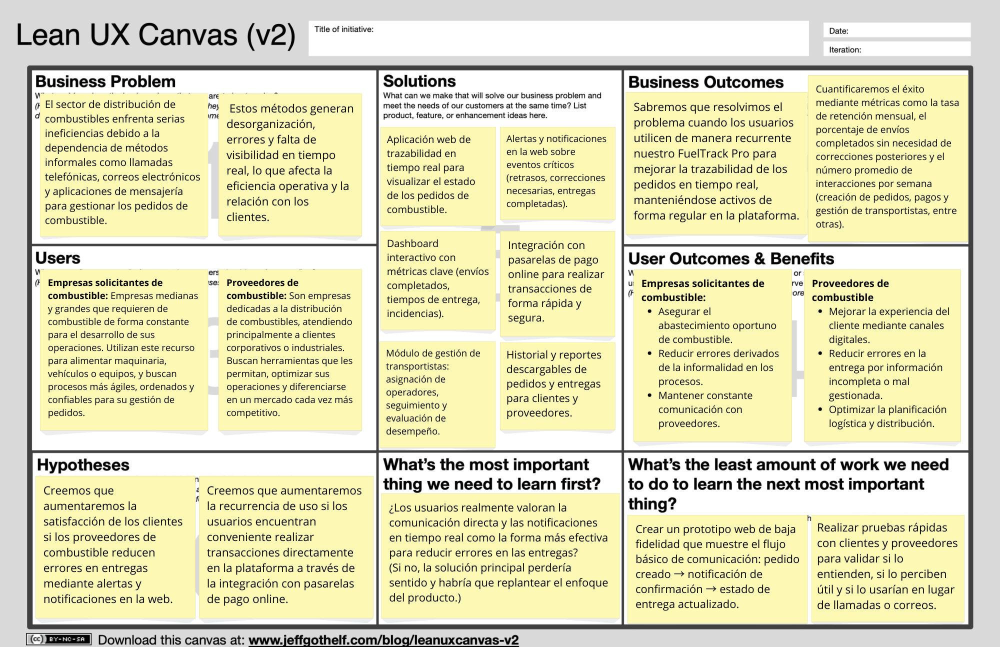

# Capítulo I: Introducción

## 1.1 Startup Profile

### 1.1.1 Descripción de la Startup

**FuelPoint** es una startup peruana orientada a la transformación digital del abastecimiento corporativo de combustible. Su propósito es conectar a empresas que necesitan combustible para mantener sus operaciones con empresas autorizadas para comercializarlo y distribuirlo, reduciendo la fragmentación de información que aparece cuando una operación se coordina mediante llamadas, correos, mensajería instantánea y hojas de cálculo separadas.

FuelPoint desarrolla **FullTank**, una solución web B2B que centraliza las solicitudes, su evaluación, la coordinación logística, el seguimiento de estados y el historial de las operaciones. El producto conserva la idea de negocio planteada originalmente, pero se implementará en un nuevo entorno de aplicación web distribuida: una Landing Page pública, una Web Application responsive integrada con un RESTful API propio y un servicio externo de terceros. La experiencia estará disponible desde navegadores de escritorio y dispositivos móviles, tendrá inglés como idioma predeterminado y ofrecerá español latinoamericano como idioma alternativo.

**Misión.** Facilitar operaciones de abastecimiento de combustible más ordenadas, transparentes y verificables mediante una solución web que conecte a compradores y proveedores, reduzca los errores de coordinación y permita tomar decisiones con información centralizada.

**Visión.** Ser una startup de referencia en Latinoamérica para la digitalización del abastecimiento corporativo de combustible, reconocida por la confiabilidad, accesibilidad y trazabilidad de sus productos digitales.

**Principios de trabajo.**

- **Trazabilidad:** cada cambio relevante de una solicitud debe poder identificarse y consultarse.
- **Confiabilidad:** la información presentada debe ser consistente y útil para coordinar operaciones reales.
- **Accesibilidad:** las experiencias deben poder ser percibidas, comprendidas y operadas por la mayor cantidad posible de usuarios.
- **Transparencia:** compradores y proveedores deben conocer el estado, los responsables y las condiciones relevantes de una operación.
- **Mejora continua:** las decisiones del producto se revisarán con evidencia obtenida de los segmentos objetivo.

### 1.1.2 Perfiles de integrantes del equipo

| Foto | Apellidos y nombres | Código | Carrera | Perfil y habilidades |
|---|---|---|---|---|
|  | Brayan Alexis Corvacho Damian | u20231a257 | Ingeniería de Software | Estudiante de Ingeniería de Software en la UPC. Poseo conocimientos sólidos en Python, JavaScript y desarrollo web. Me apasiona la resolución de problemas algorítmicos y el trabajo en equipo para crear soluciones innovadoras. |

## 1.2 Solution Profile

### 1.2.1 Antecedentes y problemática

El abastecimiento corporativo de combustible es un proceso transversal para empresas de transporte, construcción, minería, agroindustria, manufactura y otros sectores que emplean vehículos, maquinaria o equipos. La operación no termina en una compra: requiere registrar cantidades y destinos, comprobar condiciones comerciales, revisar disponibilidad, asignar recursos, coordinar el despacho, comunicar incidencias y conservar evidencias de la entrega.

La dimensión del mercado vuelve relevante cualquier mejora en la coordinación. Osinergmin reportó para diciembre de 2025 una demanda nacional de combustibles líquidos de **10 973 490 galones por día**. El Diesel B5 S-50 representó **6 827 595 galones diarios**, equivalentes al **62,22 %** del total. Lima concentró **3 525 557 galones por día**, aproximadamente el **32,13 %** de la demanda nacional reportada. Estas cifras muestran un entorno de operación de gran volumen y justifican que el alcance inicial de FullTank priorice organizaciones con consumo recurrente y operaciones en Lima y Callao, sin limitar una expansión posterior a otras regiones ([Osinergmin, 2025](https://www.osinergmin.gob.pe/seccion/centro_documental/hidrocarburos/SCOP/SCOP-DOCS/2025/01-Demanda-Nacional-Combustibles-Liquidos-Diciembre-2025.pdf)).

La actividad empresarial de los sectores potencialmente compradores también mantiene dinamismo. En el tercer trimestre de 2025, las altas de empresas constituidas como sociedades anónimas crecieron, frente al mismo trimestre de 2024, **73,3 % en explotación de minas y canteras**, **64,5 % en construcción** y **46,1 % en transporte y almacenamiento**. Estas variaciones no representan por sí solas la demanda de FullTank, pero respaldan la existencia de un universo empresarial activo en sectores donde el combustible es un recurso operativo relevante ([INEI, 2025](https://www.inei.gob.pe/media/MenuRecursivo/boletines/boletin_demografia_iiit25.pdf)).

En este contexto, el problema que aborda FullTank no es la ausencia de combustible ni la sustitución de los sistemas regulatorios o contables de las empresas. El problema es la **fragmentación de la coordinación B2B** entre compradores y proveedores: una misma solicitud puede tener información repartida entre diferentes canales, sin un estado común, un responsable visible ni un historial integral. Esto incrementa el esfuerzo para confirmar datos, dificulta el seguimiento y hace que la respuesta ante cambios o incidencias dependa de comunicaciones manuales.

El análisis de la problemática mediante 5W2H se resume de la siguiente manera:

| Pregunta | Análisis |
|---|---|
| **What?** | La información necesaria para solicitar, evaluar, programar, despachar y comprobar una entrega de combustible se encuentra fragmentada entre herramientas y participantes. |
| **When?** | El problema aparece desde la preparación de una solicitud y se intensifica durante la confirmación de condiciones, el despacho, la comunicación de incidencias y la consulta posterior. |
| **Where?** | En las áreas de compras, abastecimiento, operaciones, inventario, despacho y logística de empresas compradoras y proveedoras de combustible. |
| **Who?** | Responsables de abastecimiento de empresas compradoras y responsables comerciales, de inventario o logística de empresas proveedoras. |
| **Why?** | Los canales separados no mantienen un estado compartido ni aseguran trazabilidad de cambios, responsables, fechas y evidencias. |
| **How?** | Los participantes vuelven a registrar o confirmar información mediante llamadas, mensajes, correos y hojas de cálculo; luego consolidan manualmente los datos para conocer el avance. |
| **How much?** | El alcance potencial es significativo: el mercado nacional movilizó cerca de 10,97 millones de galones diarios de combustibles líquidos en diciembre de 2025 y el Diesel B5 S-50 concentró 62,22 % del total. El costo específico de la fragmentación será medido durante las entrevistas mediante tiempo de coordinación, número de contactos adicionales, correcciones e incidencias por operación. |

#### Entorno de aplicación de FullTank

FullTank se plantea como una experiencia web adaptable para dos contextos complementarios:

- **Entorno administrativo:** uso principalmente desde navegadores de escritorio para crear y evaluar solicitudes, gestionar inventario y recursos, consultar historiales y revisar indicadores.
- **Entorno operativo:** uso desde navegadores móviles o tablets para consultar estados, comunicar incidencias y verificar información durante la coordinación y la entrega.

El producto incluirá una Landing Page dirigida a visitantes de ambos segmentos y una Web Application para usuarios registrados. La solución no realizará la venta informal de combustible ni reemplazará las obligaciones regulatorias. Las empresas proveedoras que participen deberán operar de acuerdo con la normativa aplicable y contar con las habilitaciones correspondientes en el Registro de Hidrocarburos administrado por Osinergmin ([Osinergmin, 2024](https://www.osinergmin.gob.pe/seccion/centro_documental/hidrocarburos/RegistroHidrocarburo/Registro-Hidrocarburos/Osinergmin-150-2024-OS-CD-Reglamento.pdf)).

### 1.2.2 Lean UX Process

FuelPoint aplicará Lean UX al desarrollo de FullTank para transformar las creencias iniciales del equipo en hipótesis comprobables. El proceso relaciona resultados de negocio, necesidades de los usuarios y características del producto. Las assumptions descritas en esta sección no se presentan como hechos confirmados: serán contrastadas mediante entrevistas de Needfinding, artefactos de UX, prototipos y evidencia de uso.

#### 1.2.2.1 Lean UX Problem Statements

El estado actual de la coordinación del abastecimiento corporativo de combustible se ha concentrado principalmente en empresas compradoras y proveedoras que combinan llamadas, mensajería, correo electrónico, hojas de cálculo y sistemas internos para completar una misma operación. Lo que los productos y servicios existentes no siempre resuelven es una experiencia B2B accesible que mantenga una trazabilidad compartida desde la solicitud hasta la entrega, sin depender de confirmaciones manuales entre múltiples canales. FullTank abordará esta brecha mediante una solución web responsive que centralice solicitudes, estados, responsables, notificaciones, evidencias e información histórica. El enfoque inicial serán empresas peruanas con consumo recurrente de combustible y proveedores autorizados que atienden clientes corporativos, comenzando por Lima y Callao. Sabremos que la propuesta tiene éxito cuando, durante un piloto, al menos el 70 % de las operaciones de los participantes se gestione de principio a fin en FullTank, se reduzcan en 30 % las consultas de estado realizadas por canales externos y al menos el 80 % de los usuarios complete su tarea principal sin asistencia.

#### 1.2.2.2 Lean UX Assumptions

**Business Assumptions**

- Las empresas compradoras percibirán valor en contar con una fuente única para coordinar sus solicitudes de combustible.
- Las empresas proveedoras estarán dispuestas a incorporar FullTank si reduce trabajo administrativo sin impedir sus procesos comerciales y regulatorios.
- FuelPoint podrá ofrecer FullTank mediante un modelo SaaS con planes diferenciados por capacidad operativa y características.
- El valor del producto dependerá de que compradores y proveedores participen simultáneamente en la experiencia.
- La confianza, la seguridad y la trazabilidad serán factores decisivos para la adopción en un entorno B2B.

**Business Outcome Assumptions**

- Al menos el 70 % de las operaciones del grupo piloto podrá gestionarse íntegramente dentro de FullTank.
- Las consultas de estado realizadas por canales externos se reducirán en 30 % durante el piloto.
- Las operaciones que requieren corregir información después de ser aceptadas se mantendrán por debajo del 10 %.
- Al menos el 60 % de las organizaciones participantes manifestará intención de continuar utilizando el producto después del piloto.
- El tiempo administrativo destinado a consolidar el estado de las operaciones se reducirá en 25 %.

**User Assumptions**

- El usuario comprador será un responsable de compras, abastecimiento, operaciones o logística que coordina solicitudes recurrentes.
- El usuario proveedor será un responsable comercial, de inventario, despacho o logística que atiende simultáneamente varias solicitudes.
- Los usuarios administrativos trabajarán principalmente desde computadoras, mientras que los usuarios en campo requerirán acceso desde dispositivos móviles o tablets.
- Ambos segmentos necesitan distinguir rápidamente estados, responsables, fechas, cantidades e incidencias.
- Los usuarios aceptarán una nueva herramienta si el flujo es comprensible y no exige duplicar la información en sus canales actuales.

**User Outcome and Benefit Assumptions**

- Los compradores desean asegurar el abastecimiento oportuno y conocer el avance sin depender de llamadas de seguimiento.
- Los compradores desean conservar un historial verificable para control interno y futuras decisiones.
- Los proveedores desean priorizar solicitudes y coordinar inventario, vehículos y conductores con información consistente.
- Los proveedores desean comunicar cambios e incidencias a sus clientes sin repetir el mismo mensaje en diferentes canales.
- Ambos segmentos desean reducir correcciones, incertidumbre y tiempo dedicado a buscar información.

**Feature Assumptions**

- Un flujo centralizado de solicitudes permitirá registrar, evaluar y actualizar una operación sin duplicar información.
- El seguimiento por estados y las notificaciones reducirá las consultas manuales entre compradores y proveedores.
- Los paneles, filtros e historiales facilitarán la supervisión operativa y el análisis de operaciones anteriores.
- Un directorio de proveedores autorizados con información comparable facilitará la evaluación de alternativas por parte de los compradores.

#### 1.2.2.3 Lean UX Hypothesis Statements

Se formula una hipótesis por cada Feature Assumption. Cada enunciado relaciona un resultado de negocio, los usuarios involucrados, el beneficio esperado y la característica que se someterá a validación.

1. **Gestión centralizada de solicitudes.** Creemos que lograremos que al menos el 70 % de las operaciones del grupo piloto se gestione íntegramente en FullTank si los responsables de abastecimiento y los responsables del proveedor alcanzan control y trazabilidad compartida mediante un flujo centralizado para registrar, evaluar y actualizar solicitudes.
2. **Seguimiento y notificaciones.** Creemos que lograremos reducir en 30 % las consultas de estado realizadas por canales externos si los compradores y proveedores alcanzan visibilidad oportuna de cada operación mediante estados, responsables y notificaciones de cambios e incidencias.
3. **Paneles e historiales.** Creemos que lograremos reducir en 25 % el tiempo dedicado a consolidar información operativa si los responsables de ambos segmentos alcanzan acceso rápido a información vigente y anterior mediante paneles, filtros e historiales.
4. **Directorio de proveedores.** Creemos que lograremos que al menos el 80 % de los compradores evaluados identifique una alternativa adecuada sin asistencia externa si alcanzan mayor confianza y capacidad de comparación mediante un directorio de proveedores autorizados con información relevante.

Estas métricas constituyen objetivos de validación, no resultados alcanzados. Las líneas base y los umbrales se revisarán con la información obtenida en las entrevistas.

#### 1.2.2.4 Lean UX Canvas

El Lean UX Canvas consolida la relación entre el problema de negocio, los usuarios, los resultados esperados y el aprendizaje necesario para reducir el riesgo de la propuesta.

*Figura 1. Lean UX Canvas incorporado por el equipo como base visual de la propuesta. La tabla siguiente presenta la versión textual actualizada para FullTank y facilita la lectura y trazabilidad de su contenido.*

| Bloque | Definición para FullTank |
|---|---|
| **1. Business problem** | La coordinación B2B del abastecimiento de combustible se fragmenta entre varios canales, dificultando conocer el estado, los responsables y la evidencia integral de una operación. |
| **2. Business outcomes** | Gestionar al menos 70 % de las operaciones piloto dentro del producto; reducir 30 % las consultas externas de estado; mantener por debajo de 10 % las operaciones aceptadas que requieren correcciones; reducir 25 % el tiempo de consolidación administrativa. |
| **3. Users** | Responsables de compras, abastecimiento, operaciones o logística de empresas compradoras; responsables comerciales, de inventario, despacho o logística de proveedores autorizados. |
| **4. User outcomes and benefits** | Asegurar abastecimiento, conocer el avance oportunamente, coordinar recursos con información consistente, comunicar incidencias y conservar un historial verificable. |
| **5. Solutions** | Flujo de solicitudes, seguimiento por estados, notificaciones, directorio de proveedores, paneles, filtros, historial y evidencias de entrega. |
| **6. Hypotheses** | Si ambos segmentos obtienen trazabilidad, visibilidad, acceso a información consolidada y alternativas comparables mediante las características propuestas, FuelPoint alcanzará los resultados de negocio definidos. |
| **7. Most important thing to learn first** | Comprobar si la fragmentación entre canales es un problema frecuente y suficientemente costoso para que ambos segmentos adopten una experiencia compartida. |
| **8. Least amount of work to learn** | Entrevistar entre tres y cinco representantes de cada segmento y validar con ellos un prototipo que cubra creación de solicitud, evaluación, seguimiento y consulta de historial. |

El principal riesgo no es únicamente técnico. FullTank necesita que compradores y proveedores perciban valor en usar un estado compartido y que la adopción por un segmento incentive la participación del otro. Por ello, la primera validación priorizará el flujo completo y la colaboración entre actores antes de incorporar características analíticas avanzadas.

## 1.3 Segmentos objetivo

FullTank emplea segmentación B2B. La organización es el cliente, mientras que los usuarios de la Web Application son las personas responsables de ejecutar o supervisar las tareas de abastecimiento. Las características ocupacionales y de uso señaladas a continuación son criterios iniciales de reclutamiento y deberán contrastarse en las entrevistas.

### Segmento 1: empresas compradoras de combustible

Organizaciones formales medianas o grandes que consumen combustible de manera recurrente para vehículos, maquinaria, equipos o procesos productivos. El alcance inicial considera empresas de transporte y almacenamiento, construcción, minería, agroindustria y manufactura ubicadas principalmente en Lima y Callao.

**Características organizacionales**

- Mantienen operaciones cuya continuidad depende del abastecimiento oportuno de combustible.
- Gestionan solicitudes recurrentes y coordinan con uno o más proveedores autorizados.
- Necesitan conservar información sobre cantidades, fechas, destinos, estados e incidencias.
- Cuentan con personal responsable de compras, abastecimiento, operaciones o logística.

**Perfil inicial del usuario**

- Persona adulta que desempeña una función administrativa u operativa relacionada con el abastecimiento.
- Utiliza una computadora para planificar y registrar información, y puede requerir acceso móvil para seguimiento.
- Coordina con proveedores y con áreas internas como operaciones, finanzas o mantenimiento.
- Valora la disponibilidad, el tiempo de entrega, la trazabilidad, la confiabilidad del proveedor y la claridad de la información.

**Sustento del segmento**

El Diesel B5 S-50 representó 62,22 % de la demanda nacional de combustibles líquidos reportada por Osinergmin en diciembre de 2025. Además, el crecimiento interanual de altas de sociedades anónimas en minería, construcción y transporte durante el tercer trimestre de 2025 muestra actividad empresarial en sectores vinculados con el consumo operativo. El alcance inicial en Lima y Callao se sustenta en que Lima concentró aproximadamente 32,13 % de la demanda nacional registrada en dicho mes.

**Necesidades iniciales**

- Registrar solicitudes con información completa y consistente.
- Conocer el estado, responsable y fecha estimada de una entrega.
- Reducir confirmaciones y correcciones por canales separados.
- Comparar proveedores autorizados según información relevante.
- Consultar evidencias e historial para control interno.

### Segmento 2: empresas proveedoras de combustible

Organizaciones formales autorizadas para comercializar y distribuir combustible a clientes corporativos. El alcance considera distribuidores mayoristas o minoristas, estaciones de servicio y otros agentes habilitados que atiendan operaciones B2B y puedan coordinar inventario, despacho y entrega.

**Características organizacionales**

- Deben contar con habilitación vigente para la actividad de hidrocarburos que realizan.
- Reciben solicitudes de diferentes clientes y evalúan disponibilidad, condiciones y capacidad de atención.
- Coordinan personal, inventario, vehículos, conductores y documentación de entrega.
- Cuentan con responsables comerciales, de inventario, despacho, operaciones o logística.

**Perfil inicial del usuario**

- Persona adulta con responsabilidad sobre la recepción, evaluación o ejecución de solicitudes.
- Trabaja con varias operaciones simultáneas y necesita priorizarlas según estado y fecha.
- Utiliza herramientas de escritorio para gestión y requiere acceso móvil cuando participa en tareas de campo.
- Valora la claridad de los datos, la planificación de recursos, la comunicación oportuna y el historial de clientes.

**Sustento del segmento**

El Reglamento del Registro de Hidrocarburos incluye dentro de su alcance a distribuidores mayoristas y minoristas, estaciones de servicio, medios de transporte y otros agentes que desarrollan actividades de comercialización de hidrocarburos. FullTank no reemplazará dicho registro; lo utilizará como criterio para definir proveedores elegibles. La magnitud de la demanda nacional evidencia un mercado que requiere una red diversa de agentes para abastecer a empresas y consumidores.

**Necesidades iniciales**

- Recibir y priorizar solicitudes en un canal centralizado.
- Evaluar solicitudes con datos completos y reducir correcciones.
- Coordinar inventario y recursos de despacho.
- Comunicar cambios de estado e incidencias oportunamente.
- Consultar historial e indicadores para mejorar la planificación.

### Relación entre los segmentos

Los segmentos son interdependientes. La empresa compradora necesita un proveedor capaz de atender la solicitud; la empresa proveedora necesita información completa y oportuna para comprometer inventario y recursos. FullTank propone un estado compartido de la operación, pero conserva responsabilidades diferenciadas: el comprador define y supervisa su necesidad de abastecimiento, mientras que el proveedor evalúa la solicitud, planifica la atención y registra el avance de la entrega.
