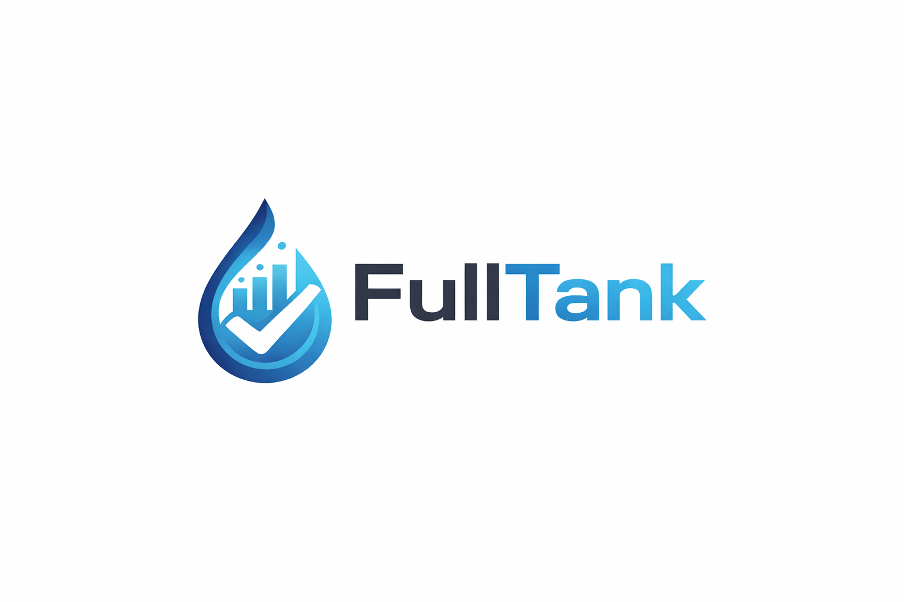
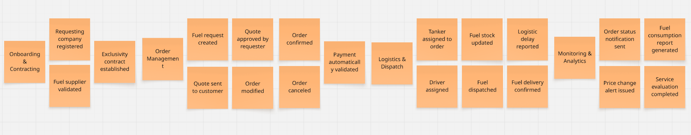

# Capítulo II: Requirements Elicitation & Analysis

## 2.1. Competidores

En el mercado existen diversas soluciones digitales enfocadas en la gestión de combustible y flotas que compiten de manera directa o indirecta con lo propuesto. Entre ellas destaca **Zavgar**, una plataforma SaaS que ayuda a las empresas con flotas vehiculares a optimizar costos y controlar el consumo de combustible. Otro competidor importante es **FuelCloud**, que ofrece una solución integrada de hardware y software para garantizar seguridad y precisión en el despacho de combustible, principalmente en empresas con tanques propios. Finalmente, **Wialon** se presenta como una plataforma internacional de gestión de flotas que combina monitoreo GPS, análisis operativos y control de combustible, dirigida a compañías logísticas y de transporte.

### 2.1.1. Análisis competitivo.

<table border="2">
  <tr>
    <th colspan="6" style="text-align:left">Competitive Analysis Landscape</th>
  </tr>
  <tr>
    <td colspan="1"><strong>¿Por qué llevar a cabo este análisis?</strong></td>
    <td colspan="5">Este análisis se está llevando a cabo porque queremos conocer las ventajas y desventajas de nuestra aplicación frente a la competencia, y cómo nos diferenciamos de ellas.</td>
  </tr>
  <tr>
    <td colspan="2"><strong></strong></td>
    <td><strong>FullTank</strong> </td>
    <td><strong>Zavgar</strong> </td>
    <td><strong>FuelCloud</strong> </td>
    <td><strong>Wialon</strong> </td>
  </tr>

  <tr>
    <th rowspan="3">Perfil</th>
    <td><strong>Visión general</strong></td>
    <td>Plataforma web que digitaliza y estructura el proceso completo de pedido de combustible entre empresas y proveedores.</td>
    <td>SaaS para la gestión de consumo de combustible de flotas, con enfoque en eficiencia, monitoreo y costos.</td>
    <td>Solución con hardware/software para el control físico del despacho de combustible.</td>
    <td>Plataforma de gestión de flotas con control de combustible, GPS y reportes operativos.</td>
  </tr>
  <tr>
    <td><strong>Ventaja competitiva</strong></td>
    <td>Especialización en el flujo completo de pedido, despacho y análisis; integración de pagos y logística; UI intuitiva.</td>
    <td>No requiere hardware; ofrece métricas, control de gastos y reportes sobre consumo.</td>
    <td>Control físico preciso del combustible, monitoreo en tiempo real.</td>
    <td>Seguimiento en tiempo real, visualización de rutas, integración con sensores de combustible.</td>
  </tr>
  <tr>
    <td><strong>¿Qué valor ofrece al cliente?</strong></td>
    <td>Trazabilidad total, eficiencia operativa, reportes de consumo y validación segura de pedidos.</td>
    <td>Optimización de costos y control sobre el uso de combustible en flotas.</td>
    <td>Seguridad y precisión operativa en el control de combustible.</td>
    <td>Trazabilidad de flotas, alertas automáticas, análisis de rutas y consumo de combustible.</td>
  </tr>
  <tr>
    <th rowspan="2">Perfil de Marketing</th>
    <td><strong>Mercado objetivo</strong></td>
    <td>Empresas que solicitan combustible a proveedores.</td>
    <td>Empresas con flotas vehiculares que desean monitorear y reducir el consumo de combustible.</td>
    <td>Empresas con tanques de combustible propios.</td>
    <td>Empresas logísticas, distribuidoras y de transporte de combustible.</td>
  </tr>
  <tr>
    <td><strong>Estrategias de marketing</strong></td>
    <td>Alianzas con proveedores, demostraciones de ahorro, marketing de contenido enfocado en eficiencia.</td>
    <td>Enfoque digital, contenido técnico, integración con proveedores de tarjetas de combustible.</td>
    <td>Ferias industriales, distribuidores, venta consultiva entre empresas.</td>
    <td>Alianzas con distribuidores de GPS, marketing técnico, ferias de transporte.</td>
  </tr>
  <tr>
    <th rowspan="3">Perfil de Producto</th>
    <td><strong>Productos & Servicios</strong></td>
    <td>Plataforma para gestión completa de pedidos, seguimiento, reportes, validación y alertas.</td>
    <td>Plataforma web con módulo de abastecimiento, reportes de consumo, integración GPS y tarjetas.</td>
    <td>Hardware IoT y software para gestión, y control de combustible.</td>
    <td>Plataforma SaaS + app móvil con monitoreo, alertas, mapas y módulos personalizables.</td>
  </tr>
  <tr>
    <td><strong>Precios & Costos</strong></td>
    <td>Modelo SaaS con suscripción escalable según volumen y servicios.</td>
    <td>SaaS con modelos por flota activa o vehículos monitoreados.</td>
    <td>Venta e instalación de hardware + licencias de software.</td>
    <td>Modelo SaaS modular, basado en vehículos activos y funcionalidades activadas.</td>
  </tr>
  <tr>
    <td><strong>Canales de distribución</strong></td>
    <td>Web app responsive, potencial app móvil futura.</td>
    <td>Web app, marketing digital y comunidad de flotas.</td>
    <td>Plataforma web + hardware instalado en sitio.</td>
    <td>Red de partners global, distribuidores locales e integradores de sistemas GPS.</td>
  </tr>
  <tr>
    <th rowspan="4">Análisis SWOT</th>
    <td><strong>Fortalezas</strong></td>
    <td>Enfoque especializado, experiencia de usuario optimizada, integraciones clave, análisis avanzado de consumo.</td>
    <td>Implementación ágil, sin hardware, fácil adopción en empresas medianas.</td>
    <td>Control físico riguroso, solución probada en industrias exigentes.</td>
    <td>Plataforma robusta, cobertura internacional, integración con más de 2,400 dispositivos GPS.</td>
  </tr>
  <tr>
    <td><strong>Debilidades</strong></td>
    <td>Nueva en el mercado, menor reconocimiento de marca, necesita consolidar confianza.</td>
    <td>No gestiona el flujo completo del pedido, enfoque parcial en flotas.</td>
    <td>Alto costo, dependencia de hardware, menor adaptabilidad en mercados emergentes.</td>
    <td>No gestiona pedidos entre proveedor y solicitante, requiere configuración técnica inicial.</td>
  </tr>
  <tr>
    <td><strong>Oportunidades</strong></td>
    <td>Alta informalidad en el sector, digitalización creciente en logística, necesidad de trazabilidad y control.</td>
    <td>Mayor conciencia en eficiencia de flotas y digitalización de costos operativos.</td>
    <td>Nuevos mercados industriales con enfoque en seguridad y control.</td>
    <td>Creciente necesidad de control logístico y monitoreo de distribución en países en desarrollo.</td>
  </tr>
  <tr>
    <td><strong>Amenazas</strong></td>
    <td>Aparición de soluciones similares, resistencia al cambio en empresas tradicionales, competencia ERP.</td>
    <td>SaaS especializados con mayor cobertura funcional (ERP, proveedores, logística).</td>
    <td>SaaS ágiles y sin hardware físico, que ofrecen soluciones más accesibles.</td>
    <td>SaaS más específicos y ligeros, enfocados exclusivamente en la trazabilidad de entregas.</td>
  </tr>
</table>

### 2.1.2. Estrategias y tácticas frente a competidores.

**FuelPoint** aplicará diversas estrategias para afrontar la competencia y aprovechar las oportunidades que ofrece el sector.

#### a. Diferenciación a través de especialización
Una de las principales estrategias de **FuelPoint** es la **especialización en el flujo completo de pedido de combustible**. A diferencia de soluciones como **Zavgar**, que están orientadas principalmente al control y análisis del consumo de combustible en flotas, nuestra plataforma se enfoca en las **interacciones B2B** entre empresas solicitantes y proveedores. Esto nos permite ofrecer un control dedicado del pedido, gestión de la logística, y reportes detallados de consumo y entregas, lo cual no está presente en la mayoría de las plataformas competidoras.

- **Táctica**: Desarrollar funcionalidades para la validación automática de pagos, gestión de stock en tiempo real y la optimización del transporte logrando la automatización de procesos que solo eran logrados de forma manual. Esto crea una ventaja frente a competidores como **FuelCloud**, que se centran más en el control físico del combustible y menos en la administración a nivel operativo.

#### b. Innovación en la interfaz de usuario y experiencia

El sistema de **FuelPoint** está diseñado para ofrecer una **experiencia de usuario optimizada**, algo que **Wialon**, **FuelCloud** y la propia **OSINERGMIN** no abordan en sus plataformas. Al ser una solución especializada y dirigida a una tarea específica, podemos dedicar más recursos en crear una interfaz intuitiva y procesos bien definidos brindando comodidad y seguridad a nuestros usuarios.

- **Táctica**: Diseñar una **interfaz intuitiva y consistente** que permita a los usuarios acceder a reportes de consumo, validar pedidos y coordinar logística con facilidad. Además, ofrecer **soporte y formación continua** para asegurar que los usuarios aprovechen al máximo todas las funcionalidades del sistema.

#### c. Flexibilidad en precios y modelo SaaS escalable
El modelo de precios de **FuelPoint** ofrece **planes escalables basados en suscripción**, lo que hace que sea más accesible para medianas y grandes empresas. Esto es más competitivo frente a **Wialon**, que puede no ser una opción viable para empresas que solo requieren una solución de pedidos de combustible. También es más asequible que **FuelCloud**, que requiere una inversión considerable en hardware, instalación y mantenimiento.

- **Táctica**: Ofrecer un modelo de suscripción flexible y **precios competitivos**, con **múltiples niveles de suscripción** adaptados a las necesidades de diferentes empresas. Esto permitirá que empresas de menor tamaño puedan acceder a la plataforma sin comprometer su presupuesto, a la vez que se asegura el crecimiento a largo plazo a medida que la empresa crece.

#### d. Aprovechamiento de la digitalización en la logística
El sector de la logística está experimentando una transformación digital acelerada. **FuelPoint** se aprovechará de esta tendencia buscando la integración de la plataforma con otras soluciones logísticas (como los sistemas de gestión de vehículos o flotas). De esta forma podemos ofrecer una solución más completa y eficiente.

- **Táctica**: Colaborar con empresas de **gestión de flotas** para optimizar el proceso de asignación de vehículos, cisternas y choferes. También se considerará la posibilidad de integrar **sensores IoT** en los camiones de reparto para un control más preciso sobre el combustible transportado y la entrega.

#### e. Expansión hacia mercados internacionales
Si bien **FuelPoint** está inicialmente orientada a empresas locales, el modelo de negocio y la flexibilidad de la plataforma la hacen ideal para expandirse a **mercados internacionales**. Competidores como **Wialon** ya tienen presencia en mercados globales, pero su enfoque en empresas grandes y sus altos costos de implementación pueden ser una barrera para empresas de menor tamaño, limitando su alcance.

- **Táctica**: Iniciar la expansión en mercados emergentes donde la digitalización en la logística es una necesidad creciente. Esto incluirá la **localización de la plataforma** (idioma, moneda, regulaciones locales) para facilitar la adaptabilidad de los nuevos mercados.

## 2.2. Entrevistas.

### 2.2.1. Diseño de entrevistas.

**A. Proveedores de Combustible**

**Preguntas:**

1. ¿Cuál es su cargo dentro de la empresa proveedora?
2. ¿Qué tipos de clientes atienden principalmente (logística, construcción, minería, agroindustria)?
3. ¿Qué volumen de operaciones realizan mensualmente?
4. ¿Cómo gestionan actualmente los pedidos y contratos de sus clientes?
5. ¿Qué problemas han experimentado con los métodos tradicionales (llamadas, correos, planillas)?
6. ¿Utilizan algún software especializado para ventas o logística?
7. ¿Qué características valoraría más en una plataforma digital para gestionar pedidos?
8. ¿Considera que una solución que centralice cotizaciones, contratos y entregas sería útil para su empresa?
9. ¿Qué tan importante es para ustedes tener reportes históricos y comparativos de ventas?
10. ¿Qué estrategias usan actualmente para fidelizar clientes, y cómo cree que una plataforma como FullTank podría apoyarlos?

---

**B. Empresas Solicitantes**

**Preguntas:**

1. ¿Cuál es su cargo en la empresa?
2. ¿Hace cuánto tiempo trabaja en el sector energético/logístico?
3. ¿Qué volumen de combustible gestionan aproximadamente al mes?
4. ¿Cómo gestionan actualmente la compra y control de combustible?
5. ¿Qué herramientas usan (Excel, llamadas, correos, sistemas propios)?
6. ¿Cuáles son los principales problemas que enfrentan con su sistema actual?
7. ¿Qué tan importante es para usted contar con trazabilidad en tiempo real?
8. ¿Qué dispositivos utilizan para gestionar pedidos (PC, móvil, tablet)?
9. ¿Qué información considera más valiosa al momento de comprar combustible (precio, tiempo de entrega, historial de proveedor, etc.)?
10. ¿Cómo afecta la falta de transparencia en los precios a sus decisiones de compra?
11. ¿Le interesaría recibir notificaciones en tiempo real sobre cambios de precio o estado de sus pedidos?
12. ¿Qué barreras considera que dificultarían implementar una solución digital como FullTank en su empresa?

### 2.2.2 Registro de entrevistas

**1. Segmento 1: Empresas solicitantes de combustible**

- Entrevista 1:

| Campo                    | Detalle |
|-------------------------|---------|
| **Nombre entrevistado** | Betsabe Maldonado Estrella |
| **Edad**               | 52 |
| **Departamento**       | Lima |
| **Inicio del video**   | 00:00 |
| **Fin del video**      | 03:45 |
| **Link del video**     | https://upcedupe-my.sharepoint.com/:v:/g/personal/u20231b842_upc_edu_pe/IQCkouwLUL7JT7ks3UohUtfUAeA0xot3mF3G4dxzBzAEvWQ?nav=eyJyZWZlcnJhbEluZm8iOnsicmVmZXJyYWxBcHAiOiJPbmVEcml2ZUZvckJ1c2luZXNzIiwicmVmZXJyYWxBcHBQbGF0Zm9ybSI6IldlYiIsInJlZmVycmFsTW9kZSI6InZpZXciLCJyZWZlcnJhbFZpZXciOiJNeUZpbGVzTGlua0NvcHkifX0&e=gfM51X |
| **Foto entrevista**    |  |
| **Resumen**           | 
La señora Betsabe Maldonado Estrella se desempeña como parte del área de logística y abastecimiento de la empresa. Su personalidad se caracteriza por ser <strong>organizada, cautelosa y enfocada en la seguridad operativa</strong>, valorando mucho la consistencia en los procesos. En su toma de decisiones influyen de manera directa las regulaciones vigentes del sector y los reportes de entidades supervisoras como <strong>Osinergmin</strong>.

La coordinación actual con los proveedores la realiza a través de <strong>llamadas de voz por teléfono celular y correos electrónicos tradicionales</strong>. Sus actividades operativas las realiza a través de una <strong>computadora de escritorio de torre HP</strong>, recurriendo de manera constante al navegador <strong>Microsoft Edge</strong> y herramientas de <strong>Office (Excel y Word)</strong>.

En la operativa actual, Betsabe señala deficiencias críticas por la falta de trazabilidad en los procesos de despacho de los proveedores, lo que le genera desconfianza y le imposibilita predecir con exactitud los abastecimientos del día. Cree que una planificación digital óptima reduciría la incertidumbre actual. Finalmente, resalta que los factores determinantes para seleccionar un proveedor son el cumplimiento de tiempos, el precio justo y la confiabilidad del servicio, mostrando un gran interés en una solución integral que automatice el tracking de pedidos y centralice la información histórica de consumos.
 |

- Entrevista 2:

| Campo                    | Detalle |
|-------------------------|---------|
| **Nombre entrevistado** | Daniel Angelo Siqueiros Cruz |
| **Edad**               | 21 |
| **Departamento**       | Lima |
| **Inicio del video**   | 00:00 |
| **Fin del video**      | 06:29 |
| **Link del video**     | https://upcedupe-my.sharepoint.com/:v:/g/personal/u202318620_upc_edu_pe/IQCdgZwWmcdbRol75iM8cTHFASEn_WeKWpU6JDASO27sYzI?nav=eyJyZWZlcnJhbEluZm8iOnsicmVmZXJyYWxBcHAiOiJTdHJlYW1XZWJBcHAiLCJyZWZlcnJhbFZpZXciOiJTaGFyZURpYWxvZy1MaW5rIiwicmVmZXJyYWxBcHBQbGF0Zm9ybSI6IldlYiIsInJlZmVycmFsTW9kZSI6InZpZXcifX0%3D&e=kQ2BIT |
| **Foto entrevista**    |  |
| **Resumen**           | El entrevistado se desempeña como asistente de logística y almacén en una empresa constructora mediana de Lima Norte, con un año y medio de experiencia, y se encarga de revisar el nivel de combustible de la maquinaria y del tanque de obra, solicitar el combustible a los proveedores y registrar cada entrega. La empresa consume entre 15,000 y 20,000 litros de diésel al mes, con dos o tres pedidos por semana de 3,000 a 6,000 litros cada uno, según el avance de las obras. Actualmente, la gestión es manual: los pedidos se coordinan por WhatsApp, el jefe de logística realiza la transferencia, el comprobante se envía como foto por el mismo chat y los datos se registran después en un Excel compartido; las llamadas se usan en casos urgentes y el correo solo para recibir la factura, ya que el sistema contable de la empresa no registra los pedidos. Entre los principales problemas destacan la falta de visibilidad sobre la hora real de llegada del pedido, lo que provoca paralizaciones de maquinaria cuando el camión se retrasa; la información dispersa entre el chat, la galería del celular, el correo y el Excel, que le hace perder tiempo al preparar el resumen mensual; y los errores al digitar cantidades, como un pedido registrado por 4,000 litros en lugar de 1,400. Considera que conocer en tiempo real si el pedido salió, está en camino o cuándo llega le ahorraría varias llamadas diarias y le permitiría avisar a tiempo en la obra. Usa la computadora en la oficina, pero realiza la mayoría de tareas desde el celular cuando está en campo. Al comprar, prioriza el tiempo de entrega, luego el precio y el cumplimiento del proveedor, además de su formalidad. La falta de transparencia en los precios lo obliga a consultar a varios proveedores y a comprar al que responde primero, sin saber si le cobran de más. Le interesan las notificaciones sobre el estado del pedido, siempre que se limiten a las importantes para no terminar ignorándolas. Finalmente, identifica como barreras para adoptar una solución digital que el proveedor también la utilice, la costumbre de su jefe de coordinar por teléfono con proveedores de confianza, la mala señal de internet en obra y la aprobación del costo por parte de gerencia. |

- Entrevista 3:

| Campo                    | Detalle |
|-------------------------|---------|
| **Nombre entrevistado** | Alessandro Gonzales |
| **Edad**               | 21 |
| **Departamento**       | Lima |
| **Inicio del video**   | 00:00 |
| **Fin del video**      | 04:25 |
| **Link del video**     | https://upcedupe-my.sharepoint.com/:v:/g/personal/u202319057_upc_edu_pe/IQBqEiboowHOQoOS2LbOXhPIARznCkH09uwTmQO6PiCjApo?nav=eyJyZWZlcnJhbEluZm8iOnsicmVmZXJyYWxBcHAiOiJPbmVEcml2ZUZvckJ1c2luZXNzIiwicmVmZXJyYWxBcHBQbGF0Zm9ybSI6IldlYiIsInJlZmVycmFsTW9kZSI6InZpZXciLCJyZWZlcnJhbFZpZXciOiJNeUZpbGVzTGlua0NvcHkifX0&e=smKx0D|
| **Foto entrevista**    |  |
| **Resumen**           |El entrevistado se encarga de la gestión de abastecimiento y coordinación logística de combustible, con aproximadamente cinco años de experiencia en el sector energético y logístico. La empresa gestiona un volumen aproximado de 500,000 litros de combustible al mes. Actualmente, las compras se coordinan directamente con los proveedores y el seguimiento de pedidos, entregas y consumo se realiza mediante procesos internos, utilizando principalmente Excel, llamadas telefónicas, correos y algunos sistemas propios. Entre los principales problemas se encuentran la información dispersa, los errores de coordinación y la dificultad para conocer en tiempo real el estado de los pedidos, lo que puede complicar la reacción ante retrasos o inconvenientes. Considera que la trazabilidad en tiempo real es muy importante, ya que permitiría conocer el estado de cada pedido y actuar rápidamente ante cualquier incidencia. Para gestionar estas actividades utiliza principalmente una PC y un celular, dependiendo de si se encuentra en la oficina o supervisando operaciones. Al momento de comprar combustible, considera especialmente importante contar con el precio actualizado, el tiempo de entrega, la disponibilidad del proveedor y su historial de cumplimiento. La falta de transparencia en los precios dificulta la comparación entre proveedores y puede generar sobrecostos. También muestra interés en recibir notificaciones en tiempo real sobre cambios de precio y estado de los pedidos, ya que le permitirían anticipar cambios y supervisar mejor las entregas. Finalmente, identifica como principales barreras para implementar una solución digital como FullTank la resistencia al cambio, la necesidad de capacitar al personal, la integración con los sistemas existentes y la preocupación por los costos iniciales.|

- Entrevista 4:

| Campo                    | Detalle |
|-------------------------|---------|
| **Nombre entrevistado** | Carlos Gutierrez |
| **Edad**               | 20 |
| **Departamento**       | Lima |
| **Inicio del video**   | 00:00 |
| **Fin del video**      | 02:30 |
| **Link del video**     | https://upcedupe-my.sharepoint.com/:v:/g/personal/u202319057_upc_edu_pe/IQDF46DLEU4IToQ4AGTnklbCAZ0agzl-FG0yWztwR2suv3A?nav=eyJyZWZlcnJhbEluZm8iOnsicmVmZXJyYWxBcHAiOiJPbmVEcml2ZUZvckJ1c2luZXNzIiwicmVmZXJyYWxBcHBQbGF0Zm9ybSI6IldlYiIsInJlZmVycmFsTW9kZSI6InZpZXciLCJyZWZlcnJhbFZpZXciOiJNeUZpbGVzTGlua0NvcHkifX0&e=ywABmN|
| **Foto entrevista**    |  |
| **Resumen**           | El entrevistado se desempeña como coordinador de compras y abastecimiento en una empresa dedicada a operaciones de transporte y distribución, con aproximadamente tres años de experiencia en el sector energético y logístico. La empresa gestiona alrededor de 280,000 litros de combustible al mes, principalmente para mantener operativa su flota. Actualmente, la compra se realiza según la planificación de consumo y las necesidades de cada sede, coordinando con distintos proveedores y registrando las operaciones en Excel. Para estas actividades utilizan principalmente Excel, correo electrónico, llamadas telefónicas y un sistema interno para registrar parte de la información, aunque no todas las herramientas están conectadas entre sí. Entre las principales dificultades menciona la duplicidad de registros, la demora en recibir información de los proveedores y la falta de un seguimiento centralizado de los pedidos, lo que dificulta saber rápidamente qué compras están pendientes o cuándo llegará cada entrega. Considera que la trazabilidad en tiempo real sería importante para mejorar la planificación y reducir la necesidad de realizar llamadas para confirmar el estado de los pedidos. Utiliza principalmente la PC durante la jornada de oficina y el celular cuando necesita supervisar operaciones fuera de ella. Al momento de seleccionar un proveedor, considera especialmente relevantes el precio, la disponibilidad del combustible, los tiempos de entrega y el cumplimiento de entregas anteriores, ya que un retraso puede afectar directamente las operaciones de transporte. La falta de transparencia en los precios dificulta identificar cuándo una cotización es realmente conveniente y obliga a solicitar información a varios proveedores antes de realizar una compra. También estaría interesado en recibir alertas sobre variaciones de precios, confirmación de pedidos y posibles retrasos, siempre que las notificaciones sean claras y realmente relevantes. Finalmente, considera que las principales barreras para implementar FullTank serían la adaptación de los trabajadores a una nueva herramienta, la compatibilidad con los sistemas que ya utiliza la empresa, la capacitación inicial y la disposición de los proveedores para integrarse a la plataforma.|

**2. Segmento 2: Proveedores de combustible**

- Entrevista 1:

| Campo                    | Detalle |
|-------------------------|---------|
| **Nombre entrevistado** | Carlos Mendoza |
| **Edad**               | 50 |
| **Departamento**       | Lima |
| **Fecha**              | No consignada |
| **Inicio del video**   | 00:00 |
| **Fin del video**      | 04:41 |
| **Link del video**     | https://upcedupe-my.sharepoint.com/:v:/g/personal/u20241c630_upc_edu_pe/IQAc_YdFgDxbSIN6wUPQrIZ-ARLL0hIcgJwoS9AJHEcnpD4?e=fdVXa8&nav=eyJyZWZlcnJhbEluZm8iOnsicmVmZXJyYWxBcHAiOiJTdHJlYW1XZWJBcHAiLCJyZWZlcnJhbFZpZXciOiJTaGFyZURpYWxvZy1MaW5rIiwicmVmZXJyYWxBcHBQbGF0Zm9ybSI6IldlYiIsInJlZmVycmFsTW9kZSI6InZpZXcifX0%3D |
| **Foto entrevista**    |  |
| **Resumen**           | El entrevistado se desempeña como jefe de logística y operaciones comerciales, con responsabilidad sobre todo el flujo desde la solicitud del cliente hasta la entrega final del combustible, atendiendo principalmente a clientes de gran volumen en sectores como minería y agroindustria, que representan cerca del 90% de su cartera. Maneja un volumen mensual de entre 40,000 y 60,000 galones, operando bajo contratos marco anuales donde los pedidos se reciben mediante órdenes de compra enviadas por correo electrónico. El proceso incluye validaciones internas como revisión de crédito en sistemas ERP y posterior programación de la flota, lo que introduce múltiples puntos de fricción. Entre los principales problemas destacan la falta de trazabilidad en tiempo real, retrasos por burocracia interna, dependencia de correos que pueden quedar sin atención, y la necesidad constante de coordinar manualmente información con choferes para responder a clientes, lo que genera ineficiencia y sobrecarga operativa. Aunque cuentan con sistemas para contabilidad y GPS para flota, estos no están integrados, lo que limita la visibilidad completa del proceso. El entrevistado valora altamente soluciones que integren automáticamente pedidos, validaciones y despachos, permitiendo al cliente subir órdenes, validar condiciones y rastrear entregas en tiempo real sin intermediación. Asimismo, considera clave contar con reportes dinámicos para análisis de desempeño, consumo por zonas y tiempos de entrega. Señala que una plataforma centralizada representaría un salto importante en la madurez digital de la empresa, permitiendo escalar operaciones sin incrementar significativamente el personal. Finalmente, destaca que la fidelización en su sector depende del cumplimiento estricto y la ausencia de fallas, y que una solución digital podría convertirse en una ventaja competitiva al ofrecer mayor transparencia, control y posicionamiento como socio tecnológico ante sus clientes. |

- Entrevista 2:

| Campo                    | Detalle |
|-------------------------|---------|
| **Nombre entrevistado** | Lucia Fernandez |
| **Edad**               | 21 |
| **Departamento**       | Lima |
| **Fecha**              | No consignada |
| **Inicio del video**   | 00:00 |
| **Fin del video**      | 04:44 |
| **Link del video**     | https://upcedupe-my.sharepoint.com/:v:/g/personal/u20231b842_upc_edu_pe/IQCxI6oUHNUeSrK3kLqxOqWuASqRIC7hVQ0GcfQOepRQXyY?nav=eyJyZWZlcnJhbEluZm8iOnsicmVmZXJyYWxBcHAiOiJPbmVEcml2ZUZvckJ1c2luZXNzIiwicmVmZXJyYWxBcHBQbGF0Zm9ybSI6IldlYiIsInJlZmVycmFsTW9kZSI6InZpZXciLCJyZWZlcnJhbFZpZXciOiJNeUZpbGVzTGlua0NvcHkifX0&e=5LRYMx |
| **Foto entrevista**    |  |
| **Resumen**           | La entrevistada se desempeña como gerenta de ventas en una empresa proveedora de combustible, asumiendo además funciones relacionadas con operaciones y cobranzas, atendiendo principalmente a clientes del sector transporte y logística, como flotas de camiones y talleres con tanques propios. Maneja un volumen mensual de entre 25,000 y 40,000 galones, con una gestión de pedidos altamente dependiente de canales informales como WhatsApp y llamadas telefónicas, mientras que la información se transfiere manualmente a hojas de Excel compartidas con el área de despacho. Los contratos de mayor escala se gestionan por correo, pero la operación diaria se basa principalmente en comunicación directa. Entre los principales problemas identificados destacan la pérdida de pedidos por saturación de mensajes, errores al transcribir información al sistema, y demoras en procesos como facturación y coordinación interna. Aunque cuentan con un sistema contable, no disponen de herramientas integradas para la gestión logística, dependiendo en gran medida de Excel y la memoria operativa del equipo. La entrevistada valora especialmente soluciones digitales que sean simples e intuitivas, adaptadas a usuarios no técnicos, permitiendo registrar pedidos de forma rápida y visualizar la información organizada por prioridad. Considera que una plataforma que centralice pedidos, contratos y entregas sería altamente beneficiosa, ya que reduciría errores y optimizaría el tiempo de gestión. Asimismo, destaca la importancia de contar con reportes históricos para mejorar la planificación y negociación con proveedores, y señala que la fidelización de clientes se basa en el trato directo y el acceso a crédito, pudiendo fortalecerse mediante herramientas que brinden mayor transparencia, visibilidad del estado de cuenta y seguimiento en tiempo real de los pedidos. |

- Entrevista 3:

| Campo                    | Detalle |
|-------------------------|---------|
| **Nombre entrevistado** | Samuel Roca Rey |
| **Edad**               | 48 |
| **Departamento**       | Lima |
| **Inicio del video**   | 00:00 |
| **Fin del video**      | 07:36 |
| **Link del video**     | https://upcedupe-my.sharepoint.com/:v:/g/personal/u20231b842_upc_edu_pe/IQC2p2YWEIDGSIbGObwo0gYAAfz48MPf4PC9a2lIWsAQZVc |
| **Foto entrevista**    |  |
| **Resumen**           | 
El señor Samuel Roca Rey se desempeña como supervisor de logística y operaciones en la empresa. Cuenta con un perfil de personalidad <strong>metódico, pragmático y muy enfocado en la seguridad operativa</strong>. Su gestión diaria está fuertemente influenciada por las normas de seguridad de <strong>OSINERGMIN</strong> y buenas prácticas en distribución.

Indica que la comunicación operativa con los choferes y clientes se efectúa a través de <strong>llamadas de voz por teléfono celular y correo electrónico (Outlook)</strong>, usando <strong>Microsoft Excel</strong> para sus registros. Desarrolla su trabajo mediante una <strong>computadora de escritorio Lenovo y un teléfono móvil Motorola</strong>, navegando a través de <strong>Microsoft Edge</strong>.

Samuel describe problemas recurrentes de trazabilidad física del combustible y errores de tipeo manual que alteran la precisión. Señala la urgencia de implementar una solución digital que centralice todos los datos en un solo lugar seguro y accesible. Para finalizar, remarca que contar con el historial completo de transacciones en la plataforma es clave para optimizar la planificación de rutas y el control de inventarios.
 |

### 2.2.3 Análisis de entrevistas

En esta sección se presenta el análisis detallado de la información recolectada. Para cada segmento, se explican los hallazgos objetivos y subjetivos, seguidos de su interpretación para el desarrollo de la solución.

### Segmento 1: Empresas Solicitantes de Combustible

**Análisis de Características Objetivas y Subjetivas:** El análisis evidencia una digitalización parcial pero desarticulada. El 100% de los entrevistados gestiona sus pedidos mediante herramientas informales como llamadas, correos electrónicos y WhatsApp, mientras que el 100% utiliza Excel como principal herramienta de registro. Sin embargo, no existe integración entre estas herramientas, lo que genera duplicidad de información y procesos manuales constantes. En términos operativos, los volúmenes gestionados son altos y críticos para la continuidad del negocio, con casos que superan los 20,000 m³ mensuales.

A nivel subjetivo, el 100% de los entrevistados identifica problemas de desorganización, errores en pedidos y pérdida de tiempo en validaciones. Asimismo, el 100% considera la trazabilidad en tiempo real como un factor clave, especialmente debido al impacto directo que tiene el desabastecimiento en sus operaciones, pudiendo generar paralizaciones completas. En cuanto a la toma de decisiones, el 100% prioriza el tiempo de entrega y la confiabilidad del proveedor por encima del precio en contextos críticos. Finalmente, existe una alta disposición a adoptar soluciones digitales, aunque con la condición implícita de que sean intuitivas y no generen fricción en su flujo actual.

### Segmento 2: Proveedores de Combustible

**Análisis de Características Objetivas y Subjetivas:** El análisis revela una operación altamente fragmentada y dependiente de procesos manuales. El 100% de los proveedores recibe pedidos mediante canales informales como WhatsApp, llamadas o correos, y el 100% utiliza Excel como herramienta principal de registro. Asimismo, el 100% gestiona contratos, pedidos y despachos en sistemas separados o documentos independientes, evidenciando una falta total de integración. En algunos casos, existen sistemas adicionales como ERP o GPS, pero estos operan de forma aislada, sin conexión con la gestión comercial o logística.

Desde una perspectiva subjetiva, el 100% de los entrevistados identifica errores frecuentes derivados de información incompleta o mal registrada, así como una pérdida significativa de tiempo en la búsqueda y validación de datos. Además, el 100% señala la falta de visibilidad del estado de los pedidos como un problema crítico, lo que obliga a realizar coordinaciones manuales constantes con clientes y operadores. A nivel estratégico, el 100% reconoce la importancia de contar con reportes históricos y métricas para mejorar la planificación y la toma de decisiones. Existe también un consenso en que una solución digital integrada representaría una mejora significativa en eficiencia operativa, escalabilidad y percepción de valor frente al cliente.

### Análisis Comparativo

**Contrastación de Segmentos:**

Al comparar ambos segmentos, se identifican coincidencias clave que validan la necesidad de la solución. En primer lugar, el 100% de ambos grupos depende de herramientas informales y no integradas (WhatsApp, correos y Excel), lo que genera ineficiencias estructurales en toda la cadena de valor. Asimismo, el 100% coincide en la necesidad de centralizar la información y mejorar la trazabilidad de los pedidos.

Sin embargo, existen diferencias importantes en la percepción del problema. Mientras que las empresas solicitantes experimentan el problema como un riesgo operativo crítico, donde el desabastecimiento puede detener completamente sus operaciones, los proveedores lo perciben como un problema de eficiencia y escalabilidad, relacionado con la sobrecarga operativa, errores y limitaciones para crecer sin aumentar recursos humanos.

Esta diferencia define claramente la propuesta de valor:

- Para los solicitantes: continuidad operativa y reducción de riesgo
- Para los proveedores: eficiencia, control y escalabilidad del negocio

### Conclusiones y Definición de Arquetipos

Basado en el análisis de las entrevistas, se definen los siguientes perfiles de usuario:

**User Persona Solicitante ("El Operador Crítico")**
- Rasgo clave: Prioriza la continuidad operativa y la confiabilidad por encima del costo.
- Sustento: El 100% considera la trazabilidad en tiempo real como crítica y prioriza el tiempo de entrega frente al precio.
- Necesidad principal: Evitar desabastecimientos y tener visibilidad inmediata del estado de sus pedidos.

**User Persona Proveedor ("El Gestor Saturado")**
- Rasgo clave: Busca orden y automatización para reducir carga operativa y escalar.
- Sustento: El 100% reporta desorganización, errores y procesos manuales intensivos, además de la necesidad de integrar sistemas.
- Necesidad principal: Centralizar la gestión de pedidos, contratos y despachos en una sola plataforma.

## 2.3 Needfinding

### 2.3.1 User Personas

Los User Personas son perfiles arquetípicos que representan a los usuarios de cada segmento objetivo. Se construyeron a partir de los patrones comunes encontrados en las entrevistas de la sección 2.2: cargos, rutinas, herramientas, frustraciones y metas que se repitieron entre los entrevistados. Se elaboraron en UXPressia y sirven de referencia para el User Task Matrix, los User Journey Maps, los Empathy Maps, el Impact Mapping y el diseño de la aplicación web.

**Segmento 1: empresas solicitantes de combustible**

**Carlos Ramírez Torres** (32 años, Lima) es encargado logístico de una constructora mediana que depende del suministro constante de combustible para operar maquinaria pesada. Tiene más de diez años de experiencia en logística y operaciones. Coordina varios pedidos a la vez, supervisa las entregas y debe evitar que la obra se detenga. Hoy gestiona sus pedidos por llamadas, correo y WhatsApp, por lo que la información queda desordenada y sin trazabilidad.

- **Metas:** reducir en al menos 30 % los retrasos en las entregas, centralizar todos sus pedidos en una sola plataforma, mejorar la comunicación con sus proveedores y decidir con datos.
- **Frustraciones:** falta de una confirmación clara de sus pedidos, errores por mala comunicación, tiempo perdido en seguimiento manual y herramientas desconectadas.
- **Tecnología:** usa laptop y computadora de escritorio con Windows y un celular Android; navega en Google Chrome.
- **Cita:** «Necesito saber exactamente dónde está mi pedido sin tener que estar llamando todo el día».

**Segmento 2: empresas proveedoras de combustible**

**Andrea López Castillo** (28 años, Callao) es gestora de ventas regional en una distribuidora de combustible que atiende a varios clientes industriales. Coordina los pedidos, asigna las rutas de entrega y supervisa que cada despacho se cumpla. Recibe muchas solicitudes al día y las procesa de forma manual, lo que le genera sobrecarga operativa.

- **Metas:** reducir en 50 % los errores logísticos, optimizar las rutas de distribución, disminuir el tiempo de gestión de pedidos y aumentar la satisfacción de sus clientes.
- **Necesidades:** una bandeja única de pedidos, visibilidad del estado de cada despacho y avisos automáticos que eviten responder las mismas consultas.
- **Frustraciones:** exceso de llamadas y mensajes de clientes, dificultad para organizar muchos pedidos, falta de visibilidad en tiempo real y procesos manuales repetitivos.
- **Tecnología:** trabaja principalmente desde laptop y computadora de escritorio con Windows y usa un celular Android en campo; navega en Google Chrome.
- **Cita:** «Si pudiera ver todos los pedidos organizados automáticamente, ahorraría horas de trabajo cada día».

Siguiendo el enfoque de Lean UX (Gothelf & Seiden, 2021), los User Personas priorizan metas, necesidades y comportamientos sobre los datos demográficos, y son documentos vivos: se actualizarán cada vez que las entrevistas o las pruebas de usabilidad aporten nueva evidencia sobre los usuarios.

Ambos perfiles comparten la dependencia de canales desconectados y la necesidad de conocer el estado real de cada pedido. Carlos necesita, sobre todo, registrar y seguir sus pedidos sin llamar. Andrea necesita organizar, validar y despachar muchos pedidos con menos trabajo manual.

### 2.3.2 User Task Matrix

El User Task Matrix recoge las tareas que Carlos y Andrea realizan para cumplir sus objetivos, usen o no FullTank. Para cada tarea se estima su **frecuencia** (con qué periodicidad se realiza) y su **importancia** (cuánto afecta a la continuidad de la operación) en cada segmento. Las valoraciones se basan en lo relatado en las entrevistas y usan la escala Alta, Media y Baja.

| Tarea | Solicitante: frecuencia | Solicitante: importancia | Proveedor: frecuencia | Proveedor: importancia |
|---|---|---|---|---|
| Registrar o recibir pedidos de combustible | Alta | Alta | Alta | Alta |
| Validar la información del pedido | Media | Alta | Alta | Alta |
| Registrar o validar el comprobante de pago | Media | Alta | Alta | Alta |
| Consultar o actualizar el estado del pedido | Alta | Alta | Alta | Alta |
| Modificar o cancelar un pedido | Media | Media | Baja | Media |
| Comparar y elegir proveedores | Baja | Alta | No aplica | No aplica |
| Controlar el nivel de combustible de equipos y tanques | Alta | Alta | No aplica | No aplica |
| Gestionar el inventario de combustible | No aplica | No aplica | Alta | Alta |
| Asignar cisternas y conductores a un despacho | No aplica | No aplica | Alta | Alta |
| Programar y planificar entregas | Baja | Media | Alta | Alta |
| Gestionar varios pedidos a la vez | Media | Media | Alta | Alta |
| Confirmar la recepción del pedido | Media | Alta | Media | Alta |
| Comunicarse entre cliente y proveedor | Alta | Alta | Alta | Alta |
| Recibir o enviar notificaciones | Alta | Alta | Alta | Alta |
| Revisar el historial de pedidos | Media | Media | Media | Media |
| Monitorear consumo o ventas | Baja | Media | Media | Media |
| Generar reportes y métricas | Baja | Media | Media | Media |

**Análisis**

- **Tareas críticas compartidas:** registrar o recibir pedidos, consultar su estado, comunicarse y recibir notificaciones son de frecuencia e importancia altas en ambos segmentos. Por eso forman el núcleo del producto: el flujo de pedidos con estados compartidos y las notificaciones automáticas.
- **Solicitante:** además del pedido, Carlos controla a diario el nivel de sus equipos y tanques, ya que de ello depende cuándo pedir combustible. Esto justifica el módulo de equipos y los accesos directos para crear una solicitud.
- **Proveedor:** Andrea concentra la mayor carga en validar pagos, asignar cisternas y conductores, planificar entregas y gestionar varios pedidos a la vez. Estas tareas justifican la bandeja de solicitudes entrantes, el módulo de flota y el inventario.
- **Tareas de apoyo:** el historial, el monitoreo y los reportes tienen importancia media. Se ofrecerán en módulos secundarios de la aplicación, sin interrumpir el flujo principal.

### 2.3.3 User Journey Mapping

-Segmento 1: Empresas solicitantes de combustible

El User Journey Mapping de Carlos representa el recorrido actual que experimenta como responsable en una empresa constructora, en la gestión del abastecimiento de combustible necesario para la operación de maquinaria pesada. El mapa ilustra el proceso end-to-end, desde la identificación de la necesidad de combustible hasta la evaluación de la entrega y desempeño del proveedor.

En la situación As-Is, Carlos enfrenta un flujo de trabajo manual y poco estructurado: detecta necesidades sin apoyo de alertas, busca proveedores de manera informal, realiza pedidos mediante canales como WhatsApp o correo y da seguimiento a través de llamadas constantes. Esto genera desorden en la información, falta de trazabilidad, retrasos y una alta dependencia de la comunicación manual.

El Journey busca evidenciar los puntos críticos de su experiencia actual, identificando emociones, tareas, fricciones y oportunidades de mejora a lo largo de cada etapa (Awareness, Data Collection, Daily Management, Communication, Reporting y Evaluation). Este análisis servirá como base para diseñar una solución que centralice la información, automatice el registro de pedidos y permita el seguimiento en tiempo real.

 

-Segmento 2: Proveedores de Combustible

El User Journey Mapping de Andrea representa el recorrido actual que experimenta como coordinadora en una empresa distribuidora de combustible, encargada de gestionar múltiples pedidos, coordinar entregas y asegurar el cumplimiento logístico. El mapa ilustra el proceso end-to-end, desde la recepción de pedidos hasta la evaluación del desempeño operativo.

En la situación As-Is, Andrea enfrenta un flujo de trabajo altamente demandante y fragmentado: recibe pedidos por diversos canales, valida información manualmente, organiza rutas sin herramientas automatizadas y mantiene comunicación constante con clientes mediante llamadas y mensajes. Esto genera sobrecarga operativa, errores en la planificación, saturación en la comunicación y limitada visibilidad de métricas clave.

El Journey busca evidenciar los puntos críticos de su experiencia actual, identificando emociones, tareas, fricciones y oportunidades de mejora a lo largo de cada etapa (Awareness, Data Collection, Daily Management, Communication, Reporting y Evaluation). Este análisis servirá como base para diseñar una solución tecnológica que centralice pedidos, automatice la planificación logística y mejore la visibilidad operativa mediante indicadores y dashboards.

 

### 2.3.4 Empathy Mapping

Para la elaboración de los Empathy Maps, el equipo partió del conocimiento y observaciones recolectadas durante el análisis de los User Persona. Se colocó al centro de cada mapa al usuario correspondiente (Carlos y Andrea) y se respondieron las preguntas claves sobre su entorno, emociones, comportamientos y necesidades.

-Segmento 1: Empresas solicitantes de combustible

 

-Segmento 2: Proveedores de Combustible

 

## 2.4 Big Picture Event Storming
Para comprender a profundidad el dominio del negocio de Prime Fuel y alinear la visión tecnológica con las operaciones reales de compraventa y distribución de combustible, el equipo llevó a cabo una sesión de Event Storming. Esta técnica colaborativa nos permitió identificar los hitos clave del sistema sin adelantarnos a detalles técnicos.

### Step 1 – Free Exploration (Exploración Libre)
En esta primera etapa, el equipo realizó una lluvia de ideas desestructurada para capturar todos los Eventos de Dominio relevantes de la operativa logística y comercial. Utilizando notas de color naranja (post-its), registramos hechos que ya ocurrieron en el negocio, redactados estrictamente en tiempo pasado (ej. Fuel request created, Fuel dispatched).

El objetivo principal fue plasmar sobre el lienzo la realidad del negocio, desde el registro de usuarios hasta el despacho físico en las cisternas, priorizando la cantidad de eventos sobre el orden cronológico o la jerarquía.

  
  
<em>Figura X: Step 1 - Exploración libre de eventos de dominio.</em>

### Step 2 – Structured Organization (Líneas de Tiempo)
Tras listar los eventos de dominio, procedimos a organizar el caos inicial estructurando los post-its en un flujo lógico de negocio de izquierda a derecha. Agrupamos los eventos en cuatro grandes bloques temporales que reflejan el ciclo de vida real de una operación de abastecimiento de combustible:

- Onboarding & Contracting: Abarca el registro de las empresas y la formalización de los contratos de exclusividad.
- Order Management: Contiene el núcleo transaccional administrativo, desde la creación de la solicitud y envío de cotizaciones, hasta la confirmación y validación financiera.
- Logistics & Dispatch: Refleja la operativa física, incluyendo la asignación de cisternas (Tanker assigned to order), actualización de inventarios y la entrega del combustible.
- Monitoring & Analytics: Agrupa los eventos asíncronos de valor agregado, como el envío de notificaciones, alertas de precios y reportes de consumo
  
Esta estructura temporal nos ayudó a identificar claramente las áreas críticas donde la digitalización eliminará los actuales cuellos de botella del sector.

  
  
<em>Figura Y: Step 2 - Organización temporal por flujos de negocio.</em>

## 2.5 Ubiquitous Language
En este proyecto, cuyo objetivo principal es mejorar la eficiencia, la trazabilidad y la comunicación en la gestión y distribución de combustible mediante una plataforma web, se ha definido el siguiente lenguaje ubicuo para garantizar la claridad y la coherencia entre usuarios, desarrolladores y partes interesadas:

| Término | Definición |
| --- | --- |
| Solicitud de Combustible | Pedido generado por una empresa cliente que especifica el tipo, la cantidad y los detalles de entrega de combustible. |
| Empresa Cliente | Organización que requiere combustible para sus operaciones y utiliza la plataforma para realizar y rastrear pedidos. |
| Proveedor de Combustible | Empresa responsable de recibir, validar y atender las solicitudes de combustible. |
| Estado del Pedido | Etapa actual de una solicitud (ej. pendiente, validado, programado, en entrega, completado). |
| Seguimiento del Pedido | Monitoreo en tiempo real del progreso y la ubicación de una entrega de combustible. |
| Programación de Entrega | Proceso de asignación de fecha, hora y recursos logísticos para cumplir con una solicitud de combustible. |
| Panel Centralizado | Interfaz principal donde los usuarios visualizan pedidos, métricas y el estado operacional. |
| Notificación | Mensaje automatizado que informa a los usuarios sobre actualizaciones o cambios en sus solicitudes de combustible. |
| Historial de Pedidos | Registro de solicitudes de combustible pasadas, incluyendo detalles y resultados. |
| Planificación Logística | Organización y optimización de rutas, entregas y recursos operativos. |
| Proceso de Validación | Paso en el que el proveedor confirma la disponibilidad, precisión y factibilidad de una solicitud. |
| Comunicación Integrada | Sistema integrado de chat o mensajería que permite la interacción directa entre clientes y proveedores. |
| Métricas Operativas | Indicadores como tiempo de entrega, eficiencia y tasas de error utilizados para la evaluación del desempeño. |
| Reporte | Documento o panel generado que resume el consumo de combustible, las entregas y los datos de desempeño. |
| Sesión | Período autenticado en el que un usuario accede a la plataforma con credenciales seguras. |
| Roles y Permisos | Controles de acceso que definen qué acciones puede realizar cada tipo de usuario (cliente o proveedor). |

Beneficios esperados del lenguaje ubicuo:

- Facilita la comunicación entre desarrolladores, usuarios y las partes interesadas del sistema.
- Mejora la comprensión de los procesos y funcionalidades fundamentales del sistema.
- Reduce la ambigüedad y las interpretaciones erróneas durante el diseño y el desarrollo.
- Garantiza la coherencia entre la documentación, las interfaces y la implementación.
  
