# Capítulo IV: Product Design

## 4.1 Style Guidelines
En esta sección se presentan las directrices de diseño y estilo para FullTank, plataforma desarrollada por la startup FuelPoint orientada a la gestión y abastecimiento eficiente de combustible en sectores industriales.

### 4.1.1 General Style Guidelines
En esta sección se establecen las bases visuales y comunicativas que garantizan coherencia, usabilidad y solidez técnica en todos los puntos de contacto con el usuario. Las decisiones adoptadas se fundamentan en los principios de Material Design, adaptados a la dinámica operativa B2B del rubro de energía y transporte.

**Branding**

La identidad corporativa de FullTank simboliza precisión, trazabilidad y control de recursos críticos:

- **Concepto:** El imagotipo de FullTank fusiona la silueta de una gota de combustible con barras métricas de medición ascendente y un indicador de validación. Esta conjunción representa el abastecimiento garantizado, la supervisión de volumen en tiempo real y la confiabilidad transaccional entre empresas solicitantes y proveedoras.
- **Identidad Visual:** Se emplean trazos geométricos definidos y formas limpias que transmiten robustez técnica e institucionalidad, proyectando solidez ante gerencias de operaciones, transporte y logística.

**Typography**

Para toda la plataforma se ha seleccionado la familia tipográfica **Inter** (sans-serif), reconocida por su alta legibilidad y rendimiento en pantallas de alta y media densidad:

- **Sustento:** Las interfaces de gestión logística concentran dashboards densos, métricas volumétricas y tablas de despacho en tiempo real. Inter optimiza la lectura rápida y previene la fatiga visual de operadores en planta o centro de control.
- **Jerarquía Tipográfica:**
  - **Headlines (Inter Bold / Semibold - 600 a 700):** Destinado a títulos de vistas principales, encabezados de secciones y métricas destacadas (KPIs).
  - **Body Text (Inter Regular - 400):** Empleado en párrafos descriptivos, registros tabulares, documentación y textos informativos generales.
  - **Labels y Metadatos (Inter Medium - 500):** Utilizado en etiquetas de campos de formulario, estados de orden, badges de alerta y leyendas de navegación, facilitando una rápida diferenciación estructural.

**Colors**

La paleta cromática de FullTank balancea seriedad institucional, contraste ergonómico y semántica visual del sector energético:

- **Primary (#1E3A8A):** Azul marino profundo que proyecta seguridad, formalidad y solvencia técnica. Es el tono predominante en barras de navegación, encabezados y botones de confirmación principal.
- **Secondary (#6D7698):** Tono pizarra neutro que aporta equilibrio cromático, aplicado en componentes de soporte, bordes delimitadores y fondos secundarios.
- **Accent / Energy (#F59E0B):** Tono ámbar que evoca energía y combustible. Se reserva para llamados a la acción destacados (Call to Action), indicadores de advertencia y estados en tránsito que requieren foco visual.
- **Surface & Backgrounds (#F8FAFC / #FFFFFF):** Fondos claros de alta luminosidad que aportan pulcritud y reducen la saturación visual.
- **Neutral Text (#0F172A y #475569):** Tonos oscuros para textos principales y secundarios, asegurando cumplimiento estricto con los ratios de contraste WCAG 2.1 AA.
- **Semantic Colors:** Verde (#10B981) para estados completados o aprobados, ámbar (#F59E0B) para pedidos en proceso o pendientes, y rojo (#EF4444) para cancelaciones, rechazos o alertas críticas.

**Spacing**

Se implementa un sistema de espaciado basado en una unidad modular de **8dp (8px)**, en concordancia con los principios de Material Design:

- **Escala Modular:** Márgenes, separadores, rellenos internos (padding) y alturas de componentes se configuran en múltiplos de 8 (8px, 16px, 24px, 32px, 48px).
- **Justificación:** Proporciona ritmo vertical y horizontal predecible, permitiendo que la interfaz distribuya armónicamente la información y reduzca la carga mental de los supervisores durante jornadas operativas continuas.

**Tone of Voice and Language**

La comunicación de FullTank se orienta a interacciones formales entre empresas (B2B):

- **Serio y Formal:** Lenguaje sobrio y profesional que refleja la relevancia económica del suministro continuo de combustible.
- **Técnico y Preciso:** Empleo exacto de unidades métricas, especificaciones de combustible y estados operativos sin ambigüedades.
- **Respetuoso y Orientado a la Solución:** Mensajes del sistema claros que indican las causas de incidencias (como validaciones de pago observadas) y ofrecen alternativas inmediatas para su resolución.
- **Soporte de Idiomas:** Idioma predeterminado en inglés (`en-US`) para proyección internacional del software, con soporte y disponibilidad completa para español de Latinoamérica (`es-419`).

---

### 4.1.2 Web Style Guidelines
En esta sección se definen los lineamientos técnicos de interacción, adaptabilidad y uso de componentes para la plataforma web de FullTank, cubriendo tanto la Landing Page como la aplicación web de gestión.

**1. Grid and Breakpoints**

La disposición de los elementos adopta un sistema de rejilla responsiva fluida:

- **Desktop (>= 1200px):** Cuadrícula de 12 columnas con márgenes exteriores de 24dp y canales internos (gutters) de 16dp, idónea para visualización de múltiples paneles de telemetría y tablas extensas de pedidos.
- **Tablet (600px a 1199px):** Cuadrícula de 8 columnas con márgenes de 16dp, reorganizando paneles secundarios y tablas con desplazamiento horizontal asistido.
- **Mobile (360px a 599px):** Cuadrícula de 4 columnas con márgenes de 16dp. Los elementos se apilan verticalmente para optimizar la interacción táctil en campo mediante scroll natural.

**2. UI Components (PrimeVue con Material Design)**

La aplicación web se construye sobre el framework Vue 3 utilizando la biblioteca de componentes **PrimeVue**, estilizada bajo principios de Material Design:

- **Botones (PrimeVue `Button`):** Diferenciación clara entre acciones primarias mediante botones elevados (`p-button-raised`) con elevación sutil, acciones de cancelación o retorno mediante botones delineados (`p-button-outlined`), y comandos contextuales con botones planos (`p-button-text`).
- **Campos de Entrada (PrimeVue `InputText`, `Dropdown`, `InputNumber`):** Diseñados con borde continuo (outline) y etiquetas flotantes (`FloatLabel`) que conservan la referencia visual del campo al escribir. Incluyen validación reactiva y soporte nativo de accesibilidad.
- **Tarjetas y Contenedores (PrimeVue `Card`):** Segmentan la información en bloques modulares con elevación suave de 1dp a 2dp, organizando pedidos, resúmenes financieros y detalles de flota.
- **Tablas de Datos (PrimeVue `DataTable`):** Presentación de datos densos con paginación dinámica, filtrado columnar reactivo y soporte de selección por fila para operaciones logísticas por lote.
- **Retroalimentación Asíncrona (PrimeVue `Toast`, `ProgressSpinner`, `Skeleton`):** Notificaciones contextuales flotantes para confirmaciones o alertas, junto con marcadores de posición tipo skeleton durante la carga de datos del backend.

**3. Interaction States and Feedback**

Para garantizar una retroalimentación predecible ante cualquier acción:

- **Hover:** En entornos de escritorio, los elementos interactivos responden con una transición de color de 150ms y un ligero incremento de elevación, señalando disponibilidad de click.
- **Focus / Active:** Todo control enfocado vía teclado exhibe un anillo de enfoque de alto contraste (`outline: 2px solid #1E3A8A; outline-offset: 2px`), cumpliendo con los criterios de accesibilidad para navegación sin puntero.
- **Disabled:** Controles no disponibles se muestran con opacidad al 50% y cursor de bloqueo (`cursor: not-allowed`), suprimiendo eventos de clic.
- **Accesibilidad ARIA:** Todos los componentes interactivos incorporan atributos semánticos (`aria-label`, `aria-expanded`, `role`) para compatibilidad completa con lectores de pantalla.

**4. Responsive Navigation**

- **Desktop:** Barra lateral de navegación (Sidebar colapsable) fija en el lateral izquierdo que concede acceso rápido a los módulos principales de la plataforma: Dashboard, Orders, Inventory, Fleet, Reports y Settings.
- **Mobile:** La barra lateral se contrae en un menú tipo hamburguesa accesible desde la barra superior, complementándose con una barra de navegación inferior para acciones críticas en terreno.

---

## 4.2 Information Architecture
En esta sección se detalla la arquitectura de información de FullTank, estructurando la forma en que los usuarios organizan, etiquetan, buscan y navegan el contenido de la solución.

### 4.2.1 Organization Systems
FullTank estructura sus contenidos para responder eficazmente a las necesidades de abastecimiento de combustible entre solicitantes y proveedores industriales.

**Organización Visual del Contenido**

- **Jerárquica (Visual Hierarchy):** En el dashboard y vistas de gestión se prioriza visualmente la información de mayor urgencia: balance de combustible, órdenes activas y botones primarios de acción (por ejemplo, "Crear Solicitud" o "Asignar Cisterna"), ubicando gráficos de tendencia y tablas detalladas en niveles inferiores.
- **Secuencial (Step-by-Step):** Los procesos críticos que requieren validación rigurosa se dividen en etapas secuenciales. La creación de un pedido de combustible guía al solicitante a través de selección de producto, especificación de volumen, carga de comprobante de pago y confirmación final, minimizando omisiones o errores de digitación.

**Esquemas de Categorización de Contenido**

- **Por Audiencia (Roles de Usuario):**
  - **Empresas Solicitantes (Clientes):** Tienen acceso directo al catálogo de combustibles, registro y consulta de pedidos, gestión de sus equipos receptores (vehículos, generadores, depósitos), carga de pagos y reportes de consumo.
  - **Empresas Proveedoras:** Gestionan el inventario de combustibles disponible, la revisión y validación de pagos, la asignación de cisternas y conductores, el despacho de pedidos y la emisión de reportes comerciales.
- **Por Tópicos Funcionales:** El contenido se agrupa en módulos cohesivos claramente diferenciados:
  - Gestión de Pedidos y Solicitudes
  - Gestión de Inventario y Precios
  - Logística, Flota y Despacho
  - Facturación y Validación de Pagos
  - Reportes y Analítica
  - Configuración y Perfil de Usuario

**Implementación en la Interfaz**

La estructura se traduce en una aplicación web modular en Vue 3, con enrutamiento dinámico mediante Vue Router y estado centralizado a través de Pinia. Cada vista adapta sus controles según el rol del usuario autenticado, asegurando que cada perfil interactúe exclusivamente con sus herramientas de trabajo.

---

### 4.2.2 Labeling Systems
El sistema de etiquetado utiliza terminología concisa y estandarizada en inglés como idioma base, complementado con su correspondencia exacta en español (`es-419`) para evitar ambigüedades operativas.

**1. Landing Page Labels**

- **Home (Inicio):** Vista principal y resumen de la propuesta de valor de FullTank.
- **How It Works (Cómo funciona):** Flujo descriptivo del servicio de intermediación y control de combustible.
- **Features (Características):** Funcionalidades clave de trazabilidad, control de flota y analítica.
- **Pricing (Planes y tarifas):** Esquema de suscripciones del servicio SaaS.
- **About Us (Sobre nosotros):** Misión, visión e identidad de la startup FuelPoint.
- **Contact (Contacto):** Canales de atención institucional y consultas comerciales.
- **Sign In / Request a Demo (Iniciar sesión / Solicitar demo):** Accesos a la aplicación y contacto comercial.

**2. Web Application Labels (Navegación y Módulos)**

- **Dashboard:** Panel de control principal con indicadores clave de desempeño (KPIs).
- **Orders:** Módulo de solicitudes activas, historial de transacciones y estados de pedido.
- **Inventory:** Módulo de control de existencias, capacidad de almacenamiento y precio por litro.
- **Fleet:** Gestión de vehículos de transporte (cisternas) y conductores asignados.
- **Equipment:** Registro y monitoreo de maquinaria, tanques receptores y generadores del cliente.
- **Reports:** Centro de analítica, gráficos de consumo y descarga de reportes documentales.
- **Settings:** Preferencias de cuenta, seguridad de acceso y perfiles corporativos.

**3. Status Labels (Estados del Ciclo de Vida del Pedido)**

- **Pending:** Solicitud generada pendiente de confirmación de pago o revisión del proveedor.
- **Approved:** Comprobante de pago validado y orden aceptada por el proveedor.
- **In Transit:** Unidad de cisterna asignada y combustible en ruta hacia el punto de entrega.
- **Completed:** Despacho entregado a satisfacción y confirmado por la empresa solicitante.
- **Rejected:** Solicitud observada o rechazada por discrepancias de pago o disponibilidad.

---

### 4.2.3 SEO Tags and Meta Tags
Para la Landing Page se configuran metaetiquetas técnicas y de indexación dentro del encabezado HTML5, optimizando la visibilidad orgánica en motores de búsqueda y la presentación en redes corporativas.

**Metaetiquetas Técnicas y de Renderizado**

- `charset="utf-8"`: Garantiza la correcta codificación de caracteres en múltiples idiomas.
- `viewport="width=device-width, initial-scale=1.0"`: Asegura la adaptabilidad responsiva en cualquier dispositivo.
- `robots="index, follow"`: Instruye a los motores de búsqueda a indexar la página y seguir sus enlaces.

**Metaetiquetas SEO y de Redes Sociales**

- `title`: Título representativo de la solución para motores de búsqueda.
- `meta description`: Síntesis comercial orientada al ratio de clics (CTR).
- `meta keywords`: Términos de búsqueda clave vinculados a logística y combustible.
- `meta author`: Identificación del equipo de desarrollo FuelPoint.
- Etiquetas Open Graph (`og:title`, `og:description`, `og:type`) para previsualizaciones estructuradas.

**Estructura del Encabezado HTML (`<head>`):**

```html
<head>
  <meta charset="utf-8">
  <meta name="viewport" content="width=device-width, initial-scale=1.0">
  <meta name="robots" content="index, follow">

  <!-- SEO Primario -->
  <title>FullTank - Fuel Supply and Distribution Management</title>
  <meta name="description" content="FullTank by FuelPoint streamlines fuel purchasing, traceability and supply between industrial companies and authorized providers.">
  <meta name="keywords" content="FullTank, FuelPoint, fuel supply, B2B logistics, tanker fleet, order management, energy traceability">
  <meta name="author" content="FuelPoint Team">

  <!-- Open Graph / Redes Sociales -->
  <meta property="og:type" content="website">
  <meta property="og:title" content="FullTank - Smart Fuel Management">
  <meta property="og:description" content="Control, traceability and efficiency for industrial fuel distribution.">
  <meta property="og:locale" content="en_US">
  <meta property="og:locale:alternate" content="es_419">

  <!-- Tipografía Oficial -->
  <link rel="preconnect" href="https://fonts.googleapis.com">
  <link rel="preconnect" href="https://fonts.gstatic.com" crossorigin>
  <link href="https://fonts.googleapis.com/css2?family=Inter:wght@400;500;600;700&display=swap" rel="stylesheet">

  <!-- Hoja de estilos de la Landing Page -->
  <link rel="stylesheet" href="css/style.css">
</head>
```

**Metaetiquetas de la aplicación web:**

La SPA utiliza inglés como idioma predeterminado y actualiza el título y la descripción de cada vista mediante Vue Router. Las vistas autenticadas de operación no deben aparecer en resultados públicos, por lo que emplean `robots="noindex, nofollow"`; la pantalla pública de acceso conserva una descripción general del producto sin exponer información de usuarios ni operaciones.

```html
<head>
  <meta charset="utf-8">
  <meta name="viewport" content="width=device-width, initial-scale=1.0">
  <meta name="robots" content="noindex, nofollow">
  <title>Dashboard | FullTank</title>
  <meta name="description" content="Manage fuel orders, inventory, fleet and operational reports with FullTank.">
  <meta name="author" content="FuelPoint Team">
</head>
```

---

### 4.2.4 Searching Systems
El sistema de búsqueda y filtrado de FullTank permite localizar información crítica en segundos, reduciendo la sobrecarga cognitiva de operadores y administradores.

**Mecanismos de Búsqueda y Filtrado por Rol**

- **Empresas Solicitantes:**
  - Búsqueda directa por identificador alfanumérico de pedido (`Order ID`).
  - Filtrado multifactorial por estado de pedido: Pending, Approved, In Transit, Completed.
  - Filtrado temporal por rangos de fecha de solicitud o fecha estimada de entrega.
  - Filtrado por tipo de combustible requerido y por equipo receptor.
- **Empresas Proveedoras:**
  - Búsqueda por nombre de empresa cliente o número de documento de identidad tributaria (RUC).
  - Filtrado de solicitudes pendientes de revisión urgente.
  - Búsqueda y disponibilidad de unidades de cisterna por número de placa o capacidad de carga.
  - Búsqueda de conductores por nombre o documento de identidad y estado de asignación.

**Visualización y Retroalimentación de Resultados**

- Los resultados se presentan en tablas de datos reactivas con paginación asíncrona, indicando el número total de registros coincidentes.
- En caso de consultas sin correspondencia, se muestra un mensaje informativo contextual ("No se encontraron registros con los criterios seleccionados") con un comando directo para limpiar los filtros aplicados.
- Las tablas permiten ordenar de forma ascendente o descendente por columnas críticas como fecha, volumen y monto.

---

### 4.2.5 Navigation Systems
El sistema de navegación de FullTank proporciona recorridos coherentes, accesibles e intuitivos a lo largo de toda la experiencia de usuario.

- **Navegación Global:** Compuesta por la barra de navegación superior en la Landing Page y la barra lateral (Sidebar) en la aplicación web. Proporciona acceso constante a los módulos nucleares de la plataforma, adaptándose mediante menú tipo hamburguesa en pantallas móviles.
- **Navegación Contextual:** Enlaces internos, migas de pan (breadcrumbs) y botones de acción guiada que asisten al usuario según la tarea en curso (por ejemplo, desde el resumen de una solicitud hacia el registro detallado del comprobante de pago o la visualización del flete).
- **Navegación Secundaria:** Pestañas internas (Tabs) para alternar vistas dentro de un mismo módulo temático, como la división entre "Vehículos Cisterna" y "Conductores" dentro del módulo de Flota, o "Stock Vigente" y "Precios" dentro de Inventario.
- **Accesibilidad y Multiidioma:** Uso riguroso de roles semánticos HTML5 (`<nav role="navigation">`, `<main>`, `<aside>`), atajos de teclado para desplazamiento entre módulos principales y persistencia de preferencia de idioma entre inglés (`en-US`) y español (`es-419`).

---

## 4.3 Landing Page UI Design

### 4.3.1 Landing Page Wireframe

### 4.3.2 Landing Page Mock-up


---

## 4.4 Web Applications UX/UI Design

### 4.4.1 Web Applications Wireframes


### 4.4.2 Web Applications Wireflow Diagrams

Los wireflows combinan los wireframes de la sección 4.4.1 con las transiciones entre pantallas. Muestran qué acción lleva al usuario de una vista a otra y permiten comprobar, antes de diseñar en alta fidelidad, que cada objetivo se completa con pocos pasos y sin callejones sin salida. Se elaboraron en Figma, uno por segmento.

Ambos recorridos parten del inicio de sesión, que también da acceso al registro de una cuenta corporativa y a la recuperación de contraseña. Tras autenticarse, la aplicación lleva al usuario al dashboard de su rol, y desde allí la barra lateral le da acceso directo a cada módulo.

**Wireflow del segmento solicitante (Carlos Ramírez)**

Está pensado para registrar pedidos y seguirlos con la menor cantidad de pasos. Desde el Dashboard, Carlos puede:

- ir a **Equipment** para revisar el nivel de sus equipos y registrar uno nuevo con el formulario *Add Equipment*;
- ir a **Requests** para ver sus solicitudes, abrir el detalle de una de ellas con su seguimiento y crear una nueva;
- ir a **Suppliers** para comparar proveedores y abrir el directorio de proveedores verificados;
- consultar **Reports** con su consumo y sus gastos;
- actualizar sus datos en **Account Settings**.

<div align="center">
  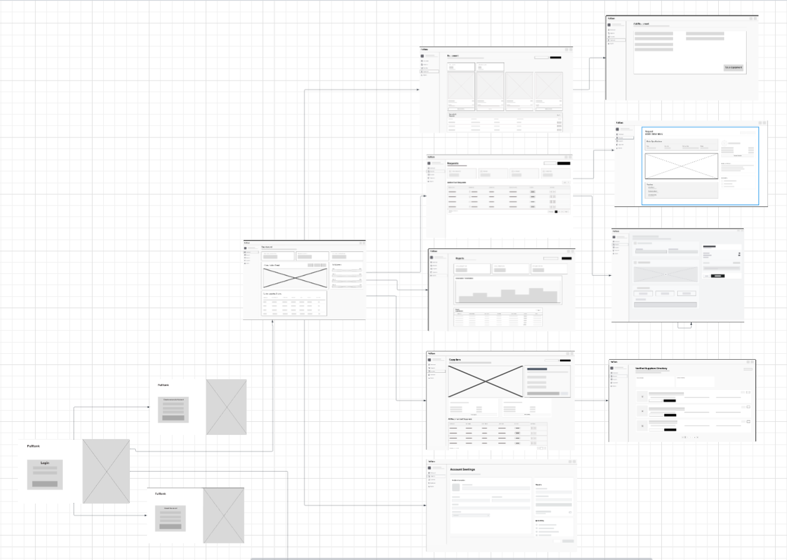
</div>

**Wireflow del segmento proveedor (Andrea López)**

Prioriza la atención de muchos pedidos a la vez. Desde el Dashboard, Andrea puede:

- abrir **Requests** para aprobar o rechazar las solicitudes entrantes;
- abrir **Orders** para seguir los despachos en curso y entrar al detalle de cada orden;
- mantener su **Inventory** actualizado;
- administrar su **Fleet** de cisternas y conductores;
- revisar **Reports** de ventas y el reporte de clientes;
- actualizar su **Account Settings**.

<div align="center">
  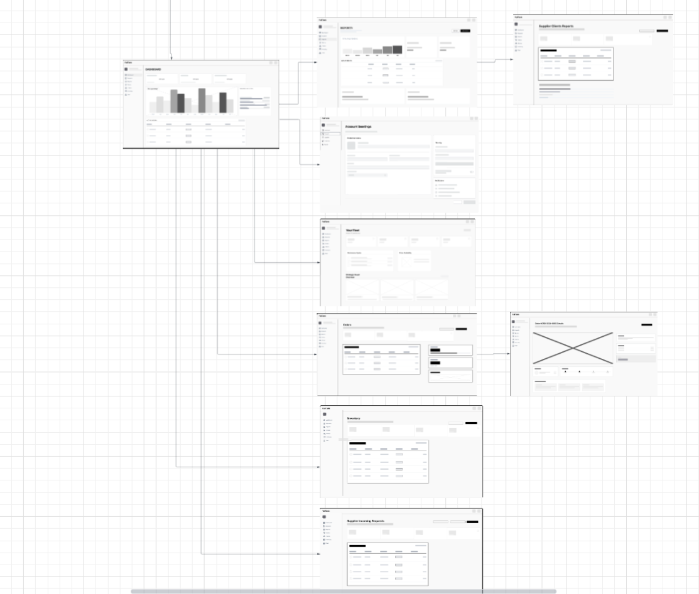
</div>

**Transiciones principales**

| Segmento | Pantalla de origen | Acción del usuario | Pantalla de destino |
|---|---|---|---|
| Ambos | Sign In | Ingresa credenciales válidas y presiona «Ingresar» | Dashboard de su rol |
| Ambos | Sign In | Presiona «Regístrate aquí» | Sign Up |
| Ambos | Sign In | Presiona «¿Olvidaste tu contraseña?» | Password Recovery |
| Solicitante | Dashboard | Selecciona «Requests» en la barra lateral | Requests |
| Solicitante | Requests | Presiona «New Fuel Request» | New Fuel Request |
| Solicitante | Requests | Selecciona una solicitud | Request Detail |
| Solicitante | Dashboard | Selecciona «Equipment» | Equipment |
| Solicitante | Equipment | Presiona «Register New Asset» | Add Equipment |
| Solicitante | Dashboard | Selecciona «Suppliers» | Suppliers |
| Solicitante | Suppliers | Presiona «View All» | Verified Suppliers Directory |
| Proveedor | Dashboard | Selecciona «Requests» | Incoming Requests |
| Proveedor | Incoming Requests | Presiona «Approve» o «Reject» | Incoming Requests con el estado actualizado |
| Proveedor | Dashboard | Selecciona «Orders» | Orders |
| Proveedor | Orders | Presiona «Details» | Order Detail |
| Proveedor | Dashboard | Selecciona «Reports» | Reports |
| Proveedor | Reports | Presiona «View All Clients» | Client Reports |

### 4.4.3 Web Applications Mock-ups

Los mock-ups son los diseños de alta fidelidad de la aplicación web. Se elaboraron en Figma a partir de los wireframes y wireflows anteriores y aplican el sistema de diseño de la sección 4.1:

- tipografía Inter;
- azul primario y ámbar para las acciones destacadas;
- colores semánticos para los estados;
- espaciado en múltiplos de 8 px.

Se presentan en versión desktop y mobile para ambos segmentos. Los componentes se eligieron para que su implementación con Vue 3 y PrimeVue sea directa:

- `Sidebar` y `Menu` para la navegación;
- `Card` para los indicadores;
- `DataTable` para las listas;
- `Tag` para los estados;
- `Timeline` para el seguimiento;
- `Chart` para los reportes.

#### Acceso a la aplicación

**Inicio de sesión.** Pantalla dividida en dos columnas.

- **Izquierda:** el formulario pide el correo corporativo y la contraseña, y ofrece los enlaces para recuperar la contraseña y para crear una cuenta.
- **Derecha:** una imagen de una cisterna refuerza el contexto del producto.
- **Botón principal:** «Ingresar» usa el color de acento para destacar la acción.

<div align="center">
  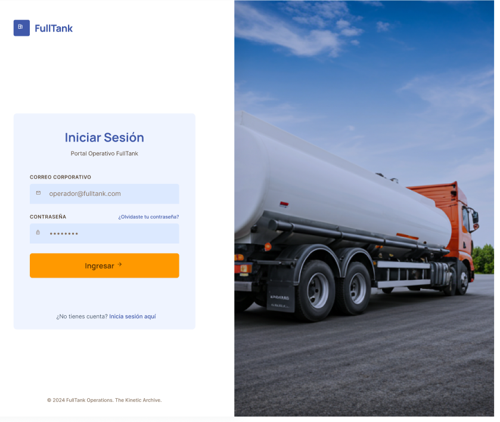
</div>

**Registro de cuenta corporativa.** Mantiene la misma estructura y solicita el nombre de la empresa, el correo corporativo y la contraseña. Tras el registro, el usuario recibe un correo de validación y vuelve al inicio de sesión.

<div align="center">
  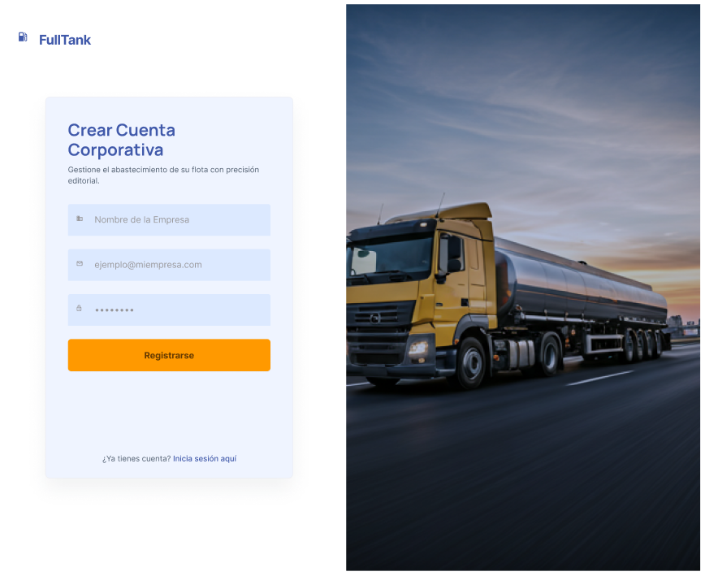
</div>

#### Segmento solicitante: versión desktop

Las pantallas del solicitante comparten:

- una barra lateral con los módulos Dashboard, Requests, Suppliers, Equipment y Reports;
- una barra superior con las notificaciones y la configuración.

**Dashboard.**

- **Indicadores:** consumo total de combustible, solicitudes pendientes y tanques con baja capacidad.
- **Consumo:** tendencia diaria, semanal o mensual.
- **Tanques:** nivel de cada uno, con colores semánticos.
- **Pedidos activos:** tabla con destino, proveedor, volumen, hora estimada de llegada y estado.

<div align="center">
  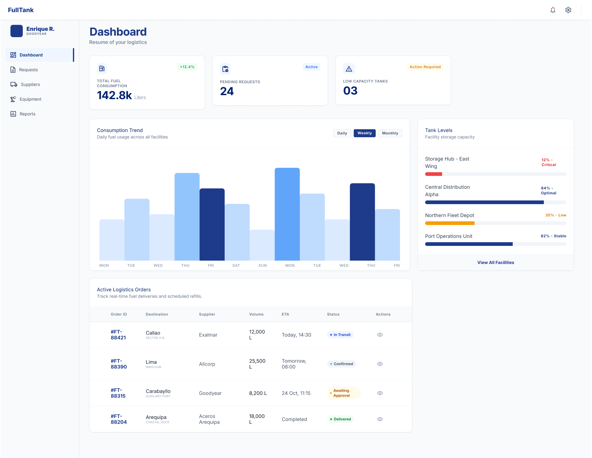
</div>

**Directorio de proveedores verificados.**

- **Datos de cada proveedor:** cobertura, tipos de combustible, capacidad mensual, pedido mínimo e índice de confiabilidad.
- **Acciones:** solicitar una cotización o marcar al proveedor como favorito.

<div align="center">
  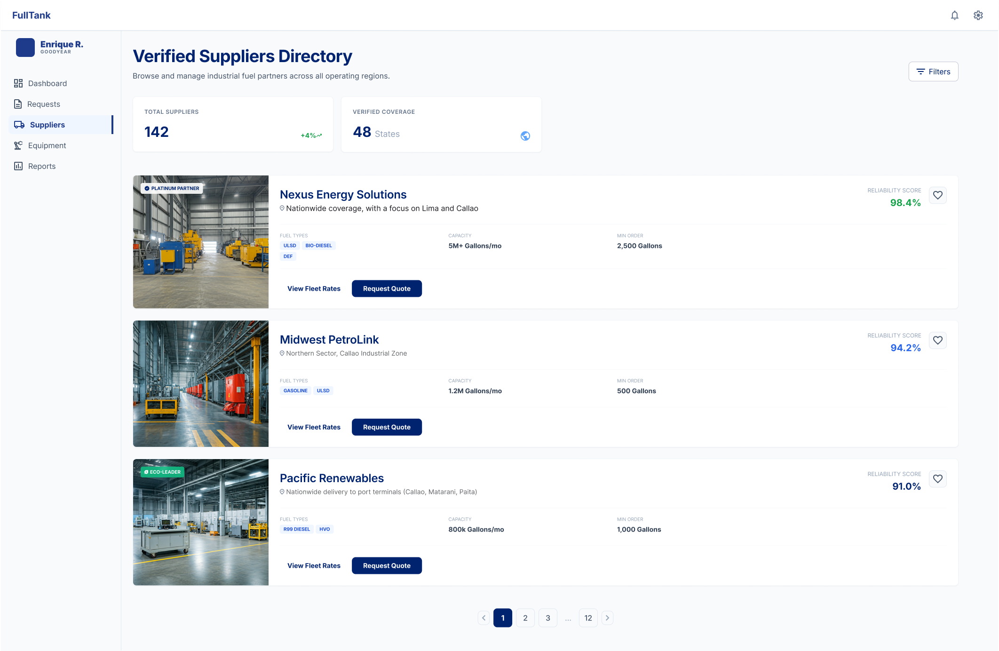
</div>

**Recomendación de proveedores.** Destaca al proveedor más adecuado para los equipos del solicitante y compara alternativas por tipo de combustible, precio unitario, tiempo de entrega y cumplimiento.

<div align="center">
  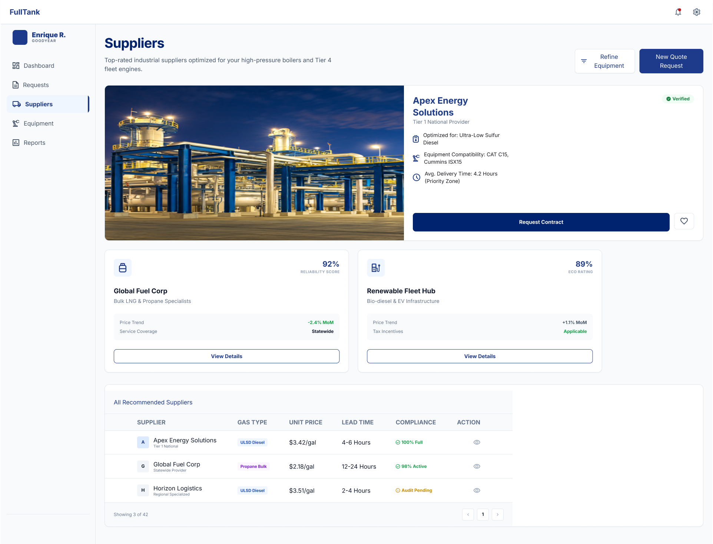
</div>

**Nueva solicitud de combustible.** Guía el registro en tres pasos:

1. tipo y cantidad de combustible;
2. lugar de entrega, con apoyo de un mapa;
3. prioridad e instrucciones adicionales.

Un panel lateral resume el pedido y su costo estimado antes de enviarlo o guardarlo como borrador.

<div align="center">
  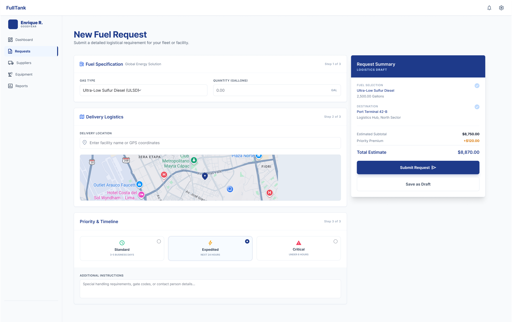
</div>

**Lista de solicitudes.** Resume las solicitudes activas, las pendientes, el volumen en tránsito y las completadas en el día. La tabla permite ordenar, paginar y abrir el detalle de cada solicitud.

<div align="center">
  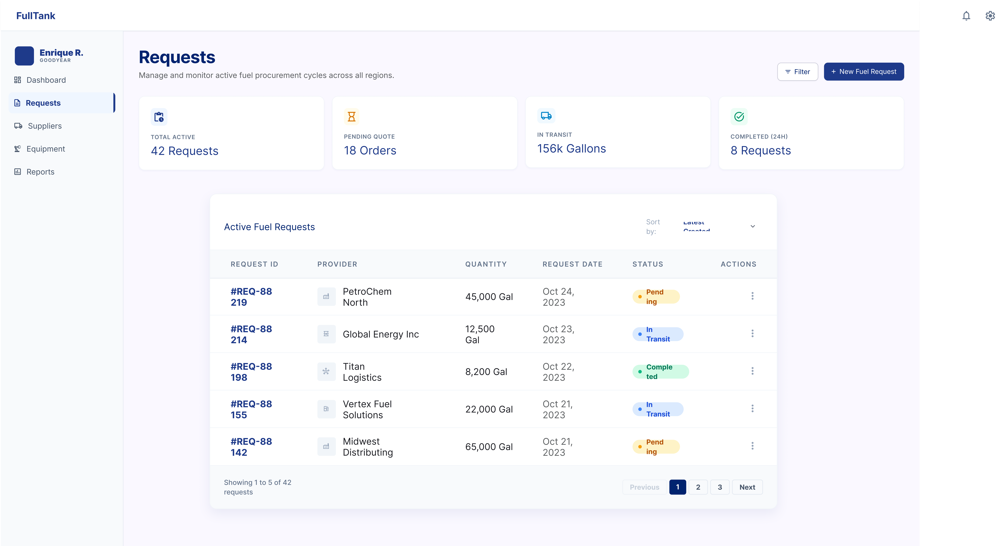
</div>

**Detalle de la solicitud.** Reúne:

- las especificaciones del pedido;
- el mapa del lugar de entrega;
- la línea de tiempo de estados;
- el proveedor, el conductor y la cisterna asignados, con la hora estimada de llegada;
- las notas y los documentos adjuntos.

Desde aquí el solicitante puede contactar al proveedor.

<div align="center">
  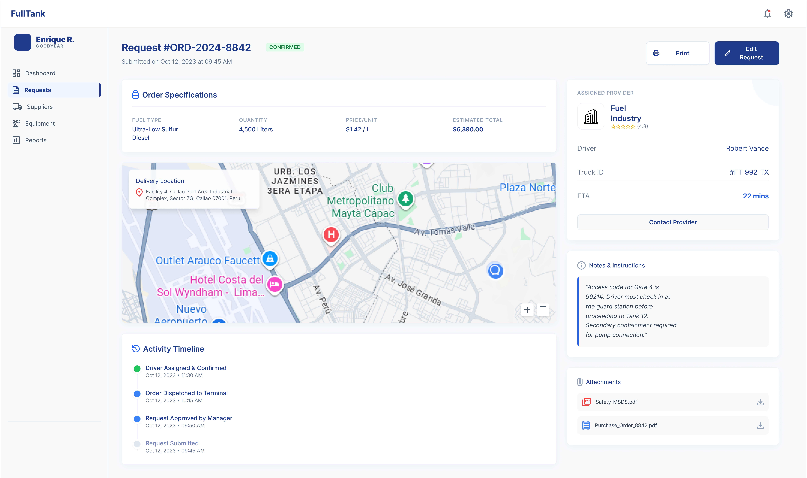
</div>

**Equipos.** Presenta los tanques y equipos del solicitante en tarjetas con su capacidad, su porcentaje restante y su fecha de última recarga. Cada tarjeta permite solicitar una recarga, y al pie se listan las últimas solicitudes de recarga.

<div align="center">
  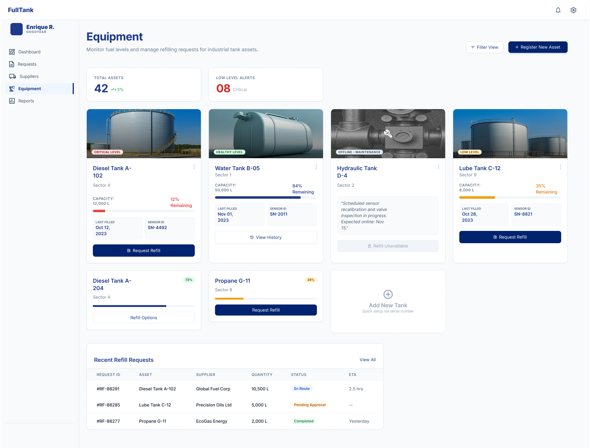
</div>

**Reportes.** Resume el consumo total, el gasto y la eficiencia del periodo seleccionado. Muestra la tendencia semanal de consumo y la tabla de gastos recientes, y permite exportar a PDF.

<div align="center">
  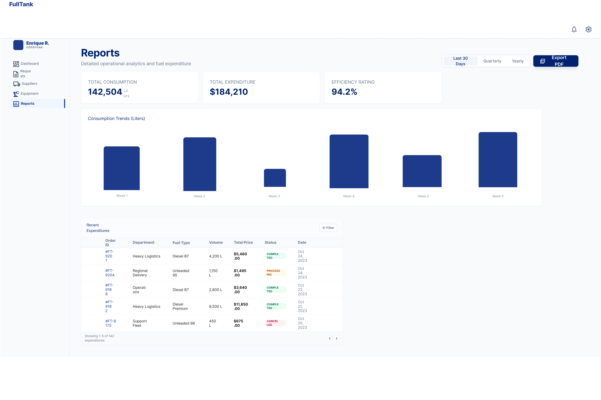
</div>

**Configuración de la cuenta.** Permite editar los datos del perfil y el idioma, cambiar la contraseña, activar la autenticación en dos pasos y elegir qué notificaciones recibir.

<div align="center">
  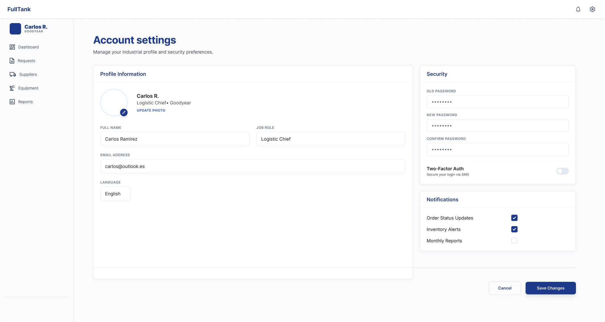
</div>

#### Segmento proveedor: versión desktop

Las pantallas del proveedor comparten una barra lateral con los módulos Dashboard, Requests, Reports, Orders, Inventory y Fleet.

**Dashboard.**

- **Indicadores:** volumen vendido, órdenes pendientes y alertas de inventario bajo.
- **Ventas:** tendencia de ventas.
- **Depósitos:** nivel de cada uno.
- **Órdenes activas:** tabla con destino, volumen, hora estimada y estado.

<div align="center">
  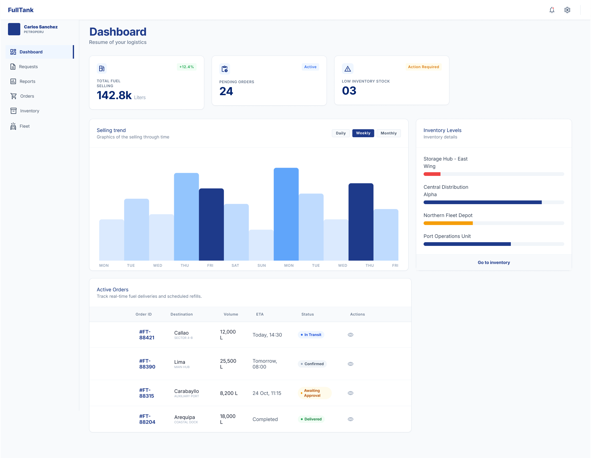
</div>

**Solicitudes entrantes.** Es la bandeja de trabajo principal. Cada solicitud muestra:

- el cliente;
- el combustible y la cantidad;
- el lugar;
- la prioridad;
- el estado del pago (pendiente, comprobante cargado o verificado);
- los botones para aprobar o rechazar.

Un registro inferior muestra las últimas acciones realizadas.

<div align="center">
  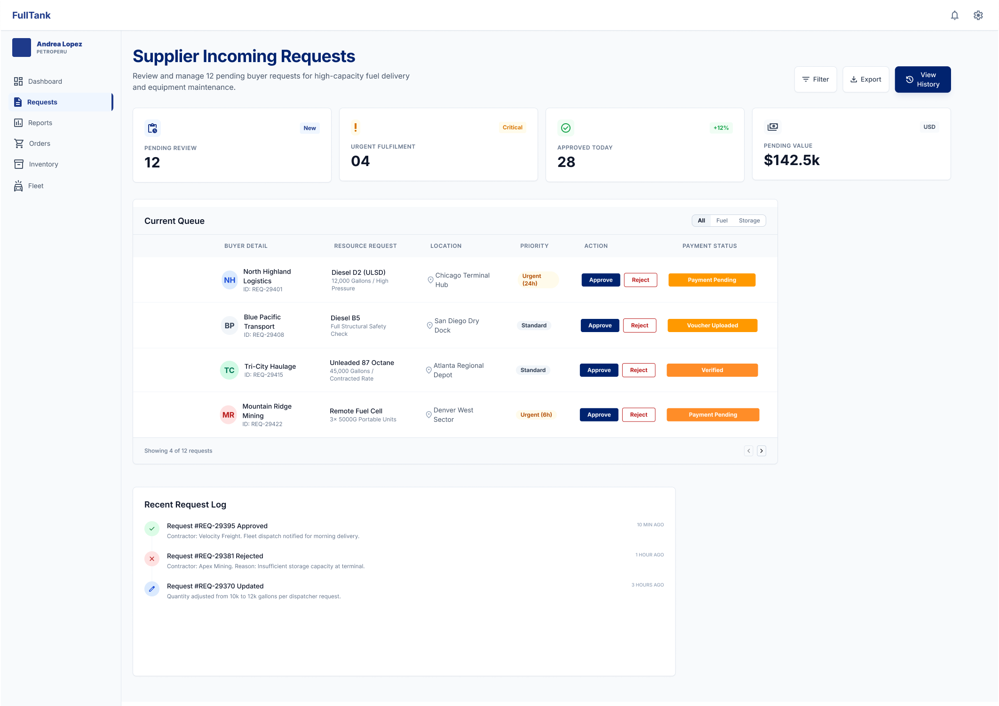
</div>

**Órdenes en curso.** Muestra los despachos en tránsito, en carga, con retraso y entregados en el día. La tabla lista cada orden con su estado y su hora estimada, y un panel lateral agrupa las alertas prioritarias.

<div align="center">
  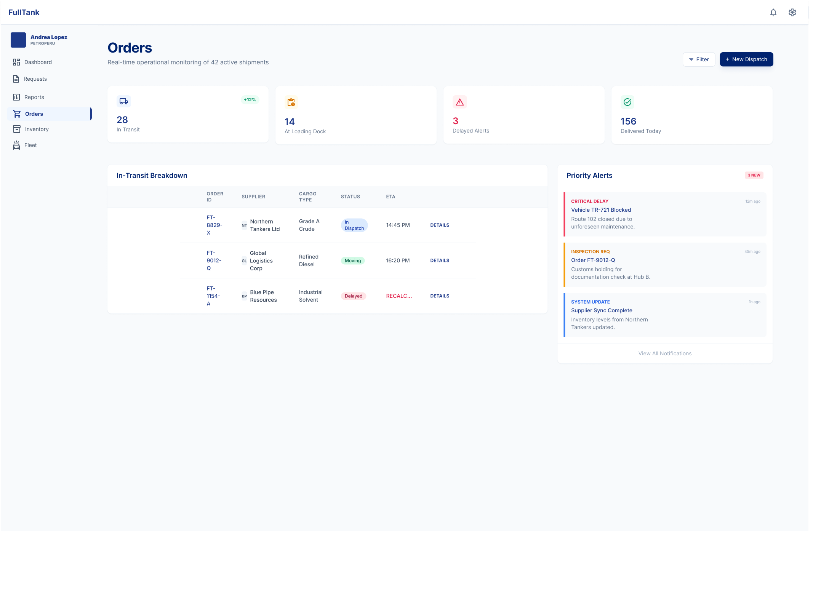
</div>

**Detalle de la orden.** Combina:

- el seguimiento de la ruta en un mapa;
- la cisterna y el conductor asignados;
- la línea de tiempo de la orden;
- los datos del cliente y el manifiesto de carga;
- las notas y requisitos de entrega.

<div align="center">
  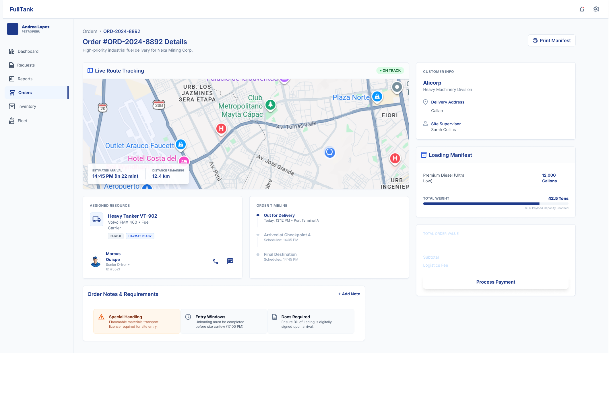
</div>

**Inventario.** Muestra el stock total por tipo de combustible y las alertas activas. Una tabla lo distribuye por depósito con la capacidad ocupada y el tipo de producto, y el botón «Add Inventory» registra nuevos ingresos.

<div align="center">
  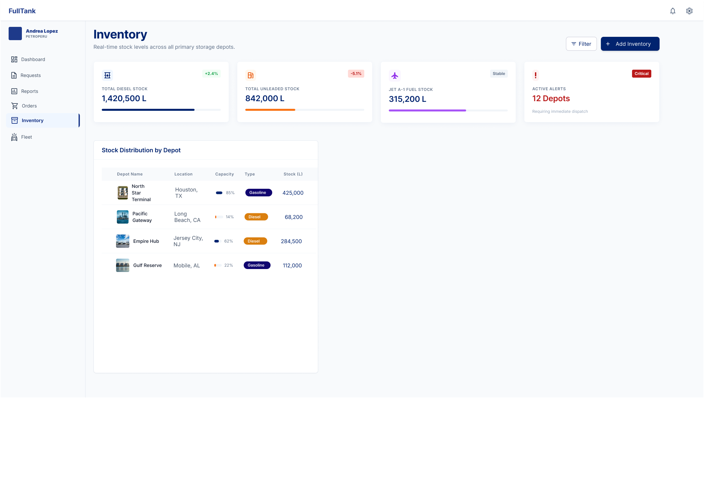
</div>

**Flota.** Resume el tamaño de la flota, su disponibilidad, los mantenimientos y las alertas de seguridad. Muestra la disponibilidad de los conductores y las unidades con su estado y nivel de carga, y permite registrar un nuevo vehículo.

<div align="center">
  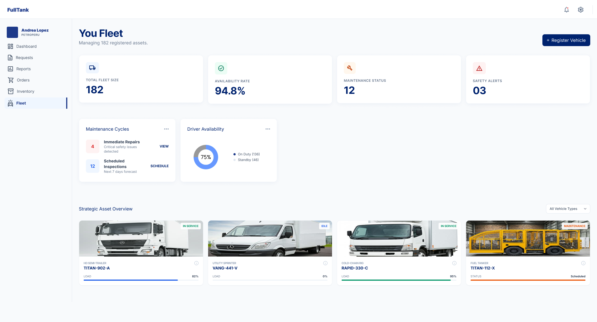
</div>

**Reportes de ventas.** Presenta los ingresos del periodo con su tendencia mensual, la tasa de cumplimiento y el tiempo promedio de entrega. Incluye el desempeño por cliente y la exportación a PDF.

<div align="center">
  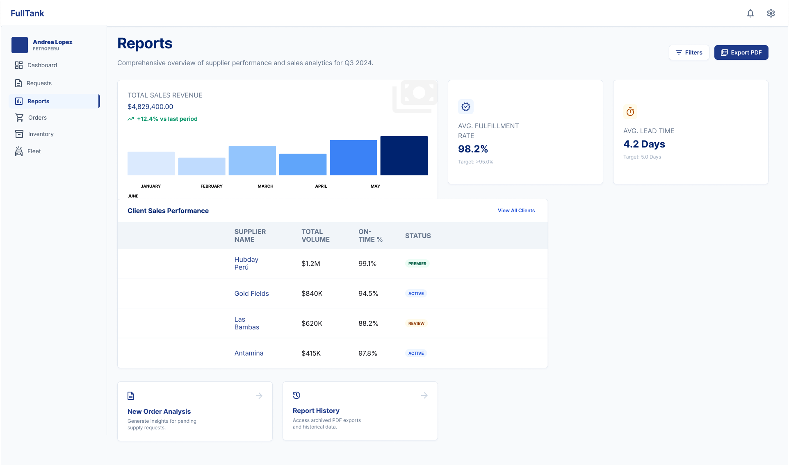
</div>

**Reporte de clientes.** Muestra la cartera de clientes con su sector, volumen, última actividad y estado, junto con la distribución del volumen por sector industrial.

<div align="center">
  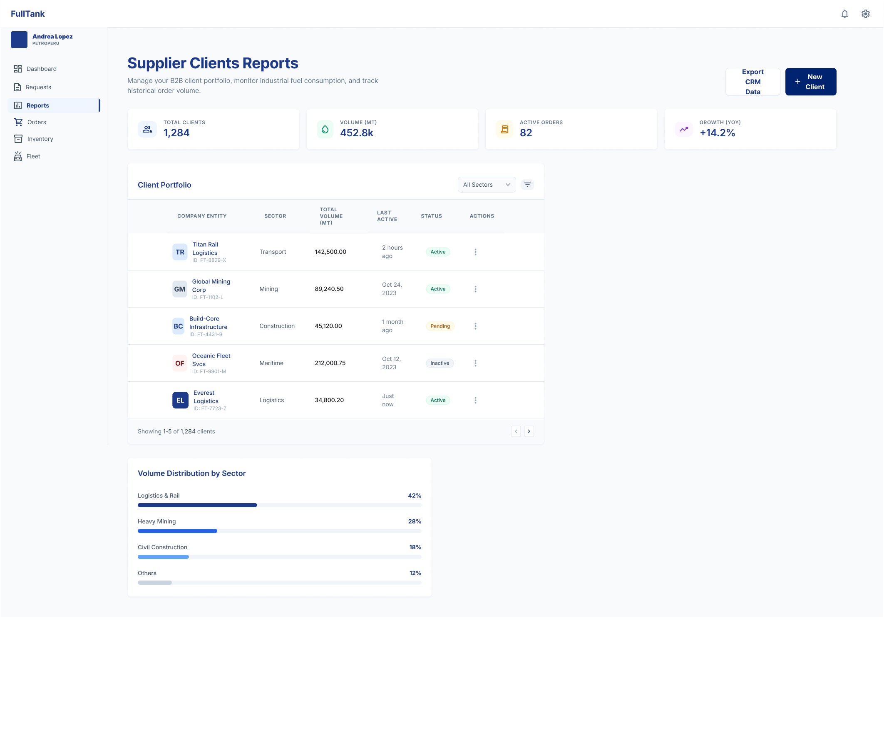
</div>

**Configuración de la cuenta.** Ofrece las mismas opciones de perfil, seguridad y notificaciones que el solicitante, con alertas específicas de inventario.

<div align="center">
  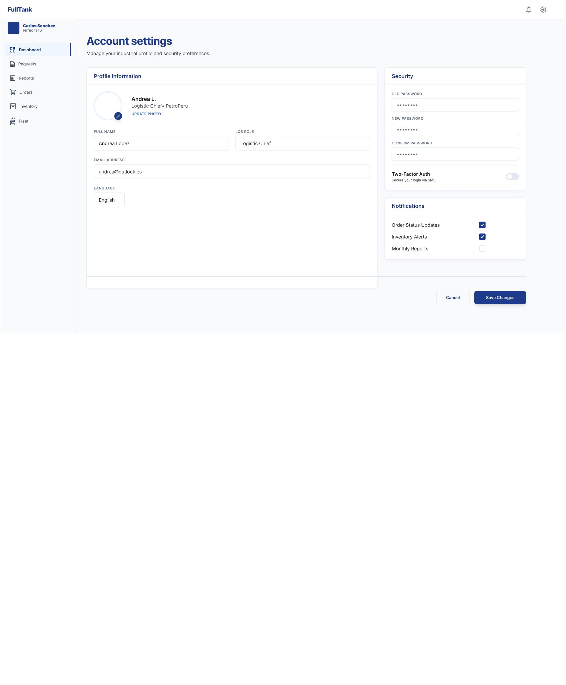
</div>

#### Segmento solicitante: versión mobile

La versión mobile sigue un enfoque responsive:

- la barra lateral se convierte en un menú hamburguesa;
- las tablas se transforman en tarjetas apiladas;
- los botones ocupan todo el ancho para facilitar el uso táctil.

Está pensada para un solicitante que suele estar en obra o en planta y necesita pedir combustible o revisar una entrega desde su celular.

- **Dashboard:** pedidos activos, balance de combustible, consumo de la semana, estado de los tanques y pedidos recientes.
- **Proveedores:** buscador con filtros rápidos y tarjetas con calificación, cobertura, pedido mínimo y tiempo de entrega.
- **Recomendaciones:** proveedor más confiable y alternativas ordenadas por puntaje.
- **Nueva solicitud:** los tres pasos del formulario desktop en una sola columna, con el total estimado antes de enviar.

<p align="center">
  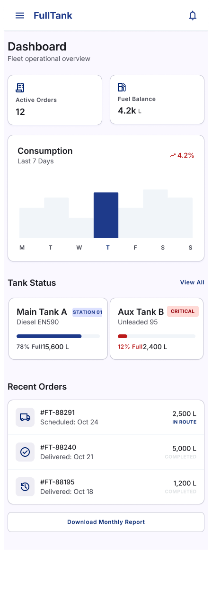
  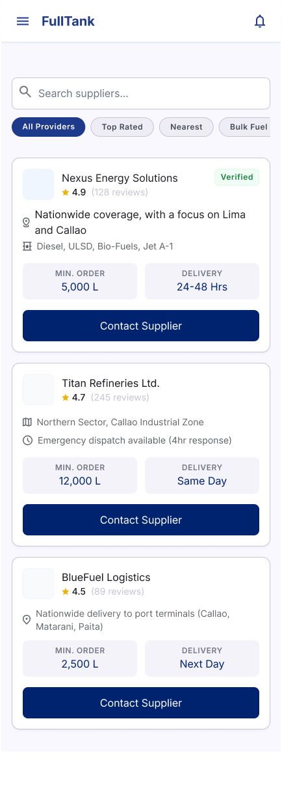
  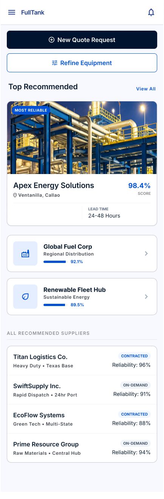
  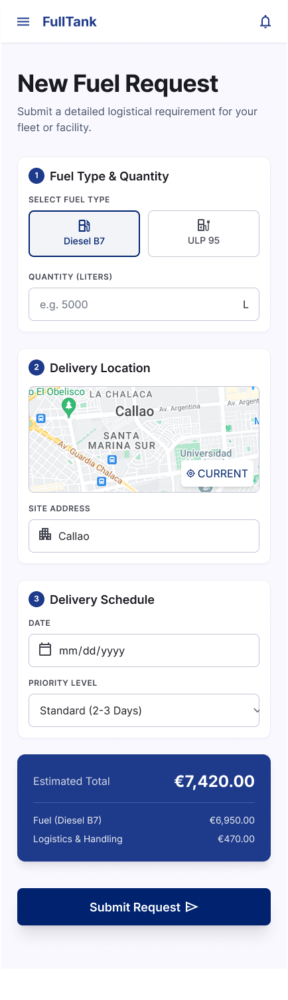
</p>

- **Solicitudes:** buscador y tarjetas con el estado, el tipo de combustible, la cantidad y el acceso al detalle o al seguimiento.
- **Detalle de la solicitud:** mapa, combustible y volumen, proveedor y conductor con botón de llamada, y línea de tiempo del pedido.
- **Equipos:** nivel de cada tanque en un indicador circular, con acceso directo a solicitar o programar una recarga.
- **Reportes:** consumo del periodo, gasto por sede y exportación a PDF.

<p align="center">
  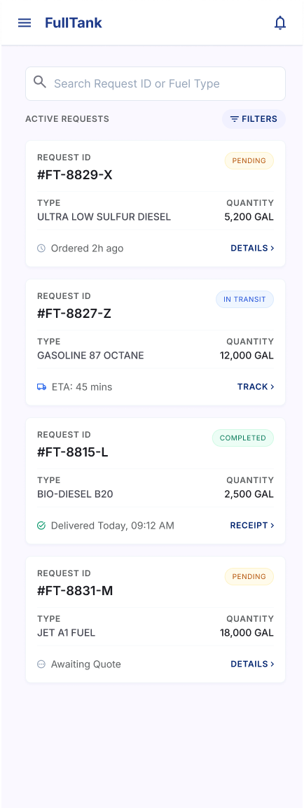
  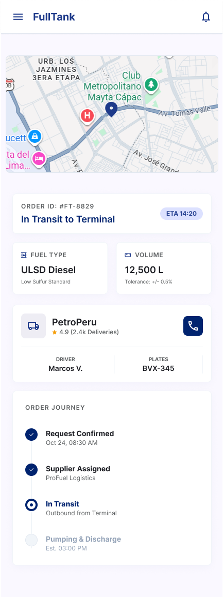
  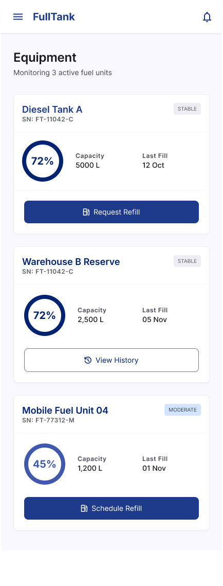
  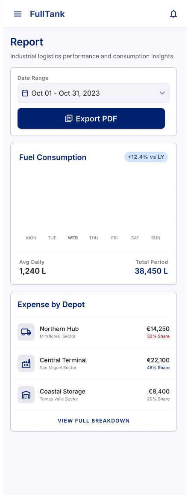
</p>

#### Segmento proveedor: versión mobile

La versión mobile del proveedor permite supervisar la operación logística en campo con la misma información que la versión desktop.

- **Menú de navegación:** el menú hamburguesa despliega los mismos módulos que la barra lateral.
- **Dashboard:** órdenes activas, balance de combustible, tendencia de ventas y solicitudes urgentes con botones para aceptar o rechazar.
- **Órdenes en progreso:** tarjetas con mapa, combustible, hora estimada de llegada, destino y cisterna asignada.
- **Seguimiento de la orden:** ubicación de la cisterna, datos del conductor con opciones de mensaje y llamada, y manifiesto de carga.

<p align="center">
  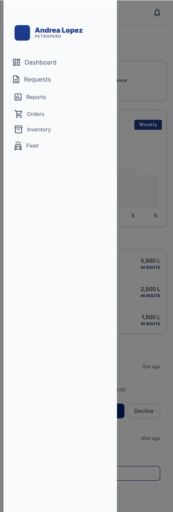
  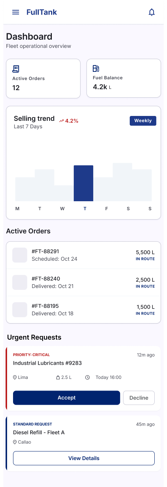
  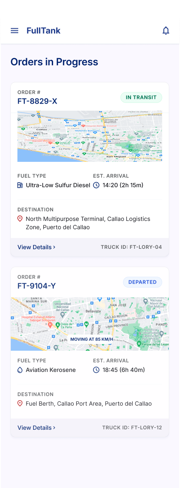
  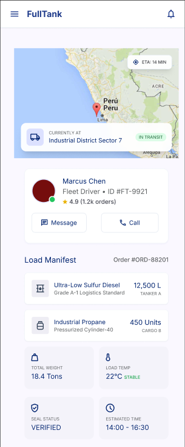
</p>

- **Inventario:** tarjetas por depósito con el nivel de cada combustible y etiquetas de estado (crítico, óptimo o bajo).
- **Flota:** vehículos activos con su estado, destino y tiempo estimado, y un botón flotante para registrar una unidad.
- **Reportes:** ingresos del periodo, tendencia de volumen y descarga del reporte en PDF.
- **Reporte de clientes:** volumen por sector y cartera de clientes.
- **Configuración de la cuenta:** perfil, seguridad y preferencias de notificación en una sola columna.

<p align="center">
  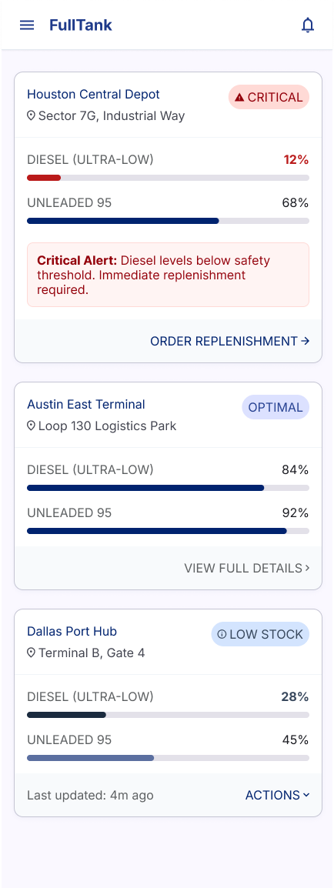
  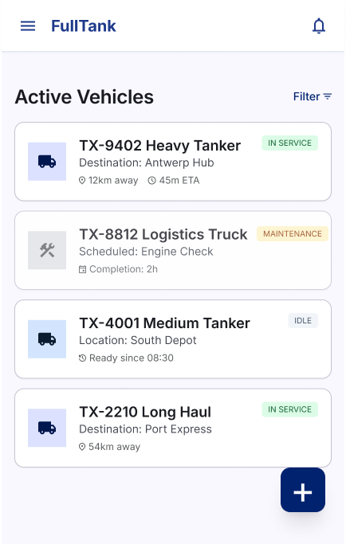
  
  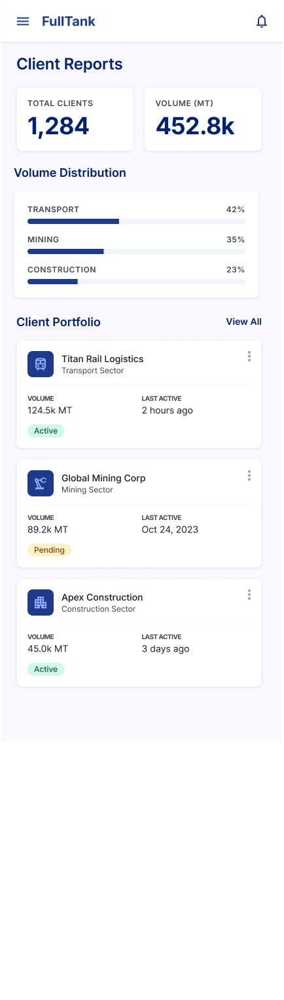
  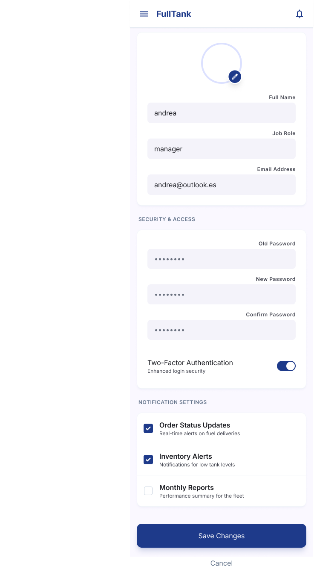
</p>

### 4.4.4 Web Applications User Flow Diagrams

Los User Flow Diagrams representan el recorrido que sigue un usuario para cumplir un objetivo concreto (User Goal) dentro de la aplicación. Para cada objetivo se describe:

- el **happy path**, en el que el usuario completa la tarea sin inconvenientes;
- los **unhappy paths**, en los que un error o una condición no cumplida desvía el flujo.

Cada objetivo se relaciona con las historias de usuario del capítulo III y con los User Personas Carlos Ramírez (solicitante) y Andrea López (proveedora).

#### User Goal 1: iniciar sesión

- **User Personas:** Carlos Ramírez y Andrea López.
- **Historias relacionadas:** EP04 — Autenticación y Registro.

**Happy path.** El usuario ingresa su correo corporativo y su contraseña en la pantalla de inicio de sesión y presiona «Ingresar». El sistema valida sus credenciales y lo lleva al dashboard de su rol, desde donde puede gestionar sus pedidos.

<div align="center">
  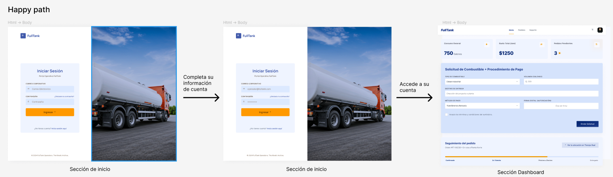
</div>

**Unhappy path.** El usuario ingresa credenciales incorrectas. Al presionar «Ingresar», el sistema no permite el acceso y muestra el mensaje «Usuario y/o contraseña incorrectos». El usuario permanece en la misma pantalla para corregir los datos y volver a intentarlo.

<div align="center">
  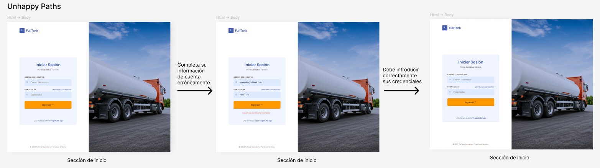
</div>

#### User Goal 2: crear una cuenta corporativa

- **User Personas:** visitantes que serán solicitantes o proveedores.
- **Historias relacionadas:** EP04 — Autenticación y Registro.

**Happy path.** Desde el inicio de sesión, el visitante presiona «Regístrate aquí» y llega al formulario de registro. Completa el nombre de su empresa, su correo corporativo y una contraseña válida, y presiona «Registrarse». El sistema crea la cuenta y lo devuelve al inicio de sesión para que ingrese con sus nuevas credenciales.

<div align="center">
  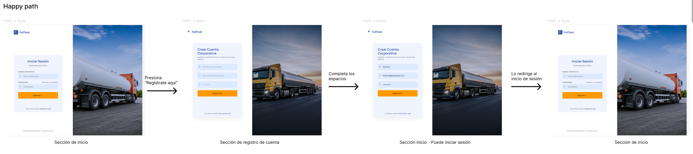
</div>

**Unhappy paths.** Se contemplan dos errores:

- un dato con formato inválido, como un correo mal escrito;
- uno o más campos obligatorios vacíos.

En ambos casos el sistema no crea la cuenta, se mantiene en el formulario y muestra en rojo el mensaje «Campos inválidos» o «Complete todos los campos».

<div align="center">
  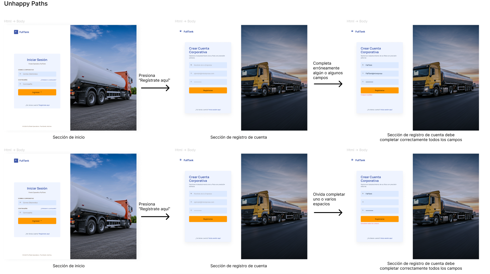
</div>

#### User Goal 3: recuperar el acceso a la cuenta

- **User Personas:** Carlos Ramírez y Andrea López.
- **Historias relacionadas:** EP04 — Autenticación y Registro; TS-02.

**Happy path.**

1. Desde el inicio de sesión, el usuario presiona «¿Olvidaste tu contraseña?».
2. Ingresa su correo corporativo y presiona «Enviar código».
3. En la pantalla «Restablecer contraseña» escribe el código recibido, su nueva contraseña y la confirmación.
4. Presiona «Actualizar contraseña» y el proceso termina con éxito.

<div align="center">
  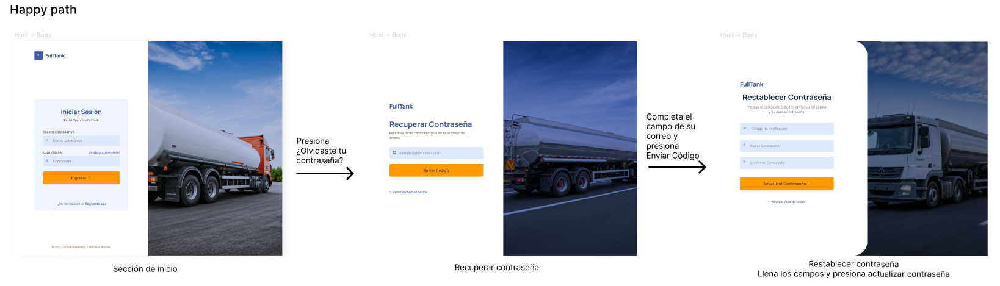
</div>

**Unhappy path.** El usuario ingresa un correo que no está registrado. Al presionar «Enviar código», el sistema no continúa y muestra el mensaje «Correo no registrado, ingrese un correo válido» hasta que el usuario corrija el dato.

<div align="center">
  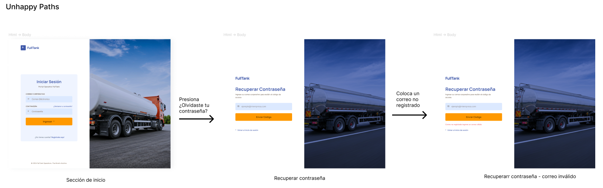
</div>

#### User Goal 4: registrar un pedido de combustible

- **User Persona:** Carlos Ramírez.
- **Historias relacionadas:** US-05 Registrar nuevo pedido y US-08 Registrar información de pago.

**Happy path.**

1. Desde su dashboard, Carlos entra a «Requests» y presiona «New Fuel Request».
2. Selecciona el tipo de combustible, indica la cantidad y el lugar de entrega, y elige la prioridad.
3. Revisa el resumen de costos y presiona «Submit Request».
4. El sistema registra el pedido con estado «Pending» y lo lleva a la lista de solicitudes, donde el pedido aparece al inicio.

<div align="center">
  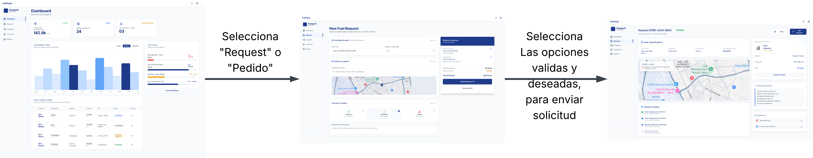
</div>

**Unhappy paths.** El pedido no se envía si Carlos:

- deja campos obligatorios vacíos, como el tipo de combustible;
- ingresa una cantidad igual o menor a cero, o mayor al límite permitido.

El sistema se mantiene en el formulario, resalta los campos con error y explica qué debe corregirse.

<div align="center">
  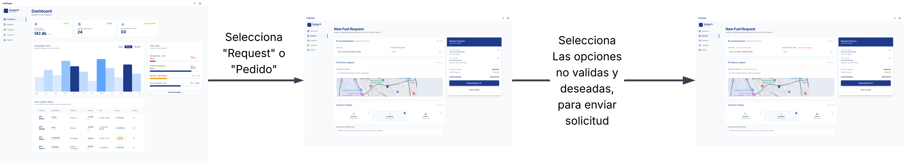
</div>

#### User Goal 5: aprobar un pedido con pago validado

- **User Persona:** Andrea López.
- **Historias relacionadas:** US-10 Ver pedidos pendientes, US-11 Aprobar pedido y US-42 Rechazar pedido.

**Happy path.**

1. Desde su dashboard, Andrea entra a «Requests» y revisa la bandeja de solicitudes entrantes.
2. Ubica un pedido cuyo pago figura como verificado.
3. Comprueba que los comprobantes cubren el total y presiona «Approve».
4. El pedido cambia a «Approved», se muestra una confirmación y el solicitante recibe una notificación.

<div align="center">
  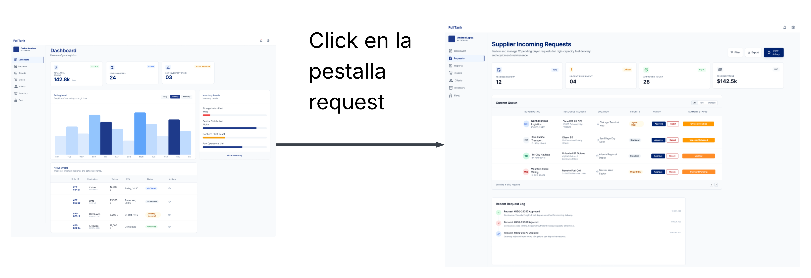
</div>

**Unhappy paths.** El pago del pedido está pendiente, es inválido o no cubre el total.

- Si Andrea intenta aprobarlo, el sistema no cambia el estado y muestra un mensaje que indica que el pago está incompleto.
- Andrea puede esperar a que el cliente regularice el pago o presionar «Reject»; en ese caso debe ingresar un motivo obligatorio antes de confirmar el rechazo.

<div align="center">
  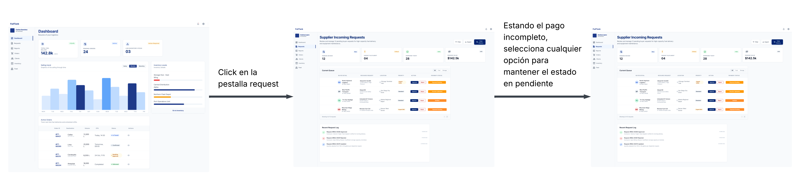
</div>

#### User Goal 6: despachar un pedido aprobado

- **User Persona:** Andrea López.
- **Historias relacionadas:** US-12 Marcar pedido como despachado; TS-17, TS-18 y TS-19.
- **Happy path:** Andrea abre un pedido aprobado desde «Orders», le asigna una cisterna y un conductor disponibles de su flota y lo despacha. El pedido pasa a «In Transit», el solicitante recibe una notificación y la línea de tiempo se actualiza.
- **Unhappy paths:**
  - no hay cisternas o conductores disponibles: el sistema lo indica y no permite despachar hasta que se libere un recurso;
  - el pedido todavía no fue aprobado: la acción de despacho no está disponible.

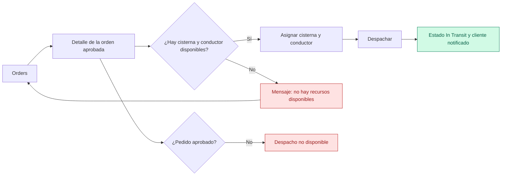
```mermaid
flowchart LR
    A[Orders] --> B[Detalle de la orden aprobada]
    B --> C{¿Hay cisterna y conductor disponibles?}
    C -- Sí --> D[Asignar cisterna y conductor]
    D --> E[Despachar]
    E --> F[Estado In Transit y cliente notificado]
    C -- No --> G[Mensaje: no hay recursos disponibles]
    G --> A
    B --> H{¿Pedido aprobado?}
    H -- No --> I[Despacho no disponible]
    classDef ok fill:#D1FAE5,stroke:#047857,color:#065F46
    classDef bad fill:#FEE2E2,stroke:#B91C1C,color:#991B1B
    class F ok
    class G,I bad
```

#### User Goal 7: seguir y confirmar la entrega

- **User Persona:** Carlos Ramírez.
- **Historias relacionadas:** US-06 Consultar estado del pedido, US-07 Confirmar recepción y US-13 Cerrar pedido.
- **Happy path:** Carlos recibe la notificación de despacho y abre el detalle de su solicitud. Sigue la cisterna en el mapa y, cuando el combustible llega, confirma la recepción. El pedido pasa a «Completed» y el proveedor puede cerrarlo.
- **Unhappy paths:**
  - el pedido aún no está en tránsito: la confirmación no está disponible;
  - el pedido ya fue confirmado: el sistema bloquea la acción e informa que la entrega ya fue registrada.

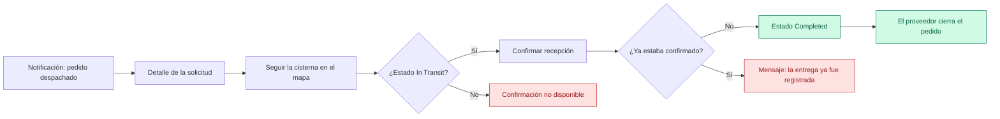
```mermaid
flowchart LR
    A[Notificación: pedido despachado] --> B[Detalle de la solicitud]
    B --> C[Seguir la cisterna en el mapa]
    C --> D{¿Estado In Transit?}
    D -- Sí --> E[Confirmar recepción]
    E --> F{¿Ya estaba confirmado?}
    F -- No --> G[Estado Completed]
    G --> H[El proveedor cierra el pedido]
    D -- No --> I[Confirmación no disponible]
    F -- Sí --> J[Mensaje: la entrega ya fue registrada]
    classDef ok fill:#D1FAE5,stroke:#047857,color:#065F46
    classDef bad fill:#FEE2E2,stroke:#B91C1C,color:#991B1B
    class G,H ok
    class I,J bad
```

## 4.5 Web Applications Prototyping

El prototipo interactivo de FullTank se construyó en Figma sobre los mock-ups de la sección 4.4.3, en versión desktop y mobile. Simula cómo los usuarios se autentican, registran y siguen sus pedidos, y cómo los proveedores los aprueban, despachan y controlan.

**Tipo de prototipo y objetivo**

Siguiendo a Gothelf y Seiden (2021), el tipo de prototipo se eligió según quién lo usará y qué se quiere aprender.

- **Tipo:** prototipo on-screen de alta fidelidad, porque se evaluará con responsables de abastecimiento y de despacho que deben reconocer en él una herramienta de trabajo real.
- **Alcance:** no simula todo el producto, sino los flujos principales, que son los que concentran el mayor riesgo:
  - registrar un pedido;
  - aprobarlo;
  - despacharlo;
  - seguirlo hasta su entrega.
- **Qué se quiere aprender:**
  - si ambos segmentos completan esas tareas sin ayuda;
  - si entienden los estados del pedido;
  - si encuentran valor suficiente para dejar las llamadas y los mensajes.

**Criterios de diseño**

- **Arquitectura centrada en el usuario:** las tareas más frecuentes del User Task Matrix (registrar y seguir pedidos, validar pagos, despachar y recibir notificaciones) están a uno o dos clics desde el dashboard.
- **Navegación consistente:** en desktop, la barra lateral fija da acceso a los módulos de cada rol, como define la sección 4.1.2; en mobile, el mismo contenido se despliega desde un menú hamburguesa.
- **Patrones de interacción conocidos:**
  - tarjetas para indicadores y proveedores;
  - tablas con filtros y paginación para listas extensas;
  - etiquetas de color para los estados del pedido;
  - líneas de tiempo para el seguimiento;
  - formularios por pasos para las solicitudes.
- **Diseño accesible:**
  - contraste conforme a WCAG 2.1 AA;
  - tipografía Inter con jerarquía clara;
  - botones amplios en mobile;
  - mensajes de error que explican cómo corregir cada dato.

**Flujos del prototipo**

| Flujo | Segmento | Recorrido |
|---|---|---|
| Flujo 1: acceso | Ambos | Inicio de sesión → registro de cuenta → recuperación de contraseña → dashboard según el rol |
| Flujo 2: proveedor | Andrea López | Dashboard → solicitudes entrantes (aprobar o rechazar) → órdenes → detalle de la orden → inventario → flota → reportes → configuración |
| Flujo 3: solicitante | Carlos Ramírez | Dashboard → proveedores y recomendaciones → nueva solicitud → lista de solicitudes → detalle y seguimiento → equipos → reportes → configuración |

**Versión desktop.** Está orientada a la gestión completa. El dashboard concentra los indicadores y los pedidos activos, la barra lateral lleva a cada módulo y las vistas de detalle agrupan en paneles la información del pedido, la logística y las acciones disponibles.

**Versión mobile.** Prioriza la consulta rápida en campo:

- resumen inmediato de pedidos y alertas;
- tarjetas apiladas en lugar de tablas;
- acciones principales al alcance del pulgar;
- acceso a todos los módulos desde el menú hamburguesa.

**Relación con los User Flow Diagrams.** Los flujos del prototipo recorren los happy paths de los User Goals de la sección 4.4.4, y los estados de error se muestran con los mensajes definidos en los unhappy paths.

**Enlaces**

- Diseño y prototipo en Figma: [FullTank en Figma](https://www.figma.com/design/ZMHB35H60u2eUhctevkVKc/Fullank-Completo?node-id=0-1&t=I3nr2x0tcAinM7gE-1)
- Video de recorrido del prototipo: [Prototype video en Microsoft Stream](https://upcedupe-my.sharepoint.com/:v:/g/personal/u202318620_upc_edu_pe/IQD-Y375Tn-qTL4_5hJtuQ8QAbHWOzNnv9YkDF7B09hJdfw?nav=eyJyZWZlcnJhbEluZm8iOnsicmVmZXJyYWxBcHAiOiJPbmVEcml2ZUZvckJ1c2luZXNzIiwicmVmZXJyYWxBcHBQbGF0Zm9ybSI6IldlYiIsInJlZmVycmFsTW9kZSI6InZpZXciLCJyZWZlcnJhbFZpZXciOiJNeUZpbGVzTGlua0NvcHkifX0&e=i63Yxn)


## 4.6 Domain-Driven Software Architecture

### 4.6.1 Design-Level Event Storming
Para identificar los eventos de dominio, es recomendable realizar una sesión de Event Storming. Esta técnica permite visualizar y comprender el flujo de eventos dentro del dominio, facilitando la identificación de los Bounded Context.

El desarrollo del proceso del Domain-Driven Design se realizó en la aplicación Miro: https://miro.com/app/board/uXjVGgOzeI4=/?share_link_id=421094077860

<div align="center">
  
</div>

1. Bounded Context IAM
   El bounded context IAM (Identity and Access Management) se encarga de la autenticación, autorización y gestión de credenciales dentro del sistema. Administra procesos como el registro de clientes y proveedores, inicio de sesión, recuperación de contraseñas y asignación de permisos según el rol. Su propósito es garantizar accesos seguros y controlados, asegurando que cada usuario interactúe únicamente con las funcionalidades que le corresponden dentro de la plataforma.
<div align="center">
  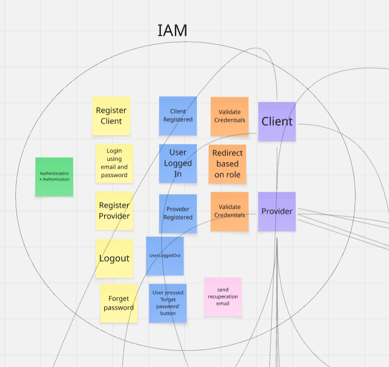
</div>

2. Bounded Context Catalog
El bounded context Catalog se encarga de gestionar la visualización y consulta de empresas proveedoras y los productos de combustible que ofrecen dentro del sistema. Su propósito es permitir que los solicitantes puedan explorar, comparar y evaluar diferentes opciones de combustible según disponibilidad, características y oferta de cada proveedor, facilitando así la toma de decisiones para seleccionar el producto más adecuado para sus equipos y operaciones.

<div align="center">
  
</div>

3. Bounded Context Ordering
El bounded context Ordering se encarga de la gestión del ciclo de vida de las solicitudes y órdenes realizadas por los clientes. Administra procesos como la creación de solicitudes, validación, aceptación o rechazo por parte del proveedor, generación de órdenes, despacho, confirmación de entrega y cierre del pedido. Su propósito es orquestar el flujo principal del negocio, asegurando que cada pedido siga un proceso claro, trazable y consistente desde su inicio hasta su finalización.

<div align="center">
  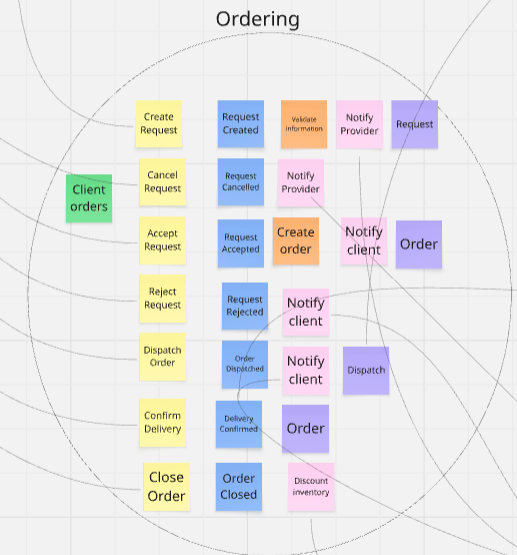
</div>


4. Bounded Context Fulfillment
El bounded context Fulfillment se encarga de la gestión logística necesaria para cumplir con las órdenes generadas. Administra procesos como el registro de transportes y conductores, asignación de recursos a pedidos y ejecución del despacho. Su propósito es garantizar que la entrega del combustible se realice de manera eficiente, coordinando los recursos logísticos involucrados en la distribución.

<div align="center">
  
</div>


5. Bounded Context Payment
El bounded context Payment se encarga de la gestión de los pagos asociados a las órdenes. Administra procesos como la solicitud de pago, registro de transacciones y aprobación del pago. Su propósito es asegurar que las operaciones económicas se realicen de manera confiable, validando que los pedidos cuenten con el respaldo financiero necesario antes de su ejecución o finalización.

<div align="center">
  
</div>

6. Bounded Context Notification
El bounded context Notification se encarga de la generación y gestión de notificaciones dentro del sistema. Administra procesos como la creación de notificaciones y el seguimiento de su estado (leídas o no leídas). Su propósito es mantener informados a los usuarios sobre eventos relevantes, como cambios en el estado de pedidos, pagos o entregas, mejorando la comunicación dentro de la plataforma.

<div align="center">
  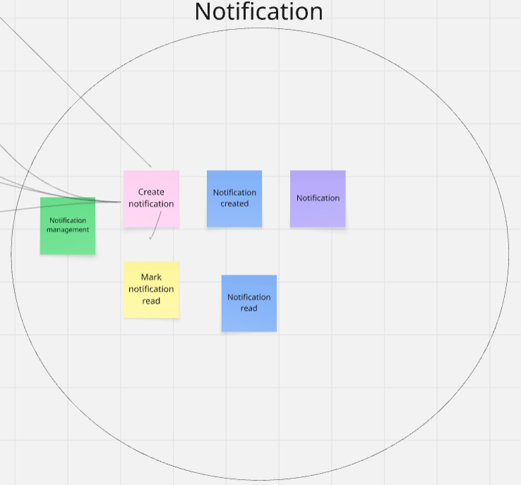
</div>

7. Bounded Context Reporting & Analytics
El bounded context Reporting & Analytics se encarga de la generación y visualización de reportes basados en la información del sistema. Administra procesos como la elaboración de reportes de ventas, consumo y métricas operativas. Su propósito es proporcionar información clave para la toma de decisiones, permitiendo analizar el comportamiento del negocio y optimizar sus procesos.

<div align="center">
  
</div>

8. Bounded Context Inventory
El bounded context Inventory se encarga de la gestión de los productos de combustible ofrecidos por los proveedores dentro del sistema. Administra procesos como el registro, actualización y eliminación de productos, así como la modificación de información relacionada con precios, disponibilidad y características del combustible. Su propósito es permitir que los proveedores mantengan actualizado su inventario, asegurando que los solicitantes puedan consultar ofertas vigentes y seleccionar el producto más adecuado para sus necesidades operativas.

<div align="center">
  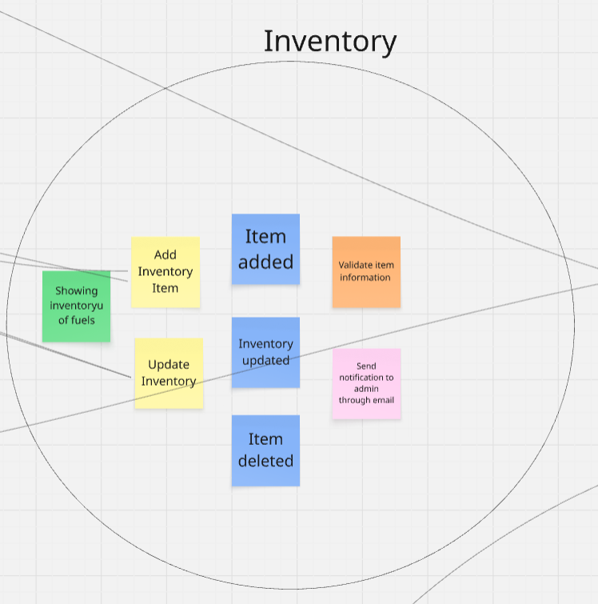
</div>

9. Bounded Context Equipment
El bounded context Equipment se encarga de la gestión y monitoreo de los equipos pertenecientes a los clientes o solicitantes dentro del sistema. Administra procesos como el registro y actualización de equipos, así como la visualización de su estado operativo y el nivel de combustible disponible en cada uno. Su propósito es permitir a los solicitantes supervisar sus hornos, maquinarias, tanques y otros equipos relacionados, facilitando el control del consumo de combustible y la planificación eficiente de sus operaciones.

<div align="center">
  
</div>

### 4.6.2 Software Architecture Context Diagram
En este nivel se presenta una vista de alto nivel de la arquitectura, donde el foco está en el sistema de software FullTank Platform como una "caja negra" y en las interacciones que mantiene con sus usuarios y con otros sistemas externos.

El context diagram muestra al FullTank Platform como un recuadro central, rodeado por los principales actores y sistemas con los que se comunica:

Visitor: usuario anónimo que navega la landing page para conocer la plataforma, revisar sus beneficios y registrarse en el sistema.

Client (Requester): representante de una empresa que requiere combustible. Interactúa con la plataforma para explorar el catálogo de proveedores y sus productos, gestionar sus equipos (vehículos, generadores, maquinaria), crear solicitudes de abastecimiento, registrar pagos, hacer seguimiento de pedidos y confirmar entregas.

Provider: representante de una empresa proveedora de combustible. Gestiona su inventario de productos, evalúa solicitudes entrantes, aprueba o rechaza pedidos, asigna recursos logísticos (transporte y conductores) y ejecuta despachos.

Email Service: sistema externo encargado de enviar correos electrónicos, principalmente para la recuperación de contraseñas y notificaciones relacionadas a autenticación.

Cloud Storage: sistema externo utilizado para almacenar comprobantes de pago (vouchers) cargados por los clientes.

PDF Generator Service: sistema externo encargado de generar reportes en formato PDF, como resúmenes de consumo y ventas.

En el diagrama se representan las relaciones entre estos elementos, destacando que los usuarios (Visitor, Client y Provider) interactúan directamente con FullTank, mientras que el sistema se encarga de orquestar la comunicación con los servicios externos (correo, almacenamiento y generación de reportes). Esta vista permite comprender el alcance del sistema, sus límites de responsabilidad y el ecosistema en el que opera antes de entrar en detalles internos.

<div allign="center">
  
</div>

### 4.6.3 Software Architecture Container Diagrams

En el nivel de contenedores, la atención se centra en cómo se organiza internamente el sistema en aplicaciones y fuentes de datos. El container diagram muestra los elementos principales de la arquitectura de FullTank, sus responsabilidades y la forma en que se comunican entre sí y con sistemas externos.

La arquitectura lógica de FullTank se estructura en los siguientes contenedores:

Landing Page: aplicación web estática que presenta la propuesta de valor del sistema, incluyendo secciones como descripción del servicio, beneficios, testimonios, precios, preguntas frecuentes y contacto. Está desarrollada con HTML, CSS y JavaScript, y orientada a usuarios no autenticados.

FullTank Web Application (SPA): aplicación web principal desarrollada en Vue.js 3 con Pinia como gestor de estado y Vue Router para navegación protegida por roles. Es utilizada por clientes y proveedores para interactuar con el sistema. Del lado del cliente contiene módulos como catálogo de proveedores, gestión de equipos, solicitudes, pagos, reportes de consumo y notificaciones. Del lado del proveedor incluye módulos de inventario, gestión de órdenes, flota y despacho, reportes de ventas y listado de clientes.

FullTank API: backend desarrollado en ASP.NET Core 8 con Entity Framework Core que expone una API REST. Centraliza la lógica de negocio, reglas de validación y orquestación de procesos, organizados en nueve bounded contexts del dominio: Identity & Access, Catalog, Equipment, Inventory, Ordering, Payment, Fulfillment, Notification y Reporting & Analytics.

MySQL Database: base de datos relacional donde se almacena toda la información estructurada del sistema, incluyendo usuarios, proveedores, productos, equipos, solicitudes, órdenes, pagos, inventario, flota, despachos, notificaciones y reportes.

En el diagrama se observa que los usuarios acceden inicialmente a la Landing Page, desde donde pueden registrarse o ingresar a la aplicación principal. La Web Application (SPA) se comunica exclusivamente con la API mediante peticiones HTTPS utilizando formato JSON a través de un cliente HTTP centralizado (Axios) con interceptor JWT. La API persiste y consulta datos en la base de datos MySQL mediante Entity Framework Core.Adicionalmente, la API se integra con sistemas externos: Email Service para correos de recuperación de contraseña, Cloud Storage para almacenamiento de comprobantes de pago y PDF Generator Service para la generación de reportes descargables.

Esta vista permite entender la distribución de responsabilidades entre la capa de presentación (Landing Page y SPA), la capa de lógica de negocio (API) y la capa de persistencia (Database), así como las principales decisiones tecnológicas adoptadas.

<div align="center">
  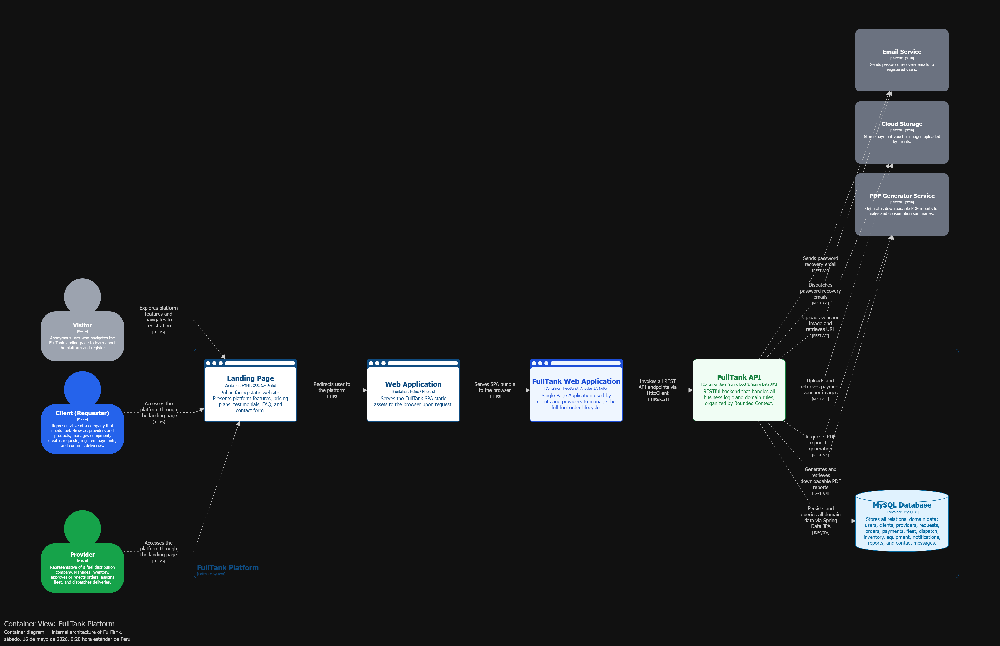
</div>

### 4.6.4 Software Architecture Components Diagrams
En el nivel de componentes se detalla la descomposición interna de los contenedores, enfocándose principalmente en el contenedor FullTank API, donde reside la lógica de negocio del sistema.

El component diagram organiza la arquitectura interna siguiendo los bounded contexts definidos en el dominio. Cada uno representa un módulo backend con responsabilidades específicas:

Identity & Access BC: gestiona el registro de usuarios (clientes y proveedores), autenticación mediante credenciales de correo electrónico y contraseña, autorización basada en roles, emisión de tokens JWT, recuperación de contraseñas y administración de perfiles. Redirige al usuario según su rol tras el inicio de sesión.

Catalog BC: bounded context orientado al cliente que permite explorar los proveedores disponibles en la plataforma, consultar el catálogo de productos (tipos de combustible, precios por litro) que ofrece cada proveedor y asignar productos seleccionados a los equipos registrados del cliente. Consume datos del Inventory BC para obtener disponibilidad y del Equipment BC para validar compatibilidad de tipo de combustible.

Equipment BC: gestiona los equipos del cliente, tales como vehículos, generadores y maquinaria. Cada equipo registra su tipo, marca, modelo, tipo de combustible requerido, capacidad del tanque y estado operativo. Permite al cliente agregar, actualizar, eliminar y listar sus equipos, así como asignar o cambiar el tipo de combustible asociado.

Inventory BC: bounded context orientado al proveedor que administra el inventario de combustible, incluyendo niveles de stock disponible y precio por litro según tipo de combustible. Valida la información de los ítems al momento de registro o actualización y notifica al administrador ante cambios relevantes.

Ordering BC: orquesta el ciclo de vida completo de las órdenes, desde la creación de solicitudes por parte del cliente hasta su cierre por parte del proveedor. Incluye las operaciones de creación de solicitud, cancelación, aceptación, rechazo, despacho, confirmación de entrega y cierre. Valida la información de cada solicitud, notifica al proveedor o cliente según corresponda y, al cerrar una orden, descuenta el inventario correspondiente.

Payment BC: gestiona el registro de pagos mediante comprobantes (vouchers), valida que el monto total coincida con el precio del combustible solicitado y habilita la aprobación de órdenes una vez verificado el respaldo financiero.

Fulfillment BC: administra los recursos logísticos del proveedor, incluyendo el registro de transportes (vehículos de distribución) y conductores. Permite asignar un transporte y un conductor a una orden aprobada para su despacho, y libera ambos recursos cuando la orden es cerrada.

Notification BC: genera notificaciones dentro del sistema en respuesta a eventos relevantes del dominio, como cambios en el estado de las órdenes (creación, aprobación, rechazo, despacho, entrega, cierre). Permite a los usuarios visualizar su historial de notificaciones y marcarlas como leídas.

Reporting & Analytics BC: procesa información histórica de órdenes cerradas para generar reportes de consumo (perspectiva del cliente) y ventas (perspectiva del proveedor), incluyendo gráficos de tendencias y la generación de archivos PDF descargables.

En el diagrama se refleja cómo la Web Application consume los servicios de cada componente backend mediante endpoints REST organizados por contexto. Cada bounded context accede a la base de datos para gestionar la información correspondiente a su dominio. Existen interacciones relevantes entre contextos: Ordering depende de Payment para validar pagos antes de aprobar órdenes; Ordering interactúa con Fulfillment para coordinar la asignación de flota y su liberación al cerrar órdenes; Ordering actualiza el stock en Inventory al cerrar órdenes; Catalog lee datos de Inventory para mostrar disponibilidad de productos y valida contra Equipment la compatibilidad de tipos de combustible; Notification reacciona a cambios de estado en órdenes; y Reporting consume datos de órdenes cerradas para generar agregados analíticos. Algunos componentes se integran con sistemas externos: Identity & Access con el servicio de correo electrónico, Payment con almacenamiento en la nube para comprobantes y Reporting & Analytics con el generador de PDFs.

De esta manera, los component diagrams permiten entender cómo la arquitectura se organiza internamente en módulos coherentes con el dominio, cómo se relacionan entre sí y cómo colaboran para implementar la funcionalidad completa de FullTank.

<div allign="center">
  
</div>

## 4.7 Software Object-Oriented Design

En esta sección se presenta el diseño orientado a objetos del sistema, el cual desarrolla con mayor detalle la implementación interna de los componentes identificados en los diagramas C4 del apartado 4.6. A partir de los contenedores y componentes definidos (Landing Page, Web Application, API y Database), se derivan diagramas de clases específicos para cada bounded context del dominio, con el objetivo de mostrar:

- Cómo se modelan las entidades, agregados, servicios, repositorios y controladores en el backend para cada contexto.
- Cómo se estructuran los componentes de presentación, lógica de aplicación y acceso a datos en el frontend.
- Cómo se reflejan estos modelos en el diseño de la base de datos relacional, identificando qué tablas pertenecen a cada bounded context.

De esta forma, el diseño orientado a objetos enlaza el nivel arquitectónico (C4 Model) con el nivel de implementación, permitiendo verificar la coherencia entre bounded contexts, responsabilidades de cada módulo y decisiones de diseño técnico, como el uso de interfaces de servicio, repositorios, ensambladores y value objects por contexto.

### 4.7.1 Class Diagrams
*Sección reservada para los diagramas de clases orientados a objetos (frontend y backend) estructurados por Bounded Context, a ser incorporados por el integrante asignado según el reparto de trabajo del equipo.*

En esta subsección se presentan los diagramas de clases que detallan la estructura interna de los principales componentes para cada bounded context. Estos diagramas complementan al Component Diagram de la API Application y a los contenedores definidos, proporcionando una vista centrada en clases, relaciones y responsabilidades.


En esta subsección se presentan los diagramas de clases que detallan la estructura interna de los principales componentes para cada bounded context. Estos diagramas complementan al Component Diagram de la API Application y a los contenedores definidos, proporcionando una vista centrada en clases, relaciones y responsabilidades.


### Diagramas de clases del Frontend

A nivel de frontend, se modelan las clases en función de los módulos y vistas que consumen los servicios expuestos por la API. La aplicación web sigue una arquitectura modular basada en bounded contexts, donde cada contexto se organiza en packages independientes con las siguientes capas:

- **domain/model**: contiene las estructuras que representan los modelos de datos y value objects utilizados en la interfaz.
- **application**: incluye servicios de aplicación que coordinan la lógica necesaria para interactuar con el backend.
- **infrastructure/api**: encapsula las llamadas HTTP a la API mediante un cliente centralizado.
- **presentation**: agrupa las vistas y componentes de interfaz de usuario, así como los mecanismos de gestión de estado cuando es necesario compartir información entre múltiples vistas.

**Diagrama del Frontend completo:**

<div allign="center">
  
</div>

El diagrama completo del frontend muestra la organización general de la capa de presentación, incluyendo todos los bounded contexts agrupados en packages independientes, los mecanismos de gestión de estado global, el cliente HTTP centralizado con manejo de autenticación, y los componentes encargados de la protección de rutas según el rol del usuario autenticado. Cada vista se conecta a su servicio correspondiente, el cual interactúa con la capa de infraestructura para consumir los servicios REST del backend.

**Diagrama del Frontend dividido por contextos:**

- **Identity & Access Frontend**  
  Responsabilidad: Maneja las vistas de registro, inicio de sesión, recuperación de contraseña y edición de perfil de usuario.

<div allign="center">
  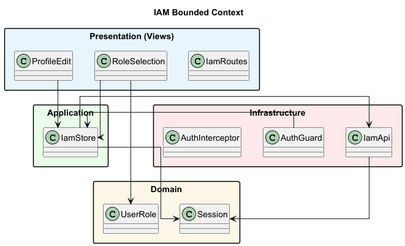
</div>

- **Catalog Frontend**  
  Responsabilidad: Maneja las vistas de gestión del inventario de recursos ofrecidos por el proveedor.

<div allign="center">
  
</div>

- **Ordering Frontend**  
  Responsabilidad: Maneja las vistas del ciclo de vida completo de pedidos: creación de solicitudes, aprobación, rechazo, despacho, confirmación de entrega y cierre.

<div allign="center">
  
</div>

- **Payment Frontend**  
  Responsabilidad: Maneja las vistas para que el cliente registre comprobantes de pago vinculados a una orden.

<div allign="center">
  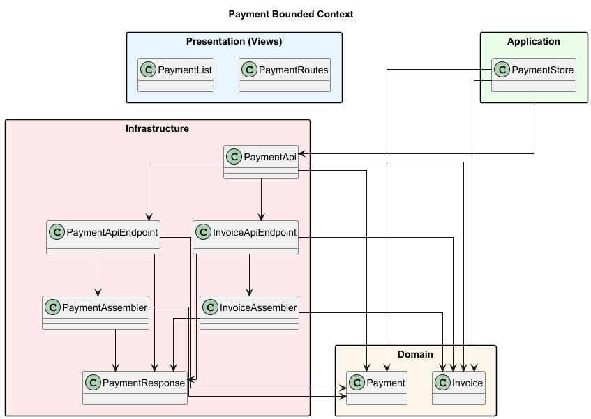
</div>

- **Fulfillment Frontend**  
  Responsabilidad: Maneja las vistas de gestión de recursos logísticos (por ejemplo, vehículos y operadores) y la asignación de despacho a órdenes aprobadas.

<div allign="center">
  
</div>

- **Notification Frontend**  
  Responsabilidad: Maneja el panel de notificaciones dentro de la aplicación para informar a los usuarios sobre cambios en el estado de los pedidos.

<div allign="center">
  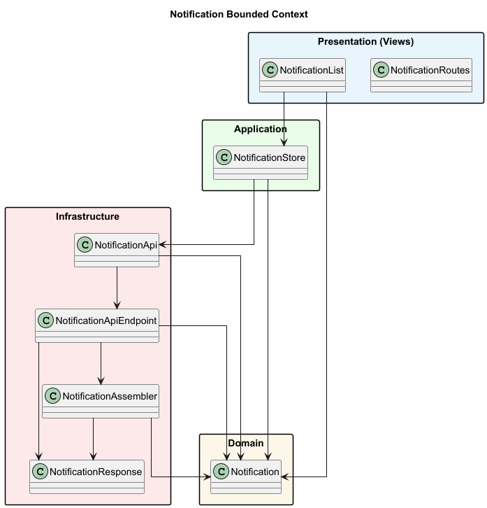
</div>

- **Reporting & Analytics Frontend**  
  Responsabilidad: Maneja las vistas de visualización de métricas, gráficos de consumo o ventas, y la descarga de reportes.

<div allign="center">
  
</div>


- **Equipment Frontend**  
  Responsabilidad: Maneja las vistas para que el cliente registre, actualice, elimine y visualice sus equipos (vehículos, generadores, maquinaria), incluyendo el tipo de combustible requerido y el estado operativo de cada uno.

<div allign="center">
  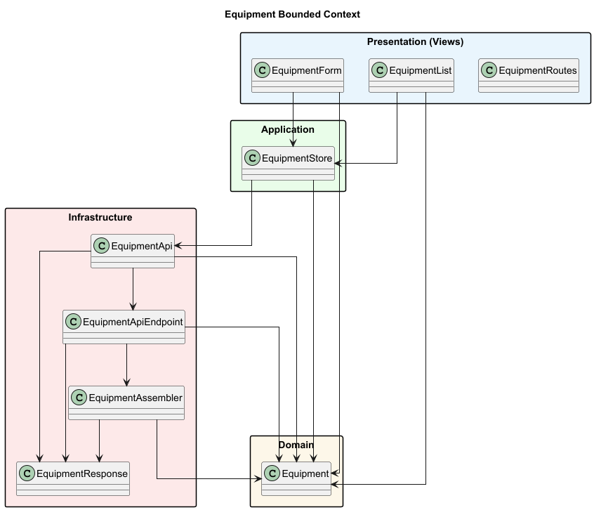
</div>

- **Inventory Frontend**  
  Responsabilidad: Maneja las vistas de gestión del inventario de combustible por parte del proveedor, incluyendo el registro, actualización y eliminación de ítems, así como la visualización de niveles de stock y precio por litro.

<div allign="center">
  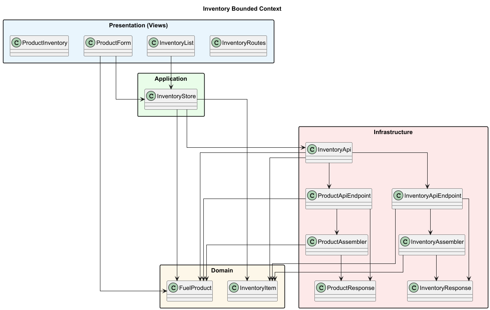
</div>

### Diagramas de clases del Backend

A nivel de backend, los diagramas de clases reflejan la implementación detallada de los módulos definidos como componentes dentro de la API. El sistema sigue una arquitectura por capas organizada por bounded contexts, donde cada contexto mantiene una clara separación de responsabilidades:

- **interfaces**: expone los endpoints del sistema (controladores REST) y componentes encargados de transformar datos entre modelos externos e internos.
- **domain**: contiene las entidades, agregados, value objects, así como comandos, consultas e interfaces que definen el comportamiento del dominio.
- **application**: implementa la lógica de negocio mediante servicios que ejecutan comandos y consultas.
- **infrastructure**: define los mecanismos de persistencia y comunicación con sistemas externos, incluyendo repositorios y servicios de integración.

**Diagrama del Backend completo:**

<div allign="center">
  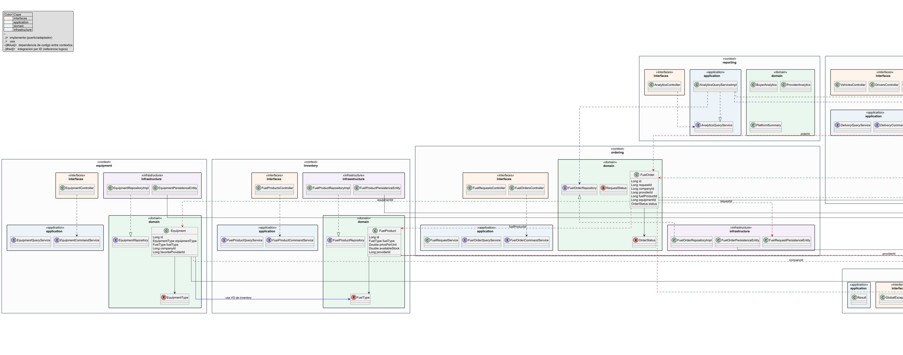
</div>

El diagrama completo del backend muestra la organización de todos los bounded contexts como módulos independientes dentro del sistema. Se visualizan las dependencias entre contextos, donde el bounded context de Ordering actúa como núcleo del sistema y coordina a los demás contextos mediante interfaces.

Las principales dependencias incluyen:
- Verificación de pagos antes de aprobar órdenes.
- Gestión y liberación de recursos logísticos.
- Validación y actualización de inventario.
- Generación de notificaciones ante cambios de estado.
- Alimentación de datos para reportes y análisis.

Todas las interacciones entre bounded contexts se realizan a través de interfaces, evitando dependencias directas de implementación y favoreciendo el desacoplamiento.

**Diagrama del Backend dividido por contextos:**

- **Identity & Access Backend**  
  Responsabilidad: Gestiona el registro de usuarios, autenticación, autorización y control de acceso.

<div allign="center">
  
</div>

- **Catalog Backend**  
  Responsabilidad: Gestiona el inventario de recursos disponibles, incluyendo stock y características relevantes.

<div allign="center">
  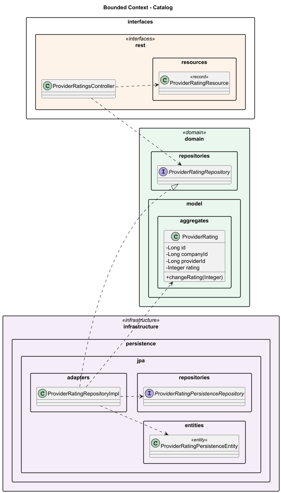
</div>

- **Ordering Backend**  
  Responsabilidad: Orquesta el ciclo de vida completo del pedido. Es el bounded context central que coordina la interacción con los demás contextos.

<div allign="center">
  
</div>


- **Payment Backend**  
  Responsabilidad: Gestiona el registro y validación de pagos asociados a órdenes.

<div allign="center">
  
</div>

- **Fulfillment Backend**  
  Responsabilidad: Gestiona los recursos necesarios para la ejecución de entregas y su asignación a órdenes.

<div allign="center">
  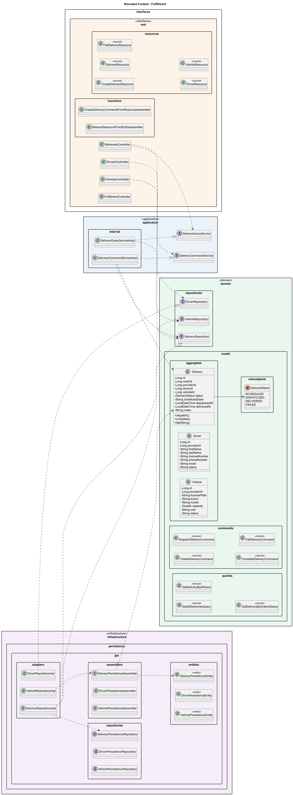
</div>

- **Notification Backend**  
  Responsabilidad: Genera y gestiona notificaciones ante eventos relevantes del sistema.

<div allign="center">
  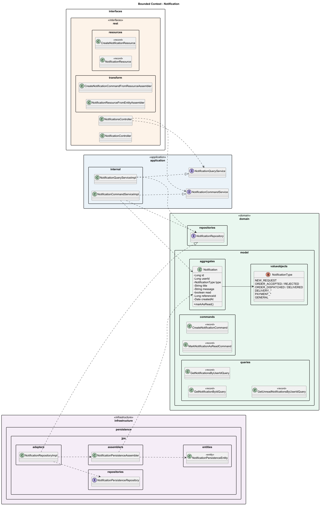
</div>


- **Reporting & Analytics Backend**  
  Responsabilidad: Agrega información histórica para generar métricas, análisis y reportes.

<div allign="center">
  
</div>

- **Equipment Backend**  
  Responsabilidad: Gestiona el registro, actualización, eliminación y consulta de los equipos del cliente, así como la asignación del tipo de combustible requerido por cada equipo.

<div allign="center">
  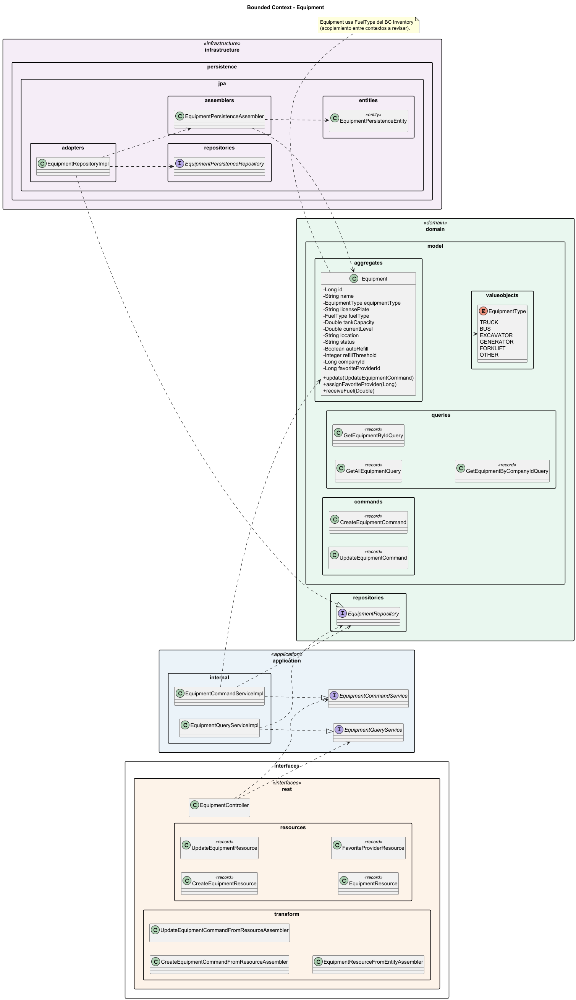
</div>

- **Inventory Backend**  
  Responsabilidad: Gestiona el registro, actualización y eliminación de los productos de combustible del proveedor, validando la información del ítem y controlando los niveles de stock disponible y precio por litro.

<div allign="center">
  
</div>

## 4.8 Database Design

### 4.8.1 Database Diagrams
La base de datos relacional almacena todos los datos del dominio del sistema. Las tablas se organizan en correspondencia directa con los bounded contexts definidos en el diseño orientado a objetos. A continuación, se detalla qué tablas pertenecen a cada contexto y cuál es su responsabilidad dentro del modelo de datos.


Identity & Access — Base de datos
Responsabilidad: Almacena la información de usuarios, sesiones y las extensiones de perfil para clientes y proveedores.

- USER: datos base del usuario autenticado (id_user, ruc, full_name, dni, email, password_hash, phone_number, address, role, is_active, created_at, updated_at).
- CLIENT: extensión del perfil para empresas solicitantes (id_client, id_user FK, company_name, company_ruc, industry, created_at).
- PROVIDER: extensión del perfil para empresas proveedoras (id_provider, id_user FK, company_name, company_ruc, description, created_at).


Catalog — Base de datos
Responsabilidad: Almacena el inventario disponible de cada proveedor, incluyendo stock y características relevantes.

- INVENTORY: registro de stock por tipo de recurso (id_inventory, id_provider FK, fuel_type, quantity_liters, price_per_liter, updated_at).


Ordering — Base de datos
Responsabilidad: Almacena el ciclo de vida completo de solicitudes y órdenes, incluyendo el detalle de ítems y los cambios de estado.

- REQUEST: solicitud creada por el cliente (id_request, id_client FK, id_provider FK, fuel_type, quantity_liters, delivery_address, requested_date, estimated_delivery, status, notes, created_at).
- REQUEST_DETAIL: detalle del pedido con desglose de valores (id_detail, id_request FK, fuel_type, quantity_liters, unit_price, subtotal).
- ORDER: orden generada a partir de una solicitud aprobada (id_order, id_request FK, status, approved_at, dispatched_at, delivered_at, closed_at, rejection_reason, created_at).


Payment — Base de datos
Responsabilidad: Almacena los registros de pago asociados a las órdenes.

- PAYMENT: comprobante de pago vinculado a una orden (id_payment, id_order FK, operation_code, amount, bank_name, voucher_url, payment_date, status, registered_at).


Fulfillment — Base de datos
Responsabilidad: Almacena los recursos logísticos y su asignación a órdenes.

- TRANSPORT: recurso de transporte del proveedor (id_transport, id_provider FK, plate, vehicle_type, capacity_liters, is_available, created_at).
- DRIVER: operador asignado al transporte (id_driver, id_provider FK, full_name, dni, license_number, phone_number, is_available, created_at).
- DISPATCH: asignación de recursos a una orden (id_dispatch, id_order FK, id_transport FK, id_driver FK, assigned_at, status).


Notification — Base de datos
Responsabilidad: Almacena las notificaciones generadas por eventos del sistema.

- NOTIFICATION: notificación asociada a un usuario (id_notification, id_user FK, id_order FK, type, message, is_read, created_at).


Reporting & Analytics — Base de datos
Responsabilidad: Almacena la información de reportes generados a partir de datos históricos.

- REPORT: reporte generado por un usuario (id_report, id_user FK, type, pdf_url, generated_at).
