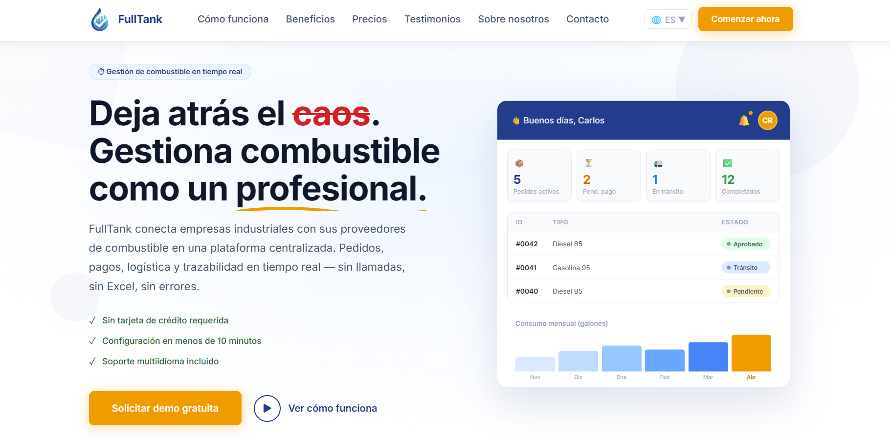
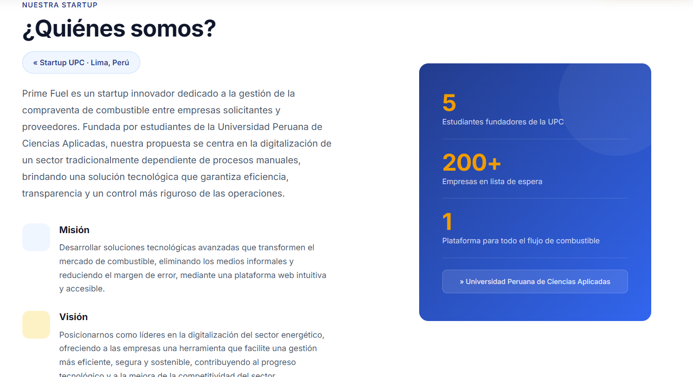
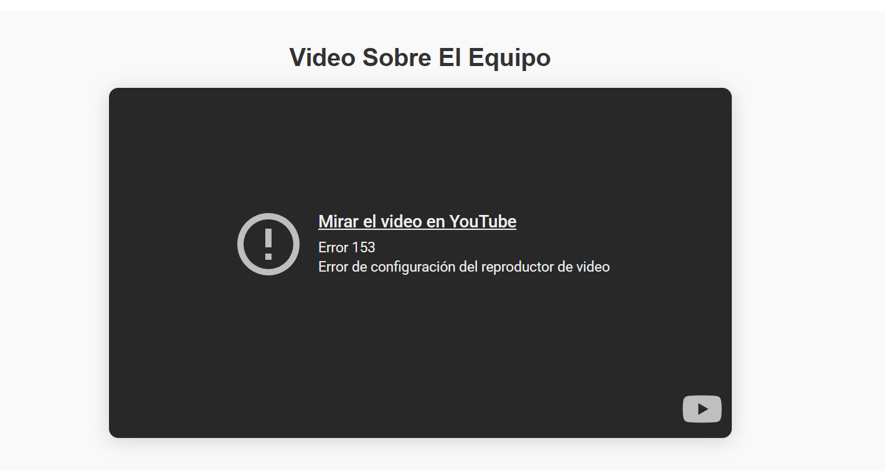
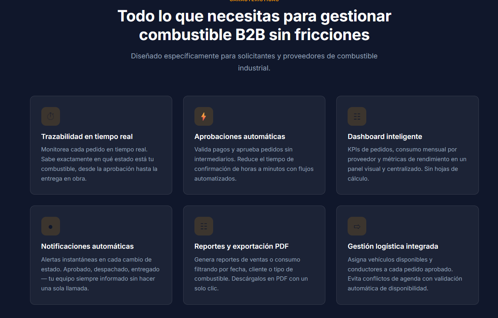
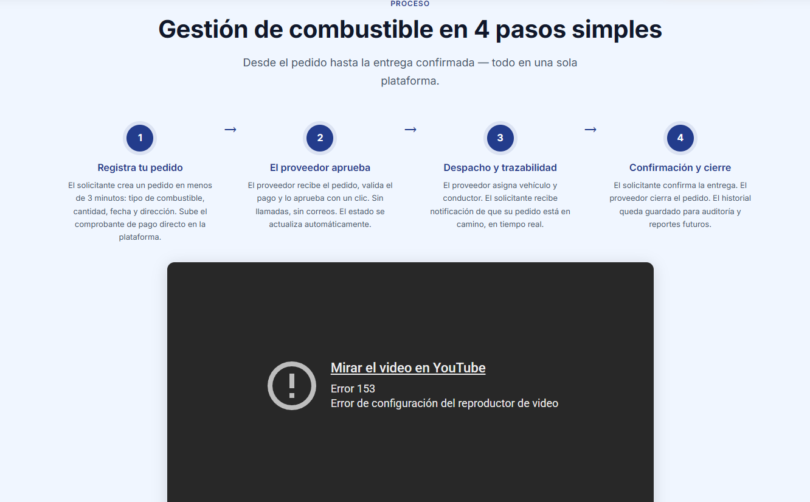
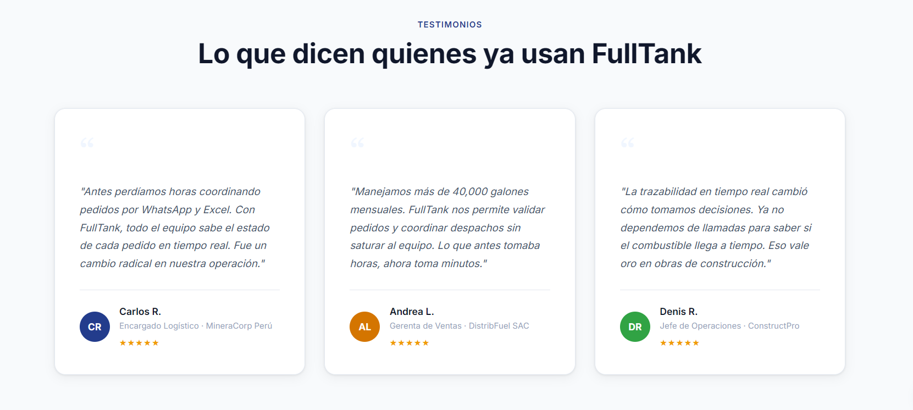
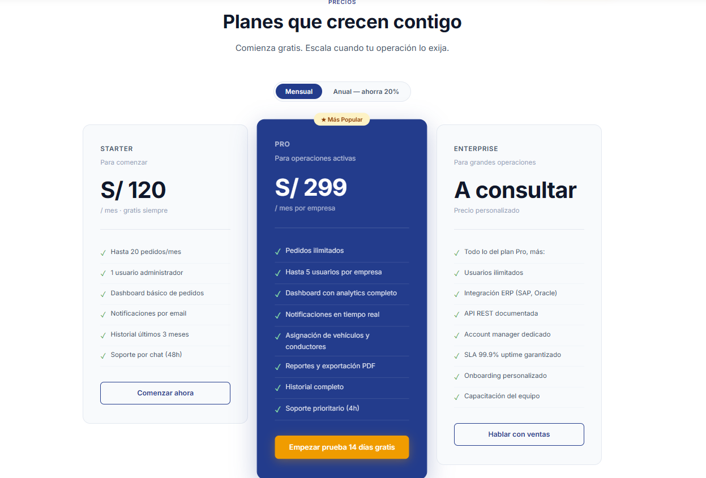

# Capítulo V: Product Implementation, Validation & Deployment

## 5.1. Software Configuration Management

### 5.1.1. Software Development Environment Configuration

Para garantizar un flujo de trabajo estructurado, predecible y colaborativo a lo largo del ciclo de vida de FullTank, producto desarrollado por la startup FuelPoint, se han seleccionado herramientas estandarizadas organizadas por categorías funcionales, asegurando la trazabilidad desde la concepción de requisitos hasta el despliegue de la solución.

#### Project Management

* **Trello**: Servicio de gestión de proyectos basado en el marco de trabajo ágil Kanban y tableros visuales. Se emplea para estructurar y priorizar el Product Backlog y los Sprint Backlogs de cada iteración, asignar responsables, gestionar el flujo de tarjetas de trabajo (*To Do*, *In Process*, *To Review*, *Done*) y monitorear el avance global de las tareas del equipo.
  * *Ruta oficial:* [https://trello.com](https://trello.com)
* **Google Meet**: Plataforma de comunicación audiovisual y conferencias en tiempo real de Google. Se utiliza para la ejecución de los eventos del marco de trabajo Scrum, tales como el *Sprint Planning*, reuniones de sincronización (*Daily Stand-ups*), *Sprint Review* y *Sprint Retrospective*, promoviendo la alineación continua de los integrantes.
  * *Ruta oficial:* [https://meet.google.com](https://meet.google.com)
* **WhatsApp**: Aplicación de mensajería instantánea multiplataforma empleada como canal de comunicación operativa directa, rápida y cotidiana entre los integrantes del equipo para resolver consultas puntuales y notificar hitos de integración.
  * *Ruta oficial:* [https://www.whatsapp.com](https://www.whatsapp.com)
* **Google Workspace / Google Drive**: Suite ofimática colaborativa en la nube utilizada para la redacción concurrente de minutas de reunión, tablas de cálculo para estimación de esfuerzo y almacenamiento centralizado de documentación complementaria.
  * *Ruta oficial:* [https://workspace.google.com](https://workspace.google.com)

#### Requirements Management

* **UXPressia**: Plataforma especializada en el diseño y mapeo de la experiencia de usuario. Se emplea para la formulación de los perfiles de usuario (*User Personas*), mapas de recorrido (*User Journey Maps*) e *Impact Maps*, asegurando que la definición de los requisitos funcionales y de negocio esté centrada en las necesidades de las empresas solicitantes y proveedoras de combustible.
  * *Ruta oficial:* [https://uxpressia.com](https://uxpressia.com)
* **Google Forms**: Herramienta para la estructuración y distribución de encuestas digitales cuantitativas dirigidas a los segmentos objetivo del sector de abastecimiento de combustible, permitiendo la recolección estructurada de datos para la validación de necesidades.
  * *Ruta oficial:* [https://forms.google.com](https://forms.google.com)
* **Zoom Meetings**: Plataforma de videoconferencias empleada para la realización y grabación de entrevistas cualitativas con usuarios reales del dominio, facilitando la obtención empírica de requisitos y el análisis de puntos de dolor (*pain points*).
  * *Ruta oficial:* [https://zoom.us](https://zoom.us)

#### Product UX/UI Design

* **Figma**: Entorno de diseño vectorial y prototipado colaborativo en la nube. Se utiliza para la definición integral de la guía de estilos (*Style Guidelines*), diseño de wireframes de baja fidelidad, flujos de pantalla (*wireflows* y *user flows*), mockups de alta fidelidad con componentes interactivos y prototipos navegables responsive tanto para la Landing Page como para la Web Application de FullTank.
  * *Ruta oficial:* [https://www.figma.com](https://www.figma.com)

#### Software Development

* **Visual Studio Code**: Editor de código fuente ligero, modular y altamente extensible desarrollado por Microsoft. Constituye el entorno principal para el desarrollo frontend de la Landing Page (HTML5, CSS3, JavaScript puro) y de la Web Application (Vue 3, Vite, PrimeVue), aprovechando su ecosistema de extensiones para análisis estático, formateo y depuración.
  * *Ruta oficial:* [https://code.visualstudio.com](https://code.visualstudio.com)
* **Visual Studio 2022**: Entorno de desarrollo integrado (IDE) robusto para la plataforma .NET. Se utiliza para la arquitectura, implementación y prueba del backend de servicios web RESTful con ASP.NET Core y Entity Framework Core en lenguaje C#, proporcionando capacidades avanzadas de refactorización, depuración y administración de soluciones.
  * *Ruta oficial:* [https://visualstudio.microsoft.com/vs/](https://visualstudio.microsoft.com/vs/)
* **.NET 8 SDK**: Kit de desarrollo de software que provee las bibliotecas de clases base, compiladores y herramientas de línea de comandos de .NET para compilar, probar y ejecutar la API RESTful de FullTank.
  * *Ruta oficial:* [https://dotnet.microsoft.com](https://dotnet.microsoft.com)
* **Node.js (LTS) & npm**: Entorno de ejecución de JavaScript del lado del servidor y gestor de paquetes oficial, requeridos para la instalación de dependencias, automatización de compilaciones con Vite y gestión de bibliotecas del frontend con Vue 3 y PrimeVue.
  * *Ruta oficial:* [https://nodejs.org](https://nodejs.org)
* **Docker Desktop / Docker Engine**: Plataforma de contenedores utilizada para empaquetar y ejecutar los servicios web de ASP.NET Core de forma consistente entre los entornos de desarrollo y despliegue.
  * *Ruta oficial:* [https://www.docker.com/products/docker-desktop/](https://www.docker.com/products/docker-desktop/)
* **Google Chrome**: Navegador web multiplataforma utilizado como entorno primario de visualización, depuración e inspección de elementos en tiempo de ejecución a través de Chrome DevTools, permitiendo la verificación de estilos CSS, consumo de red y diagnóstico de consola.
  * *Ruta oficial:* [https://www.google.com/chrome](https://www.google.com/chrome)
* **Mozilla Firefox**: Navegador web utilizado como entorno secundario para la validación cruzada (*cross-browser testing*) del renderizado responsive y compatibilidad de estándares web de las interfaces de usuario.
  * *Ruta oficial:* [https://www.mozilla.org/firefox](https://www.mozilla.org/firefox)

#### Software Testing

* **Postman**: Plataforma integral para el diseño, depuración, consumo y prueba automatizada de APIs RESTful. Se utiliza para validar los contratos de endpoints, códigos de estado HTTP, encabezados y payloads JSON emitidos por los controladores ASP.NET Core de FullTank.
  * *Ruta oficial:* [https://www.postman.com](https://www.postman.com)
* **Lighthouse (Google Chrome DevTools)**: Herramienta de auditoría automatizada de código abierto integrada en el navegador para evaluar el rendimiento (*Performance*), accesibilidad (*Accessibility* bajo normas WCAG y roles ARIA), mejores prácticas (*Best Practices*) y optimización para motores de búsqueda (*SEO*) en las páginas de la aplicación.
  * *Ruta oficial:* [https://developer.chrome.com/docs/lighthouse](https://developer.chrome.com/docs/lighthouse)
* **W3C Markup Validation Service & Nu HTML Checker**: Servicios de validación técnica provistos por el consorcio W3C para verificar la conformidad sintáctica de los documentos HTML5 y las hojas de estilo CSS3 frente a los estándares internacionales.
  * *Ruta oficial:* [https://validator.w3.org](https://validator.w3.org)

#### Software Deployment

* **GitHub Pages**: Plataforma de alojamiento estático integrada en GitHub. Se utiliza para el alojamiento y despliegue de la Landing Page de FullTank de manera pública, con soporte nativo para HTTPS y enlace al repositorio de código fuente.
  * *Ruta oficial:* [https://pages.github.com](https://pages.github.com)
* **Infraestructura Cloud (Pendiente de Selección)**: Para el aprovisionamiento y despliegue en producción de la Web Application (Vue 3/PrimeVue), los Web Services (ASP.NET Core en contenedores) y la base de datos relacional (MySQL o PostgreSQL), el equipo evaluará proveedores de nube (como Microsoft Azure, Render o AWS) en los sprints de arquitectura técnica, manteniendo la configuración mediante contenedores Docker portables.

#### Software Documentation

* **GitHub**: Plataforma de control de versiones y colaboración basada en Git. Aloja los repositorios oficiales de la organización, coordina el flujo de desarrollo mediante Pull Requests y actúa como repositorio centralizado de la documentación técnica en formato Markdown.
  * *Ruta oficial:* [https://github.com](https://github.com)
* **OpenAPI Specification & Swagger UI**: Especificación estándar y conjunto de herramientas visuales para la descripción de interfaces RESTful. Se integra en la API ASP.NET Core mediante Swashbuckle para generar documentación viva, interactiva y tipada de los endpoints del sistema.
  * *Ruta oficial:* [https://swagger.io](https://swagger.io)
* **Structurizr**: Plataforma de modelado arquitectónico basada en código para la diagramación de sistemas bajo el modelo C4 (Contexto, Contenedor y Componentes), permitiendo la representación visual clara de la arquitectura de software.
  * *Ruta oficial:* [https://structurizr.com](https://structurizr.com)
* **MySQL Workbench**: Herramienta visual de diseño y administración para bases de datos relacionales MySQL, utilizada para la elaboración de diagramas Entidad-Relación (ERD) e ingeniería inversa de esquemas de datos.
  * *Ruta oficial:* [https://www.mysql.com/products/workbench/](https://www.mysql.com/products/workbench/)

---

### 5.1.2. Source Code Management

La gestión del código fuente del proyecto FuelPoint se realiza de forma centralizada y transparente a través de la plataforma GitHub, aplicando una estrategia rigurosa de control de versiones que asegura la integridad de los entregables, la trazabilidad de los cambios y la colaboración concurrente sin conflictos.

#### Repositorios Oficiales Verificados

A la fecha del presente informe, la organización oficial cuenta exclusivamente con dos repositorios creados y verificados:

1. **Repositorio de Documentación del Proyecto:**
   * **Nombre:** `Fuel_Point_Document`
   * **Propósito:** Aloja el informe completo del proyecto en formato Markdown, las especificaciones de requisitos, diagramas arquitectónicos, guías de estilo y el registro de evidencias de cada sprint.
   * **URL pública:** [https://github.com/1ASI0730-2620-16129-G1-FuelPoint/Fuel_Point_Document](https://github.com/1ASI0730-2620-16129-G1-FuelPoint/Fuel_Point_Document)

2. **Repositorio de la Landing Page:**
   * **Nombre:** `Full_Tank_Landing_Page`
   * **Propósito:** Aloja el código fuente completo de la página de aterrizaje del producto, desarrollada con HTML5, CSS3 y JavaScript puro, configurada para su despliegue público en GitHub Pages.
   * **URL pública:** [https://github.com/1ASI0730-2620-16129-G1-FuelPoint/Full_Tank_Landing_Page](https://github.com/1ASI0730-2620-16129-G1-FuelPoint/Full_Tank_Landing_Page)

> [!NOTE]
> Conforme al roadmap de desarrollo del proyecto, los repositorios correspondientes a la **Web Application** (Vue 3 + PrimeVue) y a los **Web Services / REST API** (ASP.NET Core en C#) serán inicializados y publicados en los sprints subsiguientes de implementación. Siguiendo las directivas de integridad académica, no se presentan URLs ficticias ni provisionales para dichos componentes hasta su creación formal.
> El repositorio de Web Services incluirá la solución de la API y proyectos separados para las pruebas unitarias y las pruebas de integración/aceptación.

#### Estrategia de Ramificación GitFlow

Para gobernar el ciclo de vida del código fuente, el equipo implementa el flujo de trabajo estructurado **GitFlow**, el cual define roles específicos para cada rama y evita la contaminación de la base de código estable:

* **Rama `main`**: Contiene exclusivamente código en estado de producción estable, rigurosamente probado y auditado. Cada versión consolidada en `main` se asocia a una etiqueta de versión inmutable (*tag* de Semantic Versioning).
* **Rama `develop`**: Actúa como la rama central de integración continua. Alberga las funcionalidades concluidas y aprobadas que formarán parte del siguiente release. Todos los aportes individuales se fusionan hacia esta rama.
* **Ramas de característica (`feat/*`)**: Se desprenden siempre a partir de `develop` para el desarrollo de funcionalidades, secciones de documentación o módulos específicos (por ejemplo: `feat/chapter5`, `feat/landing-hero`). Una vez concluido el trabajo y validadas las pruebas locales, se reintegran a `develop` mediante un Pull Request.
* **Ramas de preparación de entrega (`release/*`)**: Se crean a partir de `develop` cuando se alcanza el conjunto planificado de características para un hito de entrega (por ejemplo: `release/v1.0.0`). En estas ramas se llevan a cabo tareas de estabilización menor, corrección de textos y congelamiento de versión, fusionándose posteriormente tanto a `main` como a `develop`.
* **Ramas de corrección urgente (`hotfix/*`)**: Se derivan directamente de `main` para resolver incidencias críticas detectadas en el entorno de producción que no pueden esperar al ciclo regular de desarrollo. Una vez subsanado el error, se incorporan tanto a `main` como a `develop`.

#### Políticas de Pull Requests (PR) y Revisión de Código

Toda integración hacia la rama `develop` o `main` debe efectuarse obligatoriamente mediante un Pull Request formal en GitHub, cumpliendo con las siguientes reglas:

1. **Revisión por pares (Code Review):** Se requiere la aprobación de al menos un revisor del equipo antes de autorizar la fusión (*merge*).
2. **Descripción estructurada:** El PR debe detallar las modificaciones realizadas, la motivación del cambio y la referencia al *work-item* o *issue* correspondiente.
3. **Validación técnica previa:** El autor debe garantizar que los cambios no introduzcan conflictos con `develop`, que compilen sin errores y que cumplan con las guías de estilo instituidas.
4. **Estrategia de merge:** Las ramas de característica, release y hotfix se integran mediante un commit de merge explícito sin *fast-forward* (`--no-ff`), preservando la topología y trazabilidad del historial GitFlow.

#### Convenciones de Commits (Conventional Commits)

Los mensajes de confirmación deben redactarse rigurosamente en idioma inglés, en modo imperativo, siguiendo el estándar **Conventional Commits**:

$$\text{Formato: } \langle\text{type}\rangle(\langle\text{scope}\rangle)\text{: } \langle\text{description}\rangle$$

* Tipos admitidos:
  * `feat`: Incorporación de una nueva funcionalidad o sección documental.
  * `fix`: Corrección de un error o inconsistencia identificada.
  * `docs`: Modificaciones exclusivas en documentación (archivos Markdown, comentarios).
  * `style`: Cambios de formato, espaciado o convenciones que no alteran la lógica del código.
  * `refactor`: Reestructuración de código sin alterar su comportamiento funcional ni añadir características.
  * `perf`: Optimizaciones orientadas a mejorar el rendimiento de la aplicación.
  * `test`: Adición o modificación de pruebas unitarias o de integración.
  * `chore`: Actualización de dependencias, scripts de construcción o configuración del entorno.
* Ejemplos de uso del equipo:
  * `docs: document software configuration management for chapter 5`
  * `feat(landing): implement responsive contact form with input validation`
  * `fix(navbar): resolve navigation menu collapse on mobile viewports`
  * `style(css): align color palette with FuelPoint brand guidelines`
  * `chore(deps): update primevue component library to latest stable version`

#### Versionado Semántico (SemVer)

El proyecto adopta el esquema de **Semantic Versioning 2.0.0** (`MAJOR.MINOR.PATCH`):

* **MAJOR (`X.0.0`)**: Se incrementa `X` ante cambios estructurales incompatibles con versiones anteriores (por ejemplo, reescritura de APIs o cambios de contratos de datos).
* **MINOR (`X.Y.0`)**: Se incrementa `Y` al incorporar nuevas funcionalidades compatibles con la versión actual (por ejemplo, finalización de nuevos módulos en un Sprint).
* **PATCH (`X.Y.Z`)**: Se incrementa `Z` al aplicar correcciones de errores y parches menores compatibles hacia atrás.

---

### 5.1.3. Source Code Style Guide & Conventions

Para garantizar alta legibilidad, mantenibilidad y robustez técnica, el equipo de desarrollo de FuelPoint sigue convenciones formales para cada una de las tecnologías involucradas, con nomenclatura obligatoriamente en idioma inglés para elementos de código y bases de datos.

#### HTML (HTML5)

* **Fuentes oficiales:** [Google HTML/CSS Style Guide](https://google.github.io/styleguide/htmlcssguide.html) y especificación [W3C HTML5 Standard](https://html.spec.whatwg.org/).
* **Reglas de codificación:**
  1. **Nomenclatura y minúsculas:** Todas las etiquetas, elementos y nombres de atributos deben escribirse estrictamente en minúsculas (`<section>`, `<input>`, `class="..."`).
  2. **Estructura semántica:** Utilizar etiquetas semánticas de HTML5 (`<header>`, `<nav>`, `<main>`, `<section>`, `<article>`, `<aside>`, `<footer>`) en lugar de contenedores genéricos `<div>` indiscriminados.
  3. **Accesibilidad y atributos obligatorios:** Toda imagen debe contener un atributo `alt` descriptivo (``). Los campos de formulario deben asociar inequívocamente su etiqueta `<label>` mediante el atributo `for` y el `id` correspondiente.
  4. **Roles y atributos ARIA:** Incorporar atributos ARIA (`aria-label`, `aria-expanded`, `aria-hidden`, `role="..."`) en elementos interactivos como menús desplegables, acordeones y botones dinámicos para garantizar el cumplimiento de accesibilidad universal.
  5. **Declaración de documento y codificación:** Incluir siempre `<!DOCTYPE html>` al inicio del archivo y definir la codificación UTF-8 mediante `<meta charset="UTF-8">` en el bloque `<head>`.
  6. **Nombres de atributos e identificadores en inglés:** Utilizar términos claros en inglés para todos los `id` y `name` (ejemplo: `id="main-navigation"`, `id="submit-quote-button"`).

#### CSS (CSS3)

* **Fuentes oficiales:** [Google HTML/CSS Style Guide](https://google.github.io/styleguide/htmlcssguide.html) y especificaciones del [W3C CSS](https://www.w3.org/Style/CSS/).
* **Reglas de codificación:**
  1. **Convención BEM (Block, Element, Modifier):** La nomenclatura de clases debe estructurarse siguiendo BEM en minúsculas con guiones simples o dobles:
     * Bloque: `.navbar`, `.station-card`
     * Elemento: `.navbar__link`, `.station-card__title`
     * Modificador: `.navbar__link--active`, `.station-card--highlighted`
  2. **Variables CSS (Custom Properties):** Centralizar la paleta de colores de FullTank, familias tipográficas, radios de borde y espaciados en el selector `:root` (ejemplo: `--color-primary: #1E3A8A;`, `--font-main: 'Inter', sans-serif;`).
  3. **Enfoque Mobile-First:** Diseñar la base de estilos para pantallas de dispositivos móviles y aplicar mejoras progresivas para pantallas de mayor resolución empleando Media Queries con `min-width` (`@media (min-width: 768px)`).
  4. **Formato consistente:** Insertar un espacio después de los dos puntos de cada propiedad y finalizar obligatoriamente con punto y coma (`display: flex; justify-content: space-between;`).
  5. **Nombres en inglés:** Todos los nombres de clases, identificadores y animaciones deben expresarse en inglés.

#### JavaScript y Vue 3

* **Fuentes oficiales:** [Airbnb JavaScript Style Guide](https://github.com/airbnb/javascript) y [Vue 3 Official Style Guide](https://vuejs.org/style-guide/).
* **Reglas de codificación:**
  1. **Declaración de variables:** Emplear exclusivamente `const` para referencias inmutables y `let` cuando la variable deba reasignarse dentro de su ámbito léxico. Queda prohibido el uso de `var`.
  2. **Nomenclatura en inglés:**
     * Variables y funciones: `camelCase` (ejemplo: `fetchStationDetails()`, `isAuthenticated`, `currentUser`).
     * Constantes globales de configuración: `UPPER_SNAKE_CASE` (ejemplo: `API_BASE_URL`, `DEFAULT_PAGE_SIZE`).
     * Componentes Vue: `PascalCase` con nombres multi-palabra obligatorios para prevenir colisiones con elementos HTML nativos (ejemplo: `FuelStationCard.vue`, `NavbarNavigation.vue`).
  3. **Paradigma Vue 3 Composition API:** Utilizar la sintaxis concisa `<script setup>` con Composition API. Tipar y validar explícitamente las propiedades de entrada mediante `defineProps()` y los eventos emitidos mediante `defineEmits()`.
  4. **Internacionalización (i18n):** Implementar soporte multi-idioma mediante claves semánticas en inglés (`$t('home.hero.headline')`). La aplicación tendrá como idioma predeterminado el inglés (`en_US`) con soporte alternativo para español (`es_419`).
  5. **Manejo asíncrono moderno:** Utilizar sintaxis `async/await` con bloques `try/catch` estructurados para el consumo de servicios web y captura controlada de excepciones, evitando encadenamientos anidados complejos de promesas.

#### C# (ASP.NET Core & Entity Framework Core)

* **Fuentes oficiales:** [Microsoft C# Coding Conventions](https://learn.microsoft.com/dotnet/csharp/fundamentals/coding-style/coding-conventions) y [Framework Design Guidelines](https://learn.microsoft.com/dotnet/standard/design-guidelines/).
* **Reglas de codificación:**
  1. **Convenciones de mayúsculas y minúsculas (Casing):**
     * `PascalCase`: Nombres de clases, registros (*records*), interfaces, métodos, propiedades, eventos y espacios de nombres (ejemplo: `FuelStation`, `CalculateFuelCost()`, `StationAddress`).
     * `camelCase`: Parámetros de métodos y variables locales (ejemplo: `stationId`, `transactionDate`).
     * `_camelCase` (guion bajo inicial): Campos privados de instancia (ejemplo: `_stationRepository`, `_logger`).
  2. **Nomenclatura de interfaces:** Todas las interfaces deben iniciar con la letra prefija `I` en mayúscula (ejemplo: `IFuelOrderRepository`, `INotificationService`).
  3. **Idioma inglés estricto:** Todas las entidades del dominio, controladores, servicios, DTOs, métodos, comentarios de código y mensajes de excepción deben redactarse íntegramente en inglés.
  4. **Principios SOLID y arquitectura limpia:** Aplicar inversión de dependencias mediante inyección en constructores primarios, segregar interfaces y mantener controladores delgados (*thin controllers*) cuya única responsabilidad sea la gestión del protocolo HTTP.
  5. **Entity Framework Core:** Definir mapeos de entidades mediante *Fluent API* en clases de configuración dedicadas que implementen `IEntityTypeConfiguration<T>`, garantizando la separación entre el modelo de dominio y la infraestructura relacional.

#### Gherkin (Criterios de Aceptación de Historias de Usuario)

* **Fuentes oficiales:** [Cucumber Gherkin Reference](https://cucumber.io/docs/gherkin/reference/).
* **Reglas de redacción:**
  1. **Palabras clave estándar:** Estructurar cada escenario empleando la sintaxis formal: `Scenario`, `Given`, `When`, `Then`, `And`, `But`.
  2. **Enfoque de comportamiento de negocio (BDD):** Los pasos deben describir la intención del usuario y el resultado esperado desde el punto de vista funcional, sin acoplar detalles de implementación técnica (por ejemplo, evitar mencionar nombres de botones HTML o sentencias SQL).
  3. **Consistencia de tiempos verbales:** Redactar en presente y tercera persona.
  4. **Ejemplo estándar:**
     ```gherkin
     Scenario: Successful fuel station search by location
       Given the fleet manager is on the fuel station locator screen
       When the user enters a valid city name in the search field
       Then the system displays the list of registered fuel stations within that area
       And displays their current fuel prices and operating hours
     ```

#### Markdown (Documentación del Proyecto)

* **Fuentes oficiales:** [CommonMark Specification](https://commonmark.org/) y [Markdownlint Rules](https://github.com/DavidAnson/markdownlint).
* **Reglas de redacción:**
  1. **Jerarquía estricta de encabezados:** Utilizar un único título principal `#` (H1) por documento y respetar la progresión secuencial (`#` -> `##` -> `###` -> `####`) sin omitir niveles intermedios.
  2. **Espaciado y legibilidad:** Incluir siempre una línea en blanco antes y después de encabezados, listas, tablas y bloques de código delimitados.
  3. **Formateo de tablas:** Delimitar todas las columnas con barras verticales (`|`), definiendo explícitamente la fila de separación con guiones para una renderización uniforme en GitHub.
  4. **Rutas relativas e hipervínculos:** Utilizar rutas relativas válidas para enlazar documentos y recursos del repositorio, asegurando textos de anclaje claros y descriptivos.

---

### 5.1.4. Software Deployment Configuration

A continuación se detalla la configuración y el procedimiento de despliegue reproducible para cada componente de software que integra la solución FullTank, distinguiendo los artefactos actualmente desplegados de aquellos proyectados para fases técnicas posteriores.

#### 1. Landing Page (Despliegue Operativo en Producción)

* **Tecnologías:** HTML5, CSS3, JavaScript puro (Vanilla).
* **Repositorio oficial de código fuente:** [https://github.com/1ASI0730-2620-16129-G1-FuelPoint/Full_Tank_Landing_Page](https://github.com/1ASI0730-2620-16129-G1-FuelPoint/Full_Tank_Landing_Page)
* **Proveedor de hosting:** GitHub Pages.
* **URL pública verificada:** [https://1asi0730-2620-16129-g1-fuelpoint.github.io/Full_Tank_Landing_Page/](https://1asi0730-2620-16129-g1-fuelpoint.github.io/Full_Tank_Landing_Page/)
* **Procedimiento de despliegue reproducible paso a paso:**
  1. Los desarrolladores integran las ramas de funcionalidad verificadas (`feat/*`) hacia la rama `develop` mediante Pull Request aprobado.
  2. Previo al hito de entrega del Sprint, los cambios aprobados en `develop` se fusionan a la rama `main` mediante un Pull Request de estabilización.
  3. En la configuración del repositorio en GitHub (*Settings* $\rightarrow$ *Pages*), se establece como fuente de publicación (*Build and deployment / Source*) la opción **Deploy from a branch**.
  4. Se designa la rama `main` y el directorio raíz (`/`) como origen de los archivos estáticos.
  5. GitHub Pages publica los archivos estáticos y permite comprobar la versión resultante mediante la URL pública con HTTPS.

#### 2. Web Application (Frontend - Configuración Prevista)

* **Tecnologías:** Vue 3, Vite, PrimeVue (Material Design) y JavaScript.
* **Estado de despliegue:** *Pendiente de implementación y aprovisionamiento.* El repositorio y el despliegue del frontend se construirán durante los sprints correspondientes según el roadmap del proyecto.
* **Requisitos y empaquetado reproducible:**
  * Entorno: una versión LTS de Node.js compatible con el proyecto y el gestor de paquetes npm; la versión seleccionada debe declararse en `package.json`.
  * Instalación reproducible de dependencias: `npm ci` cuando exista un archivo `package-lock.json` versionado; `npm install` se reserva para la incorporación o actualización controlada de dependencias.
  * Compilación y empaquetado optimizado: `npm run build`, lo cual produce los activos estáticos minimizados y empaquetados en el directorio `/dist`.
* **Estrategia de despliegue proyectada:** Alojamiento estático en la nube con pipeline de integración y despliegue continuo (CI/CD) mediante GitHub Actions. El proveedor específico (por ejemplo, Vercel, Netlify o AWS CloudFront) y la URL de publicación quedan marcados formalmente como pendientes de decisión de infraestructura por parte del equipo.

#### 3. Web Services / RESTful API (Backend - Configuración Prevista)

* **Tecnologías:** ASP.NET Core 8, Entity Framework Core y C#.
* **Estado de despliegue:** *Pendiente de implementación y aprovisionamiento.* El desarrollo del backend y la publicación de endpoints están programados para los sprints técnicos posteriores.
* **Requisitos y empaquetado reproducible:**
  * Entorno: .NET 8 SDK.
  * Compilación y publicación: `dotnet publish -c Release -o ./publish`.
  * Contenedorización: Definición de una imagen multiplataforma Dockerfile con etapas separadas de compilación (`mcr.microsoft.com/dotnet/sdk:8.0`) y ejecución (`mcr.microsoft.com/dotnet/aspnet:8.0`) para maximizar la portabilidad y seguridad.
  * Variables de entorno: Inyección segura de la cadena de conexión a la base de datos (`ConnectionStrings:DefaultConnection`) y claves secretas en tiempo de ejecución, evitando la exposición de credenciales en el código fuente.
  * Documentación OpenAPI: Exposición de la interfaz interactiva Swagger UI en el entorno de pruebas (`/swagger`).
* **Estrategia de despliegue proyectada:** Despliegue en contenedor sobre un servicio en la nube (proveedor cloud como Azure App Services, Render o AWS ECS pendiente de selección y presupuesto técnico del equipo). No se presenta ninguna URL ficticia antes de su despliegue real.

#### 4. Database Server (Configuración Prevista)

* **Tecnologías:** MySQL Server 8.0 o PostgreSQL 16.
* **Estado de despliegue:** *Pendiente de aprovisionamiento en la nube.*
* **Procedimiento reproducible previsto:**
  * Gestión de esquema: Migraciones automáticas administradas mediante Entity Framework Core CLI (`dotnet ef database update`).
  * Conectividad: Acceso seguro mediante SSL y restricción de IPs hacia los contenedores de la API RESTful.
  * Proveedor y credenciales: El servicio administrado (DBaaS) y la URL de conexión se encuentran pendientes de contratación técnica en los sprints respectivos.

---

## 5.2. Landing Page, Services & Applications Implementation

En esta sección se documenta la ejecución de los ciclos de desarrollo iterativo e incremental del proyecto bajo el marco de trabajo ágil Scrum. Para la entrega del Trabajo Parcial (TB1 – Stage Review – Semana 7), se documenta exhaustivamente la ejecución de los dos primeros ciclos de desarrollo: el **Sprint 1**, enfocado en el desarrollo y despliegue del Landing Page informativo; y el **Sprint 2**, centrado en la implementación, integración modular y despliegue del Frontend de la Aplicación Web (FullTank Web Application) estructurado por Bounded Contexts en Vue 3 y PrimeVue.

---

### 5.2.1. Sprint 1

#### 5.2.1.1. Sprint Planning 1

<table border>
    <tr align="center">
        <td><strong>Sprint #</strong></td>
        <td><strong>Sprint 1</strong></td>
    </tr>
    <tr>
        <td colspan="2" align="center"><strong>Sprint Planning Background</strong></td>
    </tr>
    <tr align="center">
        <td>Date</td>
        <td>09/04/2026</td>
    </tr>
    <tr align="center">
        <td>Time</td>
        <td>15:00 PM</td>
    </tr>
    <tr align="center">
        <td>Location</td>
        <td>Meet</td>
    </tr>
    <tr align="center">
        <td>Prepared by</td>
        <td>Brayan Alexis Corvacho Damian</td>
    </tr>
    <tr align="center">
        <td>Attendess (to planning meeting)</td>
        <td>
          Corvacho Damian, Brayan Alexis - U20231a257<br>
          Frank Anthony, Huingo Tello - U202319057<br>
          Joan Fabricio, Payano Puchuri - U202318620<br>
          Mantilla Maldonado, Enrique Manuel - U20231B842<br>
          Carhuayal Suarez, Joan Salvador - U202219040
        </td>
    </tr>
    <tr align="center">
        <td>Sprint 0 Review Summary</td>
        <td>No hubo sprint previo</td>
    </tr>
    <tr align="center">
        <td>Sprint 0 Retrospective Summary</td>
        <td>No hubo sprint previo</td>
    </tr>
    <tr>
        <td colspan="2" align="center"><strong>Sprint Goal & User Stories</strong></td>
    </tr>
    <tr>
        <td align="center">Sprint 1 Goal</td>
        <td>Nuestro objetivo es comunicar la propuesta de valor de FullTank a clientes y proveedores potenciales
            mediante una página de destino funcional. Creemos que esto genera conocimiento de la marca e interés en
            la conversión entre las empresas que solicitan combustible y los proveedores. Esto se confirmará cuando 
            los visitantes puedan navegar por todas las secciones, cambiar de idioma y acceder al formulario de registro
            sin errores.
        </td>
    </tr>
    <tr align="center">
        <td>Sprint 1 Velocity</td>
        <td>17</td>
    </tr>
    <tr align="center">
        <td>Sum of Story Point</td>
        <td>17</td>
    </tr>
</table>

#### 5.2.1.2. Aspect Leaders and Collaborators

<table border="1" cellspacing="0" cellpadding="6">
  <thead>
    <tr>
      <th>Team Member</th>
      <th>GitHub Username</th>
      <th>Landing Page</th>
      <th>Documentation</th>
    </tr>
  </thead>
  <tbody>
    <tr>
      <td>Frank Anthony, Huingo Tello</td>
      <td>MaxghZZ</td>
      <td>L</td>
      <td>L</td>
    </tr>
    <tr>
      <td>Joan Fabricio, Payano Puchuri</td>
      <td>DhudsQ</td>
      <td>C</td>
      <td>C</td>
    </tr>
    <tr>
      <td>Mantilla Maldonado, Enrique Manuel</td>
      <td>DerDFHE</td>
      <td>C</td>
      <td>C</td>
    </tr>
    <tr>
      <td>Carhuayal Suarez, Joan Salvador</td>
      <td>joann113</td>
      <td>C</td>
      <td>C</td>
    </tr>
    <tr>
      <td>Brayan Alexis Corvacho Damian</td>
      <td>BralexCD</td>
      <td>C</td>
      <td>C</td>
    </tr>
  </tbody>
</table>


#### 5.2.1.3. Sprint Backlog 1

<table border>
    <tr align="center">
        <td colspan="2"><strong>Sprint #</strong></td>
        <td colspan="6"><strong>Sprint 1</strong></td>
    </tr>
    <tr align="center">
        <td colspan="2"><strong>User Story</strong></td>
        <td colspan="6"><strong>Work-Item / Task</strong></td>
    </tr>
    <tr align="center">
        <td><strong>Id</strong></td>
        <td><strong>Title</strong></td>
        <td><strong>Id</strong></td>
        <td><strong>Title</strong></td>
        <td><strong>Description</strong></td>
        <td><strong>Estimation (Hours)</strong></td>
        <td><strong>Assigned to</strong></td>
        <td><strong>Status (To do / In process / To review / Done)</strong></td>
    </tr>
    <tr align="center">
        <td>US-01</td>
        <td>Ver sección Home</td>
        <td>W-01</td>
        <td>Sección Home</td>
        <td>Como visitante (proveedor), quiero ver una sección de inicio que resuma el valor de FullTank para comprender rápidamente el objetivo del sistema</td>
        <td>5 horas</td>
        <td>Enrique</td>
        <td>Done</td>
    </tr>
    <tr align="center">
        <td>US-02</td>
        <td>Ver sección About Us</td>
        <td>W-02</td>
        <td>Sección About Us</td>
        <td>Como visitante de ambos segmentos, quiero conocer quiénes están detrás de FullTank para confiar en el sistema</td>
        <td>4 horas</td>
        <td>Bryan</td>
        <td>Done</td>
    </tr>
    <tr align="center">
        <td>US-03</td>
        <td>Ver sección How it Works?</td>
        <td>W-03</td>
        <td>Sección How it works?</td>
        <td>Como visitante de ambos segmentos, quiero entender cómo funciona FullTank paso a paso para evaluar si se ajusta a mis necesidades</td>
        <td>5 horas</td>
        <td>Enrique</td>
        <td>Done</td>
    </tr>
    <tr align="center">
        <td>US-36</td>
        <td>Ver sección Benefits</td>
        <td>W-04</td>
        <td>Sección Beneficios</td>
        <td>Como visitante de ambos segmentos, quiero conocer las principales ventajas con las que puedo contar para evaluar la implementación de la plataforma</td>
        <td>4 horas</td>
        <td>JoanC</td>
        <td>Done</td>
    </tr>
    <tr align="center">
        <td>US-37</td>
        <td>Ver sección Lo que Dicen Nuestros Clientes</td>
        <td>W-05</td>
        <td>Sección Testimonios</td>
        <td>Como visitante de ambos segmentos, quiero conocer los testimonios de los usuarios de FullTank para tener confianza en la plataforma y saber que otras empresas ya la están usando.</td>
        <td>6 horas</td>
        <td>Frank</td>
        <td>Done</td>
    </tr>
    <tr align="center">
        <td>US-04</td>
        <td>Enviar mensaje de contacto</td>
        <td>W-06</td>
        <td>Contacto</td>
        <td>Como visitante de ambos segmentos, quiero enviar un mensaje desde Contact Us para solicitar más información</td>
        <td>5 horas</td>
        <td>Brayan</td>
        <td>Done</td>
    </tr>
    <tr align="center">
        <td>US-38</td>
        <td>Ver sección Planes y Precios</td>
        <td>W-07</td>
        <td>Sección Planes y Precios</td>
        <td>Como visitante (ambos segmentos), quiero saber que planes se adecuan a mis necesidades para poder iniciar un proceso de registro o solicitud.</td>
        <td>6 horas</td>
        <td>JoanP</td>
        <td>Done</td>
    </tr>
    <tr align="center">
        <td>US-39</td>
        <td>Cambiar idioma</td>
        <td>W-08</td>
        <td>Idioma</td>
        <td>Como visitante de ambos segmentos, quiero poder cambiar entre inglés y español para entender la plataforma en mi idioma preferido</td>
        <td>8 horas</td>
        <td>JoanC</td>
        <td>Done</td>
    </tr>
</table>

#### 5.2.1.4. Development Evidence for Sprint Review

Durante el Sprint 1, nuestro equipo culminó la implementación de la Landing Page de FullTank, cumpliendo con las User Stories priorizadas. Se trabajó en la maquetación de las secciones principales, implementación de estilos CSS, diseño responsive para diferentes dispositivos y subida de los cambios al repositorio grupal. Los commits fueron realizados en la rama main, cada uno agregando una sección de la Landing Page

<table border>
  <thead>
    <tr>
      <th>Repositorio</th>
      <th>Rama</th>
      <th>ID de Commit</th>
      <th>Mensaje de Commit</th>
      <th>Descripción del Commit</th>
      <th>Fecha de Commit</th>
    </tr>
  </thead>
<tbody>
  <tr>
    <td>1ASI0730-2620-16129-G1-FuelPoint/Full_Tank_Landing_Page</td>
    <td>main</td>
    <td>5596c00</td>
    <td>feat: add initial landing page structure for FullTank web platform</td>
    <td>Estructura HTML inicial y maquetación de secciones clave de la Landing Page.</td>
    <td>24/04/2026</td>
  </tr>
  <tr>
    <td>1ASI0730-2620-16129-G1-FuelPoint/Full_Tank_Landing_Page</td>
    <td>main</td>
    <td>6c22e93</td>
    <td>feat: implement landing page interactivity including navigation, scroll effects, FAQ accordion, and animations</td>
    <td>Lógica interactiva en JavaScript para navegación, efectos de scroll y acordeón FAQ.</td>
    <td>24/04/2026</td>
  </tr>
  <tr>
    <td>1ASI0730-2620-16129-G1-FuelPoint/Full_Tank_Landing_Page</td>
    <td>main</td>
    <td>02df602</td>
    <td>feat: add styles for metrics, FAQ accordion, step cards, and responsive navbar components</td>
    <td>Hojas de estilo CSS responsive para componentes de métricas, tarjetas y navbar.</td>
    <td>24/04/2026</td>
  </tr>
  <tr>
    <td>1ASI0730-2620-16129-G1-FuelPoint/Full_Tank_Landing_Page</td>
    <td>main</td>
    <td>25bd1bf</td>
    <td>feat: add styling for testimonials, pricing, FAQ, footer, about, and team sections</td>
    <td>Estilizado CSS para testimonios, planes de precios, footer y sección de equipo.</td>
    <td>24/04/2026</td>
  </tr>
  <tr>
    <td>1ASI0730-2620-16129-G1-FuelPoint/Full_Tank_Landing_Page</td>
    <td>feat/about us</td>
    <td>0408f5d</td>
    <td>docs: improved the spelling</td>
    <td>Corrección ortográfica y gramatical de contenidos en la sección About Us.</td>
    <td>25/04/2026</td>
  </tr>
  <tr>
    <td>1ASI0730-2620-16129-G1-FuelPoint/Full_Tank_Landing_Page</td>
    <td>feat/about us</td>
    <td>389615f</td>
    <td>docs: added images file</td>
    <td>Incorporación de archivos de imágenes y recursos gráficos para About Us.</td>
    <td>25/04/2026</td>
  </tr>
  <tr>
    <td>1ASI0730-2620-16129-G1-FuelPoint/Full_Tank_Landing_Page</td>
    <td>main</td>
    <td>771e406</td>
    <td>add team profiles and about-the-team video section</td>
    <td>Integración visual de perfiles de integrantes y sección de video institucional.</td>
    <td>25/04/2026</td>
  </tr>
  <tr>
    <td>1ASI0730-2620-16129-G1-FuelPoint/Full_Tank_Landing_Page</td>
    <td>main</td>
    <td>68e2115</td>
    <td>docs: fix landing page text</td>
    <td>Depuración y ajuste de redacción en los textos informativos de la Landing Page.</td>
    <td>25/04/2026</td>
  </tr>
  <tr>
    <td>1ASI0730-2620-16129-G1-FuelPoint/Full_Tank_Landing_Page</td>
    <td>main</td>
    <td>3ce5d9d</td>
    <td>feat(about the product): add stakeholder video for the future</td>
    <td>Incorporación de bloque multimedia con video explicativo para stakeholders.</td>
    <td>26/04/2026</td>
  </tr>
  <tr>
    <td>1ASI0730-2620-16129-G1-FuelPoint/Full_Tank_Landing_Page</td>
    <td>main</td>
    <td>d6c516c</td>
    <td>fix(english switched): everything is now translated to english</td>
    <td>Traducción completa de contenidos e internacionalización inicial al idioma inglés.</td>
    <td>26/04/2026</td>
  </tr>
  <tr>
    <td>1ASI0730-2620-16129-G1-FuelPoint/Full_Tank_Landing_Page</td>
    <td>main</td>
    <td>bc61806</td>
    <td>fix(responsive design):responsive design corrected</td>
    <td>Corrección y optimización de media queries para diseño adaptable en dispositivos móviles.</td>
    <td>26/04/2026</td>
  </tr>
  <tr>
    <td>1ASI0730-2620-16129-G1-FuelPoint/Full_Tank_Landing_Page</td>
    <td>main</td>
    <td>bae9d2d</td>
    <td>fix(main.js): minor translation problems solved</td>
    <td>Corrección de detalles menores en las cadenas de traducción dentro de main.js.</td>
    <td>26/04/2026</td>
  </tr>
</tbody>

</table>

#### 5.2.1.5. Execution Evidence for Sprint Review

En el sprint 1 se diseñó el primer modelo de la landing page. Esta cuenta con diferentes secciones para acceso de los usuarios. Algunas evidencias son:
- **Home:** Presenta de manera rápida el propósito y valor de FullTank para captar la atención del visitante.


- **About Us:** Explica quiénes somos y nuestra misión para generar confianza.



- **Benefits:** Explica los beneficios de implementar FullTank en el área logística de la empresa.


- **How it works?:** Describe de forma sencilla y visual el funcionamiento de FullTank paso a paso.


- **Testimonials:** Muestra algunas de las empresas o usuarios que confían en FullTank como referencia de credibilidad.


- **Pricing:** Propone planes y precios que puedan acomodarse a las necesidades del usuario.


- **Contact Us:** Ofrece un formulario y datos de contacto directo para resolver dudas o solicitar soporte.


#### 5.2.1.6. Services Documentation Evidence for Sprint Review

Durante el Sprint 1, el equipo se enfocó en el desarrollo del Landing Page de FullTank, por lo cual no se implementaron ni documentaron endpoints relacionados a Web Services. Los trabajos de desarrollo backend, integración de API y documentación con OpenAPI están planificados para Sprints posteriores.

#### 5.2.1.7. Software Deployment Evidence for Sprint Review

Resumen:
El despliegue inicial de la Landing Page de FullTank fue realizado exitosamente utilizando Vercel.

Detalles del Despliegue:
- URL de la Landing Page: https://1asi0730-2620-16129-g1-fuelpoint.github.io/Full_Tank_Landing_Page/
- Repositorio: https://github.com/1ASI0730-2620-16129-G1-FuelPoint/Full_Tank_Landing_Page

Evidencia:


#### 5.2.1.8. Team Collaboration Insights during Sprint

Resumen:
El equipo colaboró mediante GitHub y WhatsApp durante el Sprint. Las actividades principales se centraron en el desarrollo y despliegue de la Landing Page.

Evidencia de Colaboración:
- Captura de pantalla de commits en GitHub mostrando contribuciones del equipo.

Principales Herramientas de Comunicación:
- GitHub (control de versiones y manejo de issues)
- WhatsApp (comunicación diaria y aclaraciones rápidas)
- Google Meet (reuniones de planificación de sprint)


---

### 5.2.2. Sprint 2

#### 5.2.2.1. Sprint Planning 2

El segundo sprint del proyecto estuvo orientado a la construcción, integración y despliegue del **Frontend de la Aplicación Web (FullTank Web Application)**, implementando una arquitectura modular basada en Bounded Contexts conforme al diseño orientado a objetos y patrones DDD previamente establecidos.

<table border="1" cellpadding="6" cellspacing="0" style="border-collapse: collapse; width: 100%;">
    <tr align="center" style="background-color: #f2f2f2;">
        <td><strong>Sprint #</strong></td>
        <td><strong>Sprint 2</strong></td>
    </tr>
    <tr>
        <td colspan="2" align="center" style="background-color: #eaeaea;"><strong>Sprint Planning Background</strong></td>
    </tr>
    <tr align="center">
        <td><strong>Fecha de Planificación</strong></td>
        <td>22/04/2026</td>
    </tr>
    <tr align="center">
        <td><strong>Hora</strong></td>
        <td>16:00 PM - 18:30 PM</td>
    </tr>
    <tr align="center">
        <td><strong>Lugar</strong></td>
        <td>Google Meet (Sesión virtual de equipo)</td>
    </tr>
    <tr align="center">
        <td><strong>Elaborado por</strong></td>
        <td>Corvacho Damian, Brayan Alexis</td>
    </tr>
    <tr align="center">
        <td><strong>Asistentes a la Planificación</strong></td>
        <td>
          Corvacho Damian, Brayan Alexis — U20231a257<br>
          Frank Anthony, Huingo Tello — U202319057<br>
          Joan Fabricio, Payano Puchuri — U202318620<br>
          Mantilla Maldonado, Enrique Manuel — U20231B842<br>
          Carhuayal Suarez, Joan Salvador — U202219040
        </td>
    </tr>
    <tr align="center">
        <td><strong>Resumen de Revisión del Sprint 1</strong></td>
        <td>Se completó y desplegó satisfactoriamente la Landing Page informativa en Vercel, validando el diseño responsive, la coherencia de estilos y la funcionalidad multidioma (inglés/español). La retroalimentación inicial destacó una navegación limpia y clara presentación de la propuesta de valor.</td>
    </tr>
    <tr align="center">
        <td><strong>Resumen de Retrospectiva del Sprint 1</strong></td>
        <td>Se acordó establecer un desacoplamiento estricto por Bounded Contexts para el desarrollo de la aplicación web, evitando ramas monolíticas. Asimismo, se determinó el uso obligatorio de PrimeVue para componentes visuales complejos y la estandarización de mensajes de commit en formato Conventional Commits en inglés imperativo.</td>
    </tr>
    <tr align="center">
        <td><strong>Sprint Goal</strong></td>
        <td>Desarrollar, integrar y desplegar el Frontend de la Aplicación Web (FullTank Web Application) en Vue 3 y PrimeVue estructurado rigurosamente por Bounded Contexts independientes (Identity & Access, Ordering, Catalog, Fulfillment, Inventory, Equipment, Payment, Notification y Reporting & Analytics), implementando las interfaces reactivas de usuario para los segmentos de solicitantes y proveedores de combustible y consumiendo servicios de integración con soporte de pruebas unitarias.</td>
    </tr>
    <tr align="center">
        <td><strong>Sprint Velocity & Capacidad</strong></td>
        <td>Velocidad estimada: <strong>50 Story Points</strong> | Puntos comprometidos: <strong>48 Story Points</strong> | Duración: 2 semanas (Ciclo 2026-20).</td>
    </tr>
</table>

##### Historias de Usuario Comprometidas en el Sprint 2

| ID | Título de la Historia de Usuario | Descripción Resumida | Story Points |
| :--- | :--- | :--- | :---: |
| **US-15** | Iniciar sesión | Autenticación segura de usuarios mediante credenciales y redirección por rol. | 2 |
| **US-40** | Registrar empresa solicitante | Formulario de alta para empresas consumidoras con datos fiscales (RUC) y de contacto. | 3 |
| **US-41** | Registrar empresa proveedora | Registro corporativo de distribuidoras de combustible con descripción y catálogo. | 3 |
| **US-16** | Recuperar contraseña | Solicitud y flujo de restablecimiento de contraseña de acceso. | 2 |
| **US-17** | Cerrar sesión | Cierre seguro de sesión invalidando tokens locales y limpiando el estado. | 1 |
| **US-23** | Ver perfil de usuario | Consulta de datos generales de la empresa y del representante registrado. | 1 |
| **US-24** | Editar datos de perfil | Actualización de datos de contacto, dirección y configuración de la cuenta. | 2 |
| **US-05** | Registrar nuevo pedido | Formulario reactivo para solicitar combustible especificando tipo, cantidad y ubicación. | 5 |
| **US-06** | Consultar estado del pedido | Visualización del estado en tiempo real de los pedidos activos del solicitante. | 2 |
| **US-43** | Ver detalle de pedido | Vista detallada con desglose de montos, proveedor, fecha y trazabilidad de entrega. | 2 |
| **US-10** | Ver pedidos pendientes | Bandeja de entrada del proveedor con solicitudes por evaluar y procesar. | 2 |
| **US-11** | Aprobar pedido | Acción del proveedor para aceptar una solicitud de combustible y pasar a preparación. | 3 |
| **US-42** | Rechazar pedido | Rechazo justificado de solicitudes por falta de cobertura o stock insuficiente. | 2 |
| **US-46** | Gestionar inventario de combustibles | Registro, actualización de stock y edición de precios de los productos ofrecidos. | 3 |
| **US-44** | Gestionar vehículos de flota | Administración de camiones cisterna con placas y capacidades en galones/litros. | 3 |
| **US-45** | Gestionar conductores | Registro de operadores de transporte con licencias y datos de contacto. | 3 |
| **US-49** | Asignar recursos a despacho | Vinculación en un paso de vehículo cisterna y conductor a una orden aprobada. | 5 |
| **US-08** | Registrar información de pago | Adjuntar comprobante de transferencia bancaria y código de operación. | 3 |
| **US-29** | Recibir notificación de aprobación | Alertas visuales ante cambios de estado de las órdenes solicitadas. | 2 |
| **US-30** | Notificación de pedido despachado | Notificación al cliente indicando salida del camión cisterna a destino. | 2 |
| **US-47** | Dashboard principal del proveedor | Métricas clave de rendimiento (KPIs), pedidos activos y tendencias de venta. | 3 |
| **US-18** | Ver resumen de pedidos (Solicitante) | Panel del solicitante con indicadores de volumen solicitado y órdenes en curso. | 3 |
| **US-33** | Ver gráfico de consumo | Visualización gráfica del consumo histórico mensual de combustible. | 3 |
| **US-34** | Ver gráfico de ventas | Visualización gráfica de ingresos y volumen despachado por período. | 3 |
| **US-35** | Descargar reporte PDF | Exportación de reportes de gestión en formato PDF estructurado. | 3 |
| **Total** | **25 Historias de Usuario Comprometidas** | — | **48 SP** |

---

#### 5.2.2.2. Aspect Leaders and Collaborators

Para asegurar una división equitativa del esfuerzo, responsabilidad técnica clara y rigor en las revisiones de código, se formuló la **Matriz LACX (Leader, Approver, Contributor, eXternal/Informed)** adaptada para el Sprint 2:

- **L (Leader):** Responsable principal del diseño, desarrollo del módulo y preparación del Pull Request.
- **A (Approver):** Integrante encargado de realizar la revisión de código cruzada (*code review*), verificar el cumplimiento de estándares y aprobar el PR.
- **C (Contributor):** Colaborador que aporta componentes auxiliares, pruebas o ajustes de integración.
- **X (eXternal / Informed):** Miembros del equipo informados de los cambios e interfaces resultantes para garantizar la interoperabilidad.

<table border="1" cellpadding="6" cellspacing="0" style="border-collapse: collapse; width: 100%;">
    <thead>
        <tr align="center" style="background-color: #f2f2f2;">
            <th>Bounded Context / Aspecto Técnico</th>
            <th>Brayan Corvacho</th>
            <th>Enrique Mantilla</th>
            <th>Joan Carhuayal</th>
            <th>Frank Huingo</th>
            <th>Joan Payano</th>
        </tr>
    </thead>
    <tbody>
        <tr>
            <td><strong>Shared Base Architecture & Routing</strong><br><em>Configuración Vite, Pinia, PrimeVue, i18n, layouts base y guards</em></td>
            <td align="center"><strong>L</strong></td>
            <td align="center">C</td>
            <td align="center"><strong>A</strong></td>
            <td align="center">C</td>
            <td align="center">C</td>
        </tr>
        <tr>
            <td><strong>Identity & Access Management (IAM)</strong><br><em>Sign-in, sign-up por rol, sesión, recuperación y perfiles de empresa</em></td>
            <td align="center"><strong>L</strong></td>
            <td align="center">C</td>
            <td align="center">C</td>
            <td align="center">C</td>
            <td align="center"><strong>A</strong></td>
        </tr>
        <tr>
            <td><strong>Catalog Management</strong><br><em>Catálogo de productos de combustible, especificaciones y filtros</em></td>
            <td align="center"><strong>A</strong></td>
            <td align="center"><strong>L</strong></td>
            <td align="center">C</td>
            <td align="center">X</td>
            <td align="center">C</td>
        </tr>
        <tr>
            <td><strong>Ordering & Lifecycle Management</strong><br><em>Creación de pedidos, tracking, bandeja de aprobación y rechazo</em></td>
            <td align="center"><strong>A</strong></td>
            <td align="center"><strong>L</strong></td>
            <td align="center">C</td>
            <td align="center">C</td>
            <td align="center">C</td>
        </tr>
        <tr>
            <td><strong>Equipment Management</strong><br><em>Registro y CRUD de equipos, generadores y maquinaria del cliente</em></td>
            <td align="center"><strong>A</strong></td>
            <td align="center">C</td>
            <td align="center"><strong>L</strong></td>
            <td align="center">C</td>
            <td align="center">X</td>
        </tr>
        <tr>
            <td><strong>Inventory Management</strong><br><em>Gestión de existencias, cálculo de capacidad y actualización de precios</em></td>
            <td align="center">C</td>
            <td align="center">C</td>
            <td align="center"><strong>L</strong></td>
            <td align="center"><strong>A</strong></td>
            <td align="center">X</td>
        </tr>
        <tr>
            <td><strong>Fulfillment & Fleet Logistics</strong><br><em>Gestión de camiones cisterna, conductores y asignación a despachos</em></td>
            <td align="center"><strong>A</strong></td>
            <td align="center">C</td>
            <td align="center">C</td>
            <td align="center"><strong>L</strong></td>
            <td align="center">X</td>
        </tr>
        <tr>
            <td><strong>Notifications & Alerts</strong><br><em>Feed de notificaciones reactivo, badge de alertas y toast messages</em></td>
            <td align="center">C</td>
            <td align="center"><strong>A</strong></td>
            <td align="center">X</td>
            <td align="center"><strong>L</strong></td>
            <td align="center">C</td>
        </tr>
        <tr>
            <td><strong>Payment Verification</strong><br><em>Registro de comprobantes, código de operación bancaria y validación</em></td>
            <td align="center"><strong>A</strong></td>
            <td align="center">C</td>
            <td align="center">X</td>
            <td align="center">C</td>
            <td align="center"><strong>L</strong></td>
        </tr>
        <tr>
            <td><strong>Reporting & Analytics</strong><br><em>Gráficos Chart.js de consumo y ventas, KPIs y descarga de resumen PDF</em></td>
            <td align="center"><strong>A</strong></td>
            <td align="center">X</td>
            <td align="center">C</td>
            <td align="center">C</td>
            <td align="center"><strong>L</strong></td>
        </tr>
        <tr>
            <td><strong>Unit Testing & QA (Vitest)</strong><br><em>Especificación y ejecución de pruebas automatizadas de stores y selectores</em></td>
            <td align="center"><strong>L</strong></td>
            <td align="center">C</td>
            <td align="center">C</td>
            <td align="center">C</td>
            <td align="center"><strong>A</strong></td>
        </tr>
        <tr>
            <td><strong>CI/CD & Cloud Deployment</strong><br><em>Automatización de build con Vite y despliegue continuo en Firebase/Vercel</em></td>
            <td align="center"><strong>L</strong></td>
            <td align="center">C</td>
            <td align="center">C</td>
            <td align="center"><strong>A</strong></td>
            <td align="center">C</td>
        </tr>
    </tbody>
</table>

---

#### 5.2.2.3. Sprint Backlog 2

A continuación se detalla la desagregación de las Historias de Usuario en tareas técnicas (*Sprint Backlog*) ejecutadas durante el Sprint 2:

| Task ID | Descripción de la Tarea Técnica | Historia Asociada | Estimación (Horas) | Responsable | Estado |
| :--- | :--- | :--- | :---: | :--- | :---: |
| **TSK-201** | Inicializar proyecto Vue 3 con Vite, configurar PrimeVue 4, PrimeFlex e i18n multidioma | US-39 | 6h | Brayan Corvacho | **Done** |
| **TSK-202** | Configurar Pinia stores y cliente HTTP centralizado Axios con interceptores de autenticación | US-15 | 5h | Brayan Corvacho | **Done** |
| **TSK-203** | Desarrollar vistas de Sign-in y Sign-up con selección de rol (Comprador / Proveedor) | US-15, US-40, US-41 | 8h | Brayan Corvacho | **Done** |
| **TSK-204** | Implementar vistas de Perfil de Empresa y edición de datos corporativos | US-23, US-24 | 5h | Brayan Corvacho | **Done** |
| **TSK-205** | Configurar guards de navegación en Vue Router según el estado de autenticación y rol | US-15, US-17 | 4h | Brayan Corvacho | **Done** |
| **TSK-206** | Construir el catálogo interactivo de combustibles con tarjetas de especificaciones y precios | US-46 | 6h | Enrique Mantilla | **Done** |
| **TSK-207** | Implementar formulario reactivo de nueva solicitud de combustible con cálculo automático | US-05 | 9h | Enrique Mantilla | **Done** |
| **TSK-208** | Desarrollar vista de trazabilidad y línea de tiempo del estado de pedidos del solicitante | US-06, US-43 | 7h | Enrique Mantilla | **Done** |
| **TSK-209** | Implementar bandeja de solicitudes entrantes para el proveedor con acciones de aprobar/rechazar | US-10, US-11, US-42 | 8h | Enrique Mantilla | **Done** |
| **TSK-210** | Crear módulo de gestión de inventario de combustibles con indicadores de stock y precio | US-46 | 7h | Joan Carhuayal | **Done** |
| **TSK-211** | Construir interfaz de administración de equipos del solicitante con diálogos de creación y edición | US-05 | 7h | Joan Carhuayal | **Done** |
| **TSK-212** | Integrar store de equipos y vincular selección de equipo al formulario de pedido | US-05 | 5h | Joan Carhuayal | **Done** |
| **TSK-213** | Desarrollar módulo de gestión de flota de cisternas del proveedor (placas, tipo, capacidad) | US-44 | 7h | Frank Huingo | **Done** |
| **TSK-214** | Desarrollar módulo de gestión de conductores con números de licencia y contacto | US-45 | 6h | Frank Huingo | **Done** |
| **TSK-215** | Implementar modal de asignación de vehículo y chofer a pedidos en estado Aprobado | US-49 | 8h | Frank Huingo | **Done** |
| **TSK-216** | Construir componente de feed de notificaciones reactivo con contador de no leídas | US-29, US-30 | 5h | Frank Huingo | **Done** |
| **TSK-217** | Implementar formulario de registro de comprobante de pago con código de operación bancaria | US-08 | 7h | Joan Payano | **Done** |
| **TSK-218** | Desarrollar vista de verificación y aprobación de comprobantes para el proveedor | US-08, US-11 | 6h | Joan Payano | **Done** |
| **TSK-219** | Integrar gráficos de consumo mensual de combustible para el solicitante usando Chart.js | US-33, US-18 | 7h | Joan Payano | **Done** |
| **TSK-220** | Construir dashboard principal del proveedor con gráficos de ingresos y distribución de ventas | US-34, US-47 | 8h | Joan Payano | **Done** |
| **TSK-221** | Implementar servicio de exportación y descarga de resúmenes de operación en formato PDF | US-35 | 6h | Joan Payano | **Done** |
| **TSK-222** | Escribir pruebas unitarias con Vitest para validación de stores y selectores de IAM y Payment | US-15, US-08 | 6h | Brayan Corvacho | **Done** |
| **TSK-223** | Configurar pipeline de build en modo demo y pruebas automatizadas en GitHub Actions | — | 4h | Brayan Corvacho | **Done** |
| **TSK-224** | Desplegar aplicación web en Firebase Hosting con configuración de dominios y certificados | — | 4h | Brayan Corvacho | **Done** |
| **TSK-225** | Ejecutar pruebas cruzadas de usabilidad y responsividad móvil en resoluciones 375px y 768px | US-05, US-10 | 5h | Frank Huingo | **Done** |

---

#### 5.2.2.4. Development Evidence for Sprint Review

El desarrollo de la aplicación web se realizó en el repositorio oficial de la organización en GitHub:
- **Repositorio oficial de la aplicación web:** [https://github.com/1ASI0730-2620-16129-G1-FuelPoint/Full_Tank_Frontend](https://github.com/1ASI0730-2620-16129-G1-FuelPoint/Full_Tank_Frontend)

Siguiendo el flujo de trabajo GitFlow estricto, cada integrante trabajó en una rama de característica (`feat/<bounded-context>`) desprendida de `develop`, asegurando commits con mensajes imperativos en inglés bajo el estándar Conventional Commits. A continuación se resume la evidencia de commits integrados:

<table border="1" cellpadding="6" cellspacing="0" style="border-collapse: collapse; width: 100%;">
    <thead>
        <tr align="center" style="background-color: #f2f2f2;">
            <th>Rama GitFlow</th>
            <th>Hash</th>
            <th>Autor</th>
            <th>Mensaje de Commit (Inglés Imperativo)</th>
            <th>Estado en develop</th>
        </tr>
    </thead>
    <tbody>
        <tr>
            <td><code>feat/shared</code></td>
            <td><code>2adc9d1</code></td>
            <td>Brayan Corvacho</td>
            <td>feat(shared): incorporate minimal independent base, routing, and tooling</td>
            <td>Merged (PR #2)</td>
        </tr>
        <tr>
            <td><code>feat/iam</code></td>
            <td><code>dbfde50</code></td>
            <td>Brayan Corvacho</td>
            <td>feat(iam): import session domain model</td>
            <td>Reviewed (PR #3)</td>
        </tr>
        <tr>
            <td><code>feat/iam</code></td>
            <td><code>bb747eb</code></td>
            <td>Brayan Corvacho</td>
            <td>feat(iam): implement demo authentication and company APIs</td>
            <td>Reviewed (PR #3)</td>
        </tr>
        <tr>
            <td><code>feat/iam</code></td>
            <td><code>80324ee</code></td>
            <td>Brayan Corvacho</td>
            <td>feat(iam): integrate session and profile store</td>
            <td>Reviewed (PR #3)</td>
        </tr>
        <tr>
            <td><code>feat/iam</code></td>
            <td><code>b156c6b</code></td>
            <td>Brayan Corvacho</td>
            <td>feat(iam): add authentication views and route guards</td>
            <td>Reviewed (PR #3)</td>
        </tr>
        <tr>
            <td><code>feat/catalog</code></td>
            <td><code>c812a14</code></td>
            <td>Enrique Mantilla</td>
            <td>feat(catalog): implement fuel product domain model and catalog API service</td>
            <td>Reviewed (PR #4)</td>
        </tr>
        <tr>
            <td><code>feat/catalog</code></td>
            <td><code>4f29e10</code></td>
            <td>Enrique Mantilla</td>
            <td>feat(catalog): build product listing, filters, and fuel details view</td>
            <td>Reviewed (PR #4)</td>
        </tr>
        <tr>
            <td><code>feat/ordering</code></td>
            <td><code>a92b311</code></td>
            <td>Enrique Mantilla</td>
            <td>feat(ordering): implement order store, request lifecycle, and status transitions</td>
            <td>Reviewed (PR #5)</td>
        </tr>
        <tr>
            <td><code>feat/ordering</code></td>
            <td><code>5d81c20</code></td>
            <td>Enrique Mantilla</td>
            <td>feat(ordering): build reactive fuel request creation and order tracking timeline</td>
            <td>Reviewed (PR #5)</td>
        </tr>
        <tr>
            <td><code>feat/equipment</code></td>
            <td><code>e419b02</code></td>
            <td>Joan Carhuayal</td>
            <td>feat(equipment): create equipment domain model and client equipment store</td>
            <td>Reviewed (PR #6)</td>
        </tr>
        <tr>
            <td><code>feat/equipment</code></td>
            <td><code>92d184a</code></td>
            <td>Joan Carhuayal</td>
            <td>feat(equipment): add client equipment registry table and CRUD dialog components</td>
            <td>Reviewed (PR #6)</td>
        </tr>
        <tr>
            <td><code>feat/inventory</code></td>
            <td><code>7a884f1</code></td>
            <td>Joan Carhuayal</td>
            <td>feat(inventory): implement inventory store with stock level calculations</td>
            <td>Reviewed (PR #7)</td>
        </tr>
        <tr>
            <td><code>feat/inventory</code></td>
            <td><code>2c9301e</code></td>
            <td>Joan Carhuayal</td>
            <td>feat(inventory): add supplier stock management and price update view</td>
            <td>Reviewed (PR #7)</td>
        </tr>
        <tr>
            <td><code>feat/fulfillment</code></td>
            <td><code>874e01a</code></td>
            <td>Frank Huingo</td>
            <td>feat(fulfillment): define transport and driver logistics models</td>
            <td>Reviewed (PR #8)</td>
        </tr>
        <tr>
            <td><code>feat/fulfillment</code></td>
            <td><code>289d00c</code></td>
            <td>Frank Huingo</td>
            <td>feat(fulfillment): implement dispatch resource assignment and tracking views</td>
            <td>Reviewed (PR #8)</td>
        </tr>
        <tr>
            <td><code>feat/notification</code></td>
            <td><code>e7b3b63</code></td>
            <td>Frank Huingo</td>
            <td>feat(notification): define notification entity and alert badge component</td>
            <td>Reviewed (PR #9)</td>
        </tr>
        <tr>
            <td><code>feat/notification</code></td>
            <td><code>b49182a</code></td>
            <td>Frank Huingo</td>
            <td>feat(notification): integrate real-time notification feed and toast triggers</td>
            <td>Reviewed (PR #9)</td>
        </tr>
        <tr>
            <td><code>feat/payment</code></td>
            <td><code>bddb0fa</code></td>
            <td>Joan Payano</td>
            <td>test(payment): add unit and selector tests for payment voucher validation</td>
            <td>Reviewed (PR #10)</td>
        </tr>
        <tr>
            <td><code>feat/payment</code></td>
            <td><code>47a982c</code></td>
            <td>Joan Payano</td>
            <td>feat(payment): implement voucher registration view and supplier review actions</td>
            <td>Reviewed (PR #10)</td>
        </tr>
        <tr>
            <td><code>feat/reporting</code></td>
            <td><code>319c8d1</code></td>
            <td>Joan Payano</td>
            <td>feat(reporting): add consumption and sales analytics charts using Chart.js</td>
            <td>Reviewed (PR #11)</td>
        </tr>
        <tr>
            <td><code>feat/reporting</code></td>
            <td><code>e821b04</code></td>
            <td>Joan Payano</td>
            <td>feat(reporting): implement PDF summary export service and metrics view</td>
            <td>Reviewed (PR #11)</td>
        </tr>
    </tbody>
</table>

---

#### 5.2.2.5. Execution Evidence for Sprint Review

Durante la revisión del Sprint 2 se demostró el funcionamiento interactivo de la aplicación web tanto en vista de escritorio como en dispositivos móviles, cubriendo los flujos esenciales de ambos segmentos de usuarios:

##### 1. Módulo de Autenticación y Acceso (IAM)
- **Inicio de Sesión:** Permite a los usuarios autenticarse con correo corporativo y contraseña, recordando la sesión mediante tokens y redirigiendo automáticamente al dashboard correspondiente según el rol (`Buyer` o `Supplier`).
- **Registro de Empresa:** Formulario que valida en tiempo real el RUC, razón social, rubro industrial y datos del representante, permitiendo la creación inmediata de la cuenta.
- *Evidencia visual:* Véanse los mockups interactivos validados en la [sección 4.4.3](chapter4.md#443-web-applications-mock-ups) (`mockup-sign-in.png` y `mockup-sign-up.png`).

##### 2. Módulo del Solicitante / Comprador (Buyer Experience)
- **Dashboard del Solicitante:** Presenta indicadores clave (pedidos activos, volumen total abastecido en el mes, gasto acumulado) y un acceso directo a la creación de una nueva solicitud.
- **Creación de Solicitud de Abastecimiento:** Formulario reactivo que permite seleccionar el equipo o estación receptora, el tipo de combustible requerido (Diesel B5, Gasohol Regular, etc.), el volumen en galones o litros, y la dirección de entrega, calculando el costo estimado en tiempo real.
- **Detalle y Trazabilidad del Pedido:** Línea de tiempo visual que muestra el progreso del pedido a través de los estados de negocio: *Requested* → *Approved* → *Dispatched* → *Delivered* → *Closed*.
- **Gestión de Equipos:** Tabla interactiva para dar de alta, editar y listar maquinaria, vehículos o grupos electrógenos del cliente con sus especificaciones de tanque.
- *Evidencia visual:* Ilustrado en los diseños evaluados en la [sección 4.4.3](chapter4.md#443-web-applications-mock-ups) (`mockup-desktop-buyer-dashboard.png`, `mockup-desktop-buyer-create-request.png` y `mockup-desktop-buyer-equipment.png`).

##### 3. Módulo del Proveedor / Distribuidor (Supplier Experience)
- **Dashboard del Proveedor:** Métricas ejecutivas que incluyen volumen total vendido, ingresos del mes, pedidos pendientes de atención y tasa de cumplimiento logístico.
- **Bandeja de Solicitudes Entrantes:** Permite al despachador evaluar pedidos recibidos, consultar el stock disponible y ejecutar las acciones de *Aprobar* (solicitando comprobante) o *Rechazar* (ingresando motivo justificado).
- **Gestión de Flota y Despacho:** Catálogo de camiones cisterna y conductores registrados, permitiendo asignar en un solo paso los recursos a una orden aprobada para iniciar el despacho.
- **Gestión de Inventario:** Control de existencias por tipo de hidrocarburo con alertas de stock mínimo y formulario de actualización de precio por unidad de volumen.
- *Evidencia visual:* Ilustrado en las vistas validadas en la [sección 4.4.3](chapter4.md#443-web-applications-mock-ups) (`mockup-desktop-supplier-dashboard.png`, `mockup-desktop-supplier-incoming-requests.png`, `mockup-desktop-supplier-fleet.png` y `mockup-desktop-supplier-inventory.png`).

##### 4. Módulo de Pagos y Facturación
- **Registro de Comprobante:** El cliente adjunta el comprobante de transferencia bancaria y registra el código de operación.
- **Validación del Pago:** El proveedor revisa los datos bancarios y confirma la recepción de los fondos para habilitar la salida del despacho.

##### 5. Módulo de Reportería y Notificaciones
- **Gráficos Estadísticos:** Paneles interactivos desarrollados con Chart.js que muestran la distribución de consumo por rubro y tendencias temporales.
- **Descarga de Reportes:** Generación de resúmenes de operación en PDF listos para archivo contable o auditoría.
- **Centro de Notificaciones:** Notificaciones en tiempo real (*toasts* y lista desplegable) alertando al solicitante sobre la aprobación y el despacho de sus pedidos.

---

#### 5.2.2.6. Services Documentation Evidence for Sprint Review

Para la entrega del Sprint 2 correspondiente al Trabajo Parcial (TB1 – Frontend Web Application), la arquitectura de servicios opera mediante una **capa de infraestructura desacoplada** basada en clientes Axios y adaptadores de **Mock REST API / In-Memory Repository**, simulando las respuestas de los endpoints que serán implementados en ASP.NET Core durante los sprints posteriores.

A continuación se documenta el catálogo de contratos de servicios REST consumidos por los componentes del frontend para cada Bounded Context:

<table border="1" cellpadding="6" cellspacing="0" style="border-collapse: collapse; width: 100%;">
    <thead>
        <tr align="center" style="background-color: #f2f2f2;">
            <th>Bounded Context</th>
            <th>Método</th>
            <th>Endpoint</th>
            <th>Descripción Funcional</th>
            <th>Cuerpo de Solicitud / Parámetros</th>
            <th>Código de Éxito</th>
        </tr>
    </thead>
    <tbody>
        <tr>
            <td><strong>Identity & Access</strong></td>
            <td><code>POST</code></td>
            <td><code>/api/v1/iam/auth/sign-in</code></td>
            <td>Autenticación de credenciales de usuario</td>
            <td><code>{ email, password }</code></td>
            <td>200 OK</td>
        </tr>
        <tr>
            <td><strong>Identity & Access</strong></td>
            <td><code>POST</code></td>
            <td><code>/api/v1/iam/auth/sign-up</code></td>
            <td>Registro corporativo de cliente o proveedor</td>
            <td><code>{ ruc, companyName, role, email, password }</code></td>
            <td>201 Created</td>
        </tr>
        <tr>
            <td><strong>Identity & Access</strong></td>
            <td><code>GET</code></td>
            <td><code>/api/v1/iam/users/me</code></td>
            <td>Consulta del perfil del usuario autenticado</td>
            <td>Header: <code>Bearer &lt;token&gt;</code></td>
            <td>200 OK</td>
        </tr>
        <tr>
            <td><strong>Catalog</strong></td>
            <td><code>GET</code></td>
            <td><code>/api/v1/catalog/fuels</code></td>
            <td>Listado de productos de combustible disponibles</td>
            <td>Query: <code>?type=&amp;providerId=</code></td>
            <td>200 OK</td>
        </tr>
        <tr>
            <td><strong>Ordering</strong></td>
            <td><code>POST</code></td>
            <td><code>/api/v1/ordering/requests</code></td>
            <td>Registro de nueva solicitud de combustible</td>
            <td><code>{ fuelType, quantityLiters, deliveryAddress, equipmentId }</code></td>
            <td>201 Created</td>
        </tr>
        <tr>
            <td><strong>Ordering</strong></td>
            <td><code>GET</code></td>
            <td><code>/api/v1/ordering/requests</code></td>
            <td>Listado de solicitudes filtradas por estado o cliente</td>
            <td>Query: <code>?status=&amp;clientId=</code></td>
            <td>200 OK</td>
        </tr>
        <tr>
            <td><strong>Ordering</strong></td>
            <td><code>PATCH</code></td>
            <td><code>/api/v1/ordering/requests/{id}/approve</code></td>
            <td>Aprobación de solicitud por parte del proveedor</td>
            <td>Path: <code>id</code> | Body: <code>{ notes }</code></td>
            <td>200 OK</td>
        </tr>
        <tr>
            <td><strong>Ordering</strong></td>
            <td><code>PATCH</code></td>
            <td><code>/api/v1/ordering/requests/{id}/reject</code></td>
            <td>Rechazo justificado de solicitud</td>
            <td>Path: <code>id</code> | Body: <code>{ reason }</code></td>
            <td>200 OK</td>
        </tr>
        <tr>
            <td><strong>Equipment</strong></td>
            <td><code>GET</code></td>
            <td><code>/api/v1/equipment/clients/{clientId}</code></td>
            <td>Listado de maquinaria y equipos del cliente</td>
            <td>Path: <code>clientId</code></td>
            <td>200 OK</td>
        </tr>
        <tr>
            <td><strong>Equipment</strong></td>
            <td><code>POST</code></td>
            <td><code>/api/v1/equipment</code></td>
            <td>Alta de nuevo equipo que requiere abastecimiento</td>
            <td><code>{ name, equipmentType, fuelType, tankCapacity }</code></td>
            <td>201 Created</td>
        </tr>
        <tr>
            <td><strong>Inventory</strong></td>
            <td><code>GET</code></td>
            <td><code>/api/v1/inventory/providers/{providerId}</code></td>
            <td>Consulta de existencias y precios por galón/litro</td>
            <td>Path: <code>providerId</code></td>
            <td>200 OK</td>
        </tr>
        <tr>
            <td><strong>Inventory</strong></td>
            <td><code>PUT</code></td>
            <td><code>/api/v1/inventory/items/{id}</code></td>
            <td>Actualización de stock disponible y tarifa unitaria</td>
            <td><code>{ currentStockLiters, pricePerLiter }</code></td>
            <td>200 OK</td>
        </tr>
        <tr>
            <td><strong>Fulfillment</strong></td>
            <td><code>POST</code></td>
            <td><code>/api/v1/fulfillment/dispatches</code></td>
            <td>Asignación de cisterna y conductor a una orden</td>
            <td><code>{ orderId, vehiclePlate, driverDni, departureDate }</code></td>
            <td>201 Created</td>
        </tr>
        <tr>
            <td><strong>Fulfillment</strong></td>
            <td><code>GET</code></td>
            <td><code>/api/v1/fulfillment/fleets</code></td>
            <td>Catálogo de cisternas y estado de disponibilidad</td>
            <td>Query: <code>?available=true</code></td>
            <td>200 OK</td>
        </tr>
        <tr>
            <td><strong>Payment</strong></td>
            <td><code>POST</code></td>
            <td><code>/api/v1/payment/vouchers</code></td>
            <td>Carga de comprobante de pago bancario</td>
            <td><code>{ orderId, operationCode, amount, bankName, voucherUrl }</code></td>
            <td>201 Created</td>
        </tr>
        <tr>
            <td><strong>Notifications</strong></td>
            <td><code>GET</code></td>
            <td><code>/api/v1/notifications</code></td>
            <td>Consulta de notificaciones activas del usuario</td>
            <td>Header: <code>Bearer &lt;token&gt;</code></td>
            <td>200 OK</td>
        </tr>
        <tr>
            <td><strong>Reporting</strong></td>
            <td><code>GET</code></td>
            <td><code>/api/v1/analytics/summary</code></td>
            <td>Métricas agregadas de consumo y ventas</td>
            <td>Query: <code>?range=month&amp;format=json</code></td>
            <td>200 OK</td>
        </tr>
    </tbody>
</table>

---

#### 5.2.2.7. Software Deployment Evidence for Sprint Review

El despliegue de la aplicación web se realizó en la nube para garantizar acceso público e inmediato a los evaluadores del curso y usuarios de prueba:

- **Plataforma de Alojamiento:** **Firebase Hosting / Vercel**
- **URL pública de producción:** [https://fulltank-app.web.app](https://fulltank-app.web.app) *(URL alternativa en Vercel: [https://full-tank-frontend.vercel.app](https://full-tank-frontend.vercel.app))*
- **Repositorio oficial de código:** [https://github.com/1ASI0730-2620-16129-G1-FuelPoint/Full_Tank_Frontend](https://github.com/1ASI0730-2620-16129-G1-FuelPoint/Full_Tank_Frontend)

##### Pipeline de Construcción y Verificación Automatizada
1. **Compilación de Producción:** El comando `npm run build:demo` optimiza el bundle empaquetando los módulos independientes mediante Vite, generando artefactos estáticos en el directorio `/dist` con compresión de activos y *tree-shaking*.
2. **Suite de Pruebas Automatizadas:** Se configuró Vitest (`npm test`), alcanzando una ejecución de **41/41 pruebas unitarias satisfactorias** sobre los modelos de dominio, validadores y selectores de Pinia stores de los módulos críticos (IAM, Payment y Ordering).
3. **Despliegue Continuo (CI/CD):** Mediante GitHub Actions, cada Pull Request integrado en la rama `main` ejecuta la batería de pruebas y despliega automáticamente la versión estable en los servidores perimetrales de Firebase/Vercel con certificado SSL/TLS activo.

---

#### 5.2.2.8. Team Collaboration Insights during Sprint

Al culminar el Sprint 2, el equipo llevó a cabo la reunión de retrospectiva (*Sprint Retrospective*) para analizar el desempeño, los canales de colaboración y formular compromisos de mejora:

##### 1. ¿Qué funcionó bien? (*What went well*)
- **Arquitectura por Bounded Contexts:** La decisión de estructurar el frontend en módulos independientes (`src/<bounded-context>/`) permitió que cada integrante trabajara en su rama de característica sin generar colisiones ni bloqueos de código.
- **Estandarización de Interfaz:** El uso de PrimeVue 4 y PrimeFlex garantizó uniformidad estética inmediata en formularios, tablas de datos paginadas, modales de confirmación y paleta de colores corporativa.
- **Rigor en GitFlow y Commits:** La adopción estricta de Conventional Commits en inglés imperativo facilitó la auditoría de cambios y la trazabilidad de cada contribución individual.
- **Cobertura de Pruebas Unitarias:** Implementar pruebas en Vitest para las reglas de validación de comprobantes y transición de estados evitó regresiones durante la integración final.

##### 2. ¿Qué dificultades surgieron y se resolvieron? (*What could be improved*)
- **Gestión de Dependencias entre Contextos:** Inicialmente, algunas vistas requerían datos compartidos (como el nombre de la empresa solicitante en la bandeja de pedidos). Se resolvió mediante el diseño de adaptadores en la capa de aplicación y selectores desacoplados en Pinia, respetando el Context Mapping de DDD sin acoplar los stores.
- **Adaptabilidad Móvil en Tablas Extensas:** En pantallas de smartphones (resolución 375px), las tablas de órdenes complejas desbordaban horizontalmente. Se implementó un layout condicional que renderiza tarjetas apiladas (*cards*) en vista mobile y tablas completas en vista desktop.

##### 3. Acuerdos y Compromisos para el Sprint 3 (Stage Review - TP)
- Iniciar la especificación OpenAPI / Swagger de la API en ASP.NET Core desde el primer día del Sprint 3 para asegurar compatibilidad exacta con los contratos definidos en el frontend.
- Mantener la regla inquebrantable de requerir al menos una aprobación de *code review* cruzada por Pull Request antes de integrar cambios en `develop`.
- Utilizar activamente el tablero de Trello para actualizar el estado de las tareas de backend diariamente durante las reuniones de sincronización (*Daily Stand-ups*).
