<div align="center">
  
  <p><strong>UNIVERSIDAD PERUANA DE CIENCIAS APLICADAS</strong></p>
  <p>FACULTAD DE INGENIERÍA</p>
  <p>CARRERA DE INGENIERÍA DE SOFTWARE</p>
  <br>
  <p><strong>1ASI0730 — APLICACIONES WEB</strong></p>
  <p><strong>SECCIÓN:</strong> 16129</p>
  <p><strong>DOCENTE:</strong> Sánchez Seña, Alberto Wilmer</p>
  <br>
  <h1>INFORME DE TRABAJO PARCIAL (TB1)</h1>
  <br>
  <p><strong>STARTUP:</strong> FuelPoint</p>
  <p><strong>PRODUCTO:</strong> FullTank</p>
  <br>
  <p><strong>RELACIÓN DE INTEGRANTES:</strong></p>

  | Código | Apellidos y Nombres |
  |---|---|
  | U20231A257 | Corvacho Damian, Brayan Alexis |
  | U202319057 | Huingo Tello, Frank Anthony |
  | U202318620 | Payano Puchuri, Joan Fabricio |
  | U20231B842 | Mantilla Maldonado, Enrique Manuel | 
  | U202219040 | Carhuayal Suarez, Joan Salvador | 

  <br>
  <p><strong>CICLO ACADÉMICO:</strong> 2026-20</p>
  <p><strong>FECHA:</strong> Octubre de 2026</p>
</div>

---

## Registro de Versiones del Informe

| Versión | Fecha | Autor | Descripción de modificación |
|---|---|---|---|
| **0.1.0** | 2026-08-28 | Equipo FuelPoint | Versión inicial del informe para el hito AV1. Se estructuró la carátula, perfil de la startup (FuelPoint), perfiles de integrantes, antecedentes con 5W2H, supuestos de Lean UX, especificación de requisitos iniciales y la documentación del Sprint 1 para la Landing Page. |
| **0.2.0** | 2026-09-12 | Equipo FuelPoint | Incorporación del Capítulo II: registro de entrevistas grabadas con clientes y proveedores de combustible, análisis estadístico de hallazgos, User Personas en UXPressia, User Task Matrix, User Journey Mapping As-Is y sesión de Big Picture EventStorming. |
| **0.3.0** | 2026-09-26 | Equipo FuelPoint | Incorporación del Capítulo III: especificación formal de Historias de Usuario con criterios de aceptación en formato Gherkin (Given-When-Then), Technical Stories de API RESTful, diagrama de Impact Mapping y Product Backlog priorizado por valor de negocio con estimación en Story Points. |
| **0.4.0** | 2026-10-02 | Equipo FuelPoint | Incorporación del Capítulo IV: definición de Style Guidelines, Information Architecture (SEO tags), Wireframes y Mockups en Figma (Desktop y Mobile), User Flows, arquitectura DDD con C4 Model (Context, Container y Componentes), diagramas de clases UML y diseño de base de datos relacional. |
| **1.0.0** | 2026-10-08 | Equipo FuelPoint | **Versión consolidada para la entrega del Trabajo Parcial (TB1 — Stage Review):** Incorporación de la sección 5.2.2 con la documentación del Sprint 2 para la primera versión de la Web Application (Vue 3 / PrimeVue), evidencias de desarrollo en GitFlow, ejecución de vistas, despliegue en producción, actualización de Student Outcome y conclusiones. |
| **1.0.1** | 2026-10-09 | Equipo FuelPoint | Integración completa de los 10 Pull Requests del frontend en develop y main; configuración del pipeline CI/CD en GitHub Actions con 90/90 pruebas unitarias con Vitest y despliegue automático a producción en Firebase Hosting. |

---

> **Estado de evidencia TB1 (09/10/2026):** Aplicación web frontend completamente integrada, probada (90/90 pruebas aprobadas en Vitest) y desplegada a producción en Firebase Hosting mediante pipeline automatizado de GitHub Actions. Todos los Bounded Contexts cuentan con Pull Requests integrados y verificados en las ramas `develop` y `main`, documentados en [5.2.2.4](#5224-development-evidence-for-sprint-review), [5.2.2.7](#5227-software-deployment-evidence-for-sprint-review) y [5.2.2.8](#5228-team-collaboration-insights-during-sprint).

## Project Report Collaboration Insights

**Repositorio del informe:** [https://github.com/1ASI0730-2620-16129-G1-FuelPoint/Fuel_Point_Document](https://github.com/1ASI0730-2620-16129-G1-FuelPoint/Fuel_Point_Document)

El informe de proyecto de FullTank se gestiona de manera colaborativa bajo el formato Markdown en GitHub, aplicando el flujo de trabajo **GitFlow**, **Conventional Commits** y **Semantic Versioning 2.0.0**. La elaboración de la documentación se distribuye entre los miembros del equipo garantizando trazabilidad, revisión por pares (*Pull Requests*) y consistencia con las directivas del enunciado del curso.

### Dinámica de Trabajo y Distribución de Responsabilidades Documentales

Durante el desarrollo de las entregas **AV1** y **TB1**, los cinco integrantes del equipo asumieron la autoría e integración de los capítulos correspondientes mediante ramas de característica específicas (`feat/chapter*`):

1. **Corvacho Damian, Brayan Alexis:**
   - Creación y configuración inicial del repositorio documental `Fuel_Point_Document`.
   - Redacción del Capítulo I: perfil de la startup FuelPoint, perfiles de integrantes, antecedentes del problema (5W2H) y Lean UX Process (Canvas, Problem Statement e hipótesis).
   - Liderazgo técnico en la arquitectura base del Frontend (`feat/shared`), coordinación general de entregas y consolidación del `README.md` raíz.
2. **Huingo Tello, Frank Anthony:**
   - Redacción del Capítulo II (Requirements Elicitation & Analysis): diseño de entrevistas a empresas solicitantes y proveedoras, registro de videos en Microsoft Stream, análisis de entrevistas y arquetipos User Persona.
   - Colaboración en el Capítulo V (Sprint 1: Landing Page y Sprint 2: módulo de Fulfillment y Notification).
3. **Mantilla Maldonado, Enrique Manuel:**
   - Redacción del Capítulo III (Requirements Specification): formulación de Epics y User Stories con criterios de aceptación en sintaxis Gherkin, Technical Stories para la API, Impact Mapping y estructuración del Product Backlog en Trello.
   - Colaboración en el Capítulo V (Sprint 2: módulos de Catalog y Ordering).
4. **Payano Puchuri, Joan Fabricio:**
   - Redacción del Capítulo IV (Product Design): guías de estilo visual (*Style Guidelines*), arquitectura de información (SEO y metatags), Wireframes, Mockups y User Flows en Figma para desktop y mobile.
   - Colaboración en el Capítulo V (Sprint 2: módulos de Payment y Reporting).
5. **Carhuayal Suarez, Joan Salvador:**
   - Redacción del Capítulo IV (Domain-Driven Architecture): modelado de Bounded Contexts en Miro (Design-Level EventStorming), diagramas C4 (Context, Container, Components), diagramas de clases UML y diseño de Base de Datos.
   - Redacción del Capítulo V: documentación del Sprint 1 (Landing Page) y Sprint 2 (Equipment e Inventory).

### Evidencias de Colaboración en GitHub (Analytics & Commits)

A continuación se presentan las evidencias de participación activa y balanceada de todos los miembros del equipo en la evolución de este repositorio:

#### Gráfico de Contribuciones y Commits por Integrante (`Insights -> Contributors`)
El flujo de trabajo colaborativo y la participación equitativa de los integrantes del equipo se audita directamente en las métricas del repositorio oficial:
- **Enlace a métricas de colaboradores en GitHub:** [GitHub Contributors Graph - Fuel_Point_Document](https://github.com/1ASI0730-2620-16129-G1-FuelPoint/Fuel_Point_Document/graphs/contributors)

#### Historial de Ramas y Pull Requests (`Network Graph`)
La trazabilidad del modelo GitFlow mediante ramas de características independientes (`feat/*`), integración continua en `develop` y lanzamientos de versión se audita en el grafo de red oficial:
- **Enlace al grafo de red de GitHub:** [GitHub Network Graph - Fuel_Point_Document](https://github.com/1ASI0730-2620-16129-G1-FuelPoint/Fuel_Point_Document/network)

---

## Contenido

- [Student Outcome](#student-outcome)
- [Capítulo I: Introducción](#capítulo-i-introducción)
  - [1.1 Startup Profile](#11-startup-profile)
    - [1.1.1 Descripción de la Startup](#111-descripción-de-la-startup)
    - [1.1.2 Perfiles de integrantes del equipo](#112-perfiles-de-integrantes-del-equipo)
  - [1.2 Solution Profile](#12-solution-profile)
    - [1.2.1 Antecedentes y problemática](#121-antecedentes-y-problemática)
    - [1.2.2 Lean UX Process](#122-lean-ux-process)
      - [1.2.2.1 Lean UX Problem Statements](#1221-lean-ux-problem-statements)
      - [1.2.2.2 Lean UX Assumptions](#1222-lean-ux-assumptions)
      - [1.2.2.3 Lean UX Hypothesis Statements](#1223-lean-ux-hypothesis-statements)
      - [1.2.2.4 Lean UX Canvas](#1224-lean-ux-canvas)
  - [1.3 Segmentos objetivo](#13-segmentos-objetivo)
- [Capítulo II: Requirements Elicitation & Analysis](#capítulo-ii-requirements-elicitation--analysis)
  - [2.1 Competidores](#21-competidores)
    - [2.1.1 Análisis competitivo](#211-análisis-competitivo)
    - [2.1.2 Estrategias y tácticas frente a competidores](#212-estrategias-y-tácticas-frente-a-competidores)
  - [2.2 Entrevistas](#22-entrevistas)
    - [2.2.1 Diseño de entrevistas](#221-diseño-de-entrevistas)
    - [2.2.2 Registro de entrevistas](#222-registro-de-entrevistas)
    - [2.2.3 Análisis de entrevistas](#223-análisis-de-entrevistas)
  - [2.3 Needfinding](#23-needfinding)
    - [2.3.1 User Personas](#231-user-personas)
    - [2.3.2 User Task Matrix](#232-user-task-matrix)
    - [2.3.3 User Journey Mapping](#233-user-journey-mapping)
    - [2.3.4 Empathy Mapping](#234-empathy-mapping)
  - [2.4 Big Picture Event Storming](#24-big-picture-event-storming)
  - [2.5 Ubiquitous Language](#25-ubiquitous-language)
- [Capítulo III: Requirements Specification](#capítulo-iii-requirements-specification)
  - [3.1 User Stories](#31-user-stories)
    - [3.1.1 Historias funcionales](#311-historias-funcionales)
    - [3.1.2 Historias técnicas](#312-historias-técnicas)
  - [3.2 Impact Mapping](#32-impact-mapping)
  - [3.3 Product Backlog](#33-product-backlog)
- [Capítulo IV: Product Design](#capítulo-iv-product-design)
  - [4.1 Style Guidelines](#41-style-guidelines)
    - [4.1.1 General Style Guidelines](#411-general-style-guidelines)
    - [4.1.2 Web Style Guidelines](#412-web-style-guidelines)
  - [4.2 Information Architecture](#42-information-architecture)
    - [4.2.1 Organization Systems](#421-organization-systems)
    - [4.2.2 Labeling Systems](#422-labeling-systems)
    - [4.2.3 SEO Tags and Meta Tags](#423-seo-tags-and-meta-tags)
    - [4.2.4 Searching Systems](#424-searching-systems)
    - [4.2.5 Navigation Systems](#425-navigation-systems)
  - [4.3 Landing Page UI Design](#43-landing-page-ui-design)
    - [4.3.1 Landing Page Wireframe](#431-landing-page-wireframe)
    - [4.3.2 Landing Page Mock-up](#432-landing-page-mock-up)
  - [4.4 Web Applications UX/UI Design](#44-web-applications-uxui-design)
    - [4.4.1 Web Applications Wireframes](#441-web-applications-wireframes)
    - [4.4.2 Web Applications Wireflow Diagrams](#442-web-applications-wireflow-diagrams)
    - [4.4.3 Web Applications Mock-ups](#443-web-applications-mock-ups)
    - [4.4.4 Web Applications User Flow Diagrams](#444-web-applications-user-flow-diagrams)
  - [4.5 Web Applications Prototyping](#45-web-applications-prototyping)
  - [4.6 Domain-Driven Software Architecture](#46-domain-driven-software-architecture)
    - [4.6.1 Design-Level Event Storming](#461-design-level-event-storming)
    - [4.6.2 Software Architecture Context Diagram](#462-software-architecture-context-diagram)
    - [4.6.3 Software Architecture Container Diagrams](#463-software-architecture-container-diagrams)
    - [4.6.4 Software Architecture Components Diagrams](#464-software-architecture-components-diagrams)
  - [4.7 Software Object-Oriented Design](#47-software-object-oriented-design)
    - [4.7.1 Class Diagrams](#471-class-diagrams)
  - [4.8 Database Design](#48-database-design)
    - [4.8.1 Database Diagrams](#481-database-diagrams)
- [Capítulo V: Product Implementation, Validation & Deployment](#capítulo-v-product-implementation-validation--deployment)
  - [5.1 Software Configuration Management](#51-software-configuration-management)
    - [5.1.1 Software Development Environment Configuration](#511-software-development-environment-configuration)
    - [5.1.2 Source Code Management](#512-source-code-management)
    - [5.1.3 Source Code Style Guide & Conventions](#513-source-code-style-guide--conventions)
    - [5.1.4 Software Deployment Configuration](#514-software-deployment-configuration)
  - [5.2 Landing Page, Services & Applications Implementation](#52-landing-page-services--applications-implementation)
    - [5.2.1 Sprint 1](#521-sprint-1)
      - [5.2.1.1 Sprint Planning 1](#5211-sprint-planning-1)
      - [5.2.1.2 Aspect Leaders and Collaborators](#5212-aspect-leaders-and-collaborators)
      - [5.2.1.3 Sprint Backlog 1](#5213-sprint-backlog-1)
      - [5.2.1.4 Development Evidence for Sprint Review](#5214-development-evidence-for-sprint-review)
      - [5.2.1.5 Execution Evidence for Sprint Review](#5215-execution-evidence-for-sprint-review)
      - [5.2.1.6 Services Documentation Evidence for Sprint Review](#5216-services-documentation-evidence-for-sprint-review)
      - [5.2.1.7 Software Deployment Evidence for Sprint Review](#5217-software-deployment-evidence-for-sprint-review)
      - [5.2.1.8 Team Collaboration Insights during Sprint](#5218-team-collaboration-insights-during-sprint)
    - [5.2.2 Sprint 2](#522-sprint-2)
      - [5.2.2.1 Sprint Planning 2](#5221-sprint-planning-2)
      - [5.2.2.2 Aspect Leaders and Collaborators](#5222-aspect-leaders-and-collaborators)
      - [5.2.2.3 Sprint Backlog 2](#5223-sprint-backlog-2)
      - [5.2.2.4 Development Evidence for Sprint Review](#5224-development-evidence-for-sprint-review)
      - [5.2.2.5 Execution Evidence for Sprint Review](#5225-execution-evidence-for-sprint-review)
      - [5.2.2.6 Services Documentation Evidence for Sprint Review](#5226-services-documentation-evidence-for-sprint-review)
      - [5.2.2.7 Software Deployment Evidence for Sprint Review](#5227-software-deployment-evidence-for-sprint-review)
      - [5.2.2.8 Team Collaboration Insights during Sprint](#5228-team-collaboration-insights-during-sprint)
- [Conclusiones](#conclusiones)
- [Bibliografía](#bibliografía)
- [Anexos](#anexos)

---

## Student Outcome

El curso contribuye al cumplimiento del Student Outcome ABET:

**ABET – EAC - Student Outcome 5**  
**Criterio:** La capacidad de funcionar efectivamente en un equipo cuyos miembros juntos proporcionan liderazgo, crean un entorno de colaboración e inclusivo, establecen objetivos, planifican tareas y cumplen objetivos.

El siguiente cuadro recoge las acciones declaradas por los integrantes y sus conclusiones para ABET SO5. La totalidad de diez Bounded Contexts y sus respectivos Pull Requests (#2 al #11) se encuentran integrados y verificados en las ramas `develop` y `main` de la aplicación web, respaldados por la suite de pruebas unitarias con Vitest (90/90 pruebas aprobadas) y el despliegue automático continuo en Firebase Hosting.

| Criterio específico | Acciones realizadas | Conclusiones |
|---|---|---|
| **Trabaja en equipo para proporcionar liderazgo en forma conjunta.** | **Corvacho Damian, Brayan Alexis**<br>• **AV1:** Lideró la formulación del Solution Profile, antecedentes (5W2H) y la estrategia de Lean UX. Coordinó la configuración inicial de los repositorios en la organización de GitHub.<br>• **TB1:** Lideró la arquitectura técnica del frontend (`feat/shared`), estandarizando la modularización por Bounded Contexts en Vue 3 y consolidando la integración del módulo de autenticación y gestión de sesiones (`feat/iam`, PR #3 integrado en `develop` y `main`). [Video de Sustentación Individual ABET SO5](https://upcedupe-my.sharepoint.com/:v:/g/personal/u20231a257_upc_edu_pe/IQBpJTQmQ-GCSLqgcJMMXiKDAdbkbObBQoDbAiynOSheS8E?e=mgfoOP&nav=eyJyZWZlcnJhbEluZm8iOnsicmVmZXJyYWxBcHAiOiJTdHJlYW1XZWJBcHAiLCJyZWZlcnJhbFZpZXciOiJTaGFyZURpYWxvZy1MaW5rIiwicmVmZXJyYWxBcHBQbGF0Zm9ybSI6IldlYiIsInJlZmVycmFsTW9kZSI6InZpZXcifX0%3D).<br><br>**Huingo Tello, Frank Anthony**<br>• **AV1:** Lideró el diseño de entrevistas cualitativas para empresas solicitantes y proveedoras, y gestionó la consolidación de grabaciones de video en Microsoft Stream.<br>• **TB1:** Asumió el liderazgo del Bounded Context de Fulfillment y Logística (`feat/fulfillment`, PR #4) y del módulo de Notificaciones (`feat/notification`, PR #5), definiendo la estructura de despacho de combustible.<br><br>**Payano Puchuri, Joan Fabricio**<br>• **AV1:** Lideró el diseño del sistema visual (*Style Guidelines*) en Figma, definiendo paleta cromática, tipografía y lineamientos de accesibilidad WCAG.<br>• **TB1:** Lideró el diseño e implementación del Bounded Context de Pagos (`feat/payment`, PR #10) y de Reportería Operativa (`feat/reporting`, PR #11), estructurando la carga de comprobantes y métricas.<br><br>**Mantilla Maldonado, Enrique Manuel**<br>• **AV1:** Lideró el levantamiento y refinamiento de Historias de Usuario con sintaxis Gherkin y la priorización del Product Backlog en Trello según valor de negocio.<br>• **TB1:** Lideró la implementación de los módulos de Catálogo (`feat/catalog`, PR #8) y Gestión de Órdenes (`feat/ordering`, PR #9), coordinando el flujo de estados transaccionales.<br><br>**Carhuayal Suarez, Joan Salvador**<br>• **AV1:** Lideró el modelado arquitectónico con Domain-Driven Design (Big Picture EventStorming, Bounded Contexts y diagramas C4 Context y Container).<br>• **TB1:** Lideró la implementación del Bounded Context de Inventario (`feat/inventory`, PR #7) y Equipos (`feat/equipment`, PR #6), consolidando las evidencias de desarrollo del Sprint 2. | **Conclusiones AV1:**<br>El equipo demostró un liderazgo compartido y horizontal al distribuir la responsabilidad de los diversos frentes del proyecto (investigación de usuarios, diseño UX/UI, modelado arquitectónico y desarrollo web). Esta estructura permitió que las decisiones técnicas se tomaran por consenso fundamentado, logrando culminar con éxito la primera versión funcional y desplegada de la Landing Page.<br><br>**Conclusiones TB1:**<br>Para la entrega del Trabajo Parcial, el liderazgo se consolidó a través del modelo de *Aspect Leaders* por Bounded Context. Cada integrante asumió la titularidad técnica sobre su módulo asignado en la Web Application, defendiendo sus pull requests, aplicando revisiones de código estrictas y coordinando las dependencias intermodulares sin depender de una única figura centralizada. |
| **Crea un entorno colaborativo e inclusivo, establece metas, planifica tareas y cumple objetivos.** | **Corvacho Damian, Brayan Alexis**<br>• **AV1:** Estableció las convenciones de GitFlow y Conventional Commits, y facilitó las reuniones de retrospectiva en Google Meet.<br>• **TB1:** Diseñó el plan de integración por ramas para evitar colisiones de código, implementó 41 pruebas unitarias en `iam.store.spec.js` y mantuvo el build continuo de la aplicación.<br><br>**Huingo Tello, Frank Anthony**<br>• **AV1:** Colaboró en la maquetación HTML/CSS de la sección Testimonios de la Landing Page y documentó los resúmenes de entrevistas de Needfinding.<br>• **TB1:** Implementó las vistas de asignación de choferes y cisternas, ejecutó pruebas de interfaz de usuario y colaboró en el cumplimiento de las tarjetas del Sprint Backlog 2.<br><br>**Payano Puchuri, Joan Fabricio**<br>• **AV1:** Desarrolló los componentes gráficos de la sección Planes y Precios de la Landing Page y colaboró en la creación de los Empathy Maps.<br>• **TB1:** Desarrolló las pruebas de stores y selectores de pagos (`payment.store.spec.js`), integró componentes de gráficos con PrimeVue y verificó la adaptabilidad responsive.<br><br>**Mantilla Maldonado, Enrique Manuel**<br>• **AV1:** Implementó las secciones Home y How It Works de la Landing Page, asegurando la consistencia semántica del contenido.<br>• **TB1:** Desarrolló las vistas de creación de solicitudes y detalle de órdenes, colaborando en la sincronización de estados con el resto del equipo en los daily meetings.<br><br>**Carhuayal Suarez, Joan Salvador**<br>• **AV1:** Diseñó el diagrama Entidad-Relación relacional y colaboró en el selector de idiomas i18n de la Landing Page.<br>• **TB1:** Implementó las vistas de monitoreo de capacidad de tanques, desarrolló las pruebas de inventario (`inventory.store.spec.js`) y documentó la configuración de despliegue. | **Conclusiones AV1:**<br>Se fomentó un ambiente de trabajo transparente e inclusivo mediante canales sincrónicos (Google Meet) y asincrónicos (WhatsApp, Trello), donde todos los integrantes aportaron activamente en la definición de metas. Se cumplió el 100% de los compromisos adquiridos en el Sprint 1 dentro de los plazos establecidos.<br><br>**Conclusiones TB1:**<br>El entorno colaborativo maduró significativamente durante el Sprint 2 mediante la integración gradual de 9 Bounded Contexts sobre una base común limpia. La adopción de Pull Requests formales con revisión por pares aseguró que ningún integrante publicara código sin validación cruzada. El cumplimiento riguroso del Sprint Backlog 2 permitió desplegar la primera versión de la Web Application con altos estándares de calidad. |

---

---

# Capítulo I: Introducción

## 1.1 Startup Profile

### 1.1.1 Descripción de la Startup

**FuelPoint** es una startup peruana orientada a la transformación digital del abastecimiento corporativo de combustible. Su propósito es conectar a empresas que necesitan combustible para mantener sus operaciones con empresas autorizadas para comercializarlo y distribuirlo, reduciendo la fragmentación de información que aparece cuando una operación se coordina mediante llamadas, correos, mensajería instantánea y hojas de cálculo separadas.

FuelPoint desarrolla **FullTank**, una solución web B2B que centraliza las solicitudes, su evaluación, la coordinación logística, el seguimiento de estados y el historial de las operaciones. El producto conserva la idea de negocio planteada originalmente, pero se implementará en un nuevo entorno de aplicación web distribuida: una Landing Page pública, una Web Application responsive integrada con un RESTful API propio y un servicio externo de terceros. La experiencia estará disponible desde navegadores de escritorio y dispositivos móviles, tendrá inglés como idioma predeterminado y ofrecerá español latinoamericano como idioma alternativo.

**Misión.** Facilitar operaciones de abastecimiento de combustible más ordenadas, transparentes y verificables mediante una solución web que conecte a compradores y proveedores, reduzca los errores de coordinación y permita tomar decisiones con información centralizada.

**Visión.** Ser una startup de referencia en Latinoamérica para la digitalización del abastecimiento corporativo de combustible, reconocida por la confiabilidad, accesibilidad y trazabilidad de sus productos digitales.

**Principios de trabajo.**

- **Trazabilidad:** cada cambio relevante de una solicitud debe poder identificarse y consultarse.
- **Confiabilidad:** la información presentada debe ser consistente y útil para coordinar operaciones reales.
- **Accesibilidad:** las experiencias deben poder ser percibidas, comprendidas y operadas por la mayor cantidad posible de usuarios.
- **Transparencia:** compradores y proveedores deben conocer el estado, los responsables y las condiciones relevantes de una operación.
- **Mejora continua:** las decisiones del producto se revisarán con evidencia obtenida de los segmentos objetivo.

### 1.1.2 Perfiles de integrantes del equipo

| Foto | Apellidos y nombres | Código | Carrera | Perfil y habilidades |
|---|---|---|---|---|
|  | Brayan Alexis Corvacho Damian | U20231a257 | Ingeniería de Software | Estudiante de Ingeniería de Software en la UPC. Poseo conocimientos sólidos en Python, JavaScript y desarrollo web. Me apasiona la resolución de problemas algorítmicos y el trabajo en equipo para crear soluciones innovadoras. |
|  | Frank Anthony Huingo Tello | U202319057 | Ingeniería de Software | Estudiante de Ingeniería de Software en la UPC. Poseo conocimientos sólidos en HTML, CSS y JavaScript. Me apasiona aprender cosas nuevas y aplicarlas en el desarrollo de mis cursos de carrera.|
|  | Joan Fabricio Payano Puchuri | U202318620 | Ingeniería de Software | Estudiante de Ingeniería de Software en la UPC, con sólidos conocimientos en C++, Python, JavaScript, HTML y CSS. Me apasiona el desarrollo de software y la búsqueda constante de nuevas formas de mejorar mis habilidades. Destaco por mi capacidad para trabajar en equipo, asumir nuevos retos y adaptarme a diferentes situaciones, siempre con la disposición de aprender, aportar soluciones y dar lo mejor de mí en cada proyecto.|
|  | Enrique Manuel Mantilla Maldonado | U20231B842 | Ingeniería de Software | Estudiante de Ingeniería de Software en la UPC, con sólidos conocimientos en Python, C++ y JavaScript. Me apasiona la tecnología y el desarrollo de software, y busco aprender cosas nuevas en el camino.|
|  | Joan Salvador Carhuayal Suarez | U202219040 | Ingeniería de Software | Estudiante de Ingeniería de Software en la UPC, tengo conocimientos en los lenguajes de programación de Python, C++, HTLM, CSS y JavaScript. Me gusta el mundo de la tecnología y el desarrollo de software, espero seguir mejorando mis habilidades y conocimientos para formarme como profesional.|

## 1.2 Solution Profile

### 1.2.1 Antecedentes y problemática

- **What? (¿Qué?)**  
  La problemática principal es la falta de un sistema centralizado y digital para gestionar los pedidos de combustible, lo que genera errores humanos, duplicación de esfuerzos y retrasos en las entregas.

- **When? (¿Cuándo?)**  
  El problema se presenta constantemente en el proceso de gestión de pedidos, especialmente cuando hay un alto volumen de solicitudes o múltiples pedidos a coordinar.

- **Where? (¿Dónde?)**  
  El problema ocurre en empresas solicitantes de combustible y proveedores, tanto en áreas urbanas como rurales, donde la infraestructura digital aún no está optimizada.

- **Who? (¿Quién?)**  
  Los principales afectados son las empresas solicitantes (medianas y grandes), los proveedores de combustible y los encargados de la logística y gestión de pedidos.

- **Why? (¿Por qué?)**  
  El problema radica en la falta de integración entre los métodos actuales de gestión (como correos y aplicaciones de mensajería), que dificultan un control centralizado y preciso de los pedidos.

- **How? (¿Cómo?)**  
  Los procesos actuales son desorganizados, utilizando diversas plataformas desconectadas, lo que impide tener un flujo de trabajo eficiente y controlado.

- **How Much? (¿Cuánto?)**  
  La magnitud del problema es considerable, pues cada día se pierden horas valiosas debido a la ineficiencia y los errores, lo que incrementa los costos operativos y puede generar pérdidas económicas significativas.

### 1.2.2 Lean UX Process

FuelPoint aplica Lean UX al desarrollo de FullTank para convertir las creencias iniciales del equipo en hipótesis que se puedan comprobar. El punto de partida es el Lean UX Canvas de la sección 1.2.2.4, que organiza en un solo tablero el problema de negocio, los usuarios, las soluciones propuestas, los resultados esperados y lo que el equipo necesita aprender primero. Las secciones siguientes desarrollan cada una de esas ideas.

Las assumptions de esta sección no son hechos confirmados. Se validarán mediante las entrevistas de Needfinding, los artefactos de UX, los prototipos y la evidencia de uso del producto. Si la evidencia no las respalda, se ajustarán antes de comprometer esfuerzo de desarrollo.

#### 1.2.2.1 Lean UX Problem Statements

El Problem Statement sintetiza el problema de negocio identificado en el Lean UX Canvas. Siguiendo rigurosamente las directrices del enunciado oficial y la metodología de Gothelf y Seiden (2021), **se elabora un único Problem Statement para todo el proyecto**, considerando de manera articulada a ambos segmentos objetivo (empresas solicitantes y empresas proveedoras de combustible) bajo la plantilla de *Brand new initiative*.

**Plantilla oficial de Lean UX (*Brand new initiative*):**

> *The current state of [the domain we are working in] has focused mainly on [these customer segments, these pain points, these workflows, etc.].*  
> *What existing products/services fail to address is [this gap or change in the marketplace].*  
> *Our product/service will address this gap by [this product strategy or approach].*  
> *Our initial focus will be [this audience segment].*  
> *We’ll know we are successful when we see [these measurable behaviors in our target audience].*  

**Problem Statement de FullTank (Versión en inglés):**

> **The current state of** commercial and industrial B2B fuel distribution **has focused mainly on** corporate requesters (construction, mining, logistics) and licensed fuel suppliers managing orders through informal, fragmented channels such as phone calls, emails, messaging apps, and disconnected spreadsheets. These manual workflows result in severe operational disorganization, high transcription error rates, delivery delays, and a total lack of real-time supply chain visibility.  
> **What existing products/services fail to address is** an integrated, collaborative digital B2B platform that structures the entire order-to-delivery lifecycle—including demand specification, inventory availability, multi-step order approvals, payment receipt validation, and fleet dispatch coordination—without requiring expensive specialized proprietary telemetry hardware.  
> **Our product/service will address this gap by** providing FullTank, a centralized responsive web application featuring real-time order tracking, automated domain event notifications, clear status synchronization, digital voucher verification, and fleet assignment workflows tailored to corporate operations.  
> **Our initial focus will be** medium and large industrial requesting companies with intensive machinery operations and regional licensed fuel distribution suppliers in the Lima and Callao metropolitan areas.  
> **We’ll know we are successful when we see** that over 70% of placed fuel orders are fulfilled and closed without requiring post-placement manual corrections, customer follow-up calls decrease by at least 30%, and active suppliers achieve a monthly platform retention rate greater than 80%.

**Problem Statement de FullTank (Traducción en español):**

> **El estado actual de** la distribución comercial e industrial de combustible B2B **se ha enfocado principalmente en** empresas solicitantes corporativas (construcción, minería, logística) y proveedores de combustible autorizados que gestionan sus pedidos mediante canales informales y fragmentados como llamadas telefónicas, correos electrónicos, mensajería instantánea y hojas de cálculo desconectadas. Estos flujos de trabajo manuales provocan desorganización operativa, altos índices de error al transcribir datos, demoras en el abastecimiento y una falta absoluta de trazabilidad en tiempo real de la cadena de suministro.  
> **Lo que los productos y servicios existentes no resuelven es** una plataforma web B2B colaborativa e integrada que estructure todo el ciclo de vida del pedido (desde la solicitud de abastecimiento y consulta de inventario, hasta la aprobación de órdenes, validación de comprobantes de pago y asignación de flotas de despacho) sin depender de costosos sistemas de hardware propietario.  
> **Nuestro producto abordará esta brecha mediante** FullTank, una aplicación web responsive centralizada con seguimiento de pedidos en tiempo real, notificaciones automáticas ante eventos de dominio, sincronización de estados compartidos, validación digital de comprobantes y coordinación logística de cisternas adaptada a operaciones corporativas.  
> **Nuestro enfoque inicial serán** las empresas solicitantes medianas y grandes con alto consumo de combustible para maquinaria pesada y los distribuidores regionales autorizados de combustible en Lima y Callao.  
> **Sabremos que tenemos éxito cuando observemos que** más del 70 % de los pedidos de combustible se completan y cierran sin necesidad de correcciones manuales posteriores, las llamadas telefónicas de seguimiento se reduzcan en al menos un 30 %, y los proveedores activos mantengan una retención mensual superior al 80 % dentro de la plataforma.

#### 1.2.2.2 Lean UX Assumptions

Las assumptions se organizan en cinco categorías que corresponden a los recuadros del Lean UX Canvas. Cada categoría desarrolla las ideas registradas en el recuadro correspondiente.

**Business Assumptions** 

- El sector de distribución de combustibles tiene serias ineficiencias porque la gestión de pedidos depende de llamadas telefónicas, correos electrónicos y aplicaciones de mensajería.
- Esa informalidad es la causa de la desorganización, de los errores y de la falta de visibilidad en tiempo real que sufren solicitantes y proveedores.
- Estos problemas afectan directamente la eficiencia operativa de las empresas y la relación entre proveedores y clientes, por lo que ambos segmentos tienen motivos para cambiar su forma de trabajar.
- Los usuarios valoran la comunicación directa y las notificaciones en tiempo real como la forma más efectiva de reducir los errores en las entregas. Este es el supuesto más importante de validar primero: si resulta falso, la solución principal perdería sentido y habría que replantear el enfoque del producto.

**Business Outcome Assumptions** 

- Los usuarios usan FullTank de manera recurrente para mejorar la trazabilidad de sus pedidos en tiempo real.
- Los usuarios se mantienen activos de forma regular en la plataforma, lo que se medirá con la **tasa de retención mensual**.
- Los envíos se completan sin necesidad de correcciones posteriores, lo que se medirá con el **porcentaje de envíos completados sin correcciones**.
- Los usuarios crean pedidos, registran pagos y gestionan transportistas dentro de la plataforma cada semana, lo que se medirá con el **número promedio de interacciones por semana**.

**User Assumptions** 

- **Empresas solicitantes de combustible:** son empresas medianas y grandes que necesitan combustible de forma constante para desarrollar sus operaciones. Lo usan para alimentar maquinaria, vehículos o equipos, por lo que un retraso en el abastecimiento puede detener su trabajo. Buscan procesos más ágiles, ordenados y confiables para gestionar sus pedidos.
- **Proveedores de combustible:** son empresas dedicadas a la distribución de combustibles que atienden principalmente a clientes corporativos o industriales. Coordinan varios pedidos, transportistas y entregas al mismo tiempo. Buscan herramientas que les permitan optimizar sus operaciones y diferenciarse en un mercado cada vez más competitivo.

**User Outcome and Benefit Assumptions** 

Empresas solicitantes de combustible:

- Asegurar el abastecimiento oportuno de combustible para que su maquinaria y sus operaciones no se detengan.
- Reducir los errores que provoca la informalidad de los procesos actuales, como pedidos mal registrados o datos incompletos.
- Mantener una comunicación constante con sus proveedores y saber en qué estado está cada pedido sin tener que llamar.

Proveedores de combustible:

- Mejorar la experiencia de sus clientes mediante canales digitales que reemplacen las llamadas y los mensajes dispersos.
- Reducir los errores en las entregas causados por información incompleta o mal gestionada.
- Optimizar la planificación logística y la distribución de sus pedidos.

**Feature Assumptions** 

1. Una **aplicación web de trazabilidad en tiempo real** permitirá a solicitantes y proveedores visualizar el estado de cada pedido de combustible en cualquier etapa del ciclo de vida.
2. Las **alertas y notificaciones automáticas en la web** sobre eventos críticos (creación, aprobación, despacho y entrega) reducirán la incertidumbre y eliminarán las llamadas de seguimiento manual.
3. Un **dashboard interactivo con métricas clave y KPIs operativos** (pedidos completados, tiempos de entrega y volumen despachado) permitirá a los usuarios supervisar su rendimiento logístico.
4. Un **módulo de registro y verificación de comprobantes de pago** permitirá asociar transferencias bancarias a las órdenes, agilizando la validación financiera previa al despacho.
5. Un **módulo de gestión y asignación de recursos logísticos (flota y conductores)** permitirá a los distribuidores organizar sus cisternas disponibles y supervisar la entrega física.
6. El **historial transaccional y los reportes descargables (PDF)** darán a clientes y proveedores un registro formal y auditable de sus consumos y ventas acumuladas.

#### 1.2.2.3 Lean UX Hypothesis Statements

Conforme a las especificaciones del enunciado, se formula un **Hypothesis Statement por cada una de las seis Feature Assumptions** definidas previamente, empleando la plantilla estándar de 4 cláusulas de Lean UX (Gothelf & Seiden, 2021):

> *We believe we will achieve [this business outcome]*  
> *If [these personas]*  
> *Attain [this benefit/user outcome]*  
> *With [this feature or solution]*  

---

**Hypothesis Statement 01 (Trazabilidad en tiempo real):**
- **We believe we will achieve** an increase of over 70% in orders completed without operational incidents and a monthly platform retention rate exceeding 80%
- **If** corporate logistics managers (such as Carlos Ramírez) and fuel distribution coordinators (such as Andrea López)
- **Attain** immediate visibility and transparency regarding the real-time stage of fuel requests from creation to delivery
- **With** a responsive web application for real-time order lifecycle tracking with synchronized multi-stage statuses.

*(Traducción: Creemos que alcanzaremos más de un 70 % de pedidos completados sin incidencias y una retención mensual superior al 80 % si los gestores logísticos solicitantes y coordinadores proveedores obtienen visibilidad y transparencia inmediata del estado de sus pedidos en tiempo real con una aplicación web responsive de seguimiento de pedidos).*

---

**Hypothesis Statement 02 (Alertas y notificaciones automáticas):**
- **We believe we will achieve** a 30% reduction in customer follow-up phone calls and messaging inquiries
- **If** requesting operations managers and customer support coordinators
- **Attain** timely and automated awareness of critical order lifecycle events (approvals, dispatch departures, and delivery confirmations)
- **With** an in-app and web alert notification module triggered by domain state changes.

*(Traducción: Creemos que lograremos reducir en un 30 % las llamadas y mensajes de seguimiento si los encargados de operaciones y atención al cliente obtienen información oportuna de eventos críticos del pedido con un módulo de notificaciones y alertas automáticas en la web).*

---

**Hypothesis Statement 03 (Dashboard con métricas y KPIs):**
- **We believe we will achieve** a 25% increase in operational planning efficiency and decision-making speed for registered supplier companies
- **If** fuel supplier sales and operations managers
- **Attain** consolidated visibility of daily active orders, total volume dispatched, and customer fulfillment performance metrics
- **With** an interactive operational dashboard featuring real-time KPIs and trend charts.

*(Traducción: Creemos que lograremos un incremento del 25 % en la eficiencia de planificación operativa de los proveedores si sus gerentes comerciales y operativos obtienen una visión consolidada de órdenes activas y volumen despachado con un dashboard interactivo de métricas operativas).*

---

**Hypothesis Statement 04 (Registro y validación de pagos):**
- **We believe we will achieve** a 40% reduction in order processing lead time prior to logistics dispatch
- **If** corporate purchasers and supplier billing analysts
- **Attain** secure, verifiable upload and quick approval of payment vouchers directly associated with specific fuel orders
- **With** a dedicated digital payment voucher registration and verification module.

*(Traducción: Creemos que lograremos una reducción del 40 % en el tiempo de procesamiento de pedidos previo al despacho si los compradores corporativos y analistas de facturación obtienen una validación rápida y verificable de comprobantes de pago con un módulo digital de registro y verificación de comprobantes).*

---

**Hypothesis Statement 05 (Gestión de flota y transportistas):**
- **We believe we will achieve** a 20% reduction in fuel delivery transit delays and route assignment conflicts
- **If** distribution logistics coordinators
- **Attain** structured control over tanker vehicle availability, driver licensing validation, and direct dispatch allocation
- **With** a fleet and driver logistics management module integrated into order fulfillment.

*(Traducción: Creemos que lograremos reducir en un 20 % los retrasos de transporte y conflictos de asignación si los coordinadores logísticos obtienen control estructurado sobre la disponibilidad de cisternas y conductores con un módulo de gestión de flota y logística de despacho).*

---

**Hypothesis Statement 06 (Historial transaccional y reportes descargables):**
- **We believe we will achieve** a high user engagement with more than 3 report downloads per active company per month and reduced reconciliation discrepancies
- **If** corporate audit supervisors and commercial directors
- **Attain** comprehensive historical records of all completed transactions with exportable audit-ready documentation
- **With** an automated transaction history and downloadable PDF reporting module.

*(Traducción: Creemos que lograremos una alta adopción con más de 3 descargas de reportes al mes por empresa si los auditores corporativos y directores comerciales obtienen un historial completo de transacciones con un módulo de reportes analíticos descargables en PDF).*

#### 1.2.2.4 Lean UX Canvas


## 1.3 Segmentos objetivo

El modelo de negocio de FullTank atiende a dos segmentos empresariales clave del mercado B2B peruano, fundamentados en estudios sectoriales del Instituto Nacional de Estadística e Informática (INEI) y del Organismo Supervisor de la Inversión en Energía y Minería (OSINERGMIN):

### Segmento 1: Empresas compradoras de combustible (Solicitantes)
Empresas medianas y grandes pertenecientes a sectores intensivos en consumo de energía mecánica y térmica, principalmente **construcción civil, minería mediana, transporte de carga pesada, manufactura industrial y agroindustria**.
- **Perfil demográfico y geográfico:** Empresas formalmente constituidas con Registro Único de Contribuyentes (RUC 20), operando en Lima Metropolitana, Callao y provincias con frentes de obra activos. Según el informe de *Demografía Empresarial en el Perú* del INEI (2025), el sector construcción y transporte agrupa a más de 120,000 unidades productivas en el país, de las cuales aproximadamente un 12 % califica como mediana o gran empresa demandante de suministro corporativo continuo.
- **Volumen de consumo:** Consumos periódicos que oscilan entre 15,000 y 500,000 litros de diésel (B5 S-50) o gasolinas industriales al mes, despachados directamente en tanques de obra, plantas de generación eléctrica o cisternas de autoconsumo registradas ante OSINERGMIN.
- **Necesidades clave:**
  - Asegurar el abastecimiento ininterrumpido para evitar la paralización de maquinaria crítica (cuyo costo de inactividad supera los miles de soles por hora).
  - Eliminar errores de transcripción en órdenes y mantener trazabilidad estricta de precios por galón/litro.
  - Centralizar la comunicación con proveedores sin depender de mensajes dispersos de WhatsApp o llamadas.

### Segmento 2: Empresas proveedoras de combustible (Distribuidores autorizados)
Empresas comercializadoras y distribuidoras mayoristas o minoristas de combustibles líquidos y derivados de hidrocarburos, autorizadas formalmente ante el **Registro de Hidrocarburos de OSINERGMIN** bajo la Resolución de Consejo Directivo N.° 150-2024-OS/CD.
- **Perfil demográfico y comercial:** Empresas distribuidoras mayoristas y plantas envasadoras/distribuidoras con flotas de camiones cisterna calibrados y certificados. Según el boletín de *Demanda Nacional de Combustibles Líquidos* de OSINERGMIN (2025), el mercado de distribución B2B en la costa central moviliza más de 180,000 barriles diarios de destilados medios.
- **Capacidad operativa:** Flotas de 3 a 25 unidades de transporte cisterna, con capacidades de carga compartimentada de 1,500 a 10,000 galones por vehículo.
- **Motivaciones y necesidades clave:**
  - Optimizar la recepción y aprobación de órdenes para reducir la saturación operativa del área comercial.
  - Validar comprobantes de pago bancarios antes de comprometer inventario y despachar unidades de transporte.
  - Asignar choferes y unidades vehiculares en función de disponibilidad real y monitorear el cumplimiento de entregas.
  - Ofrecer canales digitales modernos que incrementen la fidelización y retención de clientes corporativos.

### Relación e interdependencia entre los segmentos
La interacción entre compradores y distribuidores configura un ecosistema B2B de alta interdependencia operativa. El comprador no puede arriesgar su continuidad por falta de combustible, y el distribuidor requiere certidumbre transaccional para planificar sus rutas y rotación de cisternas. FullTank se inserta como la plataforma integradora que formaliza la solicitud, valida la disponibilidad de inventario, asegura el respaldo financiero y coordina la entrega en un entorno digital trazable y seguro.

---

# Capítulo II: Requirements Elicitation & Analysis

## 2.1. Competidores

En el mercado existen diversas soluciones digitales enfocadas en la gestión de combustible y flotas que compiten de manera directa o indirecta con lo propuesto. Entre ellas destaca **Zavgar**, una plataforma SaaS que ayuda a las empresas con flotas vehiculares a optimizar costos y controlar el consumo de combustible. Otro competidor importante es **FuelCloud**, que ofrece una solución integrada de hardware y software para garantizar seguridad y precisión en el despacho de combustible, principalmente en empresas con tanques propios. Finalmente, **Wialon** se presenta como una plataforma internacional de gestión de flotas que combina monitoreo GPS, análisis operativos y control de combustible, dirigida a compañías logísticas y de transporte.

### 2.1.1. Análisis competitivo.

<table border="2">
  <tr>
    <th colspan="6" style="text-align:left">Competitive Analysis Landscape</th>
  </tr>
  <tr>
    <td colspan="1"><strong>¿Por qué llevar a cabo este análisis?</strong></td>
    <td colspan="5">Este análisis se está llevando a cabo porque queremos conocer las ventajas y desventajas de nuestra aplicación frente a la competencia, y cómo nos diferenciamos de ellas.</td>
  </tr>
  <tr>
    <td colspan="2"><strong></strong></td>
    <td><strong>FullTank</strong><br>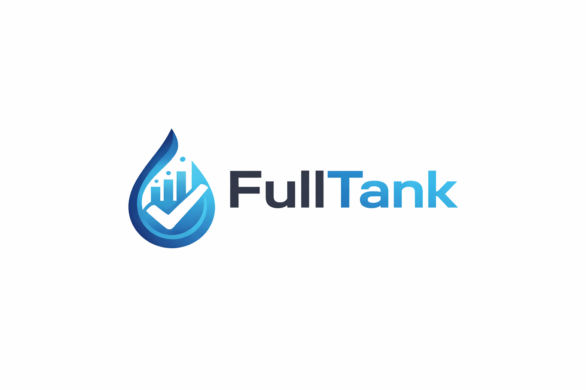</td>
    <td><strong>Zavgar</strong><br></td>
    <td><strong>FuelCloud</strong><br></td>
    <td><strong>Wialon</strong><br></td>
  </tr>

  <tr>
    <th rowspan="3">Perfil</th>
    <td><strong>Visión general</strong></td>
    <td>Plataforma web que digitaliza y estructura el proceso completo de pedido de combustible entre empresas y proveedores.</td>
    <td>SaaS para la gestión de consumo de combustible de flotas, con enfoque en eficiencia, monitoreo y costos.</td>
    <td>Solución con hardware/software para el control físico del despacho de combustible.</td>
    <td>Plataforma de gestión de flotas con control de combustible, GPS y reportes operativos.</td>
  </tr>
  <tr>
    <td><strong>Ventaja competitiva</strong></td>
    <td>Especialización en el flujo completo de pedido, despacho y análisis; integración de pagos y logística; UI intuitiva.</td>
    <td>No requiere hardware; ofrece métricas, control de gastos y reportes sobre consumo.</td>
    <td>Control físico preciso del combustible, monitoreo en tiempo real.</td>
    <td>Seguimiento en tiempo real, visualización de rutas, integración con sensores de combustible.</td>
  </tr>
  <tr>
    <td><strong>¿Qué valor ofrece al cliente?</strong></td>
    <td>Trazabilidad total, eficiencia operativa, reportes de consumo y validación segura de pedidos.</td>
    <td>Optimización de costos y control sobre el uso de combustible en flotas.</td>
    <td>Seguridad y precisión operativa en el control de combustible.</td>
    <td>Trazabilidad de flotas, alertas automáticas, análisis de rutas y consumo de combustible.</td>
  </tr>
  <tr>
    <th rowspan="2">Perfil de Marketing</th>
    <td><strong>Mercado objetivo</strong></td>
    <td>Empresas que solicitan combustible a proveedores.</td>
    <td>Empresas con flotas vehiculares que desean monitorear y reducir el consumo de combustible.</td>
    <td>Empresas con tanques de combustible propios.</td>
    <td>Empresas logísticas, distribuidoras y de transporte de combustible.</td>
  </tr>
  <tr>
    <td><strong>Estrategias de marketing</strong></td>
    <td>Alianzas con proveedores, demostraciones de ahorro, marketing de contenido enfocado en eficiencia.</td>
    <td>Enfoque digital, contenido técnico, integración con proveedores de tarjetas de combustible.</td>
    <td>Ferias industriales, distribuidores, venta consultiva entre empresas.</td>
    <td>Alianzas con distribuidores de GPS, marketing técnico, ferias de transporte.</td>
  </tr>
  <tr>
    <th rowspan="3">Perfil de Producto</th>
    <td><strong>Productos & Servicios</strong></td>
    <td>Plataforma para gestión completa de pedidos, seguimiento, reportes, validación y alertas.</td>
    <td>Plataforma web con módulo de abastecimiento, reportes de consumo, integración GPS y tarjetas.</td>
    <td>Hardware IoT y software para gestión, y control de combustible.</td>
    <td>Plataforma SaaS + app móvil con monitoreo, alertas, mapas y módulos personalizables.</td>
  </tr>
  <tr>
    <td><strong>Precios & Costos</strong></td>
    <td>Modelo SaaS con suscripción escalable según volumen y servicios.</td>
    <td>SaaS con modelos por flota activa o vehículos monitoreados.</td>
    <td>Venta e instalación de hardware + licencias de software.</td>
    <td>Modelo SaaS modular, basado en vehículos activos y funcionalidades activadas.</td>
  </tr>
  <tr>
    <td><strong>Canales de distribución</strong></td>
    <td>Web app responsive, potencial app móvil futura.</td>
    <td>Web app, marketing digital y comunidad de flotas.</td>
    <td>Plataforma web + hardware instalado en sitio.</td>
    <td>Red de partners global, distribuidores locales e integradores de sistemas GPS.</td>
  </tr>
  <tr>
    <th rowspan="4">Análisis SWOT</th>
    <td><strong>Fortalezas</strong></td>
    <td>Enfoque especializado, experiencia de usuario optimizada, integraciones clave, análisis avanzado de consumo.</td>
    <td>Implementación ágil, sin hardware, fácil adopción en empresas medianas.</td>
    <td>Control físico riguroso, solución probada en industrias exigentes.</td>
    <td>Plataforma robusta, cobertura internacional, integración con más de 2,400 dispositivos GPS.</td>
  </tr>
  <tr>
    <td><strong>Debilidades</strong></td>
    <td>Nueva en el mercado, menor reconocimiento de marca, necesita consolidar confianza.</td>
    <td>No gestiona el flujo completo del pedido, enfoque parcial en flotas.</td>
    <td>Alto costo, dependencia de hardware, menor adaptabilidad en mercados emergentes.</td>
    <td>No gestiona pedidos entre proveedor y solicitante, requiere configuración técnica inicial.</td>
  </tr>
  <tr>
    <td><strong>Oportunidades</strong></td>
    <td>Alta informalidad en el sector, digitalización creciente en logística, necesidad de trazabilidad y control.</td>
    <td>Mayor conciencia en eficiencia de flotas y digitalización de costos operativos.</td>
    <td>Nuevos mercados industriales con enfoque en seguridad y control.</td>
    <td>Creciente necesidad de control logístico y monitoreo de distribución en países en desarrollo.</td>
  </tr>
  <tr>
    <td><strong>Amenazas</strong></td>
    <td>Aparición de soluciones similares, resistencia al cambio en empresas tradicionales, competencia ERP.</td>
    <td>SaaS especializados con mayor cobertura funcional (ERP, proveedores, logística).</td>
    <td>SaaS ágiles y sin hardware físico, que ofrecen soluciones más accesibles.</td>
    <td>SaaS más específicos y ligeros, enfocados exclusivamente en la trazabilidad de entregas.</td>
  </tr>
</table>

### 2.1.2. Estrategias y tácticas frente a competidores.

**FuelPoint** aplicará diversas estrategias para afrontar la competencia y aprovechar las oportunidades que ofrece el sector.

#### a. Diferenciación a través de especialización
Una de las principales estrategias de **FuelPoint** es la **especialización en el flujo completo de pedido de combustible**. A diferencia de soluciones como **Zavgar**, que están orientadas principalmente al control y análisis del consumo de combustible en flotas, nuestra plataforma se enfoca en las **interacciones B2B** entre empresas solicitantes y proveedores. Esto nos permite ofrecer un control dedicado del pedido, gestión de la logística, y reportes detallados de consumo y entregas, lo cual no está presente en la mayoría de las plataformas competidoras.

- **Táctica**: Desarrollar funcionalidades para la validación automática de pagos, gestión de stock en tiempo real y la optimización del transporte logrando la automatización de procesos que solo eran logrados de forma manual. Esto crea una ventaja frente a competidores como **FuelCloud**, que se centran más en el control físico del combustible y menos en la administración a nivel operativo.

#### b. Innovación en la interfaz de usuario y experiencia

El sistema de **FuelPoint** está diseñado para ofrecer una **experiencia de usuario optimizada**, algo que **Wialon**, **FuelCloud** y la propia **OSINERGMIN** no abordan en sus plataformas. Al ser una solución especializada y dirigida a una tarea específica, podemos dedicar más recursos en crear una interfaz intuitiva y procesos bien definidos brindando comodidad y seguridad a nuestros usuarios.

- **Táctica**: Diseñar una **interfaz intuitiva y consistente** que permita a los usuarios acceder a reportes de consumo, validar pedidos y coordinar logística con facilidad. Además, ofrecer **soporte y formación continua** para asegurar que los usuarios aprovechen al máximo todas las funcionalidades del sistema.

#### c. Flexibilidad en precios y modelo SaaS escalable
El modelo de precios de **FuelPoint** ofrece **planes escalables basados en suscripción**, lo que hace que sea más accesible para medianas y grandes empresas. Esto es más competitivo frente a **Wialon**, que puede no ser una opción viable para empresas que solo requieren una solución de pedidos de combustible. También es más asequible que **FuelCloud**, que requiere una inversión considerable en hardware, instalación y mantenimiento.

- **Táctica**: Ofrecer un modelo de suscripción flexible y **precios competitivos**, con **múltiples niveles de suscripción** adaptados a las necesidades de diferentes empresas. Esto permitirá que empresas de menor tamaño puedan acceder a la plataforma sin comprometer su presupuesto, a la vez que se asegura el crecimiento a largo plazo a medida que la empresa crece.

#### d. Aprovechamiento de la digitalización en la logística
El sector de la logística está experimentando una transformación digital acelerada. **FuelPoint** se aprovechará de esta tendencia buscando la integración de la plataforma con otras soluciones logísticas (como los sistemas de gestión de vehículos o flotas). De esta forma podemos ofrecer una solución más completa y eficiente.

- **Táctica**: Colaborar con empresas de **gestión de flotas** para optimizar el proceso de asignación de vehículos, cisternas y choferes. También se considerará la posibilidad de integrar **sensores IoT** en los camiones de reparto para un control más preciso sobre el combustible transportado y la entrega.

#### e. Expansión hacia mercados internacionales
Si bien **FuelPoint** está inicialmente orientada a empresas locales, el modelo de negocio y la flexibilidad de la plataforma la hacen ideal para expandirse a **mercados internacionales**. Competidores como **Wialon** ya tienen presencia en mercados globales, pero su enfoque en empresas grandes y sus altos costos de implementación pueden ser una barrera para empresas de menor tamaño, limitando su alcance.

- **Táctica**: Iniciar la expansión en mercados emergentes donde la digitalización en la logística es una necesidad creciente. Esto incluirá la **localización de la plataforma** (idioma, moneda, regulaciones locales) para facilitar la adaptabilidad de los nuevos mercados.

## 2.2. Entrevistas.

### 2.2.1. Diseño de entrevistas.

**A. Proveedores de Combustible**

**Preguntas:**

1. ¿Cuál es su cargo dentro de la empresa proveedora?
2. ¿Qué tipos de clientes atienden principalmente (logística, construcción, minería, agroindustria)?
3. ¿Qué volumen de operaciones realizan mensualmente?
4. ¿Cómo gestionan actualmente los pedidos y contratos de sus clientes?
5. ¿Qué problemas han experimentado con los métodos tradicionales (llamadas, correos, planillas)?
6. ¿Utilizan algún software especializado para ventas o logística?
7. ¿Qué características valoraría más en una plataforma digital para gestionar pedidos?
8. ¿Considera que una solución que centralice cotizaciones, contratos y entregas sería útil para su empresa?
9. ¿Qué tan importante es para ustedes tener reportes históricos y comparativos de ventas?
10. ¿Qué estrategias usan actualmente para fidelizar clientes, y cómo cree que una plataforma como FullTank podría apoyarlos?

---

**B. Empresas Solicitantes**

**Preguntas:**

1. ¿Cuál es su cargo en la empresa?
2. ¿Hace cuánto tiempo trabaja en el sector energético/logístico?
3. ¿Qué volumen de combustible gestionan aproximadamente al mes?
4. ¿Cómo gestionan actualmente la compra y control de combustible?
5. ¿Qué herramientas usan (Excel, llamadas, correos, sistemas propios)?
6. ¿Cuáles son los principales problemas que enfrentan con su sistema actual?
7. ¿Qué tan importante es para usted contar con trazabilidad en tiempo real?
8. ¿Qué dispositivos utilizan para gestionar pedidos (PC, móvil, tablet)?
9. ¿Qué información considera más valiosa al momento de comprar combustible (precio, tiempo de entrega, historial de proveedor, etc.)?
10. ¿Cómo afecta la falta de transparencia en los precios a sus decisiones de compra?
11. ¿Le interesaría recibir notificaciones en tiempo real sobre cambios de precio o estado de sus pedidos?
12. ¿Qué barreras considera que dificultarían implementar una solución digital como FullTank en su empresa?

### 2.2.2 Registro de entrevistas

**1. Segmento 1: Empresas solicitantes de combustible**

- Entrevista 1:

| Campo                    | Detalle |
|-------------------------|---------|
| **Nombre entrevistado** | Betsabe Maldonado Estrella |
| **Edad**               | 52 |
| **Distrito**           | San Isidro, Lima |
| **Inicio del video**   | 00:00 |
| **Fin del video**      | 03:45 |
| **Link del video**     | https://upcedupe-my.sharepoint.com/:v:/g/personal/u20231b842_upc_edu_pe/IQCkouwLUL7JT7ks3UohUtfUAeA0xot3mF3G4dxzBzAEvWQ?nav=eyJyZWZlcnJhbEluZm8iOnsicmVmZXJyYWxBcHAiOiJPbmVEcml2ZUZvckJ1c2luZXNzIiwicmVmZXJyYWxBcHBQbGF0Zm9ybSI6IldlYiIsInJlZmVycmFsTW9kZSI6InZpZXciLCJyZWZlcnJhbFZpZXciOiJNeUZpbGVzTGlua0NvcHkifX0&e=gfM51X |
| **Foto entrevista**    |  |
| **Resumen**           | <p>La señora Betsabe Maldonado Estrella se desempeña como parte del área de logística y abastecimiento de la empresa. Su personalidad se caracteriza por ser <strong>organizada, cautelosa y enfocada en la seguridad operativa</strong>, valorando mucho la consistencia en los procesos. En su toma de decisiones influyen de manera directa las regulaciones vigentes del sector y los reportes de entidades supervisoras como <strong>Osinergmin</strong>.</p><p>La coordinación actual con los proveedores la realiza a través de <strong>llamadas de voz por teléfono celular y correos electrónicos tradicionales</strong>. Sus actividades operativas las realiza a través de una <strong>computadora de escritorio de torre HP</strong>, recurriendo de manera constante al navegador <strong>Microsoft Edge</strong> y herramientas de <strong>Office (Excel y Word)</strong>.</p><p>En la operativa actual, Betsabe señala deficiencias críticas por la falta de trazabilidad en los procesos de despacho de los proveedores, lo que le genera desconfianza y le imposibilita predecir con exactitud los abastecimientos del día. Cree que una planificación digital óptima reduciría la incertidumbre actual. Finalmente, resalta que los factores determinantes para seleccionar un proveedor son el cumplimiento de tiempos, el precio justo y la confiabilidad del servicio, mostrando un gran interés en una solución integral que automatice el tracking de pedidos y centralice la información histórica de consumos.</p> |

- Entrevista 2:

| Campo                    | Detalle |
|-------------------------|---------|
| **Nombre entrevistado** | Daniel Angelo Siqueiros Cruz |
| **Edad**               | 21 |
| **Distrito**           | Los Olivos, Lima |
| **Inicio del video**   | 00:00 |
| **Fin del video**      | 06:29 |
| **Link del video**     | https://upcedupe-my.sharepoint.com/:v:/g/personal/u202318620_upc_edu_pe/IQCdgZwWmcdbRol75iM8cTHFASEn_WeKWpU6JDASO27sYzI?nav=eyJyZWZlcnJhbEluZm8iOnsicmVmZXJyYWxBcHAiOiJTdHJlYW1XZWJBcHAiLCJyZWZlcnJhbFZpZXciOiJTaGFyZURpYWxvZy1MaW5rIiwicmVmZXJyYWxBcHBQbGF0Zm9ybSI6IldlYiIsInJlZmVycmFsTW9kZSI6InZpZXcifX0%3D&e=kQ2BIT |
| **Foto entrevista**    |  |
| **Resumen**           | El entrevistado se desempeña como asistente de logística y almacén en una empresa constructora mediana de Lima Norte, con un año y medio de experiencia, y se encarga de revisar el nivel de combustible de la maquinaria y del tanque de obra, solicitar el combustible a los proveedores y registrar cada entrega. La empresa consume entre 15,000 y 20,000 litros de diésel al mes, con dos o tres pedidos por semana de 3,000 a 6,000 litros cada uno, según el avance de las obras. Actualmente, la gestión es manual: los pedidos se coordinan por WhatsApp, el jefe de logística realiza la transferencia, el comprobante se envía como foto por el mismo chat y los datos se registran después en un Excel compartido; las llamadas se usan en casos urgentes y el correo solo para recibir la factura, ya que el sistema contable de la empresa no registra los pedidos. Entre los principales problemas destacan la falta de visibilidad sobre la hora real de llegada del pedido, lo que provoca paralizaciones de maquinaria cuando el camión se retrasa; la información dispersa entre el chat, la galería del celular, el correo y el Excel, que le hace perder tiempo al preparar el resumen mensual; y los errores al digitar cantidades, como un pedido registrado por 4,000 litros en lugar de 1,400. Considera que conocer en tiempo real si el pedido salió, está en camino o cuándo llega le ahorraría varias llamadas diarias y le permitiría avisar a tiempo en la obra. Usa la computadora en la oficina, pero realiza la mayoría de tareas desde el celular cuando está en campo. Al comprar, prioriza el tiempo de entrega, luego el precio y el cumplimiento del proveedor, además de su formalidad. La falta de transparencia en los precios lo obliga a consultar a varios proveedores y a comprar al que responde primero, sin saber si le cobran de más. Le interesan las notificaciones sobre el estado del pedido, siempre que se limiten a las importantes para no terminar ignorándolas. Finalmente, identifica como barreras para adoptar una solución digital que el proveedor también la utilice, la costumbre de su jefe de coordinar por teléfono con proveedores de confianza, la mala señal de internet en obra y la aprobación del costo por parte de gerencia. |

- Entrevista 3:

| Campo                    | Detalle |
|-------------------------|---------|
| **Nombre entrevistado** | Alessandro Gonzales |
| **Edad**               | 21 |
| **Distrito**           | Santiago de Surco, Lima |
| **Inicio del video**   | 00:00 |
| **Fin del video**      | 04:25 |
| **Link del video**     | https://upcedupe-my.sharepoint.com/:v:/g/personal/u202319057_upc_edu_pe/IQBqEiboowHOQoOS2LbOXhPIARznCkH09uwTmQO6PiCjApo?nav=eyJyZWZlcnJhbEluZm8iOnsicmVmZXJyYWxBcHAiOiJPbmVEcml2ZUZvckJ1c2luZXNzIiwicmVmZXJyYWxBcHBQbGF0Zm9ybSI6IldlYiIsInJlZmVycmFsTW9kZSI6InZpZXciLCJyZWZlcnJhbFZpZXciOiJNeUZpbGVzTGlua0NvcHkifX0&e=smKx0D|
| **Foto entrevista**    |  |
| **Resumen**           |El entrevistado se encarga de la gestión de abastecimiento y coordinación logística de combustible, con aproximadamente cinco años de experiencia en el sector energético y logístico. La empresa gestiona un volumen aproximado de 500,000 litros de combustible al mes. Actualmente, las compras se coordinan directamente con los proveedores y el seguimiento de pedidos, entregas y consumo se realiza mediante procesos internos, utilizando principalmente Excel, llamadas telefónicas, correos y algunos sistemas propios. Entre los principales problemas se encuentran la información dispersa, los errores de coordinación y la dificultad para conocer en tiempo real el estado de los pedidos, lo que puede complicar la reacción ante retrasos o inconvenientes. Considera que la trazabilidad en tiempo real es muy importante, ya que permitiría conocer el estado de cada pedido y actuar rápidamente ante cualquier incidencia. Para gestionar estas actividades utiliza principalmente una PC y un celular, dependiendo de si se encuentra en la oficina o supervisando operaciones. Al momento de comprar combustible, considera especialmente importante contar con el precio actualizado, el tiempo de entrega, la disponibilidad del proveedor y su historial de cumplimiento. La falta de transparencia en los precios dificulta la comparación entre proveedores y puede generar sobrecostos. También muestra interés en recibir notificaciones en tiempo real sobre cambios de precio y estado de los pedidos, ya que le permitirían anticipar cambios y supervisar mejor las entregas. Finalmente, identifica como principales barreras para implementar una solución digital como FullTank la resistencia al cambio, la necesidad de capacitar al personal, la integración con los sistemas existentes y la preocupación por los costos iniciales.|

- Entrevista 4:

| Campo                    | Detalle |
|-------------------------|---------|
| **Nombre entrevistado** | Carlos Gutierrez |
| **Edad**               | 20 |
| **Distrito**           | Ate, Lima |
| **Inicio del video**   | 00:00 |
| **Fin del video**      | 02:30 |
| **Link del video**     | https://upcedupe-my.sharepoint.com/:v:/g/personal/u202319057_upc_edu_pe/IQDF46DLEU4IToQ4AGTnklbCAZ0agzl-FG0yWztwR2suv3A?nav=eyJyZWZlcnJhbEluZm8iOnsicmVmZXJyYWxBcHAiOiJPbmVEcml2ZUZvckJ1c2luZXNzIiwicmVmZXJyYWxBcHBQbGF0Zm9ybSI6IldlYiIsInJlZmVycmFsTW9kZSI6InZpZXciLCJyZWZlcnJhbFZpZXciOiJNeUZpbGVzTGlua0NvcHkifX0&e=ywABmN|
| **Foto entrevista**    |  |
| **Resumen**           | El entrevistado se desempeña como coordinador de compras y abastecimiento en una empresa dedicada a operaciones de transporte y distribución, con aproximadamente tres años de experiencia en el sector energético y logístico. La empresa gestiona alrededor de 280,000 litros de combustible al mes, principalmente para mantener operativa su flota. Actualmente, la compra se realiza según la planificación de consumo y las necesidades de cada sede, coordinando con distintos proveedores y registrando las operaciones en Excel. Para estas actividades utilizan principalmente Excel, correo electrónico, llamadas telefónicas y un sistema interno para registrar parte de la información, aunque no todas las herramientas están conectadas entre sí. Entre las principales dificultades menciona la duplicidad de registros, la demora en recibir información de los proveedores y la falta de un seguimiento centralizado de los pedidos, lo que dificulta saber rápidamente qué compras están pendientes o cuándo llegará cada entrega. Considera que la trazabilidad en tiempo real sería importante para mejorar la planificación y reducir la necesidad de realizar llamadas para confirmar el estado de los pedidos. Utiliza principalmente la PC durante la jornada de oficina y el celular cuando necesita supervisar operaciones fuera de ella. Al momento de seleccionar un proveedor, considera especialmente relevantes el precio, la disponibilidad del combustible, los tiempos de entrega y el cumplimiento de entregas anteriores, ya que un retraso puede afectar directamente las operaciones de transporte. La falta de transparencia en los precios dificulta identificar cuándo una cotización es realmente conveniente y obliga a solicitar información a varios proveedores antes de realizar una compra. También estaría interesado en recibir alertas sobre variaciones de precios, confirmación de pedidos y posibles retrasos, siempre que las notificaciones sean claras y realmente relevantes. Finalmente, considera que las principales barreras para implementar FullTank serían la adaptación de los trabajadores a una nueva herramienta, la compatibilidad con los sistemas que ya utiliza la empresa, la capacitación inicial y la disposición de los proveedores para integrarse a la plataforma.|


**2. Segmento 2: Proveedores de combustible**

- Entrevista 1:

| Campo                    | Detalle |
|-------------------------|---------|
| **Nombre entrevistado** | Carlos Mendoza |
| **Edad**               | 50 |
| **Distrito**           | Callao, Callao |
| **Fecha**              | 2026-09-05 |
| **Inicio del video**   | 00:00 |
| **Fin del video**      | 04:41 |
| **Link del video**     | https://upcedupe-my.sharepoint.com/:v:/g/personal/u20241c630_upc_edu_pe/IQAc_YdFgDxbSIN6wUPQrIZ-ARLL0hIcgJwoS9AJHEcnpD4?e=fdVXa8&nav=eyJyZWZlcnJhbEluZm8iOnsicmVmZXJyYWxBcHAiOiJTdHJlYW1XZWJBcHAiLCJyZWZlcnJhbFZpZXciOiJTaGFyZURpYWxvZy1MaW5rIiwicmVmZXJyYWxBcHBQbGF0Zm9ybSI6IldlYiIsInJlZmVycmFsTW9kZSI6InZpZXcifX0%3D |
| **Foto entrevista**    |  |
| **Resumen**           | El entrevistado se desempeña como jefe de logística y operaciones comerciales, con responsabilidad sobre todo el flujo desde la solicitud del cliente hasta la entrega final del combustible, atendiendo principalmente a clientes de gran volumen en sectores como minería y agroindustria, que representan cerca del 90% de su cartera. Maneja un volumen mensual de entre 40,000 y 60,000 galones, operando bajo contratos marco anuales donde los pedidos se reciben mediante órdenes de compra enviadas por correo electrónico. El proceso incluye validaciones internas como revisión de crédito en sistemas ERP y posterior programación de la flota, lo que introduce múltiples puntos de fricción. Entre los principales problemas destacan la falta de trazabilidad en tiempo real, retrasos por burocracia interna, dependencia de correos que pueden quedar sin atención, y la necesidad constante de coordinar manualmente información con choferes para responder a clientes, lo que genera ineficiencia y sobrecarga operativa. Aunque cuentan con sistemas para contabilidad y GPS para flota, estos no están integrados, lo que limita la visibilidad completa del proceso. El entrevistado valora altamente soluciones que integren automáticamente pedidos, validaciones y despachos, permitiendo al cliente subir órdenes, validar condiciones y rastrear entregas en tiempo real sin intermediación. Asimismo, considera clave contar con reportes dinámicos para análisis de desempeño, consumo por zonas y tiempos de entrega. Señala que una plataforma centralizada representaría un salto importante en la madurez digital de la empresa, permitiendo escalar operaciones sin incrementar significativamente el personal. Finalmente, destaca que la fidelización en su sector depende del cumplimiento estricto y la ausencia de fallas, y que una solución digital podría convertirse en una ventaja competitiva al ofrecer mayor transparencia, control y posicionamiento como socio tecnológico ante sus clientes. |

- Entrevista 2:

| Campo                    | Detalle |
|-------------------------|---------|
| **Nombre entrevistado** | Lucia Fernandez |
| **Edad**               | 21 |
| **Distrito**           | San Miguel, Lima |
| **Fecha**              | 2026-09-06 |
| **Inicio del video**   | 00:00 |
| **Fin del video**      | 04:44 |
| **Link del video**     | https://upcedupe-my.sharepoint.com/:v:/g/personal/u20231b842_upc_edu_pe/IQCxI6oUHNUeSrK3kLqxOqWuASqRIC7hVQ0GcfQOepRQXyY?nav=eyJyZWZlcnJhbEluZm8iOnsicmVmZXJyYWxBcHAiOiJPbmVEcml2ZUZvckJ1c2luZXNzIiwicmVmZXJyYWxBcHBQbGF0Zm9ybSI6IldlYiIsInJlZmVycmFsTW9kZSI6InZpZXciLCJyZWZlcnJhbFZpZXciOiJNeUZpbGVzTGlua0NvcHkifX0&e=5LRYMx |
| **Foto entrevista**    |  |
| **Resumen**           | La entrevistada se desempeña como gerenta de ventas en una empresa proveedora de combustible, asumiendo además funciones relacionadas con operaciones y cobranzas, atendiendo principalmente a clientes del sector transporte y logística, como flotas de camiones y talleres con tanques propios. Maneja un volumen mensual de entre 25,000 y 40,000 galones, con una gestión de pedidos altamente dependiente de canales informales como WhatsApp y llamadas telefónicas, mientras que la información se transfiere manualmente a hojas de Excel compartidas con el área de despacho. Los contratos de mayor escala se gestionan por correo, pero la operación diaria se basa principalmente en comunicación directa. Entre los principales problemas identificados destacan la pérdida de pedidos por saturación de mensajes, errores al transcribir información al sistema, y demoras en procesos como facturación y coordinación interna. Aunque cuentan con un sistema contable, no disponen de herramientas integradas para la gestión logística, dependiendo en gran medida de Excel y la memoria operativa del equipo. La entrevistada valora especialmente soluciones digitales que sean simples e intuitivas, adaptadas a usuarios no técnicos, permitiendo registrar pedidos de forma rápida y visualizar la información organizada por prioridad. Considera que una plataforma que centralice pedidos, contratos y entregas sería altamente beneficiosa, ya que reduciría errores y optimizaría el tiempo de gestión. Asimismo, destaca la importancia de contar con reportes históricos para mejorar la planificación y negociación con proveedores, y señala que la fidelización de clientes se basa en el trato directo y el acceso a crédito, pudiendo fortalecerse mediante herramientas que brinden mayor transparencia, visibilidad del estado de cuenta y seguimiento en tiempo real de los pedidos. |


- Entrevista 3:

| Campo                    | Detalle |
|-------------------------|---------|
| **Nombre entrevistado** | Samuel Roca Rey |
| **Edad**               | 48 |
| **Distrito**           | Chorrillos, Lima |
| **Inicio del video**   | 00:00 |
| **Fin del video**      | 07:36 |
| **Link del video**     | https://upcedupe-my.sharepoint.com/:v:/g/personal/u20231b842_upc_edu_pe/IQC2p2YWEIDGSIbGObwo0gYAAfz48MPf4PC9a2lIWsAQZVc |
| **Foto entrevista**    |  |
| **Resumen**           | <p>El señor Samuel Roca Rey se desempeña como supervisor de logística y operaciones en la empresa. Cuenta con un perfil de personalidad <strong>metódico, pragmático y muy enfocado en la seguridad operativa</strong>. Su gestión diaria está fuertemente influenciada por las normas de seguridad de <strong>OSINERGMIN</strong> y buenas prácticas en distribución.</p><p>Indica que la comunicación operativa con los choferes y clientes se efectúa a través de <strong>llamadas de voz por teléfono celular y correo electrónico (Outlook)</strong>, usando <strong>Microsoft Excel</strong> para sus registros. Desarrolla su trabajo mediante una <strong>computadora de escritorio Lenovo y un teléfono móvil Motorola</strong>, navegando a través de <strong>Microsoft Edge</strong>.</p><p>Samuel describe problemas recurrentes de trazabilidad física del combustible y errores de tipeo manual que alteran la precisión. Señala la urgencia de implementar una solución digital que centralice todos los datos en un solo lugar seguro y accesible. Para finalizar, remarca que contar con el historial completo de transacciones en la plataforma es clave para optimizar la planificación de rutas y el control de inventarios.</p> |

### 2.2.3 Análisis de entrevistas

En esta sección se presenta el análisis detallado de la información recolectada. Para cada segmento, se explican los hallazgos objetivos y subjetivos, seguidos de su interpretación para el desarrollo de la solución.

### Segmento 1: Empresas Solicitantes de Combustible

**Análisis de Características Objetivas y Subjetivas:** El análisis evidencia una digitalización parcial pero desarticulada. El 100% de los entrevistados gestiona sus pedidos mediante herramientas informales como llamadas, correos electrónicos y WhatsApp, mientras que el 100% utiliza Excel como principal herramienta de registro. Sin embargo, no existe integración entre estas herramientas, lo que genera duplicidad de información y procesos manuales constantes. En términos operativos, los volúmenes gestionados son altos y críticos para la continuidad del negocio, con casos que superan los 20,000 m³ mensuales.

A nivel subjetivo, el 100% de los entrevistados identifica problemas de desorganización, errores en pedidos y pérdida de tiempo en validaciones. Asimismo, el 100% considera la trazabilidad en tiempo real como un factor clave, especialmente debido al impacto directo que tiene el desabastecimiento en sus operaciones, pudiendo generar paralizaciones completas. En cuanto a la toma de decisiones, el 100% prioriza el tiempo de entrega y la confiabilidad del proveedor por encima del precio en contextos críticos. Finalmente, existe una alta disposición a adoptar soluciones digitales, aunque con la condición implícita de que sean intuitivas y no generen fricción en su flujo actual.

### Segmento 2: Proveedores de Combustible

**Análisis de Características Objetivas y Subjetivas:** El análisis revela una operación altamente fragmentada y dependiente de procesos manuales. El 100% de los proveedores recibe pedidos mediante canales informales como WhatsApp, llamadas o correos, y el 100% utiliza Excel como herramienta principal de registro. Asimismo, el 100% gestiona contratos, pedidos y despachos en sistemas separados o documentos independientes, evidenciando una falta total de integración. En algunos casos, existen sistemas adicionales como ERP o GPS, pero estos operan de forma aislada, sin conexión con la gestión comercial o logística.

Desde una perspectiva subjetiva, el 100% de los entrevistados identifica errores frecuentes derivados de información incompleta o mal registrada, así como una pérdida significativa de tiempo en la búsqueda y validación de datos. Además, el 100% señala la falta de visibilidad del estado de los pedidos como un problema crítico, lo que obliga a realizar coordinaciones manuales constantes con clientes y operadores. A nivel estratégico, el 100% reconoce la importancia de contar con reportes históricos y métricas para mejorar la planificación y la toma de decisiones. Existe también un consenso en que una solución digital integrada representaría una mejora significativa en eficiencia operativa, escalabilidad y percepción de valor frente al cliente.

### Análisis Comparativo

**Contrastación de Segmentos:**

Al comparar ambos segmentos, se identifican coincidencias clave que validan la necesidad de la solución. En primer lugar, el 100% de ambos grupos depende de herramientas informales y no integradas (WhatsApp, correos y Excel), lo que genera ineficiencias estructurales en toda la cadena de valor. Asimismo, el 100% coincide en la necesidad de centralizar la información y mejorar la trazabilidad de los pedidos.

Sin embargo, existen diferencias importantes en la percepción del problema. Mientras que las empresas solicitantes experimentan el problema como un riesgo operativo crítico, donde el desabastecimiento puede detener completamente sus operaciones, los proveedores lo perciben como un problema de eficiencia y escalabilidad, relacionado con la sobrecarga operativa, errores y limitaciones para crecer sin aumentar recursos humanos.

Esta diferencia define claramente la propuesta de valor:

- Para los solicitantes: continuidad operativa y reducción de riesgo
- Para los proveedores: eficiencia, control y escalabilidad del negocio

### Conclusiones y Definición de Arquetipos

Basado en el análisis de las entrevistas, se definen los siguientes perfiles de usuario:

**User Persona Solicitante ("El Operador Crítico")**
- Rasgo clave: Prioriza la continuidad operativa y la confiabilidad por encima del costo.
- Sustento: El 100% considera la trazabilidad en tiempo real como crítica y prioriza el tiempo de entrega frente al precio.
- Necesidad principal: Evitar desabastecimientos y tener visibilidad inmediata del estado de sus pedidos.

**User Persona Proveedor ("El Gestor Saturado")**
- Rasgo clave: Busca orden y automatización para reducir carga operativa y escalar.
- Sustento: El 100% reporta desorganización, errores y procesos manuales intensivos, además de la necesidad de integrar sistemas.
- Necesidad principal: Centralizar la gestión de pedidos, contratos y despachos en una sola plataforma.


## 2.3 Needfinding

### 2.3.1 User Personas

Los User Personas son perfiles arquetípicos que representan a los usuarios de cada segmento objetivo. Se construyeron a partir de los patrones comunes encontrados en las entrevistas de la sección 2.2: cargos, rutinas, herramientas, frustraciones y metas que se repitieron entre los entrevistados. Se elaboraron en UXPressia y sirven de referencia para el User Task Matrix, los User Journey Maps, los Empathy Maps, el Impact Mapping y el diseño de la aplicación web.

**Segmento 1: empresas solicitantes de combustible**

**Carlos Ramírez Torres** (32 años, Lima) es encargado logístico de una constructora mediana que depende del suministro constante de combustible para operar maquinaria pesada. Tiene más de diez años de experiencia en logística y operaciones. Coordina varios pedidos a la vez, supervisa las entregas y debe evitar que la obra se detenga. Hoy gestiona sus pedidos por llamadas, correo y WhatsApp, por lo que la información queda desordenada y sin trazabilidad.

- **Metas:** reducir en al menos 30 % los retrasos en las entregas, centralizar todos sus pedidos en una sola plataforma, mejorar la comunicación con sus proveedores y decidir con datos.
- **Frustraciones:** falta de una confirmación clara de sus pedidos, errores por mala comunicación, tiempo perdido en seguimiento manual y herramientas desconectadas.
- **Tecnología:** usa laptop y computadora de escritorio con Windows y un celular Android; navega en Google Chrome.
- **Cita:** «Necesito saber exactamente dónde está mi pedido sin tener que estar llamando todo el día».

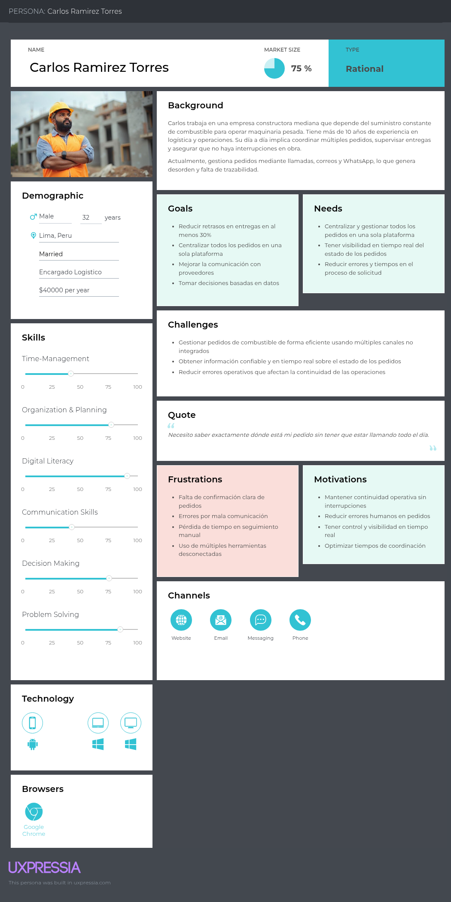

**Segmento 2: empresas proveedoras de combustible**

**Andrea López Castillo** (28 años, Callao) es gestora de ventas regional en una distribuidora de combustible que atiende a varios clientes industriales. Coordina los pedidos, asigna las rutas de entrega y supervisa que cada despacho se cumpla. Recibe muchas solicitudes al día y las procesa de forma manual, lo que le genera sobrecarga operativa.

- **Metas:** reducir en 50 % los errores logísticos, optimizar las rutas de distribución, disminuir el tiempo de gestión de pedidos y aumentar la satisfacción de sus clientes.
- **Necesidades:** una bandeja única de pedidos, visibilidad del estado de cada despacho y avisos automáticos que eviten responder las mismas consultas.
- **Frustraciones:** exceso de llamadas y mensajes de clientes, dificultad para organizar muchos pedidos, falta de visibilidad en tiempo real y procesos manuales repetitivos.
- **Tecnología:** trabaja principalmente desde laptop y computadora de escritorio con Windows y usa un celular Android en campo; navega en Google Chrome.
- **Cita:** «Si pudiera ver todos los pedidos organizados automáticamente, ahorraría horas de trabajo cada día».

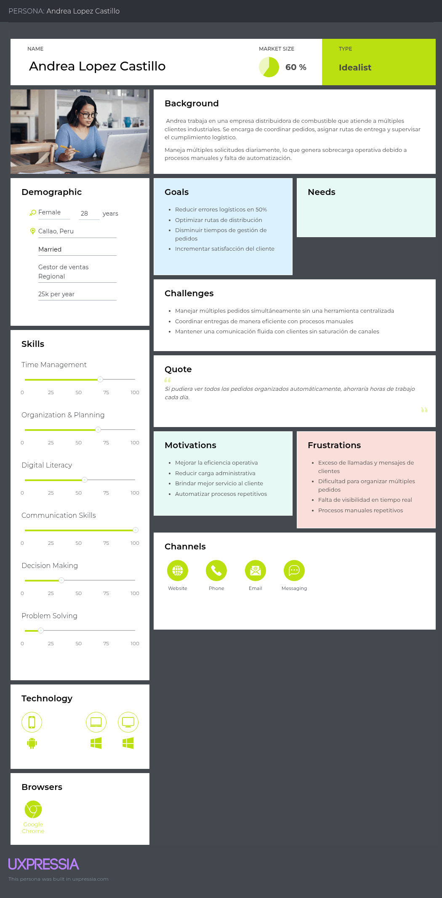

Siguiendo el enfoque de Lean UX (Gothelf & Seiden, 2021), los User Personas priorizan metas, necesidades y comportamientos sobre los datos demográficos, y son documentos vivos: se actualizarán cada vez que las entrevistas o las pruebas de usabilidad aporten nueva evidencia sobre los usuarios.

Ambos perfiles comparten la dependencia de canales desconectados y la necesidad de conocer el estado real de cada pedido. Carlos necesita, sobre todo, registrar y seguir sus pedidos sin llamar. Andrea necesita organizar, validar y despachar muchos pedidos con menos trabajo manual.

### 2.3.2 User Task Matrix

El User Task Matrix recoge las tareas que Carlos y Andrea realizan para cumplir sus objetivos, usen o no FullTank. Para cada tarea se estima su **frecuencia** (con qué periodicidad se realiza) y su **importancia** (cuánto afecta a la continuidad de la operación) en cada segmento. Las valoraciones se basan en lo relatado en las entrevistas y usan la escala Alta, Media y Baja.

| Tarea | Solicitante: frecuencia | Solicitante: importancia | Proveedor: frecuencia | Proveedor: importancia |
|---|---|---|---|---|
| Registrar o recibir pedidos de combustible | Alta | Alta | Alta | Alta |
| Validar la información del pedido | Media | Alta | Alta | Alta |
| Registrar o validar el comprobante de pago | Media | Alta | Alta | Alta |
| Consultar o actualizar el estado del pedido | Alta | Alta | Alta | Alta |
| Modificar o cancelar un pedido | Media | Media | Baja | Media |
| Comparar y elegir proveedores | Baja | Alta | No aplica | No aplica |
| Controlar el nivel de combustible de equipos y tanques | Alta | Alta | No aplica | No aplica |
| Gestionar el inventario de combustible | No aplica | No aplica | Alta | Alta |
| Asignar cisternas y conductores a un despacho | No aplica | No aplica | Alta | Alta |
| Programar y planificar entregas | Baja | Media | Alta | Alta |
| Gestionar varios pedidos a la vez | Media | Media | Alta | Alta |
| Confirmar la recepción del pedido | Media | Alta | Media | Alta |
| Comunicarse entre cliente y proveedor | Alta | Alta | Alta | Alta |
| Recibir o enviar notificaciones | Alta | Alta | Alta | Alta |
| Revisar el historial de pedidos | Media | Media | Media | Media |
| Monitorear consumo o ventas | Baja | Media | Media | Media |
| Generar reportes y métricas | Baja | Media | Media | Media |

**Análisis**

- **Tareas críticas compartidas:** registrar o recibir pedidos, consultar su estado, comunicarse y recibir notificaciones son de frecuencia e importancia altas en ambos segmentos. Por eso forman el núcleo del producto: el flujo de pedidos con estados compartidos y las notificaciones automáticas.
- **Solicitante:** además del pedido, Carlos controla a diario el nivel de sus equipos y tanques, ya que de ello depende cuándo pedir combustible. Esto justifica el módulo de equipos y los accesos directos para crear una solicitud.
- **Proveedor:** Andrea concentra la mayor carga en validar pagos, asignar cisternas y conductores, planificar entregas y gestionar varios pedidos a la vez. Estas tareas justifican la bandeja de solicitudes entrantes, el módulo de flota y el inventario.
- **Tareas de apoyo:** el historial, el monitoreo y los reportes tienen importancia media. Se ofrecerán en módulos secundarios de la aplicación, sin interrumpir el flujo principal.


### 2.3.3 User Journey Mapping

-Segmento 1: Empresas solicitantes de combustible

El User Journey Mapping de Carlos representa el recorrido actual que experimenta como responsable en una empresa constructora, en la gestión del abastecimiento de combustible necesario para la operación de maquinaria pesada. El mapa ilustra el proceso end-to-end, desde la identificación de la necesidad de combustible hasta la evaluación de la entrega y desempeño del proveedor.

En la situación As-Is, Carlos enfrenta un flujo de trabajo manual y poco estructurado: detecta necesidades sin apoyo de alertas, busca proveedores de manera informal, realiza pedidos mediante canales como WhatsApp o correo y da seguimiento a través de llamadas constantes. Esto genera desorden en la información, falta de trazabilidad, retrasos y una alta dependencia de la comunicación manual.

El Journey busca evidenciar los puntos críticos de su experiencia actual, identificando emociones, tareas, fricciones y oportunidades de mejora a lo largo de cada etapa (Awareness, Data Collection, Daily Management, Communication, Reporting y Evaluation). Este análisis servirá como base para diseñar una solución que centralice la información, automatice el registro de pedidos y permita el seguimiento en tiempo real.

 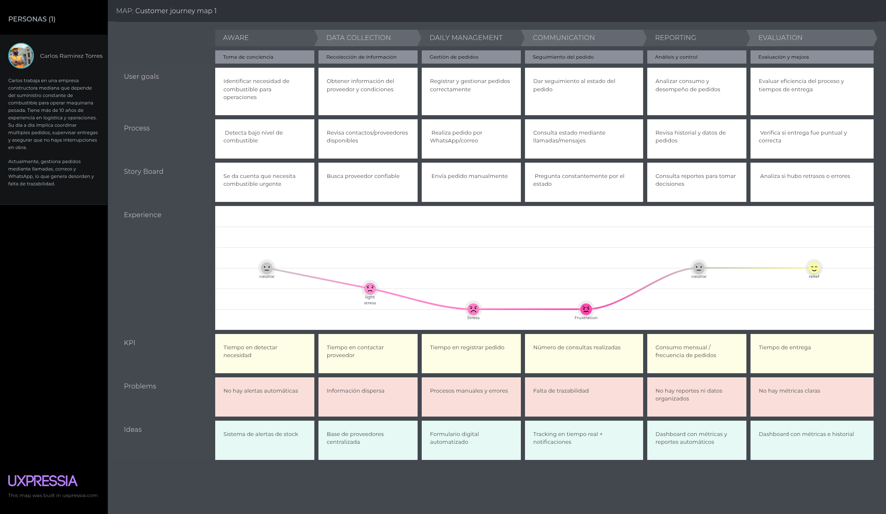

-Segmento 2: Proveedores de Combustible

El User Journey Mapping de Andrea representa el recorrido actual que experimenta como coordinadora en una empresa distribuidora de combustible, encargada de gestionar múltiples pedidos, coordinar entregas y asegurar el cumplimiento logístico. El mapa ilustra el proceso end-to-end, desde la recepción de pedidos hasta la evaluación del desempeño operativo.

En la situación As-Is, Andrea enfrenta un flujo de trabajo altamente demandante y fragmentado: recibe pedidos por diversos canales, valida información manualmente, organiza rutas sin herramientas automatizadas y mantiene comunicación constante con clientes mediante llamadas y mensajes. Esto genera sobrecarga operativa, errores en la planificación, saturación en la comunicación y limitada visibilidad de métricas clave.

El Journey busca evidenciar los puntos críticos de su experiencia actual, identificando emociones, tareas, fricciones y oportunidades de mejora a lo largo de cada etapa (Awareness, Data Collection, Daily Management, Communication, Reporting y Evaluation). Este análisis servirá como base para diseñar una solución tecnológica que centralice pedidos, automatice la planificación logística y mejore la visibilidad operativa mediante indicadores y dashboards.


 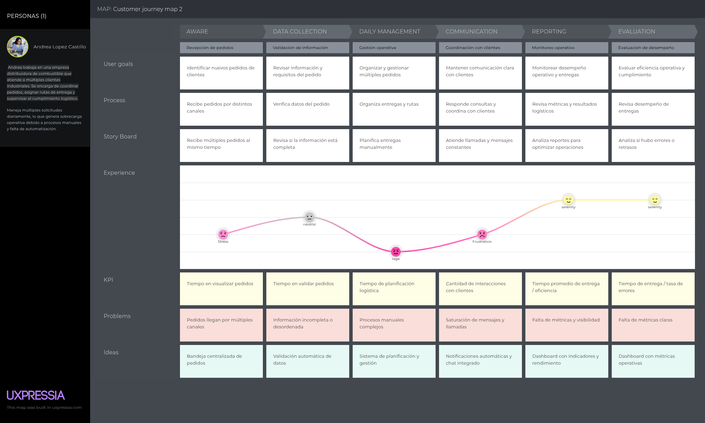

### 2.3.4 Empathy Mapping

Para la elaboración de los Empathy Maps, el equipo partió del conocimiento y observaciones recolectadas durante el análisis de los User Persona. Se colocó al centro de cada mapa al usuario correspondiente (Carlos y Andrea) y se respondieron las preguntas claves sobre su entorno, emociones, comportamientos y necesidades.

-Segmento 1: Empresas solicitantes de combustible


 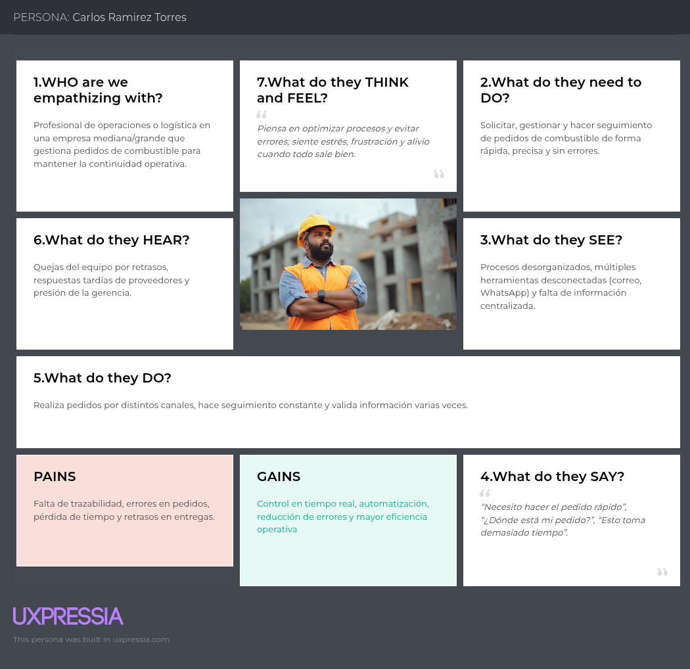


-Segmento 2: Proveedores de Combustible

 

## 2.4 Big Picture Event Storming
Para comprender a profundidad el dominio del negocio de FuelPoint (FullTank) y alinear la visión tecnológica con las operaciones reales de compraventa y distribución de combustible, el equipo llevó a cabo una sesión de Event Storming. Esta técnica colaborativa nos permitió identificar los hitos clave del sistema sin adelantarnos a detalles técnicos.

### Step 1 – Free Exploration (Exploración Libre)
En esta primera etapa, el equipo realizó una lluvia de ideas desestructurada para capturar todos los Eventos de Dominio relevantes de la operativa logística y comercial. Utilizando notas de color naranja (post-its), registramos hechos que ya ocurrieron en el negocio, redactados estrictamente en tiempo pasado (ej. Fuel request created, Fuel dispatched).

El objetivo principal fue plasmar sobre el lienzo la realidad del negocio, desde el registro de usuarios hasta el despacho físico en las cisternas, priorizando la cantidad de eventos sobre el orden cronológico o la jerarquía.

<div align="center">
  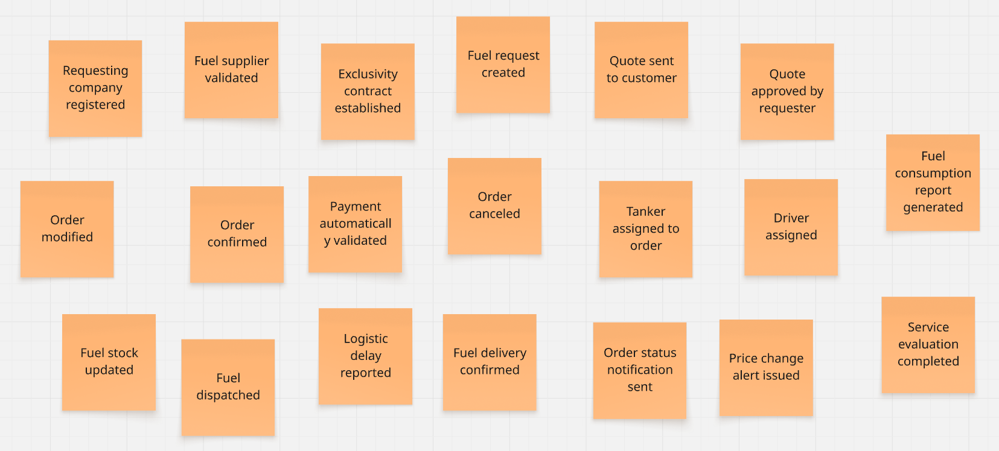
  <p><em>Figura 2.1: Step 1 - Exploración libre de eventos de dominio.</em></p>
</div>

### Step 2 – Structured Organization (Líneas de Tiempo)
Tras listar los eventos de dominio, procedimos a organizar el caos inicial estructurando los post-its en un flujo lógico de negocio de izquierda a derecha. Agrupamos los eventos en cuatro grandes bloques temporales que reflejan el ciclo de vida real de una operación de abastecimiento de combustible:

- Onboarding & Contracting: Abarca el registro de las empresas y la formalización de los contratos de exclusividad.
- Order Management: Contiene el núcleo transaccional administrativo, desde la creación de la solicitud y envío de cotizaciones, hasta la confirmación y validación financiera.
- Logistics & Dispatch: Refleja la operativa física, incluyendo la asignación de cisternas (Tanker assigned to order), actualización de inventarios y la entrega del combustible.
- Monitoring & Analytics: Agrupa los eventos asíncronos de valor agregado, como el envío de notificaciones, alertas de precios y reportes de consumo
  
Esta estructura temporal nos ayudó a identificar claramente las áreas críticas donde la digitalización eliminará los actuales cuellos de botella del sector.

<div align="center">
  
  <p><em>Figura 2.2: Step 2 - Organización temporal por flujos de negocio.</em></p>
</div>

## 2.5 Ubiquitous Language

Conforme a las directrices de Eric Evans (2003) en *Domain-Driven Design: Tackling Complexity in the Heart of Software* y las especificaciones del enunciado del curso, el glosario de términos se redacta con términos estrictamente pertenecientes al **dominio del negocio de abastecimiento y distribución de hidrocarburos**, sin ambigüedades y omitiendo términos técnicos propios de la ingeniería de software. Cada término se especifica en **inglés** como lenguaje principal, incluyendo su traducción equivalente en español entre paréntesis:

| Término (Inglés / Español) | Definición en el Dominio del Negocio |
|---|---|
| **Fuel Request (Solicitud de Combustible)** | Solicitud formal emitida por una empresa compradora en el que se especifica el tipo de combustible requerido, volumen en galones o litros, fecha deseada y punto de entrega. |
| **Fuel Supplier / Distributor (Proveedor / Distribuidor de Combustible)** | Empresa formal comercializadora y distribuidora de derivados de hidrocarburos, autorizada mediante el Registro de Hidrocarburos ante OSINERGMIN. |
| **Corporate Requester / Buyer (Empresa Solicitante / Compradora)** | Organización empresarial (construcción, minería, transporte, agroindustria) que demanda suministro continuo de combustible a granel para mantener la continuidad de su maquinaria y equipos. |
| **Fuel Order (Orden de Combustible)** | Transacción comercial formalizada una vez que el proveedor aprueba una solicitud de combustible y valida la disponibilidad de inventario y el respaldo financiero. |
| **Order Status (Estado del Pedido)** | Hito oficial dentro del ciclo de vida de la orden en el dominio (e.g., *Pending, Approved, Rejected, In Dispatch, Delivered, Closed*). |
| **Real-Time Fuel Tracking (Seguimiento de Combustible en Tiempo Real)** | Monitoreo del progreso operativo y logístico de un pedido desde su validación hasta la confirmación física de descarga en el punto de destino. |
| **Delivery Scheduling (Programación de Despacho y Entrega)** | Asignación de fecha, ventana horaria y recursos operativos para cumplir con el abastecimiento programado de un cliente. |
| **Domain Notification (Notificación de Evento de Dominio)** | Aviso generado ante un cambio de estado significativo en la transacción (aprobación de orden, salida de cisterna a ruta o confirmación de entrega). |
| **Transaction History (Historial Transaccional)** | Registro consolidado y auditable de todos los pedidos históricos, volúmenes despachados, precios facturados y fechas de cumplimiento. |
| **Logistics Route Planning (Planificación de Rutas Logísticas)** | Estrategia de optimización de itinerarios y coordinación de transporte para abastecer a múltiples puntos de obra o plantas industriales minimizando tiempos de tránsito. |
| **Order Validation (Validación de Orden)** | Procedimiento de verificación ejecutado por el proveedor para corroborar disponibilidad de stock, precios vigentes y consistencia de los datos del pedido. |
| **Tanker / Fuel Truck (Camión Cisterna de Combustible)** | Vehículo de transporte especializado, calibrado y certificado para transportar hidrocarburos líquidos a granel en compartimentos herméticos y seguros. |
| **Fuel Dispatch (Despacho de Combustible)** | Salida operativa y física del camión cisterna desde la planta de almacenamiento o refinería hacia las instalaciones del cliente solicitante. |
| **Proof of Delivery / POD (Constancia de Entrega / Guía de Remisión)** | Documento formal firmado o validado en campo que certifica la recepción conforme del volumen de combustible descargado en destino. |
| **Fuel Inventory / Stock (Inventario de Combustible)** | Volumen disponible de cada tipo de derivado de petróleo almacenado en tanques de planta por el proveedor para su comercialización inmediata. |
| **Equipment / Machinery Fuel Tank (Tanque de Maquinaria o Equipo)** | Depósito receptor de combustible perteneciente a una maquinaria pesada, grupo electrógeno o tanque de autoconsumo registrado del cliente. |
| **Fuel Level (Nivel de Combustible)** | Porcentaje o volumen remanente de carburante en el tanque de un equipo, utilizado para determinar la urgencia de reabastecimiento. |
| **Payment Voucher (Comprobante de Pago / Depósito)** | Constancia de transferencia bancaria u operación de pago cargada por el cliente para sustentar la liquidación económica del pedido. |
| **Bulk Fuel (Combustible a Granel)** | Suministro de grandes volúmenes de combustible transportado y descargado directamente en tanques receptores de empresas, sin fraccionamiento comercial minorista. |
| **Osinergmin Hydrocarbon Registry (Registro de Hidrocarburos de Osinergmin)** | Acreditación regulatoria obligatoria emitida por el organismo supervisor en el Perú que certifica a una empresa para almacenar, comercializar o transportar combustibles. |
| **Fuel Grade / Type (Tipo de Combustible)** | Especificación técnica y calidad del carburante (e.g., Diésel B5 S-50, Gasohol Regular, Gasohol Premium) requerida por la maquinaria del cliente. |
| **Operational Lead Time (Tiempo de Ciclo Logístico)** | Intervalo temporal transcurrido desde la creación formal de la solicitud de combustible hasta la culminación de la descarga física en destino. |

**Beneficios de la aplicación del Ubiquitous Language en el proyecto:**
- Elimina discrepancias léxicas y ambigüedades entre los expertos de dominio, los stakeholders y el equipo de desarrollo.
- Asegura que los nombres de agregados, entidades, comandos y eventos en el código y en la base de datos reflejen con fidelidad las operaciones de negocio.
- Garantiza la coherencia semántica en la documentación técnica, las interfaces de usuario y los mensajes de dominio expuestos en la plataforma FullTank.

---

# Capítulo III: Requirements Specification

## 3.1 User Stories

### 3.1.1 Historias funcionales

#### EP01 — Landing Page

<table border>
  <thead>
    <tr>
      <th>ID</th>
      <th>Título</th>
      <th>Descripción</th>
      <th>Criterios de Aceptación</th>
      <th>Epic ID</th>
    </tr>
  </thead>
  <tbody>

<!-- EP01 -->
<tr>
  <td colspan="5"><b>EP01 — Landing Page:</b> Como visitante, quiero explorar el sitio web público de FullTank para conocer el producto antes de registrarme.</td>
</tr>
<tr>
  <td>US-01</td>
  <td>Ver sección Home</td>
  <td>Como visitante (proveedor), quiero ver una sección de inicio que resuma el valor de FullTank para comprender rápidamente el objetivo del sistema.</td>
  <td><b>Escenario 1: Visualización de resumen del sistema</b><br/>Dado que el visitante (proveedor) accede al sitio web,<br/>Cuando se encuentra en la sección Home,<br/>Entonces puede ver un resumen claro del sistema.<br/><br/><b>Escenario 2: Acceso a call to action desde Home</b><br/>Dado que el visitante (proveedor) revisa la sección Home,<br/>Cuando desliza hacia abajo,<br/>Entonces encuentra un botón que lo invita a conocer más sobre FullTank.</td>
  <td>EP01</td>
</tr>
<tr>
  <td>US-02</td>
  <td>Ver sección About Us</td>
  <td>Como visitante de ambos segmentos, quiero conocer quiénes están detrás de FullTank para confiar en el sistema.</td>
  <td><b>Escenario 1: Información visible del equipo</b><br/>Dado que el visitante de ambos segmentos accede a About Us,<br/>Cuando se carga la sección,<br/>Entonces puede leer una descripción del equipo detrás del sistema.<br/><br/><b>Escenario 2: Ver valores o misión</b><br/>Dado que el visitante de ambos segmentos revisa la sección completa,<br/>Cuando llega al final del contenido,<br/>Entonces puede conocer los valores o misión de la empresa.</td>
  <td>EP01</td>
</tr>
<tr>
  <td>US-03</td>
  <td>Ver sección How it works?</td>
  <td>Como visitante de ambos segmentos, quiero entender cómo funciona FullTank paso a paso para evaluar si se ajusta a mis necesidades.</td>
  <td><b>Escenario 1: Comprensión del flujo de pedidos</b><br/>Dado que el visitante de ambos segmentos accede a How it works?,<br/>Cuando lee la sección,<br/>Entonces entiende el flujo de pedido desde solicitud hasta entrega.<br/><br/><b>Escenario 2: Interacción clara entre usuarios</b><br/>Dado que el visitante de ambos segmentos busca claridad,<br/>Cuando revisa la sección,<br/>Entonces puede comprender cómo interactúan solicitante y proveedor.</td>
  <td>EP01</td>
</tr>
<tr>
  <td>US-04</td>
  <td>Enviar mensaje de contacto</td>
  <td>Como visitante de ambos segmentos, quiero enviar un mensaje desde Contact Us para solicitar más información.</td>
  <td><b>Escenario 1: Envío exitoso de mensaje</b><br/>Dado que el visitante de ambos segmentos completa el formulario correctamente,<br/>Cuando presiona "Enviar",<br/>Entonces el mensaje es registrado para revisión.<br/><br/><b>Escenario 2: Validación de campos obligatorios</b><br/>Dado que el visitante de ambos segmentos deja campos vacíos,<br/>Cuando intenta enviar el formulario,<br/>Entonces el sistema muestra una advertencia.<br/><br/><b>Escenario 3: Confirmación visual del envío</b><br/>Dado que el visitante de ambos segmentos envía el formulario exitosamente,<br/>Cuando el mensaje es registrado,<br/>Entonces recibe una confirmación visual o notificación.</td>
  <td>EP01</td>
</tr>
<tr>
  <td>US-36</td>
  <td>Ver sección Benefits</td>
  <td>Como visitante de ambos segmentos, quiero conocer las principales ventajas con las que puedo contar para evaluar la implementación de la plataforma.</td>
  <td><b>Escenario 1: Visualizar beneficios</b><br/>Dado que el visitante de ambos segmentos accede a la sección "¿Por qué elegir FullTank?",<br/>Cuando visualiza los múltiples beneficios,<br/>Entonces puede identificar nuestra ventajas frente a nuestros competidores.<br/><br/><b>Escenario 2: Visualizar beneficios</b><br/>Dado que el visitante de ambos segmentos accede a la sección "¿Por qué elegir FullTank?",<br/>Cuando observa la lista de beneficios,<br/>Entonces ve como le podría beneficiar usar FullTank.</td>
  <td>EP01</td>
</tr>
<tr>
  <td>US-37</td>
  <td>Ver sección Lo que Dicen Nuestros Clientes</td>
  <td>Como visitante de ambos segmentos, quiero conocer los testimonios de los usuarios de FullTank para tener confianza en la plataforma y saber que otras empresas ya la están usando.</td>
  <td><b>Escenario 1: Ver testimonios de clientes</b><br/>Dado que el visitante de ambos segmentos está interesado en los comentarios de los clientes,<br/>Cuando accede a la sección,<br/>Entonces puede leer un breve testimonio sobre experiencias usando FullTank.<br/><br/><b>Escenario 2: Visualizar testimonios recientes</b><br/>Dado que el visitante de ambos segmentos accede a la sección y esta se actualiza regularmente,<br/>Cuando se carga la información,<br/>Entonces visualiza las últimos testimonios que se han unido a FullTank.</td>
  <td>EP01</td>
</tr>
<tr>
  <td>US-38</td>
  <td>Ver sección Planes y Precios</td>
  <td>Como visitante (ambos segmentos), quiero saber que planes se adecuan a mis necesidades para poder iniciar un proceso de registro o solicitud.</td>
  <td><b>Escenario 1: Ver información sobre ser solicitante de combustible</b><br/>Dado que el visitante entra a la sección Precios y Planes,<br/>Cuando visualiza los diferentes precios y las features incluidas,<br/>Entonces entiende que existe flexibilidad para adaptar FullTank a su empresa.<br/><br/><b>Escenario 2: Seleccionar un plan</b><br/>Dado que el visitante está interesado en obtener un plan específico,<br/>Cuando hace clic en el call to action,<br/>Entonces es redirigido a la página de registro.</td>
  <td>EP01</td>
</tr>
<tr>
  <td>US-39</td>
  <td>Cambiar idioma</td>
  <td>Como visitante de ambos segmentos, quiero poder cambiar entre inglés y español para entender la plataforma en mi idioma preferido.</td>
  <td><b>Escenario 1: Cambiar idioma a español</b><br/>Dado que el visitante de ambos segmentos está viendo la página en inglés,<br/>Cuando selecciona la opción de español,<br/>Entonces toda la interfaz de la página se muestra en español.<br/><br/><b>Escenario 2: Cambiar idioma a inglés</b><br/>Dado que el visitante está viendo la página en español,<br/>Cuando selecciona la opción de inglés,<br/>Entonces toda la interfaz de la página se muestra en inglés.</td>
  <td>EP01</td>
</tr>

</tbody>
</table>

#### EP02 — Gestión de Pedidos (Solicitante)

<table border>
  <thead>
    <tr>
      <th>ID</th>
      <th>Título</th>
      <th>Descripción</th>
      <th>Criterios de Aceptación</th>
      <th>Epic ID</th>
    </tr>
  </thead>
  <tbody>

<!-- EP02 -->
<tr>
  <td colspan="5"><b>EP02 — Gestión de Pedidos (Solicitante):</b> Como solicitante, quiero gestionar mis pedidos de combustible para registrarlos, consultarlos, confirmarlos y llevar mi historial.</td>
</tr>
<tr>
  <td>US-05</td>
  <td>Registrar nuevo pedido</td>
  <td>Como solicitante, quiero registrar un pedido con tipo y cantidad de combustible para que el proveedor lo procese.</td>
  <td><b>Escenario 1: Registro exitoso del pedido</b><br/>Dado que el solicitante accede al formulario de pedidos,<br/>Cuando completa los campos requeridos,<br/>Entonces puede enviar un nuevo pedido.<br/><br/><b>Escenario 2: Validación de campos</b><br/>Dado que el solicitante deja un campo obligatorio vacío,<br/>Cuando intenta enviar el pedido,<br/>Entonces el sistema muestra un mensaje de error.<br/><br/><b>Escenario 3: Confirmación del cambio de estado</b><br/>Dado que el solicitante envió el pedido,<br/>Cuando el proveedor lo aprueba,<br/>Entonces su estado se actualiza automáticamente.</td>
  <td>EP02</td>
</tr>
<tr>
  <td>US-06</td>
  <td>Consultar estado del pedido</td>
  <td>Como solicitante, quiero ver el estado de mis pedidos para saber si están aprobados, en tránsito o entregados.</td>
  <td><b>Escenario 1: Consulta de estado en el panel</b><br/>Dado que el solicitante accede a su panel,<br/>Cuando revisa la lista de pedidos,<br/>Entonces ve el estado actualizado.<br/><br/><b>Escenario 2: Actualización dinámica de estado</b><br/>Dado que el solicitante está visualizando el panel de pedidos,<br/>Cuando el pedido cambia de estado,<br/>Entonces el cambio se refleja correctamente al recargar el panel.</td>
  <td>EP02</td>
</tr>
<tr>
  <td>US-07</td>
  <td>Confirmar recepción de pedido</td>
  <td>Como solicitante, quiero confirmar que recibí el pedido para que el proveedor lo cierre.</td>
  <td><b>Escenario 1: Confirmación exitosa de recepción</b><br/>Dado que el solicitante recibió el pedido,<br/>Cuando lo confirma en el sistema,<br/>Entonces su estado cambia a "Entregado".<br/><br/><b>Escenario 2: Prevención de doble confirmación</b><br/>Dado que el solicitante ya confirmó la entrega,<br/>Cuando intenta volver a confirmar,<br/>Entonces el sistema bloquea la acción y notifica al usuario.</td>
  <td>EP02</td>
</tr>
<tr>
  <td>US-08</td>
  <td>Registrar información de pago</td>
  <td>Como solicitante, quiero ingresar la información de los pagos correspondientes para validar el pedido ante el proveedor.</td>
  <td><b>Escenario 1: Registro exitoso de depósitos</b><br/>Dado que el solicitante ingresa la información de depósitos,<br/>Cuando registra el pedido,<br/>Estos quedan vinculados a él.<br/><br/><b>Escenario 2: Validación del formulario de ingreso de depósitos</b><br/>Dado que el solicitante intenta ingresar los datos del depósito,<br/>Cuando excede el límite de caracteres,<br/>Entonces el sistema muestra un mensaje de error.<br/><br/><b>Escenario 3: Validación de depósitos ya registrados</b><br/>Dado que el solicitante ingresa un depósito con un número de operación repetido,<br/>Cuando intenta seguir con el registro,<br/>Entonces el sistema notifica el error.</td>
  <td>EP02</td>
</tr>
<tr>
  <td>US-09</td>
  <td>Ver historial de pedidos</td>
  <td>Como solicitante, quiero ver mis pedidos anteriores para tener control sobre mi consumo.</td>
  <td><b>Escenario 1: Visualización del historial</b><br/>Dado que el solicitante accede al historial,<br/>Cuando se listan los pedidos,<br/>Entonces puede ver fecha, tipo y estado de cada uno.<br/><br/><b>Escenario 2: Historial vacío</b><br/>Dado que el solicitante aún no ha realizado pedidos,<br/>Cuando accede al historial,<br/>Entonces se muestra un mensaje informativo.<br/><br/><b>Escenario 3: Acceso a detalles desde historial</b><br/>Dado que el solicitante ve la lista de pedidos anteriores,<br/>Cuando selecciona uno,<br/>Entonces puede revisar sus detalles.</td>
  <td>EP02</td>
</tr>
<tr>
  <td>US-43</td>
  <td>Ver detalle de pedido</td>
  <td>Como usuario de ambos segmentos, quiero ver el detalle completo de un pedido para revisar toda la información asociada.</td>
  <td><b>Escenario 1: Visualización completa del detalle</b><br/>Dado que el usuario selecciona un pedido desde su panel,<br/>Cuando se carga la vista de detalle,<br/>Entonces puede ver tipo de combustible, cantidad, estado, fechas, datos de pago y asignación logística.<br/><br/><b>Escenario 2: Pedido no encontrado</b><br/>Dado que el usuario intenta acceder al detalle de un pedido inexistente,<br/>Cuando se carga la vista,<br/>Entonces el sistema muestra un mensaje de error y ofrece regresar al listado.<br/><br/><b>Escenario 3: Restricción de acceso a pedidos ajenos</b><br/>Dado que el usuario intenta acceder al detalle de un pedido que no le pertenece,<br/>Cuando carga la URL directamente,<br/>Entonces el sistema restringe el acceso y redirige a su propio panel.</td>
  <td>EP02</td>
</tr>

</tbody>
</table>

#### EP03 — Gestión de Pedidos (Proveedor)

<table border>
  <thead>
    <tr>
      <th>ID</th>
      <th>Título</th>
      <th>Descripción</th>
      <th>Criterios de Aceptación</th>
      <th>Epic ID</th>
    </tr>
  </thead>
  <tbody>

<!-- EP03 -->
<tr>
  <td colspan="5"><b>EP03 — Gestión de Pedidos (Proveedor):</b> Como proveedor, quiero gestionar los pedidos recibidos para aprobarlos, rechazarlos, despacharlos y generar reportes de ventas.</td>
</tr>
<tr>
  <td>US-10</td>
  <td>Ver pedidos pendientes</td>
  <td>Como proveedor, quiero ver todos los pedidos pendientes para analizarlos y tomar acción.</td>
  <td><b>Escenario 1: Listado de pedidos pendientes</b><br/>Dado que el proveedor accede al panel,<br/>Cuando ve los pedidos pendientes,<br/>Entonces puede revisar sus detalles básicos.<br/><br/><b>Escenario 2: Filtro por fechas o cliente</b><br/>Dado que el proveedor tiene muchos pedidos,<br/>Cuando aplica filtros por fecha o empresa,<br/>Entonces puede localizar los pedidos relevantes.</td>
  <td>EP03</td>
</tr>
<tr>
  <td>US-11</td>
  <td>Aprobar pedido</td>
  <td>Como proveedor, quiero aprobar pedidos según los depósitos hechos a mis cuentas bancarias.</td>
  <td><b>Escenario 1: Aprobación de pedido con depósitos válidos</b><br/>Dado que el proveedor tiene el pago completo del pedido,<br/>Cuando intenta aprobarlo,<br/>Entonces el estado cambia a "Aprobado".<br/><br/><b>Escenario 2: No aprobar el pedido por pago incompleto</b><br/>Dado que el proveedor no cuenta con los depósitos suficientes para completar el pago del pedido,<br/>Cuando intenta aprobarlo,<br/>Entonces se muestra un mensaje indicando que el pedido no fue pagado por completo.</td>
  <td>EP03</td>
</tr>
<tr>
  <td>US-12</td>
  <td>Marcar pedido como despachado</td>
  <td>Como proveedor, quiero marcar cuándo un pedido sale a entrega para notificar al cliente.</td>
  <td><b>Escenario 1: Despacho exitoso de un pedido</b><br/>Dado que el proveedor tiene un pedido aprobado,<br/>Cuando marca el pedido como despachado,<br/>Entonces el estado cambia a "Despachado".<br/><br/><b>Escenario 2: Restricción de despacho sin aprobación previa</b><br/>Dado que el proveedor intenta despachar un pedido sin pasar por la liberación correspondiente,<br/>Cuando ejecuta la acción,<br/>Entonces el sistema impide el cambio de estado y muestra un mensaje.</td>
  <td>EP03</td>
</tr>
<tr>
  <td>US-13</td>
  <td>Cerrar pedido</td>
  <td>Como proveedor, quiero cerrar el pedido cuando el cliente confirme la entrega para finalizar el proceso.</td>
  <td><b>Escenario 1: Cierre correcto del pedido tras confirmación</b><br/>Dado que el solicitante ya confirmó la entrega,<br/>Cuando el proveedor cierra el pedido,<br/>Entonces este no puede modificarse más.<br/><br/><b>Escenario 2: Intento de cierre sin confirmación previa</b><br/>Dado que el proveedor intenta cerrar el pedido,<br/>Cuando el solicitante aún no ha confirmado la entrega,<br/>Entonces el sistema impide esta acción.</td>
  <td>EP03</td>
</tr>
<tr>
  <td>US-14</td>
  <td>Generar reporte de ventas</td>
  <td>Como proveedor, quiero generar reportes de ventas para tener registro de operaciones realizadas.</td>
  <td><b>Escenario 1: Generación de reporte con datos disponibles</b><br/>Dado que el proveedor selecciona un rango de fechas válido,<br/>Cuando solicita el reporte,<br/>Entonces se genera un archivo con los datos de ventas.<br/><br/><b>Escenario 2: Generación sin datos en el rango</b><br/>Dado que el proveedor selecciona un rango sin ventas,<br/>Cuando solicita el reporte,<br/>Entonces el sistema informa que no hay resultados.<br/><br/><b>Escenario 3: Descarga del archivo generado</b><br/>Dado que el reporte se genera correctamente,<br/>Cuando finaliza el proceso,<br/>Entonces el proveedor puede descargar el archivo.</td>
  <td>EP03</td>
</tr>
<tr>
  <td>US-42</td>
  <td>Rechazar pedido</td>
  <td>Como proveedor, quiero rechazar un pedido cuando no pueda atenderlo para notificar al solicitante oportunamente.</td>
  <td><b>Escenario 1: Rechazo exitoso con motivo</b><br/>Dado que el proveedor decide no atender un pedido pendiente,<br/>Cuando selecciona "Rechazar" e ingresa un motivo,<br/>Entonces el estado del pedido cambia a "Rechazado" y el solicitante recibe una notificación.<br/><br/><b>Escenario 2: Intento de rechazo sin motivo</b><br/>Dado que el proveedor intenta rechazar un pedido sin ingresar motivo,<br/>Cuando ejecuta la acción,<br/>Entonces el sistema solicita ingresar un motivo obligatorio antes de confirmar.<br/><br/><b>Escenario 3: Rechazo de pedido ya procesado</b><br/>Dado que el proveedor intenta rechazar un pedido que ya fue aprobado o despachado,<br/>Cuando ejecuta la acción,<br/>Entonces el sistema impide la acción y muestra el estado actual del pedido.</td>
  <td>EP03</td>
</tr>

</tbody>
</table>

#### EP04 — Autenticación y Registro

<table border>
  <thead>
    <tr>
      <th>ID</th>
      <th>Título</th>
      <th>Descripción</th>
      <th>Criterios de Aceptación</th>
      <th>Epic ID</th>
    </tr>
  </thead>
  <tbody>

<tr>
  <td colspan="5"><b>EP04 — Autenticación y Registro:</b> C Como usuario, quiero registrarme e iniciar sesión en la plataforma para acceder de forma segura a mi cuenta.</td>
</tr>
<tr>
  <td>US-15</td>
  <td>Iniciar sesión</td>
  <td>Como usuario registrado, quiero iniciar sesión con correo y contraseña para acceder a mi cuenta.</td>
  <td><b>Escenario 1: Inicio de sesión exitoso</b><br/>Dado que el usuario registrado ingresa credenciales válidas,<br/>Cuando presiona iniciar sesión,<br/>Entonces accede a su dashboard.<br/><br/><b>Escenario 2: Error por credenciales incorrectas</b><br/>Dado que el usuario registrado ingresa datos incorrectos,<br/>Cuando intenta iniciar sesión,<br/>Entonces el sistema muestra un mensaje de error.<br/><br/><b>Escenario 3: Validación de campos vacíos</b><br/>Dado que el usuario deja campos vacíos,<br/>Cuando intenta iniciar sesión,<br/>Entonces el sistema solicita completar los campos.</td>
  <td>EP04</td>
</tr>
<tr>
  <td>US-16</td>
  <td>Recuperar contraseña</td>
  <td>Como usuario registrado, quiero recuperar mi contraseña para volver a acceder si la olvidé.</td>
  <td><b>Escenario 1: Envío de enlace de recuperación</b><br/>Dado que el usuario registrado ingresa su correo válido,<br/>Cuando solicita recuperación,<br/>Entonces recibe un enlace al correo.<br/><br/><b>Escenario 2: Error por correo no registrado</b><br/>Dado que el usuario ingresa un correo inexistente,<br/>Cuando solicita recuperación,<br/>Entonces se le informa que el correo no está registrado.<br/><br/><b>Escenario 3: Validación de campo vacío</b><br/>Dado que el usuario no completa el campo de correo,<br/>Cuando intenta enviar la solicitud,<br/>Entonces el sistema solicita completarlo.</td>
  <td>EP04</td>
</tr>
<tr>
  <td>US-17</td>
  <td>Cerrar sesión</td>
  <td>Como usuario registrado, quiero poder cerrar sesión para mantener segura mi cuenta.</td>
  <td><b>Escenario 1: Cierre exitoso de sesión</b><br/>Dado que el usuario está autenticado,<br/>Cuando selecciona "Cerrar sesión",<br/>Entonces la sesión se finaliza y es redirigido al login.<br/><br/><b>Escenario 2: Confirmación de cierre de sesión</b><br/>Dado que el usuario cierra sesión,<br/>Cuando termina la acción,<br/>Entonces el sistema muestra un mensaje de despedida o confirmación.</td>
  <td>EP04</td>
</tr>
<tr>
  <td>US-40</td>
  <td>Registrar empresa solicitante</td>
  <td>Como visitante (solicitante), quiero registrar mi empresa en la plataforma para comenzar a realizar pedidos de combustible.</td>
  <td><b>Escenario 1: Registro exitoso de empresa</b><br/>Dado que el visitante completa todos los campos requeridos del formulario de registro,<br/>Cuando presiona "Registrar empresa",<br/>Entonces se crea la cuenta y es redirigido a su dashboard.<br/><br/><b>Escenario 2: RUC o correo ya registrado</b><br/>Dado que el visitante ingresa un RUC o correo que ya existe en el sistema,<br/>Cuando intenta completar el registro,<br/>Entonces el sistema muestra un mensaje indicando que ya existe una cuenta con esos datos.<br/><br/><b>Escenario 3: Campos obligatorios vacíos</b><br/>Dado que el visitante deja uno o más campos obligatorios sin completar,<br/>Cuando intenta continuar con el registro,<br/>Entonces el sistema resalta los campos faltantes y solicita completarlos.</td>
  <td>EP04</td>
</tr>
<tr>
  <td>US-41</td>
  <td>Registrar empresa proveedora</td>
  <td>Como visitante (proveedor), quiero registrar mi empresa distribuidora en la plataforma para comenzar a gestionar pedidos de combustible.</td>
  <td><b>Escenario 1: Registro exitoso de proveedor</b><br/>Dado que el visitante proveedor completa todos los campos del formulario,<br/>Cuando confirma el registro,<br/>Entonces se crea la cuenta y puede acceder a su panel de gestión.<br/><br/><b>Escenario 2: Datos de empresa duplicados</b><br/>Dado que el visitante ingresa un RUC que ya está registrado como proveedor,<br/>Cuando intenta finalizar el registro,<br/>Entonces el sistema notifica que ya existe una empresa con ese RUC.<br/><br/><b>Escenario 3: Formato inválido en campos</b><br/>Dado que el visitante ingresa datos con formato incorrecto,<br/>Cuando intenta avanzar en el formulario,<br/>Entonces el sistema muestra un mensaje de validación por campo.</td>
  <td>EP04</td>
</tr>

</tbody>
</table>


#### EP05 — Dashboard y Resumen Operativo

<table border>
  <thead>
    <tr>
      <th>ID</th>
      <th>Título</th>
      <th>Descripción</th>
      <th>Criterios de Aceptación</th>
      <th>Epic ID</th>
    </tr>
  </thead>
  <tbody>

<tr>
  <td colspan="5"><b>EP05 — Dashboard y Resumen Operativo:</b> Como usuario, quiero ver un panel de control con el resumen de mis pedidos para tener visibilidad operativa rápida.</td>
</tr>
<tr>
  <td>US-18</td>
  <td>Ver resumen de pedidos (Solicitante)</td>
  <td>Como solicitante, quiero ver un resumen de mis pedidos para identificar cuántos están en proceso o completados.</td>
  <td><b>Escenario 1: Visualización de resumen con datos disponibles</b><br/>Dado que el solicitante tiene pedidos registrados,<br/>Cuando accede a su dashboard,<br/>Entonces visualiza los KPIs por estado: pendientes, aprobados, despachados, finalizados y rechazados.<br/><br/><b>Escenario 2: Sin pedidos registrados</b><br/>Dado que el solicitante no tiene pedidos,<br/>Cuando accede al dashboard,<br/>Entonces ve un mensaje informando "No hay pedidos registrados".<br/><br/><b>Escenario 3: Error al cargar datos del resumen</b><br/>Dado que el solicitante accede al dashboard,<br/>Cuando ocurre un error de carga,<br/>Entonces el sistema muestra un mensaje e intenta recargar los datos automáticamente.</td>
  <td>EP05</td>
</tr>
<tr>
  <td>US-47</td>
  <td>Ver Dashboard principal del proveedor</td>
  <td>Como proveedor, quiero acceder a un panel principal con KPIs de operación y un gráfico de tendencia de ventas para tener visibilidad en tiempo real del estado de mi negocio.</td>
  <td><b>Escenario 1: Visualización de KPIs y gráfico de tendencia</b><br/>Dado que el proveedor accede al dashboard principal,<br/>Cuando se cargan los datos del periodo activo,<br/>Entonces visualiza las tarjetas de KPIs (combustible total vendido, pedidos pendientes) y un gráfico de tendencia con opción de filtrar por vista diaria, semanal o mensual.<br/><br/><b>Escenario 2: Navegación desde el dashboard hacia otras secciones</b><br/>Dado que el proveedor revisa el panel principal y desea profundizar en un indicador,<br/>Cuando selecciona el acceso directo a pedidos activos o al módulo de reportes,<br/>Entonces es redirigido a la vista correspondiente sin perder el contexto de sesión.</td>
  <td>EP05</td>
</tr>

</tbody>
</table>


#### EP06 — Logística y Despacho

<table border>
  <thead>
    <tr>
      <th>ID</th>
      <th>Título</th>
      <th>Descripción</th>
      <th>Criterios de Aceptación</th>
      <th>Epic ID</th>
    </tr>
  </thead>
  <tbody>

<tr>
  <td colspan="5"><b>EP06 — Logística y Despacho:</b> Como proveedor, quiero gestionar mi flota de vehículos y conductores para asignarlos correctamente a cada despacho.</td>
</tr>
<tr>
  <td>US-22</td>
  <td>Validar disponibilidad de transporte</td>
  <td>Como proveedor, quiero saber qué vehículos están disponibles antes de asignarlos para vincularlos correctamente.</td>
  <td><b>Escenario 1: Vehículo no disponible por superposición</b><br/>Dado que el proveedor visualiza el listado de vehículos,<br/>Cuando un vehículo está asignado a otro pedido para la misma fecha y hora estimada,<br/>Entonces el sistema lo muestra como no disponible.<br/><br/><b>Escenario 2: Vehículo disponible</b><br/>Dado que el proveedor visualiza un vehículo sin conflictos de agenda,<br/>Cuando se carga el listado de vehículos,<br/>Entonces dicho vehículo se muestra como seleccionable.<br/><br/><b>Escenario 3: Conflicto en tiempo real</b><br/>Dado que el proveedor intenta seleccionar un vehículo que fue asignado recientemente por otro usuario,<br/>Cuando realiza la acción,<br/>Entonces el sistema bloquea la selección y muestra un mensaje de actualización.</td>
  <td>EP06</td>
</tr>
<tr>
  <td>US-44</td>
  <td>Gestionar vehículos de flota</td>
  <td>Como proveedor, quiero registrar y administrar los vehículos de mi flota para tenerlos disponibles al momento de asignarlos a pedidos.</td>
  <td><b>Escenario 1: Registro exitoso de vehículo</b><br/>Dado que el proveedor accede al módulo de flota y completa los datos del vehículo,<br/>Cuando guarda el registro,<br/>Entonces el vehículo queda disponible para ser asignado a pedidos.<br/><br/><b>Escenario 2: Placa duplicada</b><br/>Dado que el proveedor intenta registrar un vehículo con una placa ya existente,<br/>Cuando intenta guardar,<br/>Entonces el sistema muestra un error indicando que la placa ya está registrada.<br/><br/><b>Escenario 3: Eliminación de vehículo</b><br/>Dado que el proveedor elimina un vehículo de la flota,<br/>Cuando confirma la acción,<br/>Entonces el vehículo deja de aparecer como opción en la asignación de pedidos.</td>
  <td>EP06</td>
</tr>
<tr>
  <td>US-45</td>
  <td>Gestionar conductores</td>
  <td>Como proveedor, quiero registrar y administrar los conductores de mi empresa para asignarlos correctamente a los despachos.</td>
  <td><b>Escenario 1: Registro exitoso de conductor</b><br/>Dado que el proveedor completa los datos del conductor (nombre, DNI, licencia),<br/>Cuando guarda el registro,<br/>Entonces el conductor queda disponible para ser asignado a pedidos.<br/><br/><b>Escenario 2: DNI duplicado</b><br/>Dado que el proveedor intenta registrar un conductor con un DNI ya existente,<br/>Cuando intenta guardar,<br/>Entonces el sistema notifica que el conductor ya está registrado.<br/><br/><b>Escenario 3: Edición de datos de conductor</b><br/>Dado que el proveedor actualiza los datos de un conductor existente,<br/>Cuando guarda los cambios,<br/>Entonces la información se actualiza correctamente en el sistema.</td>
  <td>EP06</td>
</tr>
<tr>
  <td>US-49</td>
  <td>Asignar recursos a despacho</td>
  <td>Como proveedor, quiero asignar un vehículo y un conductor a un pedido aprobado en una sola operación para agilizar la preparación del despacho.</td>
  <td><b>Escenario 1: Asignación exitosa de recursos al despacho</b><br/>Dado que el proveedor selecciona un pedido aprobado y elige un vehículo y conductor disponibles,<br/>Cuando confirma la asignación,<br/>Entonces ambos recursos quedan vinculados al pedido y el despacho queda registrado con estado "Asignado".<br/><br/><b>Escenario 2: Recursos no disponibles para la fecha del pedido</b><br/>Dado que el proveedor intenta asignar recursos a un pedido y tanto el vehículo como el conductor seleccionados ya tienen compromisos en esa fecha,<br/>Cuando ejecuta la asignación,<br/>Entonces el sistema muestra cuáles recursos están en conflicto e impide completar la operación.</td>
  <td>EP06</td>
</tr>

</tbody>
</table>

#### EP07 — Perfil de Usuario

<table border>
  <thead>
    <tr>
      <th>ID</th>
      <th>Título</th>
      <th>Descripción</th>
      <th>Criterios de Aceptación</th>
      <th>Epic ID</th>
    </tr>
  </thead>
  <tbody>

<tr>
  <td colspan="5"><b>EP07 — Perfil de Usuario:</b> Como usuario registrado, quiero ver y editar mi perfil para mantener mi información actualizada en la plataforma.</td>
</tr>
<tr>
  <td>US-23</td>
  <td>Ver perfil de usuario</td>
  <td>Como usuario registrado, quiero ver mis datos de perfil para revisar mi información registrada.</td>
  <td><b>Escenario 1: Visualización exitosa del perfil</b><br/>Dado que el usuario tiene sesión activa,<br/>Cuando accede a su perfil,<br/>Entonces ve su nombre, correo y rol.<br/><br/><b>Escenario 2: Error en la carga de datos</b><br/>Dado que el usuario accede a su perfil y ocurre un error al obtener los datos,<br/>Cuando se carga la vista,<br/>Entonces se muestra un mensaje de error y se sugiere reintentar.<br/><br/><b>Escenario 3: Restricción de datos de otros usuarios</b><br/>Dado que el usuario tiene sesión activa,<br/>Cuando intenta ver otro perfil,<br/>Entonces el sistema restringe el acceso y muestra su propia información.</td>
  <td>EP07</td>
</tr>
<tr>
  <td>US-24</td>
  <td>Editar datos de perfil</td>
  <td>Como usuario registrado, quiero editar mis datos para mantener mi información actualizada.</td>
  <td><b>Escenario 1: Edición y guardado exitoso</b><br/>Dado que el usuario modifica uno o más campos del formulario,<br/>Cuando la información ingresada es válida,<br/>Entonces el sistema guarda los cambios correctamente.<br/><br/><b>Escenario 2: Campo obligatorio vacío</b><br/>Dado que el usuario deja un campo obligatorio vacío,<br/>Cuando intenta guardar,<br/>Entonces el sistema muestra un mensaje de validación indicando el campo requerido.<br/><br/><b>Escenario 3: Error del servidor al guardar</b><br/>Dado que el usuario intenta guardar y ocurre un fallo en el servidor,<br/>Cuando se realiza la acción,<br/>Entonces se muestra un mensaje de error y los datos ingresados permanecen visibles.</td>
  <td>EP07</td>
</tr>

</tbody>
</table>

#### EP08 — Soporte y Contacto

<table border>
  <thead>
    <tr>
      <th>ID</th>
      <th>Título</th>
      <th>Descripción</th>
      <th>Criterios de Aceptación</th>
      <th>Epic ID</th>
    </tr>
  </thead>
  <tbody>

<tr>
  <td colspan="5"><b>EP08 — Soporte y Contacto:</b> Como usuario, quiero acceder a soporte y datos de contacto para resolver dudas sin necesidad de intermediarios.</td>
</tr>
<tr>
  <td>US-25</td>
  <td>Ver sección de preguntas frecuentes</td>
  <td>Como visitante de ambos segmentos, quiero acceder a una sección de preguntas frecuentes para resolver dudas rápidamente.</td>
  <td><b>Escenario 1: Visualización de preguntas comunes</b><br/>Dado que el visitante accede a la sección,<br/>Cuando se carga el contenido,<br/>Entonces puede leer las preguntas y respuestas más frecuentes.<br/><br/><b>Escenario 2: Organización por categorías</b><br/>Dado que el visitante accede a la sección de preguntas frecuentes con muchas entradas,<br/>Cuando navega por la sección,<br/>Entonces puede visualizarlas clasificadas en categorías.<br/><br/><b>Escenario 3: Error al cargar FAQs</b><br/>Dado que el visitante accede a la sección y ocurre un fallo en la carga,<br/>Cuando intenta visualizar las preguntas frecuentes,<br/>Entonces se muestra un mensaje de error o un contenido informativo alternativo.</td>
  <td>EP08</td>
</tr>
<tr>
  <td>US-26</td>
  <td>Acceder a información de contacto rápido</td>
  <td>Como usuario de ambos segmentos, quiero ver datos de contacto directo (teléfono o correo) para hacer consultas urgentes.</td>
  <td><b>Escenario 1: Visualización de datos de contacto</b><br/>Dado que el usuario accede a la sección de soporte,<br/>Cuando se carga la página,<br/>Entonces puede visualizar claramente el correo de soporte y número telefónico.<br/><br/><b>Escenario 2: Acceso al correo de cliente</b><br/>Dado que el usuario hace clic en la dirección de correo,<br/>Cuando tiene una app de correo configurada,<br/>Entonces se abre automáticamente su aplicación de correo predeterminada.<br/><br/><b>Escenario 3: Falla en la configuración de contacto</b><br/>Dado que el usuario accede a la página y los datos de contacto no están bien configurados,<br/>Cuando se carga la sección de contacto,<br/>Entonces el sistema muestra un mensaje genérico invitando a intentar más tarde.</td>
  <td>EP08</td>
</tr>

</tbody>
</table>

#### EP09 — Búsqueda y Filtrado

<table border>
  <thead>
    <tr>
      <th>ID</th>
      <th>Título</th>
      <th>Descripción</th>
      <th>Criterios de Aceptación</th>
      <th>Epic ID</th>
    </tr>
  </thead>
  <tbody>

<tr>
  <td colspan="5"><b>EP09 — Búsqueda y Filtrado:</b> Como usuario, quiero buscar y filtrar pedidos para encontrar rápidamente la información que necesito.</td>
</tr>
<tr>
  <td>US-27</td>
  <td>Buscar pedido por código</td>
  <td>Como usuario de ambos segmentos, quiero buscar un pedido específico por su código para encontrarlo rápidamente.</td>
  <td><b>Escenario 1: Pedido encontrado</b><br/>Dado que el usuario escribe un código válido,<br/>Cuando existe un pedido con ese código,<br/>Entonces se muestra el resultado correspondiente.<br/><br/><b>Escenario 2: Pedido no encontrado</b><br/>Dado que el usuario digita un código no correspondiente a ningún pedido,<br/>Cuando finaliza la búsqueda,<br/>Entonces el sistema muestra un mensaje de que no hay coincidencias.</td>
  <td>EP09</td>
</tr>
<tr>
  <td>US-28</td>
  <td>Filtrar pedidos por estado</td>
  <td>Como usuario de ambos segmentos, quiero filtrar mis pedidos por estado (pendiente, aprobado, entregado) para facilitar la revisión.</td>
  <td><b>Escenario 1: Aplicar filtro correctamente</b><br/>Dado que el usuario selecciona un estado,<br/>Cuando se aplica el filtro,<br/>Entonces solo se muestran los pedidos con ese estado.<br/><br/><b>Escenario 2: No hay pedidos en ese estado</b><br/>Dado que el usuario selecciona un estado que no tiene coincidencias,<br/>Cuando ejecuta el filtro,<br/>Entonces se muestra un mensaje indicando que no hay pedidos para ese estado.</td>
  <td>EP09</td>
</tr>

</tbody>
</table>

#### EP10 — Notificaciones

<table border>
  <thead>
    <tr>
      <th>ID</th>
      <th>Título</th>
      <th>Descripción</th>
      <th>Criterios de Aceptación</th>
      <th>Epic ID</th>
    </tr>
  </thead>
  <tbody>

<tr>
  <td colspan="5"><b>EP10 — Notificaciones:</b> Como solicitante, quiero recibir notificaciones automáticas para estar informado sobre los cambios de estado de mis pedidos.</td>
</tr>
<tr>
  <td>US-29</td>
  <td>Recibir notificación de aprobación</td>
  <td>Como solicitante, quiero recibir una notificación cuando un pedido sea aprobado o rechazado para estar informado.</td>
  <td><b>Escenario 1: Visualización de notificación</b><br/>Dado que el proveedor cambia el estado del pedido,<br/>Cuando el solicitante inicia sesión,<br/>Entonces ve una notificación del evento.<br/><br/><b>Escenario 2: Pedido actualizado desde otra sesión</b><br/>Dado que el solicitante aún no ha leído la notificación,<br/>Cuando actualiza la interfaz,<br/>Entonces la notificación se mantiene visible hasta que sea marcada como leída.</td>
  <td>EP10</td>
</tr>
<tr>
  <td>US-30</td>
  <td>Notificación de pedido despachado</td>
  <td>Como solicitante, quiero recibir una notificación cuando un pedido haya sido despachado para estar informado.</td>
  <td><b>Escenario 1: Pedido marcado como despachado</b><br/>Dado que el proveedor marca el pedido como despachado,<br/>Cuando el solicitante consulta su cuenta,<br/>Entonces puede ver la notificación correspondiente.<br/><br/><b>Escenario 2: Visualización posterior del evento</b><br/>Dado que el pedido fue despachado anteriormente,<br/>Cuando el solicitante accede en otro momento,<br/>Entonces la notificación sigue disponible hasta ser archivada o leída.</td>
  <td>EP10</td>
</tr>

</tbody>
</table>

#### EP11 — Gestión de Clientes (Proveedor)

<table border>
  <thead>
    <tr>
      <th>ID</th>
      <th>Título</th>
      <th>Descripción</th>
      <th>Criterios de Aceptación</th>
      <th>Epic ID</th>
    </tr>
  </thead>
  <tbody>

<tr>
  <td colspan="5"><b>EP11 — Gestión de Clientes (Proveedor):</b> Como proveedor, quiero ver el listado y detalle de mis clientes para analizar su historial y frecuencia de pedidos.</td>
</tr>
<tr>
  <td>US-31</td>
  <td>Ver listado de empresas</td>
  <td>Como proveedor, quiero ver una lista de empresas solicitantes para identificar a mis clientes frecuentes.</td>
  <td><b>Escenario 1: Visualización del listado</b><br/>Dado que el proveedor accede al módulo de empresas,<br/>Cuando se carga el listado,<br/>Entonces se muestran nombre, pedidos activos y total histórico por empresa.<br/><br/><b>Escenario 2: Lista vacía o sin datos</b><br/>Dado que el proveedor accede al módulo y no hay empresas registradas,<br/>Cuando se carga la vista,<br/>Entonces se muestra un mensaje indicando que no hay empresas disponibles.</td>
  <td>EP11</td>
</tr>
<tr>
  <td>US-32</td>
  <td>Ver detalles de empresa</td>
  <td>Como proveedor, quiero ver información detallada de una empresa solicitante para analizar su historial de pedidos.</td>
  <td><b>Escenario 1: Acceso a detalle de empresa</b><br/>Dado que el proveedor selecciona una empresa,<br/>Cuando se carga el detalle,<br/>Entonces visualiza pedidos realizados, cantidades solicitadas y fechas.<br/><br/><b>Escenario 2: Empresa sin historial de pedidos</b><br/>Dado que el proveedor selecciona una empresa que aún no ha realizado pedidos,<br/>Cuando se accede a su perfil,<br/>Entonces se muestra un mensaje indicando que no hay historial disponible.</td>
  <td>EP11</td>
</tr>

</tbody>
</table>

#### EP12 — Reportes y Analytics

<table border>
  <thead>
    <tr>
      <th>ID</th>
      <th>Título</th>
      <th>Descripción</th>
      <th>Criterios de Aceptación</th>
      <th>Epic ID</th>
    </tr>
  </thead>
  <tbody>

<tr>
  <td colspan="5"><b>EP12 — Reportes y Analytics:</b> Como usuario, quiero acceder a gráficos y reportes descargables para analizar mi consumo o ventas por periodo.</td>
</tr>
<tr>
  <td>US-33</td>
  <td>Ver gráfico de consumo (Solicitante)</td>
  <td>Como solicitante, quiero ver un gráfico de mi consumo mensual para tener control sobre el uso del combustible.</td>
  <td><b>Escenario 1: Gráfico con datos disponibles</b><br/>Dado que el solicitante ha realizado pedidos,<br/>Cuando accede al módulo de reportes,<br/>Entonces se visualiza un gráfico con galones consumidos por mes.<br/><br/><b>Escenario 2: Sin datos de consumo</b><br/>Dado que el solicitante no ha hecho pedidos aún,<br/>Cuando accede al gráfico,<br/>Entonces se muestra un mensaje de que no hay datos suficientes.</td>
  <td>EP12</td>
</tr>
<tr>
  <td>US-34</td>
  <td>Ver gráfico de ventas (Proveedor)</td>
  <td>Como proveedor, quiero ver un gráfico de ventas por mes para monitorear el rendimiento del negocio.</td>
  <td><b>Escenario 1: Datos disponibles para graficar</b><br/>Dado que el proveedor ha despachado pedidos,<br/>Cuando accede al módulo de reportes,<br/>Entonces se visualiza un gráfico con las ventas mensuales totales.<br/><br/><b>Escenario 2: Sin pedidos registrados</b><br/>Dado que el proveedor no ha realizado ventas aún,<br/>Cuando accede al gráfico,<br/>Entonces se muestra un mensaje de que no hay datos suficientes.</td>
  <td>EP12</td>
</tr>
<tr>
  <td>US-35</td>
  <td>Descargar reporte PDF</td>
  <td>Como usuario de ambos segmentos, quiero descargar un resumen de pedidos o ventas en formato PDF para archivarlo o compartirlo.</td>
  <td><b>Escenario 1: Generación de PDF con datos</b><br/>Dado que el usuario hace clic en "Descargar",<br/>Cuando hay datos en el periodo seleccionado,<br/>Entonces se genera un archivo PDF descargable.<br/><br/><b>Escenario 2: No hay datos en el periodo seleccionado</b><br/>Dado que el usuario no tiene registros en el periodo seleccionado,<br/>Cuando se solicita la descarga,<br/>Entonces el sistema notifica que no hay contenido para exportar.<br/><br/><b>Escenario 3: Falla en la generación del PDF</b><br/>Dado que el usuario intenta descargar el archivo y ocurre un error en el backend al generar el PDF,<br/>Cuando hace clic en el botón de descargar,<br/>Entonces se muestra un mensaje de error sin afectar la sesión.</td>
  <td>EP12</td>
</tr>
<tr>
  <td>US-48</td>
  <td>Ver distribución de ventas por sector</td>
  <td>Como proveedor, quiero ver la distribución de mis ventas por sector industrial para identificar cuáles son mis clientes más relevantes por rubro.</td>
  <td><b>Escenario 1: Visualización de distribución con datos disponibles</b><br/>Dado que el proveedor accede al módulo de reportes de clientes,<br/>Cuando existen ventas registradas en más de un sector industrial,<br/>Entonces el sistema muestra un gráfico de barras con el volumen y porcentaje de participación por sector.<br/><br/><b>Escenario 2: Sin distribución por sector disponible</b><br/>Dado que el proveedor aún no tiene ventas registradas o todos sus clientes pertenecen al mismo sector,<br/>Cuando accede a la sección de distribución,<br/>Entonces el sistema muestra un mensaje indicando que no hay datos suficientes para mostrar la distribución.</td>
  <td>EP12</td>
</tr>

</tbody>
</table>

#### EP13 — Gestión de Inventario (Proveedor)

<table border>
  <thead>
    <tr>
      <th>ID</th>
      <th>Título</th>
      <th>Descripción</th>
      <th>Criterios de Aceptación</th>
      <th>Epic ID</th>
    </tr>
  </thead>
  <tbody>

<tr>
  <td colspan="5"><b>EP13 — Gestión de Inventario (Proveedor):</b> Como proveedor, quiero administrar mi catálogo de productos de combustible para mantenerlo actualizado y disponible en la plataforma.</td>
</tr>
<tr>
  <td>US-46</td>
  <td>Gestionar inventario de combustibles</td>
  <td>Como proveedor, quiero registrar, editar y eliminar los productos de combustible de mi catálogo para que estén disponibles como opciones al crear un pedido.</td>
  <td><b>Escenario 1: Registro y visualización de productos en el inventario</b><br/>Dado que el proveedor accede al módulo de inventario y completa los campos requeridos del formulario de producto (nombre, tipo de combustible, precio por litro y unidad),<br/>Cuando guarda el registro,<br/>Entonces el producto aparece listado en el inventario con su información completa y queda disponible para ser referenciado en nuevos pedidos.<br/><br/><b>Escenario 2: Edición y eliminación de un producto existente</b><br/>Dado que el proveedor selecciona un producto ya registrado en el inventario,<br/>Cuando actualiza sus datos o confirma su eliminación,<br/>Entonces los cambios se reflejan de inmediato en el listado y el producto editado o eliminado no genera inconsistencias en pedidos en curso.</td>
  <td>EP13</td>
</tr>

</tbody>
</table>

### 3.1.2 Historias técnicas

Las historias técnicas describen lo que el equipo de desarrollo necesita del RESTful API de FullTank para implementar las historias funcionales. Están escritas desde la perspectiva del developer que consume los servicios. Sus criterios de aceptación, en Gherkin, especifican los códigos de estado HTTP y las respuestas esperadas. Los endpoints se exponen bajo el prefijo `/api/v1`, intercambian datos en JSON, requieren un token JWT salvo en el inicio de sesión, el registro y la recuperación de contraseña, y se documentan con OpenAPI y Swagger UI.

#### EP14 — API de Autenticación

<table border>
  <thead>
    <tr>
      <th>ID</th>
      <th>Título</th>
      <th>Descripción</th>
      <th>Criterios de Aceptación</th>
      <th>Epic ID</th>
    </tr>
  </thead>
  <tbody>

<tr>
  <td colspan="5"><b>EP14 — API de Autenticación:</b> Como developer, quiero contar con endpoints de autenticación para implementar el inicio de sesión, el cierre de sesión y la recuperación de contraseña.</td>
</tr>
<tr>
  <td>TS-01</td>
  <td>Endpoint: Iniciar sesión</td>
  <td>Como developer, quiero un endpoint <code>POST /api/v1/authentication/sign-in</code> para autenticar a los usuarios y obtener un token de acceso.</td>
  <td><b>Escenario 1: Autenticación exitosa</b><br/>Dado que el developer envía un correo y una contraseña válidos,<br/>Cuando realiza la solicitud al endpoint de inicio de sesión,<br/>Entonces recibe status 200 con un token JWT, el identificador del usuario y su rol.<br/><br/><b>Escenario 2: Credenciales inválidas</b><br/>Dado que el developer envía un correo o una contraseña incorrectos,<br/>Cuando se procesa la solicitud,<br/>Entonces recibe status 401 con un mensaje de error que no indica cuál de los dos datos falló.<br/><br/><b>Escenario 3: Error interno del servidor</b><br/>Dado que el developer realiza la solicitud y ocurre un error en el servidor,<br/>Cuando se procesa la autenticación,<br/>Entonces recibe status 500 con un mensaje genérico de error.</td>
  <td>EP14</td>
</tr>
<tr>
  <td>TS-02</td>
  <td>Endpoint: Recuperar contraseña</td>
  <td>Como developer, quiero un endpoint <code>POST /api/v1/authentication/password-recovery</code> para enviar al usuario un código de recuperación por correo.</td>
  <td><b>Escenario 1: Solicitud válida</b><br/>Dado que el developer envía un correo registrado,<br/>Cuando realiza la solicitud al endpoint de recuperación,<br/>Entonces el sistema genera un código con vigencia limitada, lo envía mediante el servicio de correo y responde con status 200.<br/><br/><b>Escenario 2: Correo no registrado</b><br/>Dado que el developer envía un correo que no existe en la base de datos,<br/>Cuando se procesa la solicitud,<br/>Entonces recibe status 404 y no se envía ningún correo.<br/><br/><b>Escenario 3: Falla del servicio de correo</b><br/>Dado que el developer envía un correo registrado y el servicio de correo no responde,<br/>Cuando se intenta enviar el mensaje,<br/>Entonces recibe status 500 y el error queda registrado en los logs del servidor.</td>
  <td>EP14</td>
</tr>
<tr>
  <td>TS-03</td>
  <td>Endpoint: Cerrar sesión</td>
  <td>Como developer, quiero un endpoint <code>POST /api/v1/authentication/sign-out</code> para cerrar la sesión del usuario.</td>
  <td><b>Escenario 1: Cierre de sesión exitoso</b><br/>Dado que el developer envía un token válido,<br/>Cuando realiza la solicitud al endpoint de cierre de sesión,<br/>Entonces el token queda invalidado y recibe status 200.<br/><br/><b>Escenario 2: Token inválido o expirado</b><br/>Dado que el developer envía un token no válido o expirado,<br/>Cuando se procesa la solicitud,<br/>Entonces recibe status 401 y no se realiza ninguna acción.<br/><br/><b>Escenario 3: Uso de un token invalidado</b><br/>Dado que el developer ya cerró la sesión,<br/>Cuando usa el mismo token para consumir otro endpoint protegido,<br/>Entonces recibe status 401.</td>
  <td>EP14</td>
</tr>

</tbody>
</table>

#### EP15 — API de Pedidos

<table border>
  <thead>
    <tr>
      <th>ID</th>
      <th>Título</th>
      <th>Descripción</th>
      <th>Criterios de Aceptación</th>
      <th>Epic ID</th>
    </tr>
  </thead>
  <tbody>

<tr>
  <td colspan="5"><b>EP15 — API de Pedidos:</b> Como developer, quiero contar con endpoints de pedidos para crear, consultar, confirmar y cancelar órdenes de combustible desde el frontend.</td>
</tr>
<tr>
  <td>TS-04</td>
  <td>Endpoint: Crear pedido</td>
  <td>Como developer, quiero un endpoint <code>POST /api/v1/orders</code> para registrar un nuevo pedido de combustible.</td>
  <td><b>Escenario 1: Petición con datos completos</b><br/>Dado que el developer envía el producto, la cantidad, la dirección de entrega y la fecha requerida,<br/>Cuando se procesa la solicitud,<br/>Entonces recibe status 201 con el identificador del pedido y su estado inicial «Pending».<br/><br/><b>Escenario 2: Petición incompleta</b><br/>Dado que el developer omite uno o más campos obligatorios,<br/>Cuando se procesa la solicitud,<br/>Entonces recibe status 400 con el detalle de los campos que faltan.<br/><br/><b>Escenario 3: Cantidad inválida</b><br/>Dado que el developer envía una cantidad igual o menor a cero,<br/>Cuando se procesa la solicitud,<br/>Entonces recibe status 400 con un mensaje de validación y el pedido no se registra.</td>
  <td>EP15</td>
</tr>
<tr>
  <td>TS-05</td>
  <td>Endpoint: Consultar pedidos por usuario</td>
  <td>Como developer, quiero un endpoint <code>GET /api/v1/users/{userId}/orders</code> para obtener todos los pedidos de un usuario.</td>
  <td><b>Escenario 1: Usuario con pedidos registrados</b><br/>Dado que el usuario tiene pedidos en el sistema,<br/>Cuando el developer consulta el endpoint,<br/>Entonces recibe status 200 con la lista de sus pedidos.<br/><br/><b>Escenario 2: Usuario sin pedidos</b><br/>Dado que el usuario aún no ha realizado pedidos,<br/>Cuando el developer consulta el endpoint,<br/>Entonces recibe status 200 con una lista vacía.<br/><br/><b>Escenario 3: Consulta de pedidos ajenos</b><br/>Dado que el token pertenece a un usuario distinto del indicado en la ruta,<br/>Cuando el developer consulta el endpoint,<br/>Entonces recibe status 403.</td>
  <td>EP15</td>
</tr>
<tr>
  <td>TS-13</td>
  <td>Endpoint: Consultar pedidos</td>
  <td>Como developer, quiero los endpoints <code>GET /api/v1/orders</code> y <code>GET /api/v1/orders/{orderId}</code> para listar pedidos, filtrarlos por empresa solicitante o proveedora y consultarlos por su identificador.</td>
  <td><b>Escenario 1: Consulta exitosa por identificador</b><br/>Dado que el developer envía el identificador de un pedido existente,<br/>Cuando consulta el endpoint,<br/>Entonces recibe status 200 con el detalle del pedido.<br/><br/><b>Escenario 2: Consulta por empresa</b><br/>Dado que el developer envía el identificador de una empresa solicitante o proveedora como parámetro,<br/>Cuando consulta el endpoint,<br/>Entonces recibe status 200 con la lista de pedidos asociados a esa empresa.<br/><br/><b>Escenario 3: Pedido no encontrado</b><br/>Dado que el developer envía un identificador que no corresponde a ningún pedido,<br/>Cuando consulta el endpoint,<br/>Entonces recibe status 404 con un mensaje de error.</td>
  <td>EP15</td>
</tr>
<tr>
  <td>TS-14</td>
  <td>Endpoint: Confirmar o cancelar pedido</td>
  <td>Como developer, quiero los endpoints <code>PATCH /api/v1/orders/{orderId}/confirmation</code> y <code>PATCH /api/v1/orders/{orderId}/cancellation</code> para confirmar la recepción o cancelar un pedido.</td>
  <td><b>Escenario 1: Confirmación exitosa</b><br/>Dado que el pedido está en estado «In Transit»,<br/>Cuando el developer envía la confirmación de recepción,<br/>Entonces el pedido cambia a «Completed» y recibe status 200.<br/><br/><b>Escenario 2: Cancelación exitosa</b><br/>Dado que el pedido está en estado «Pending»,<br/>Cuando el developer envía la cancelación,<br/>Entonces el pedido cambia a «Cancelled» y recibe status 200.<br/><br/><b>Escenario 3: Acción no válida para el estado actual</b><br/>Dado que el pedido ya fue cerrado o cancelado,<br/>Cuando el developer intenta confirmarlo o cancelarlo,<br/>Entonces recibe status 409 con un mensaje que indica el estado actual del pedido.</td>
  <td>EP15</td>
</tr>

</tbody>
</table>

#### EP16 — Gestión de Usuarios y Empresas

<table border>
  <thead>
    <tr>
      <th>ID</th>
      <th>Título</th>
      <th>Descripción</th>
      <th>Criterios de Aceptación</th>
      <th>Epic ID</th>
    </tr>
  </thead>
  <tbody>

<tr>
  <td colspan="5"><b>EP16 — Gestión de Usuarios y Empresas:</b> Como developer, quiero contar con endpoints para administrar los usuarios y las empresas solicitantes y proveedoras de la plataforma.</td>
</tr>
<tr>
  <td>TS-06</td>
  <td>Endpoint: Registrar usuario</td>
  <td>Como developer, quiero un endpoint <code>POST /api/v1/authentication/sign-up</code> para registrar nuevos usuarios con su rol de solicitante o proveedor.</td>
  <td><b>Escenario 1: Registro exitoso</b><br/>Dado que el developer envía el nombre de la empresa, un correo no registrado, una contraseña válida y el rol,<br/>Cuando se procesa la solicitud,<br/>Entonces recibe status 201 con el identificador del nuevo usuario, sin incluir la contraseña.<br/><br/><b>Escenario 2: Correo ya registrado</b><br/>Dado que el developer envía un correo que ya existe,<br/>Cuando se procesa la solicitud,<br/>Entonces recibe status 409 y no se crea el usuario.<br/><br/><b>Escenario 3: Datos inválidos</b><br/>Dado que el developer envía un correo con formato incorrecto o una contraseña que no cumple la política de seguridad,<br/>Cuando se procesa la solicitud,<br/>Entonces recibe status 400 con el detalle de los campos inválidos.</td>
  <td>EP16</td>
</tr>
<tr>
  <td>TS-07</td>
  <td>Endpoint: Consultar usuarios</td>
  <td>Como developer, quiero los endpoints <code>GET /api/v1/users</code> y <code>GET /api/v1/users/{userId}</code> para listar los usuarios y consultar uno por su identificador.</td>
  <td><b>Escenario 1: Listado de usuarios</b><br/>Dado que existen usuarios registrados,<br/>Cuando el developer consulta el listado,<br/>Entonces recibe status 200 con la lista de usuarios, sin datos sensibles como la contraseña.<br/><br/><b>Escenario 2: Consulta por identificador</b><br/>Dado que el developer envía el identificador de un usuario existente,<br/>Cuando consulta el endpoint,<br/>Entonces recibe status 200 con los datos del usuario.<br/><br/><b>Escenario 3: Usuario no encontrado</b><br/>Dado que el developer envía un identificador inexistente,<br/>Cuando consulta el endpoint,<br/>Entonces recibe status 404.</td>
  <td>EP16</td>
</tr>
<tr>
  <td>TS-08</td>
  <td>Endpoint: Gestionar empresas solicitantes</td>
  <td>Como developer, quiero los endpoints de <code>/api/v1/buyer-companies</code> para registrar, listar, consultar y actualizar empresas solicitantes.</td>
  <td><b>Escenario 1: Registro exitoso</b><br/>Dado que el developer envía la razón social, el RUC, el sector y la dirección de una empresa,<br/>Cuando realiza un <code>POST</code>,<br/>Entonces recibe status 201 con el identificador de la empresa.<br/><br/><b>Escenario 2: RUC duplicado o inválido</b><br/>Dado que el developer envía un RUC ya registrado o que no tiene 11 dígitos,<br/>Cuando se procesa la solicitud,<br/>Entonces recibe status 400 o 409 según el caso y la empresa no se registra.<br/><br/><b>Escenario 3: Actualización exitosa</b><br/>Dado que la empresa existe,<br/>Cuando el developer envía un <code>PUT</code> con datos válidos,<br/>Entonces recibe status 200 con la información actualizada.</td>
  <td>EP16</td>
</tr>
<tr>
  <td>TS-09</td>
  <td>Endpoint: Gestionar empresas proveedoras</td>
  <td>Como developer, quiero los endpoints de <code>/api/v1/provider-companies</code> para registrar, listar, consultar y actualizar empresas proveedoras.</td>
  <td><b>Escenario 1: Registro exitoso</b><br/>Dado que el developer envía la razón social, el RUC, el número de registro de hidrocarburos y la zona de cobertura,<br/>Cuando realiza un <code>POST</code>,<br/>Entonces recibe status 201 con el identificador del proveedor.<br/><br/><b>Escenario 2: Registro de hidrocarburos faltante</b><br/>Dado que el developer omite el número de registro de hidrocarburos,<br/>Cuando se procesa la solicitud,<br/>Entonces recibe status 400 y el proveedor no se registra.<br/><br/><b>Escenario 3: Listado para el catálogo</b><br/>Dado que existen proveedores registrados,<br/>Cuando el developer realiza un <code>GET</code>,<br/>Entonces recibe status 200 con la lista de proveedores y sus datos públicos.</td>
  <td>EP16</td>
</tr>
<tr>
  <td>TS-10</td>
  <td>Endpoint: Actualizar perfil de usuario</td>
  <td>Como developer, quiero un endpoint <code>PUT /api/v1/users/me/profile</code> para que un usuario autenticado actualice los datos de su propio perfil.</td>
  <td><b>Escenario 1: Actualización exitosa</b><br/>Dado que el developer envía un token válido y datos de perfil correctos,<br/>Cuando se procesa la solicitud,<br/>Entonces recibe status 200 con el perfil actualizado.<br/><br/><b>Escenario 2: Datos inválidos</b><br/>Dado que el developer envía un teléfono o un idioma con formato incorrecto,<br/>Cuando se procesa la solicitud,<br/>Entonces recibe status 400 y el perfil no se modifica.<br/><br/><b>Escenario 3: Sin autenticación</b><br/>Dado que el developer no envía un token,<br/>Cuando consume el endpoint,<br/>Entonces recibe status 401.</td>
  <td>EP16</td>
</tr>

</tbody>
</table>

#### EP17 — Gestión de Inventario

<table border>
  <thead>
    <tr>
      <th>ID</th>
      <th>Título</th>
      <th>Descripción</th>
      <th>Criterios de Aceptación</th>
      <th>Epic ID</th>
    </tr>
  </thead>
  <tbody>

<tr>
  <td colspan="5"><b>EP17 — Gestión de Inventario:</b> Como developer, quiero contar con endpoints para administrar los productos de combustible de cada proveedor y su stock disponible.</td>
</tr>
<tr>
  <td>TS-11</td>
  <td>Endpoint: Gestionar productos de combustible</td>
  <td>Como developer, quiero los endpoints de <code>/api/v1/fuel-products</code> para crear, listar, consultar, actualizar y eliminar productos de combustible.</td>
  <td><b>Escenario 1: Registro exitoso</b><br/>Dado que el developer envía el nombre, el tipo de combustible, el precio por litro y el stock inicial,<br/>Cuando realiza un <code>POST</code>,<br/>Entonces recibe status 201 con el identificador del producto.<br/><br/><b>Escenario 2: Precio inválido</b><br/>Dado que el developer envía un precio igual o menor a cero,<br/>Cuando se procesa la solicitud,<br/>Entonces recibe status 400 y el producto no se registra.<br/><br/><b>Escenario 3: Eliminación de producto con pedidos en curso</b><br/>Dado que el producto está asociado a pedidos que aún no se han cerrado,<br/>Cuando el developer realiza un <code>DELETE</code>,<br/>Entonces recibe status 409 y el producto no se elimina.</td>
  <td>EP17</td>
</tr>
<tr>
  <td>TS-12</td>
  <td>Endpoint: Actualizar stock de producto</td>
  <td>Como developer, quiero un endpoint <code>PATCH /api/v1/fuel-products/{productId}/stock</code> para actualizar el stock disponible de un producto.</td>
  <td><b>Escenario 1: Actualización exitosa</b><br/>Dado que el producto existe y el developer envía una cantidad válida,<br/>Cuando se procesa la solicitud,<br/>Entonces recibe status 200 con el stock actualizado.<br/><br/><b>Escenario 2: Stock negativo</b><br/>Dado que la actualización dejaría el stock por debajo de cero,<br/>Cuando se procesa la solicitud,<br/>Entonces recibe status 400 y el stock no cambia.<br/><br/><b>Escenario 3: Producto no encontrado</b><br/>Dado que el developer envía un identificador inexistente,<br/>Cuando consume el endpoint,<br/>Entonces recibe status 404.</td>
  <td>EP17</td>
</tr>

</tbody>
</table>

#### EP18 — Gestión Logística

<table border>
  <thead>
    <tr>
      <th>ID</th>
      <th>Título</th>
      <th>Descripción</th>
      <th>Criterios de Aceptación</th>
      <th>Epic ID</th>
    </tr>
  </thead>
  <tbody>

<tr>
  <td colspan="5"><b>EP18 — Gestión Logística:</b> Como developer, quiero contar con endpoints para administrar las solicitudes, las entregas, los vehículos y los conductores que intervienen en el despacho de combustible.</td>
</tr>
<tr>
  <td>TS-15</td>
  <td>Endpoint: Gestionar solicitudes de combustible</td>
  <td>Como developer, quiero los endpoints de <code>/api/v1/fuel-requests</code> para crear, listar, aceptar y rechazar solicitudes de combustible.</td>
  <td><b>Escenario 1: Aceptación de una solicitud</b><br/>Dado que la solicitud está en estado «Pending» y su pago fue validado,<br/>Cuando el developer realiza un <code>PATCH</code> a <code>/{requestId}/acceptance</code>,<br/>Entonces la solicitud cambia a «Approved», se genera la orden correspondiente y recibe status 200.<br/><br/><b>Escenario 2: Rechazo con motivo</b><br/>Dado que la solicitud está en estado «Pending»,<br/>Cuando el developer realiza un <code>PATCH</code> a <code>/{requestId}/rejection</code> con un motivo,<br/>Entonces la solicitud cambia a «Rejected» y recibe status 200.<br/><br/><b>Escenario 3: Rechazo sin motivo o solicitud ya procesada</b><br/>Dado que el developer no envía un motivo o la solicitud ya fue aprobada,<br/>Cuando intenta rechazarla,<br/>Entonces recibe status 400 o 409 según el caso y el estado no cambia.</td>
  <td>EP18</td>
</tr>
<tr>
  <td>TS-16</td>
  <td>Endpoint: Consultar solicitud por identificador</td>
  <td>Como developer, quiero un endpoint <code>GET /api/v1/fuel-requests/{requestId}</code> para consultar el detalle de una solicitud específica.</td>
  <td><b>Escenario 1: Consulta exitosa</b><br/>Dado que la solicitud existe y pertenece al usuario autenticado,<br/>Cuando el developer consulta el endpoint,<br/>Entonces recibe status 200 con el producto, la cantidad, el estado, las fechas, el pago y la asignación logística.<br/><br/><b>Escenario 2: Solicitud no encontrada</b><br/>Dado que el developer envía un identificador inexistente,<br/>Cuando consulta el endpoint,<br/>Entonces recibe status 404.<br/><br/><b>Escenario 3: Solicitud ajena</b><br/>Dado que la solicitud no pertenece a la empresa del usuario autenticado,<br/>Cuando el developer consulta el endpoint,<br/>Entonces recibe status 403.</td>
  <td>EP18</td>
</tr>
<tr>
  <td>TS-17</td>
  <td>Endpoint: Gestionar entregas</td>
  <td>Como developer, quiero los endpoints de <code>/api/v1/deliveries</code> para crear, despachar, completar, marcar como fallida y consultar entregas.</td>
  <td><b>Escenario 1: Creación de una entrega</b><br/>Dado que la orden está aprobada y el developer envía el vehículo y el conductor disponibles,<br/>Cuando realiza un <code>POST</code>,<br/>Entonces recibe status 201 y el vehículo y el conductor quedan asignados.<br/><br/><b>Escenario 2: Despacho y cierre de la entrega</b><br/>Dado que la entrega existe,<br/>Cuando el developer realiza un <code>PATCH</code> a <code>/{deliveryId}/dispatch</code> y luego a <code>/{deliveryId}/completion</code>,<br/>Entonces el pedido pasa a «In Transit» y luego a «Completed», se liberan los recursos y recibe status 200 en cada paso.<br/><br/><b>Escenario 3: Entrega fallida</b><br/>Dado que la entrega está en tránsito,<br/>Cuando el developer realiza un <code>PATCH</code> a <code>/{deliveryId}/failure</code> con el motivo,<br/>Entonces la entrega queda como fallida, el motivo se registra y recibe status 200.</td>
  <td>EP18</td>
</tr>
<tr>
  <td>TS-18</td>
  <td>Endpoint: Gestionar conductores</td>
  <td>Como developer, quiero los endpoints de <code>/api/v1/drivers</code> para registrar, consultar, actualizar y eliminar conductores.</td>
  <td><b>Escenario 1: Registro exitoso</b><br/>Dado que el developer envía el nombre, el documento de identidad y el número de licencia,<br/>Cuando realiza un <code>POST</code>,<br/>Entonces recibe status 201 con el identificador del conductor.<br/><br/><b>Escenario 2: Documento duplicado</b><br/>Dado que ya existe un conductor con el mismo documento,<br/>Cuando se procesa la solicitud,<br/>Entonces recibe status 409.<br/><br/><b>Escenario 3: Eliminación de un conductor asignado</b><br/>Dado que el conductor tiene una entrega en curso,<br/>Cuando el developer realiza un <code>DELETE</code>,<br/>Entonces recibe status 409 y el conductor no se elimina.</td>
  <td>EP18</td>
</tr>
<tr>
  <td>TS-19</td>
  <td>Endpoint: Gestionar vehículos</td>
  <td>Como developer, quiero los endpoints de <code>/api/v1/vehicles</code> para registrar, consultar, actualizar y eliminar vehículos cisterna.</td>
  <td><b>Escenario 1: Registro exitoso</b><br/>Dado que el developer envía la placa, el modelo y la capacidad de carga,<br/>Cuando realiza un <code>POST</code>,<br/>Entonces recibe status 201 con el identificador del vehículo.<br/><br/><b>Escenario 2: Placa duplicada o capacidad inválida</b><br/>Dado que la placa ya existe o la capacidad es menor o igual a cero,<br/>Cuando se procesa la solicitud,<br/>Entonces recibe status 409 o 400 según el caso.<br/><br/><b>Escenario 3: Consulta de disponibilidad</b><br/>Dado que existen vehículos registrados,<br/>Cuando el developer realiza un <code>GET</code> filtrando por estado disponible,<br/>Entonces recibe status 200 solo con los vehículos sin entregas en curso.</td>
  <td>EP18</td>
</tr>

</tbody>
</table>

#### EP19 — Gestión de Pagos

<table border>
  <thead>
    <tr>
      <th>ID</th>
      <th>Título</th>
      <th>Descripción</th>
      <th>Criterios de Aceptación</th>
      <th>Epic ID</th>
    </tr>
  </thead>
  <tbody>

<tr>
  <td colspan="5"><b>EP19 — Gestión de Pagos:</b> Como developer, quiero contar con endpoints para registrar, validar y consultar los pagos asociados a los pedidos.</td>
</tr>
<tr>
  <td>TS-20</td>
  <td>Endpoint: Registrar y validar pagos</td>
  <td>Como developer, quiero los endpoints de <code>/api/v1/payments</code> para registrar un pago con su comprobante y para que el proveedor lo apruebe u observe.</td>
  <td><b>Escenario 1: Registro de un pago</b><br/>Dado que el developer envía el identificador del pedido, el número de operación, el monto y el archivo del comprobante,<br/>Cuando realiza un <code>POST</code>,<br/>Entonces el comprobante se guarda en el almacenamiento en la nube y recibe status 201 con el pago en estado «Pending».<br/><br/><b>Escenario 2: Número de operación repetido</b><br/>Dado que el número de operación ya fue registrado,<br/>Cuando se procesa la solicitud,<br/>Entonces recibe status 409 y el pago no se registra.<br/><br/><b>Escenario 3: Validación del monto</b><br/>Dado que el proveedor realiza un <code>PATCH</code> a <code>/{paymentId}/approval</code>,<br/>Cuando la suma de los pagos del pedido cubre el total,<br/>Entonces el pago cambia a «Approved» y recibe status 200; si no lo cubre, recibe status 422 con el monto pendiente.</td>
  <td>EP19</td>
</tr>
<tr>
  <td>TS-21</td>
  <td>Endpoint: Consultar pagos</td>
  <td>Como developer, quiero un endpoint <code>GET /api/v1/payments</code> para consultar pagos por pedido, empresa o estado.</td>
  <td><b>Escenario 1: Consulta por pedido</b><br/>Dado que el pedido tiene pagos registrados,<br/>Cuando el developer consulta el endpoint con el parámetro <code>orderId</code>,<br/>Entonces recibe status 200 con los pagos del pedido y el monto total cubierto.<br/><br/><b>Escenario 2: Consulta por estado</b><br/>Dado que existen pagos con distintos estados,<br/>Cuando el developer filtra por <code>status</code>,<br/>Entonces recibe status 200 solo con los pagos que cumplen el filtro.<br/><br/><b>Escenario 3: Sin resultados</b><br/>Dado que no existen pagos que cumplan los filtros,<br/>Cuando el developer consulta el endpoint,<br/>Entonces recibe status 200 con una lista vacía.</td>
  <td>EP19</td>
</tr>

</tbody>
</table>

#### EP20 — Catálogo y Equipos

<table border>
  <thead>
    <tr>
      <th>ID</th>
      <th>Título</th>
      <th>Descripción</th>
      <th>Criterios de Aceptación</th>
      <th>Epic ID</th>
    </tr>
  </thead>
  <tbody>

<tr>
  <td colspan="5"><b>EP20 — Catálogo y Equipos:</b> Como developer, quiero contar con endpoints para gestionar las calificaciones de proveedores, los equipos de los solicitantes y sus proveedores favoritos.</td>
</tr>
<tr>
  <td>TS-22</td>
  <td>Endpoint: Calificar proveedores</td>
  <td>Como developer, quiero los endpoints de <code>/api/v1/provider-ratings</code> para crear, listar y actualizar calificaciones de proveedores.</td>
  <td><b>Escenario 1: Calificación exitosa</b><br/>Dado que el solicitante tiene un pedido completado con el proveedor,<br/>Cuando el developer envía un <code>POST</code> con una puntuación de 1 a 5 y un comentario,<br/>Entonces recibe status 201 y se recalcula el promedio del proveedor.<br/><br/><b>Escenario 2: Puntuación fuera de rango</b><br/>Dado que el developer envía una puntuación menor que 1 o mayor que 5,<br/>Cuando se procesa la solicitud,<br/>Entonces recibe status 400.<br/><br/><b>Escenario 3: Calificación sin pedido completado</b><br/>Dado que el solicitante no tiene pedidos completados con ese proveedor,<br/>Cuando el developer intenta calificarlo,<br/>Entonces recibe status 403.</td>
  <td>EP20</td>
</tr>
<tr>
  <td>TS-23</td>
  <td>Endpoint: Gestionar equipos</td>
  <td>Como developer, quiero los endpoints de <code>/api/v1/equipment</code> para registrar, actualizar, listar y consultar los equipos de un solicitante.</td>
  <td><b>Escenario 1: Registro exitoso</b><br/>Dado que el developer envía el tipo, la marca, el modelo, el tipo de combustible y la capacidad del tanque,<br/>Cuando realiza un <code>POST</code>,<br/>Entonces recibe status 201 con el identificador del equipo.<br/><br/><b>Escenario 2: Capacidad inválida</b><br/>Dado que el developer envía una capacidad igual o menor a cero,<br/>Cuando se procesa la solicitud,<br/>Entonces recibe status 400.<br/><br/><b>Escenario 3: Listado por empresa</b><br/>Dado que el solicitante tiene equipos registrados,<br/>Cuando el developer realiza un <code>GET</code>,<br/>Entonces recibe status 200 solo con los equipos de la empresa del usuario autenticado.</td>
  <td>EP20</td>
</tr>
<tr>
  <td>TS-24</td>
  <td>Endpoint: Asignar proveedor favorito</td>
  <td>Como developer, quiero un endpoint <code>PATCH /api/v1/equipment/{equipmentId}/favorite-provider</code> para asignar un proveedor favorito a un equipo.</td>
  <td><b>Escenario 1: Asignación exitosa</b><br/>Dado que el proveedor ofrece el tipo de combustible que usa el equipo,<br/>Cuando el developer envía el identificador del proveedor,<br/>Entonces recibe status 200 con el equipo actualizado.<br/><br/><b>Escenario 2: Combustible incompatible</b><br/>Dado que el proveedor no ofrece el tipo de combustible del equipo,<br/>Cuando se procesa la solicitud,<br/>Entonces recibe status 422 con un mensaje de incompatibilidad.<br/><br/><b>Escenario 3: Proveedor o equipo inexistente</b><br/>Dado que el developer envía un identificador que no existe,<br/>Cuando consume el endpoint,<br/>Entonces recibe status 404.</td>
  <td>EP20</td>
</tr>
<tr>
  <td>TS-25</td>
  <td>Endpoint: Eliminar equipo</td>
  <td>Como developer, quiero un endpoint <code>DELETE /api/v1/equipment/{equipmentId}</code> para eliminar un equipo registrado.</td>
  <td><b>Escenario 1: Eliminación exitosa</b><br/>Dado que el equipo existe y no tiene pedidos en curso,<br/>Cuando el developer realiza el <code>DELETE</code>,<br/>Entonces recibe status 204 y el equipo ya no aparece en el listado.<br/><br/><b>Escenario 2: Equipo con pedidos en curso</b><br/>Dado que el equipo está asociado a un pedido que aún no se cierra,<br/>Cuando el developer intenta eliminarlo,<br/>Entonces recibe status 409.<br/><br/><b>Escenario 3: Equipo ajeno</b><br/>Dado que el equipo pertenece a otra empresa,<br/>Cuando el developer intenta eliminarlo,<br/>Entonces recibe status 403.</td>
  <td>EP20</td>
</tr>

</tbody>
</table>

#### EP21 — Sistema de Notificaciones

<table border>
  <thead>
    <tr>
      <th>ID</th>
      <th>Título</th>
      <th>Descripción</th>
      <th>Criterios de Aceptación</th>
      <th>Epic ID</th>
    </tr>
  </thead>
  <tbody>

<tr>
  <td colspan="5"><b>EP21 — Sistema de Notificaciones:</b> Como developer, quiero contar con endpoints para generar, consultar y actualizar las notificaciones de la plataforma.</td>
</tr>
<tr>
  <td>TS-26</td>
  <td>Endpoint: Gestionar notificaciones</td>
  <td>Como developer, quiero los endpoints de <code>/api/v1/notifications</code> para crear notificaciones ante cambios de estado, consultarlas y marcarlas como leídas.</td>
  <td><b>Escenario 1: Notificación por cambio de estado</b><br/>Dado que un pedido cambia de estado,<br/>Cuando el sistema procesa el evento,<br/>Entonces se crea una notificación para el solicitante o el proveedor según corresponda.<br/><br/><b>Escenario 2: Consulta de notificaciones</b><br/>Dado que el usuario tiene notificaciones,<br/>Cuando el developer realiza un <code>GET</code>,<br/>Entonces recibe status 200 con las notificaciones del usuario autenticado, ordenadas de la más reciente a la más antigua.<br/><br/><b>Escenario 3: Marcar como leída</b><br/>Dado que la notificación pertenece al usuario,<br/>Cuando el developer realiza un <code>PATCH</code> a <code>/{notificationId}/read</code>,<br/>Entonces recibe status 200 y la notificación figura como leída; si pertenece a otro usuario, recibe status 403.</td>
  <td>EP21</td>
</tr>

</tbody>
</table>

#### EP22 — Reportes y Analítica

<table border>
  <thead>
    <tr>
      <th>ID</th>
      <th>Título</th>
      <th>Descripción</th>
      <th>Criterios de Aceptación</th>
      <th>Epic ID</th>
    </tr>
  </thead>
  <tbody>

<tr>
  <td colspan="5"><b>EP22 — Reportes y Analítica:</b> Como developer, quiero contar con endpoints para obtener las métricas y los reportes de consumo y de ventas de la plataforma.</td>
</tr>
<tr>
  <td>TS-27</td>
  <td>Endpoint: Reportes y analítica</td>
  <td>Como developer, quiero los endpoints <code>GET /api/v1/analytics/consumption</code> y <code>GET /api/v1/analytics/sales</code> para obtener indicadores de consumo del solicitante y de ventas del proveedor, y exportarlos en PDF.</td>
  <td><b>Escenario 1: Indicadores con datos</b><br/>Dado que existen pedidos cerrados en el rango de fechas enviado,<br/>Cuando el developer consulta el endpoint,<br/>Entonces recibe status 200 con los totales de volumen y monto y su distribución por periodo.<br/><br/><b>Escenario 2: Rango sin datos o inválido</b><br/>Dado que el rango no tiene pedidos o la fecha inicial es posterior a la final,<br/>Cuando el developer consulta el endpoint,<br/>Entonces recibe status 200 con indicadores en cero o status 400, respectivamente.<br/><br/><b>Escenario 3: Exportación en PDF</b><br/>Dado que el developer envía el parámetro <code>format=pdf</code>,<br/>Cuando se genera el reporte mediante el servicio externo de PDF,<br/>Entonces recibe status 200 con el archivo; si el servicio falla, recibe status 502 sin afectar la sesión.</td>
  <td>EP22</td>
</tr>

</tbody>
</table>


## 3.2 Impact Mapping

En el Impact Mapping del modelo de negocio digital de FullTank, desarrollado por la startup FuelPoint, el equipo elaboró el mapa partiendo de un Business Goal principal que cumple los criterios SMART: “Optimizar la gestión y distribución de combustible, alcanzando 300 empresas solicitantes activas y 100 proveedores registrados en el primer año de operación, reduciendo en un 40% los tiempos de gestión de pedidos”. A partir de esta meta se incorporaron como Actors/Personas a los User Personas previamente definidos: Carlos Ramírez (empresa solicitante) y Andrea López (proveedora de combustible). Para cada uno se identificaron los Impacts esperados, es decir, cómo se busca cambiar su comportamiento para lograr el objetivo: en el caso de Carlos, la digitalización del registro de pedidos, la reducción de la dependencia de canales informales, el seguimiento en tiempo real y una mejor toma de decisiones basada en datos; en el caso de Andrea, la centralización de pedidos, la optimización de la planificación logística, la mejora en la comunicación con clientes y el uso de métricas para el control operativo.

A partir de estos impactos se definieron los Deliverables que la plataforma FullTank debe ofrecer para generar dichos cambios en los actores. Entre ellos se incluyen el módulo de registro y gestión de pedidos, el sistema de tracking en tiempo real, el panel de control con métricas operativas, la planificación logística automatizada, el historial de pedidos y el sistema de notificaciones y comunicación integrada. Finalmente, en la columna de User Stories se detallaron historias en formato “Como [persona] deseo [acción] para [beneficio]” (por ejemplo, registro de pedidos, consulta de estado, actualización de entregas, coordinación logística y generación de reportes), lo que permite trazar una línea clara desde los objetivos de negocio hasta las funcionalidades del sistema, asegurando la alineación entre Business Goals, Impacts, Deliverables y el desarrollo de la solución.


 

## 3.3 Product Backlog

El Product Backlog de FullTank constituye la lista ordenada y priorizada de todos los requisitos, funcionalidades y mejoras del producto necesarias para entregar el máximo valor de negocio a los segmentos de empresas solicitantes y proveedoras de combustible. 

Siguiendo las directrices del Scrum Guide (Schwaber & Sutherland, 2020) y las especificaciones del enunciado del curso:
1. **Priorización por valor de negocio:** El orden del backlog está estrictamente determinado por el impacto directo en la propuesta de valor. Se incluyen desde las primeras posiciones las Historias de Usuario correspondientes a la presencia digital del producto (Landing Page para el Sprint 1) y al núcleo transaccional de abastecimiento (gestión de solicitudes, catálogo y trazabilidad de pedidos para el Sprint 2). Las historias de soporte y seguridad se introducen de manera coherente con el valor del flujo de usuario, evitando colocarlas al inicio como un fin aislado.
2. **Estimación en Story Points:** Cada historia cuenta con su estimación de esfuerzo relativo utilizando la secuencia de Fibonacci adaptada (1, 2, 3, 5, 8).
3. **Herramienta de gestión oficial:** El control y priorización del Product Backlog se gestiona en la plataforma **Trello** mediante un tablero ágil público accesible para todo el equipo y evaluadores:
   - **Enlace público al tablero del Product Backlog:** [https://trello.com/b/6h5mZ8L6](https://trello.com/b/6h5mZ8L6)

<div align="center">
  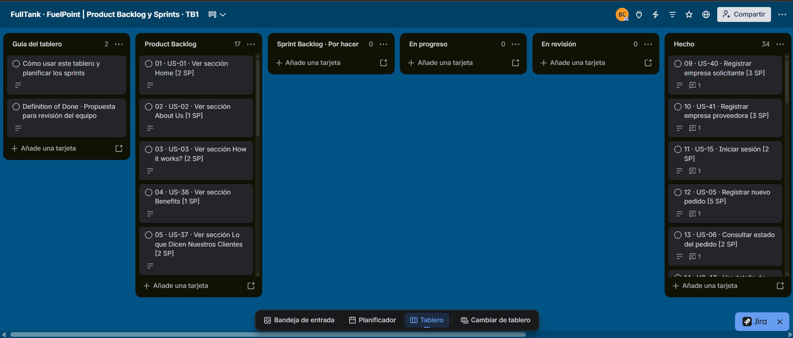
  <p><em>Figura: Captura del tablero FullTank · FuelPoint, escenario hipotético de cumplimiento del plan TB1, 8 de octubre de 2026.</em></p>
</div>

La captura proporcionada muestra la proyección del tablero si se cumple el plan de integración del frontend para TB1: **34 historias (87 Story Points) en Hecho** y **17 historias (35 Story Points) en Product Backlog**. Las tarjetas trasladadas a Hecho incluyen una nota de «HECHO HIPOTÉTICO TB1 · Sprint 2» y consideran el uso de mocks/adaptadores demo. Este estado representa planificación y no acredita ejecución real, aprobación de Pull Requests ni despliegue del backend; el cierre real requiere verificar los criterios de aceptación y adjuntar las evidencias correspondientes.

Las 17 historias pendientes corresponden a 10 historias de Landing Page, recuperación de contraseña (US-16), descarga de reportes PDF (US-35) y cinco endpoints (TS-01 a TS-05). La lista de documentación conserva ocho pendientes que no forman parte de los Story Points del producto y no aparecen en el encuadre de esta captura.

El tablero de esta captura contiene **51 historias**, mientras que la tabla documental siguiente incluye **73**. Las 22 historias técnicas adicionales de la tabla aún requieren incorporarse al tablero; los conteos de la captura se refieren exclusivamente a sus 51 tarjetas de producto.

### Tabla de Control del Product Backlog

| # Orden | User Story Id | Título | Descripción | Story Points (1 / 2 / 3 / 5 / 8) |
|:---:|:---:|---|---|:---:|
| **01** | US-01 | Ver sección Home | Como visitante (proveedor), quiero ver una sección de inicio que resuma el valor de FullTank para comprender rápidamente el objetivo del sistema. | 2 |
| **02** | US-02 | Ver sección About Us | Como visitante de ambos segmentos, quiero conocer quiénes están detrás de FullTank para confiar en el sistema. | 1 |
| **03** | US-03 | Ver sección How it works? | Como visitante de ambos segmentos, quiero entender cómo funciona FullTank paso a paso para evaluar si se ajusta a mis necesidades. | 2 |
| **04** | US-36 | Ver sección Benefits | Como visitante de ambos segmentos, quiero conocer las principales ventajas para evaluar la implementación de la plataforma. | 1 |
| **05** | US-37 | Ver sección Lo que Dicen Nuestros Clientes | Como visitante de ambos segmentos, quiero conocer los testimonios de usuarios de FullTank para tener confianza en la plataforma. | 2 |
| **06** | US-38 | Ver sección Planes y Precios | Como visitante de ambos segmentos, quiero saber qué planes se adecuan a mis necesidades para poder iniciar un proceso de registro. | 3 |
| **07** | US-39 | Cambiar idioma | Como visitante de ambos segmentos, quiero poder cambiar entre inglés y español para entender la plataforma en mi idioma preferido. | 3 |
| **08** | US-04 | Enviar mensaje de contacto | Como visitante de ambos segmentos, quiero enviar un mensaje desde Contact Us para solicitar más información. | 3 |
| **09** | US-40 | Registrar empresa solicitante | Como visitante (solicitante), quiero registrar mi empresa en la plataforma para comenzar a realizar pedidos de combustible. | 3 |
| **10** | US-41 | Registrar empresa proveedora | Como visitante (proveedor), quiero registrar mi empresa distribuidora en la plataforma para comenzar a gestionar pedidos de combustible. | 3 |
| **11** | US-15 | Iniciar sesión | Como usuario registrado, quiero iniciar sesión con correo y contraseña para acceder a mi cuenta. | 2 |
| **12** | US-05 | Registrar nuevo pedido | Como solicitante, quiero registrar un pedido con tipo y cantidad de combustible para que el proveedor lo procese. | 5 |
| **13** | US-06 | Consultar estado del pedido | Como solicitante, quiero ver el estado de mis pedidos para saber si están aprobados, en tránsito o entregados. | 2 |
| **14** | US-43 | Ver detalle de pedido | Como usuario de ambos segmentos, quiero ver el detalle completo de un pedido para revisar toda la información asociada. | 2 |
| **15** | US-10 | Ver pedidos pendientes | Como proveedor, quiero ver todos los pedidos pendientes para analizarlos y tomar acción. | 2 |
| **16** | US-08 | Registrar información de pago | Como solicitante, quiero ingresar la información de los pagos correspondientes para validar el pedido ante el proveedor. | 3 |
| **17** | US-11 | Aprobar pedido | Como proveedor, quiero aprobar pedidos según los depósitos hechos a mis cuentas bancarias. | 3 |
| **18** | US-42 | Rechazar pedido | Como proveedor, quiero rechazar un pedido cuando no pueda atenderlo para notificar al solicitante oportunamente. | 2 |
| **19** | US-46 | Gestionar inventario de combustibles | Como proveedor, quiero registrar, editar y eliminar los productos de combustible de mi catálogo para que estén disponibles como opciones al crear un pedido. | 3 |
| **20** | US-44 | Gestionar vehículos de flota | Como proveedor, quiero registrar y administrar los vehículos de mi flota para tenerlos disponibles al asignarlos a pedidos. | 3 |
| **21** | US-45 | Gestionar conductores | Como proveedor, quiero registrar y administrar los conductores de mi empresa para asignarlos correctamente a los despachos. | 3 |
| **22** | US-49 | Asignar recursos a despacho | Como proveedor, quiero asignar un vehículo y un conductor a un pedido aprobado en una sola operación para agilizar la preparación del despacho. | 5 |
| **23** | US-22 | Validar disponibilidad de transporte | Como proveedor, quiero saber qué vehículos están disponibles antes de asignarlos para vincularlos correctamente. | 5 |
| **24** | US-12 | Marcar pedido como despachado | Como proveedor, quiero marcar cuándo un pedido sale a entrega para notificar al cliente. | 2 |
| **25** | US-07 | Confirmar recepción de pedido | Como solicitante, quiero confirmar que recibí el pedido para que el proveedor lo cierre. | 2 |
| **26** | US-13 | Cerrar pedido | Como proveedor, quiero cerrar el pedido cuando el cliente confirme la entrega para finalizar el proceso. | 2 |
| **27** | US-29 | Recibir notificación de aprobación | Como solicitante, quiero recibir una notificación cuando un pedido sea aprobado o rechazado para estar informado. | 2 |
| **28** | US-30 | Notificación de pedido despachado | Como solicitante, quiero recibir una notificación cuando un pedido haya sido despachado para estar informado. | 2 |
| **29** | US-18 | Ver resumen de pedidos (Solicitante) | Como solicitante, quiero ver un resumen de mis pedidos para identificar cuántos están en proceso o completados. | 3 |
| **30** | US-47 | Ver Dashboard principal del proveedor | Como proveedor, quiero acceder a un panel principal con KPIs de operación y un gráfico de tendencia de ventas para tener visibilidad en tiempo real del estado de mi negocio. | 3 |
| **31** | US-27 | Buscar pedido por código | Como usuario de ambos segmentos, quiero buscar un pedido específico por su código para encontrarlo rápidamente. | 2 |
| **32** | US-28 | Filtrar pedidos por estado | Como usuario de ambos segmentos, quiero filtrar mis pedidos por estado para facilitar la revisión. | 2 |
| **33** | US-31 | Ver listado de empresas | Como proveedor, quiero ver una lista de empresas solicitantes para identificar a mis clientes frecuentes. | 2 |
| **34** | US-32 | Ver detalles de empresa | Como proveedor, quiero ver información detallada de una empresa solicitante para analizar su historial de pedidos. | 2 |
| **35** | US-09 | Ver historial de pedidos | Como solicitante, quiero ver mis pedidos anteriores para tener control sobre mi consumo. | 2 |
| **36** | US-33 | Ver gráfico de consumo (Solicitante) | Como solicitante, quiero ver un gráfico de mi consumo mensual para tener control sobre el uso del combustible. | 3 |
| **37** | US-34 | Ver gráfico de ventas (Proveedor) | Como proveedor, quiero ver un gráfico de ventas por mes para monitorear el rendimiento del negocio. | 3 |
| **38** | US-48 | Ver distribución de ventas por sector | Como proveedor, quiero ver la distribución de mis ventas por sector industrial para identificar cuáles son mis clientes más relevantes por rubro. | 2 |
| **39** | US-14 | Generar reporte de ventas | Como proveedor, quiero generar reportes de ventas para tener registro de operaciones realizadas. | 3 |
| **40** | US-35 | Descargar reporte PDF | Como usuario de ambos segmentos, quiero descargar un resumen de pedidos o ventas en formato PDF para archivarlo o compartirlo. | 3 |
| **41** | US-23 | Ver perfil de usuario | Como usuario registrado, quiero ver mis datos de perfil para revisar mi información registrada. | 1 |
| **42** | US-24 | Editar datos de perfil | Como usuario registrado, quiero editar mis datos para mantener mi información actualizada. | 2 |
| **43** | US-25 | Ver sección de preguntas frecuentes | Como visitante de ambos segmentos, quiero acceder a una sección de preguntas frecuentes para resolver dudas rápidamente. | 2 |
| **44** | US-26 | Acceder a información de contacto rápido | Como usuario de ambos segmentos, quiero ver datos de contacto directo (teléfono o correo) para hacer consultas urgentes. | 1 |
| **45** | US-16 | Recuperar contraseña | Como usuario registrado, quiero recuperar mi contraseña para volver a acceder si la olvidé. | 2 |
| **46** | US-17 | Cerrar sesión | Como usuario registrado, quiero poder cerrar sesión para mantener segura mi cuenta. | 1 |
| **47** | TS-01 | Endpoint: Login | Como developer, quiero un endpoint para autenticar usuarios. | 2 |
| **48** | TS-02 | Endpoint: Recuperar contraseña | Como developer, quiero un endpoint que permita enviar correo de recuperación. | 2 |
| **49** | TS-03 | Endpoint: Logout | Como developer, quiero un endpoint para cerrar sesión. | 1 |
| **50** | TS-04 | Endpoint: Crear pedido | Como developer, quiero un endpoint para registrar un nuevo pedido de combustible. | 3 |
| **51** | TS-05 | Endpoint: Consultar pedidos por usuario | Como developer, quiero un endpoint para obtener todos los pedidos de un usuario. | 2 |
| **52** | TS-13 | Endpoint: Consultar pedidos | Como developer, quiero los endpoints para listar pedidos, filtrarlos por empresa y consultarlos por su identificador. | 2 |
| **53** | TS-14 | Endpoint: Confirmar o cancelar pedido | Como developer, quiero los endpoints para confirmar la recepción o cancelar un pedido de combustible. | 2 |
| **54** | TS-06 | Endpoint: Registrar usuario | Como developer, quiero un endpoint para registrar nuevos usuarios con su rol de solicitante o proveedor. | 3 |
| **55** | TS-07 | Endpoint: Consultar usuarios | Como developer, quiero los endpoints para listar los usuarios registrados y consultar uno por su identificador. | 2 |
| **56** | TS-08 | Endpoint: Gestionar empresas solicitantes | Como developer, quiero los endpoints para registrar, listar, consultar y actualizar empresas solicitantes. | 3 |
| **57** | TS-09 | Endpoint: Gestionar empresas proveedoras | Como developer, quiero los endpoints para registrar, listar, consultar y actualizar empresas proveedoras. | 3 |
| **58** | TS-10 | Endpoint: Actualizar perfil de usuario | Como developer, quiero un endpoint para que un usuario autenticado actualice los datos de su propio perfil. | 2 |
| **59** | TS-11 | Endpoint: Gestionar productos de combustible | Como developer, quiero los endpoints para crear, listar, consultar, actualizar y eliminar productos de combustible. | 3 |
| **60** | TS-12 | Endpoint: Actualizar stock de producto | Como developer, quiero un endpoint para actualizar el stock disponible de un producto de combustible. | 2 |
| **61** | TS-15 | Endpoint: Gestionar solicitudes de combustible | Como developer, quiero los endpoints para crear, listar, aceptar y rechazar solicitudes de combustible. | 3 |
| **62** | TS-16 | Endpoint: Consultar solicitud por identificador | Como developer, quiero un endpoint para consultar el detalle de una solicitud específica. | 2 |
| **63** | TS-17 | Endpoint: Gestionar entregas | Como developer, quiero los endpoints para crear, despachar, completar, marcar como fallida y consultar entregas. | 3 |
| **64** | TS-18 | Endpoint: Gestionar conductores | Como developer, quiero los endpoints para registrar, consultar, actualizar y eliminar conductores. | 3 |
| **65** | TS-19 | Endpoint: Gestionar vehículos | Como developer, quiero los endpoints para registrar, consultar, actualizar y eliminar vehículos cisterna. | 3 |
| **66** | TS-20 | Endpoint: Registrar y validar pagos | Como developer, quiero los endpoints para registrar un pago con comprobante y para que el proveedor lo apruebe u observe. | 3 |
| **67** | TS-21 | Endpoint: Consultar pagos | Como developer, quiero un endpoint para consultar pagos por pedido, empresa o estado. | 2 |
| **68** | TS-22 | Endpoint: Calificar proveedores | Como developer, quiero los endpoints para crear, listar y actualizar calificaciones de proveedores. | 2 |
| **69** | TS-23 | Endpoint: Gestionar equipos | Como developer, quiero los endpoints para registrar, actualizar, listar y consultar los equipos de un solicitante. | 3 |
| **70** | TS-24 | Endpoint: Asignar proveedor favorito | Como developer, quiero un endpoint para asignar un proveedor favorito a un equipo. | 2 |
| **71** | TS-25 | Endpoint: Eliminar equipo | Como developer, quiero un endpoint para eliminar un equipo registrado sin pedidos en curso. | 1 |
| **72** | TS-26 | Endpoint: Gestionar notificaciones | Como developer, quiero los endpoints para crear notificaciones ante cambios de estado, consultarlas y marcarlas como leídas. | 2 |
| **73** | TS-27 | Endpoint: Reportes y analítica | Como developer, quiero los endpoints para obtener indicadores de consumo y ventas y exportarlos en formato PDF. | 3 |

---

# Capítulo IV: Product Design

## 4.1 Style Guidelines
En esta sección se presentan las directrices de diseño y estilo para FullTank, plataforma desarrollada por la startup FuelPoint orientada a la gestión y abastecimiento eficiente de combustible en sectores industriales.

### 4.1.1 General Style Guidelines
En esta sección se establecen las bases visuales y comunicativas que garantizan coherencia, usabilidad y solidez técnica en todos los puntos de contacto con el usuario. Las decisiones adoptadas se fundamentan en los principios de Material Design, adaptados a la dinámica operativa B2B del rubro de energía y transporte.

**Branding**

La identidad corporativa de FullTank simboliza precisión, trazabilidad y control de recursos críticos:

- **Concepto:** El imagotipo de FullTank fusiona la silueta de una gota de combustible con barras métricas de medición ascendente y un indicador de validación. Esta conjunción representa el abastecimiento garantizado, la supervisión de volumen en tiempo real y la confiabilidad transaccional entre empresas solicitantes y proveedoras.
- **Identidad Visual:** Se emplean trazos geométricos definidos y formas limpias que transmiten robustez técnica e institucionalidad, proyectando solidez ante gerencias de operaciones, transporte y logística.

**Typography**

Para toda la plataforma se ha seleccionado la familia tipográfica **Inter** (sans-serif), reconocida por su alta legibilidad y rendimiento en pantallas de alta y media densidad:

- **Sustento:** Las interfaces de gestión logística concentran dashboards densos, métricas volumétricas y tablas de despacho en tiempo real. Inter optimiza la lectura rápida y previene la fatiga visual de operadores en planta o centro de control.
- **Jerarquía Tipográfica:**
  - **Headlines (Inter Bold / Semibold - 600 a 700):** Destinado a títulos de vistas principales, encabezados de secciones y métricas destacadas (KPIs).
  - **Body Text (Inter Regular - 400):** Empleado en párrafos descriptivos, registros tabulares, documentación y textos informativos generales.
  - **Labels y Metadatos (Inter Medium - 500):** Utilizado en etiquetas de campos de formulario, estados de orden, badges de alerta y leyendas de navegación, facilitando una rápida diferenciación estructural.

**Colors**

La paleta cromática de FullTank balancea seriedad institucional, contraste ergonómico y semántica visual del sector energético:

- **Primary (#1E3A8A):** Azul marino profundo que proyecta seguridad, formalidad y solvencia técnica. Es el tono predominante en barras de navegación, encabezados y botones de confirmación principal.
- **Secondary (#6D7698):** Tono pizarra neutro que aporta equilibrio cromático, aplicado en componentes de soporte, bordes delimitadores y fondos secundarios.
- **Accent / Energy (#F59E0B):** Tono ámbar que evoca energía y combustible. Se reserva para llamados a la acción destacados (Call to Action), indicadores de advertencia y estados en tránsito que requieren foco visual.
- **Surface & Backgrounds (#F8FAFC / #FFFFFF):** Fondos claros de alta luminosidad que aportan pulcritud y reducen la saturación visual.
- **Neutral Text (#0F172A y #475569):** Tonos oscuros para textos principales y secundarios, asegurando cumplimiento estricto con los ratios de contraste WCAG 2.1 AA.
- **Semantic Colors:** Verde (#10B981) para estados completados o aprobados, ámbar (#F59E0B) para pedidos en proceso o pendientes, y rojo (#EF4444) para cancelaciones, rechazos o alertas críticas.

**Spacing**

Se implementa un sistema de espaciado basado en una unidad modular de **8dp (8px)**, en concordancia con los principios de Material Design:

- **Escala Modular:** Márgenes, separadores, rellenos internos (padding) y alturas de componentes se configuran en múltiplos de 8 (8px, 16px, 24px, 32px, 48px).
- **Justificación:** Proporciona ritmo vertical y horizontal predecible, permitiendo que la interfaz distribuya armónicamente la información y reduzca la carga mental de los supervisores durante jornadas operativas continuas.

**Tone of Voice and Language**

La comunicación de FullTank se orienta a interacciones formales entre empresas (B2B):

- **Serio y Formal:** Lenguaje sobrio y profesional que refleja la relevancia económica del suministro continuo de combustible.
- **Técnico y Preciso:** Empleo exacto de unidades métricas, especificaciones de combustible y estados operativos sin ambigüedades.
- **Respetuoso y Orientado a la Solución:** Mensajes del sistema claros que indican las causas de incidencias (como validaciones de pago observadas) y ofrecen alternativas inmediatas para su resolución.
- **Soporte de Idiomas:** Idioma predeterminado en inglés (`en-US`) para proyección internacional del software, con soporte y disponibilidad completa para español de Latinoamérica (`es-419`).

---

### 4.1.2 Web Style Guidelines
En esta sección se definen los lineamientos técnicos de interacción, adaptabilidad y uso de componentes para la plataforma web de FullTank, cubriendo tanto la Landing Page como la aplicación web de gestión.

**1. Grid and Breakpoints**

La disposición de los elementos adopta un sistema de rejilla responsiva fluida:

- **Desktop (>= 1200px):** Cuadrícula de 12 columnas con márgenes exteriores de 24dp y canales internos (gutters) de 16dp, idónea para visualización de múltiples paneles de telemetría y tablas extensas de pedidos.
- **Tablet (600px a 1199px):** Cuadrícula de 8 columnas con márgenes de 16dp, reorganizando paneles secundarios y tablas con desplazamiento horizontal asistido.
- **Mobile (360px a 599px):** Cuadrícula de 4 columnas con márgenes de 16dp. Los elementos se apilan verticalmente para optimizar la interacción táctil en campo mediante scroll natural.

**2. UI Components (PrimeVue con Material Design)**

La aplicación web se construye sobre el framework Vue 3 utilizando la biblioteca de componentes **PrimeVue**, estilizada bajo principios de Material Design:

- **Botones (PrimeVue `Button`):** Diferenciación clara entre acciones primarias mediante botones elevados (`p-button-raised`) con elevación sutil, acciones de cancelación o retorno mediante botones delineados (`p-button-outlined`), y comandos contextuales con botones planos (`p-button-text`).
- **Campos de Entrada (PrimeVue `InputText`, `Dropdown`, `InputNumber`):** Diseñados con borde continuo (outline) y etiquetas flotantes (`FloatLabel`) que conservan la referencia visual del campo al escribir. Incluyen validación reactiva y soporte nativo de accesibilidad.
- **Tarjetas y Contenedores (PrimeVue `Card`):** Segmentan la información en bloques modulares con elevación suave de 1dp a 2dp, organizando pedidos, resúmenes financieros y detalles de flota.
- **Tablas de Datos (PrimeVue `DataTable`):** Presentación de datos densos con paginación dinámica, filtrado columnar reactivo y soporte de selección por fila para operaciones logísticas por lote.
- **Retroalimentación Asíncrona (PrimeVue `Toast`, `ProgressSpinner`, `Skeleton`):** Notificaciones contextuales flotantes para confirmaciones o alertas, junto con marcadores de posición tipo skeleton durante la carga de datos del backend.

**3. Interaction States and Feedback**

Para garantizar una retroalimentación predecible ante cualquier acción:

- **Hover:** En entornos de escritorio, los elementos interactivos responden con una transición de color de 150ms y un ligero incremento de elevación, señalando disponibilidad de click.
- **Focus / Active:** Todo control enfocado vía teclado exhibe un anillo de enfoque de alto contraste (`outline: 2px solid #1E3A8A; outline-offset: 2px`), cumpliendo con los criterios de accesibilidad para navegación sin puntero.
- **Disabled:** Controles no disponibles se muestran con opacidad al 50% y cursor de bloqueo (`cursor: not-allowed`), suprimiendo eventos de clic.
- **Accesibilidad ARIA:** Todos los componentes interactivos incorporan atributos semánticos (`aria-label`, `aria-expanded`, `role`) para compatibilidad completa con lectores de pantalla.

**4. Responsive Navigation**

- **Desktop:** Barra lateral de navegación (Sidebar colapsable) fija en el lateral izquierdo que concede acceso rápido a los módulos principales de la plataforma: Dashboard, Orders, Inventory, Fleet, Reports y Settings.
- **Mobile:** La barra lateral se contrae en un menú tipo hamburguesa accesible desde la barra superior, complementándose con una barra de navegación inferior para acciones críticas en terreno.

---

## 4.2 Information Architecture
En esta sección se detalla la arquitectura de información de FullTank, estructurando la forma en que los usuarios organizan, etiquetan, buscan y navegan el contenido de la solución.

### 4.2.1 Organization Systems
FullTank estructura sus contenidos para responder eficazmente a las necesidades de abastecimiento de combustible entre solicitantes y proveedores industriales.

**Organización Visual del Contenido**

- **Jerárquica (Visual Hierarchy):** En el dashboard y vistas de gestión se prioriza visualmente la información de mayor urgencia: balance de combustible, órdenes activas y botones primarios de acción (por ejemplo, "Crear Solicitud" o "Asignar Cisterna"), ubicando gráficos de tendencia y tablas detalladas en niveles inferiores.
- **Secuencial (Step-by-Step):** Los procesos críticos que requieren validación rigurosa se dividen en etapas secuenciales. La creación de un pedido de combustible guía al solicitante a través de selección de producto, especificación de volumen, carga de comprobante de pago y confirmación final, minimizando omisiones o errores de digitación.

**Esquemas de Categorización de Contenido**

- **Por Audiencia (Roles de Usuario):**
  - **Empresas Solicitantes (Clientes):** Tienen acceso directo al catálogo de combustibles, registro y consulta de pedidos, gestión de sus equipos receptores (vehículos, generadores, depósitos), carga de pagos y reportes de consumo.
  - **Empresas Proveedoras:** Gestionan el inventario de combustibles disponible, la revisión y validación de pagos, la asignación de cisternas y conductores, el despacho de pedidos y la emisión de reportes comerciales.
- **Por Tópicos Funcionales:** El contenido se agrupa en módulos cohesivos claramente diferenciados:
  - Gestión de Pedidos y Solicitudes
  - Gestión de Inventario y Precios
  - Logística, Flota y Despacho
  - Facturación y Validación de Pagos
  - Reportes y Analítica
  - Configuración y Perfil de Usuario

**Implementación en la Interfaz**

La estructura se traduce en una aplicación web modular en Vue 3, con enrutamiento dinámico mediante Vue Router y estado centralizado a través de Pinia. Cada vista adapta sus controles según el rol del usuario autenticado, asegurando que cada perfil interactúe exclusivamente con sus herramientas de trabajo.

---

### 4.2.2 Labeling Systems
El sistema de etiquetado utiliza terminología concisa y estandarizada en inglés como idioma base, complementado con su correspondencia exacta en español (`es-419`) para evitar ambigüedades operativas.

**1. Landing Page Labels**

- **Home (Inicio):** Vista principal y resumen de la propuesta de valor de FullTank.
- **How It Works (Cómo funciona):** Flujo descriptivo del servicio de intermediación y control de combustible.
- **Features (Características):** Funcionalidades clave de trazabilidad, control de flota y analítica.
- **Pricing (Planes y tarifas):** Esquema de suscripciones del servicio SaaS.
- **About Us (Sobre nosotros):** Misión, visión e identidad de la startup FuelPoint.
- **Contact (Contacto):** Canales de atención institucional y consultas comerciales.
- **Sign In / Request a Demo (Iniciar sesión / Solicitar demo):** Accesos a la aplicación y contacto comercial.

**2. Web Application Labels (Navegación y Módulos)**

- **Dashboard:** Panel de control principal con indicadores clave de desempeño (KPIs).
- **Orders:** Módulo de solicitudes activas, historial de transacciones y estados de pedido.
- **Inventory:** Módulo de control de existencias, capacidad de almacenamiento y precio por litro.
- **Fleet:** Gestión de vehículos de transporte (cisternas) y conductores asignados.
- **Equipment:** Registro y monitoreo de maquinaria, tanques receptores y generadores del cliente.
- **Reports:** Centro de analítica, gráficos de consumo y descarga de reportes documentales.
- **Settings:** Preferencias de cuenta, seguridad de acceso y perfiles corporativos.

**3. Status Labels (Estados del Ciclo de Vida del Pedido)**

- **Pending:** Solicitud generada pendiente de confirmación de pago o revisión del proveedor.
- **Approved:** Comprobante de pago validado y orden aceptada por el proveedor.
- **In Transit:** Unidad de cisterna asignada y combustible en ruta hacia el punto de entrega.
- **Completed:** Despacho entregado a satisfacción y confirmado por la empresa solicitante.
- **Rejected:** Solicitud observada o rechazada por discrepancias de pago o disponibilidad.

---

### 4.2.3 SEO Tags and Meta Tags
Para la Landing Page se configuran metaetiquetas técnicas y de indexación dentro del encabezado HTML5, optimizando la visibilidad orgánica en motores de búsqueda y la presentación en redes corporativas.

**Metaetiquetas Técnicas y de Renderizado**

- `charset="utf-8"`: Garantiza la correcta codificación de caracteres en múltiples idiomas.
- `viewport="width=device-width, initial-scale=1.0"`: Asegura la adaptabilidad responsiva en cualquier dispositivo.
- `robots="index, follow"`: Instruye a los motores de búsqueda a indexar la página y seguir sus enlaces.

**Metaetiquetas SEO y de Redes Sociales**

- `title`: Título representativo de la solución para motores de búsqueda.
- `meta description`: Síntesis comercial orientada al ratio de clics (CTR).
- `meta keywords`: Términos de búsqueda clave vinculados a logística y combustible.
- `meta author`: Identificación del equipo de desarrollo FuelPoint.
- Etiquetas Open Graph (`og:title`, `og:description`, `og:type`) para previsualizaciones estructuradas.

**Estructura del Encabezado HTML (`<head>`):**

```html
<head>
  <meta charset="utf-8">
  <meta name="viewport" content="width=device-width, initial-scale=1.0">
  <meta name="robots" content="index, follow">

  <!-- SEO Primario -->
  <title>FullTank - Fuel Supply and Distribution Management</title>
  <meta name="description" content="FullTank by FuelPoint streamlines fuel purchasing, traceability and supply between industrial companies and authorized providers.">
  <meta name="keywords" content="FullTank, FuelPoint, fuel supply, B2B logistics, tanker fleet, order management, energy traceability">
  <meta name="author" content="FuelPoint Team">

  <!-- Open Graph / Redes Sociales -->
  <meta property="og:type" content="website">
  <meta property="og:title" content="FullTank - Smart Fuel Management">
  <meta property="og:description" content="Control, traceability and efficiency for industrial fuel distribution.">
  <meta property="og:locale" content="en_US">
  <meta property="og:locale:alternate" content="es_419">

  <!-- Tipografía Oficial -->
  <link rel="preconnect" href="https://fonts.googleapis.com">
  <link rel="preconnect" href="https://fonts.gstatic.com" crossorigin>
  <link href="https://fonts.googleapis.com/css2?family=Inter:wght@400;500;600;700&display=swap" rel="stylesheet">

  <!-- Hoja de estilos de la Landing Page -->
  <link rel="stylesheet" href="css/style.css">
</head>
```

**Metaetiquetas de la aplicación web:**

La SPA utiliza inglés como idioma predeterminado y actualiza el título y la descripción de cada vista mediante Vue Router. Las vistas autenticadas de operación no deben aparecer en resultados públicos, por lo que emplean `robots="noindex, nofollow"`; la pantalla pública de acceso conserva una descripción general del producto sin exponer información de usuarios ni operaciones.

```html
<head>
  <meta charset="utf-8">
  <meta name="viewport" content="width=device-width, initial-scale=1.0">
  <meta name="robots" content="noindex, nofollow">
  <title>Dashboard | FullTank</title>
  <meta name="description" content="Manage fuel orders, inventory, fleet and operational reports with FullTank.">
  <meta name="author" content="FuelPoint Team">
</head>
```

---

### 4.2.4 Searching Systems
El sistema de búsqueda y filtrado de FullTank permite localizar información crítica en segundos, reduciendo la sobrecarga cognitiva de operadores y administradores.

**Mecanismos de Búsqueda y Filtrado por Rol**

- **Empresas Solicitantes:**
  - Búsqueda directa por identificador alfanumérico de pedido (`Order ID`).
  - Filtrado multifactorial por estado de pedido: Pending, Approved, In Transit, Completed.
  - Filtrado temporal por rangos de fecha de solicitud o fecha estimada de entrega.
  - Filtrado por tipo de combustible requerido y por equipo receptor.
- **Empresas Proveedoras:**
  - Búsqueda por nombre de empresa cliente o número de documento de identidad tributaria (RUC).
  - Filtrado de solicitudes pendientes de revisión urgente.
  - Búsqueda y disponibilidad de unidades de cisterna por número de placa o capacidad de carga.
  - Búsqueda de conductores por nombre o documento de identidad y estado de asignación.

**Visualización y Retroalimentación de Resultados**

- Los resultados se presentan en tablas de datos reactivas con paginación asíncrona, indicando el número total de registros coincidentes.
- En caso de consultas sin correspondencia, se muestra un mensaje informativo contextual ("No se encontraron registros con los criterios seleccionados") con un comando directo para limpiar los filtros aplicados.
- Las tablas permiten ordenar de forma ascendente o descendente por columnas críticas como fecha, volumen y monto.

---

### 4.2.5 Navigation Systems
El sistema de navegación de FullTank proporciona recorridos coherentes, accesibles e intuitivos a lo largo de toda la experiencia de usuario.

- **Navegación Global:** Compuesta por la barra de navegación superior en la Landing Page y la barra lateral (Sidebar) en la aplicación web. Proporciona acceso constante a los módulos nucleares de la plataforma, adaptándose mediante menú tipo hamburguesa en pantallas móviles.
- **Navegación Contextual:** Enlaces internos, migas de pan (breadcrumbs) y botones de acción guiada que asisten al usuario según la tarea en curso (por ejemplo, desde el resumen de una solicitud hacia el registro detallado del comprobante de pago o la visualización del flete).
- **Navegación Secundaria:** Pestañas internas (Tabs) para alternar vistas dentro de un mismo módulo temático, como la división entre "Vehículos Cisterna" y "Conductores" dentro del módulo de Flota, o "Stock Vigente" y "Precios" dentro de Inventario.
- **Accesibilidad y Multiidioma:** Uso riguroso de roles semánticos HTML5 (`<nav role="navigation">`, `<main>`, `<aside>`), atajos de teclado para desplazamiento entre módulos principales y persistencia de preferencia de idioma entre inglés (`en-US`) y español (`es-419`).

---

## 4.3 Landing Page UI Design

### 4.3.1 Landing Page Wireframe

En esta sección se presentan los esquemas estructurales (wireframes) de baja fidelidad para la Landing Page de *Full-Tank*, diseñados en Figma. Estos diagramas establecen la jerarquía visual, la distribución de contenido y el comportamiento responsivo antes de aplicar el estilo visual final, asegurando que la interfaz cumpla con nuestros objetivos de negocio.

**Desktop Web Browser Wireframe**
<div align="center">
  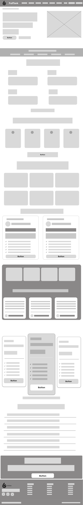
</div>

* **Header (Navegación):** Se utiliza una organización horizontal fija con el logotipo a la izquierda, los enlaces de navegación centralizados (*Home, How it works, Benefits, Pricing, Testimonials, Contact) y el botón principal de *Call to Action (*"Request a Demo"*) resaltado a la derecha para incentivar la conversión inmediata.
* **Hero Section (Home):** Ocupa la primera vista con un título de propuesta de valor centrado, un subtítulo descriptivo y un botón primario de "Request a Demo", acompañado de un placeholder (caja gris) para una imagen representativa del dashboard de Full-Tank a la derecha.
* **Body Sections:**
  * **How it works:** Se organiza secuencialmente en 3 o 4 columnas, mostrando los pasos del flujo operativo.
  * **Benefits & Testimonials:** Se estructuran de forma matricial para facilitar la lectura de características clave y generar confianza al mostrar los casos de éxito de otras empresas.
  * **Pricing:** Presentado mediante tablas comparativas para destacar claramente los planes de suscripción.
* **Footer:** Contiene los enlaces legales obligatorios (Términos y Condiciones), información de contacto y enlaces a redes sociales, cumpliendo con la ética y responsabilidad exigida en el proyecto.

### 4.3.2 Landing Page Mock-up

**Hero de nuestra landing:** El hero de nuestra plataforma FullTank presenta una grafica principal relacionada con la gestión eficiente de combustible en entornos industriales, transmitiendo control, tecnología y optimización. Incluye un título claro: "Leave the chaos. behind. Manage fuel like a pro". Una breve descripción resume la propuesta de valor, destacando la automatización del proceso de compra y distribución. Un botón de llamado a la acción "Comenzar ahora" invita a los usuarios a iniciar su experiencia. En la parte superior, una barra de navegación permite acceder fácilmente a todas las secciones, garantizando una experiencia fluida e intuitiva.

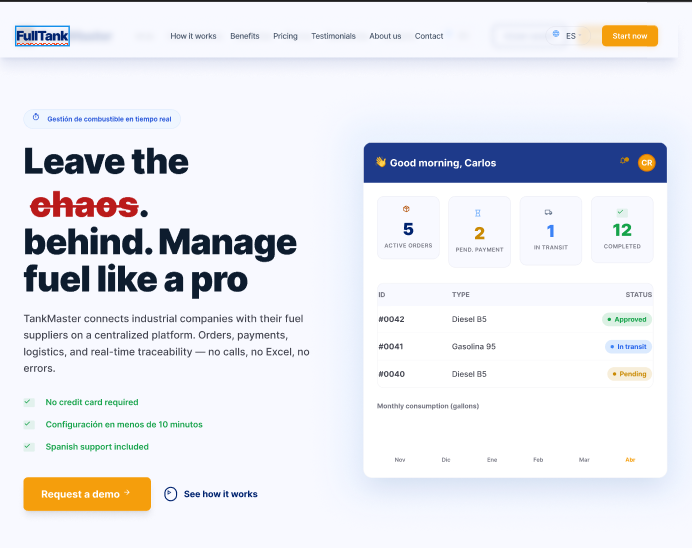


**Features:** La sección de "Features" muestra las funcionalidades clave de FullTank. El diseño sigue una forma de cards para la facil lectura

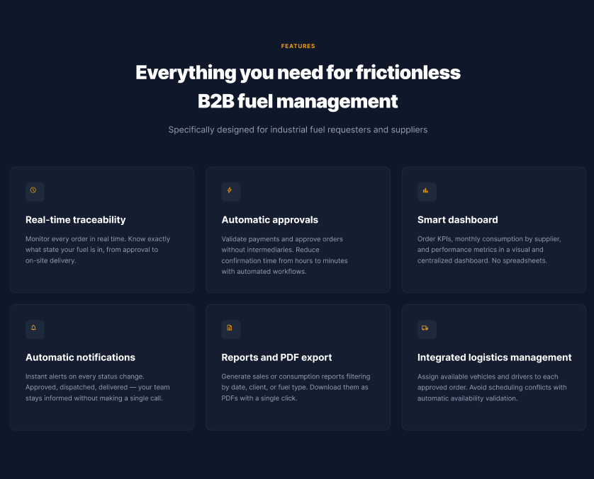

**About Us:** La sección "About Us" presenta a FuelPoint, la empresa detrás de FullTank. Aquí compartimos nuestra misión de digitalizar la gestión de combustible y nuestros valores de innovación, eficiencia y confiabilidad.
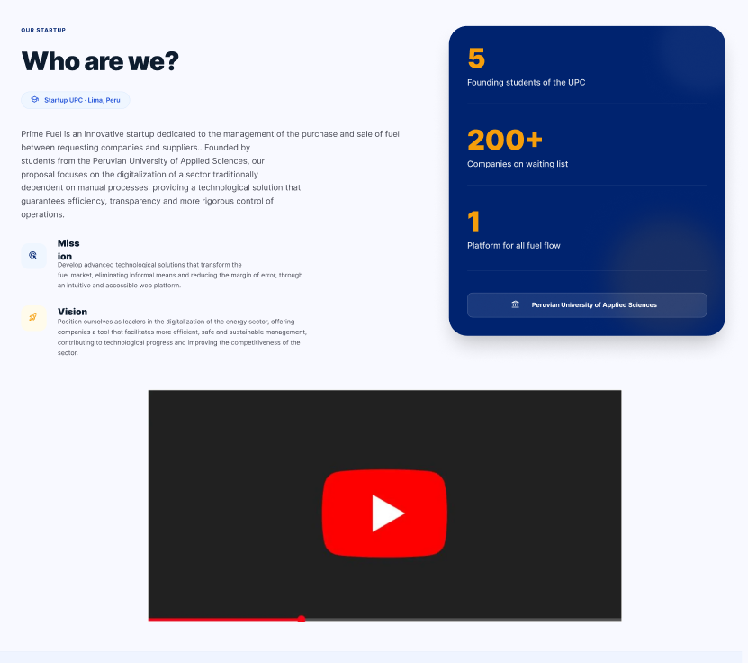

**Plans:** En la sección "Plans", detallamos los planes de suscripción disponibles. Las tarjetas incluyen opciones como "Plan Starter" y "Plan Pro", mostrando precios, características y beneficios. También se ofrece la opción de visualizar precios mensuales o anuales, facilitando la elección según las necesidades del cliente.

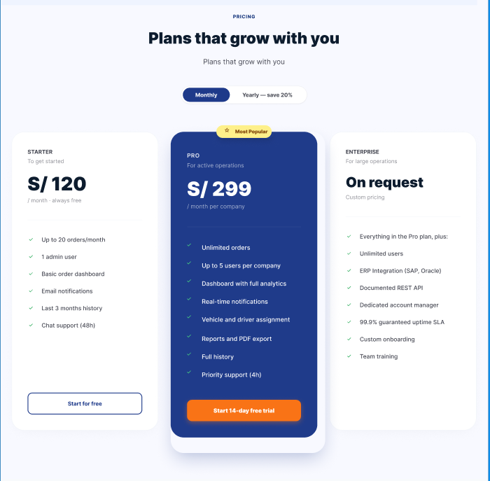

**Footer:** El Footer de la landing page contiene enlaces útiles y recursos adicionales.

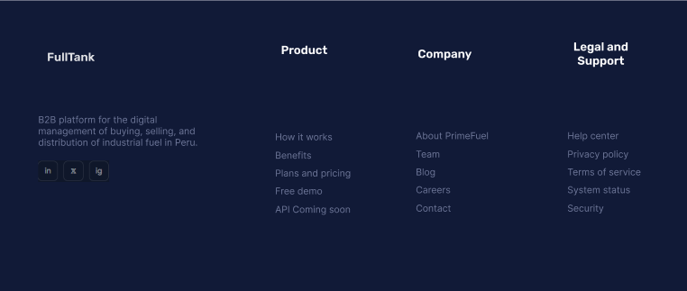
---

## 4.4 Web Applications UX/UI Design

Los wireframes y mockups aquí presentados muestran la estructura inicial de las vistas principales, priorizando la jerarquía visual, la simplicidad de navegación, la accesibilidad, la escalabilidad futura y la claridad en la presentación de información crítica como rutas, paraderos, notificaciones y configuraciones del usuario.


### 4.4.1 Web Applications Wireframes

Esta sección presenta la propuesta visual y funcional de las aplicaciones que integran la experiencia de FullTank, diseñada para optimizar la interacción entre proveedores y compradores de combustible.

**Wireframe 1 / Inicial**

El primer wireframe representa la Landing Page principal de FullTank, diseñada como una herramienta de conversión masiva para atraer tanto a empresas solicitantes como a proveedores.

En el cuerpo de la página, la información se desglosa siguiendo una secuencia lógica que construye confianza y educación sobre el servicio. Se incluyen secciones dedicadas a la historia de la startup (About Us) y al funcionamiento paso a paso del sistema (How it works), utilizando bloques modulares que permiten un escaneo rápido del contenido. Esta estructura se complementa con una cuadrícula de características que resaltan los beneficios técnicos, como la trazabilidad y la centralización de datos, fundamentales para resolver los dolores detectados en la etapa de investigación.

Hacia el final de la navegación, se presenta una sección de planes y suscripciones que utiliza el principio de jerarquía visual para destacar la opción más equilibrada, facilitando la toma de decisiones del usuario. El diseño concluye con un pie de página (footer) que centraliza los datos de contacto y redes sociales, asegurando que el usuario tenga siempre una vía de comunicación abierta con FuelPoint. Todo el conjunto ha sido diseñado bajo criterios de diseño inclusivo, empleando dimensiones de botones generosas y una organización de elementos que prioriza la legibilidad y la facilidad de interacción en dispositivos móviles.

<div align="center">
  
</div>

**Wireframe 2**

Este diseño presenta un layout de pantalla dividida (dos columnas). En el lado izquierdo, se observa el logotipo o texto de la marca ("Fulltank") en la esquina superior. En el centro geométrico de esta columna, hay un contenedor de inicio de sesión ("Login") que aloja dos campos de entrada de texto (representados por rectángulos gris claro) y un botón de acción primaria (rectángulo gris oscuro). El lado derecho está dominado por un gran marcador de posición gráfico (indicado por la equis).

<div align="center">
  
</div>

**Wireframe 3**

Mantiene la misma estructura de pantalla dividida y contenedor gráfico a la derecha. El contenedor izquierdo, titulado "Create corporate Account", expande el formulario a tres campos de entrada de texto horizontales y un botón de acción primaria inferior.

<div align="center">
  
</div>


**Wireframe 4**

Esta es la vista principal (Home) de la aplicación tras el inicio de sesión. Presenta un sistema de navegación lateral izquierdo (Sidebar) con enlaces a diferentes módulos. En el área principal, emplea un patrón de diseño tipo Dashboard con una jerarquía clara: tarjetas de indicadores clave de rendimiento (KPIs) en la parte superior, gráficos centrales (tendencia de consumo y niveles de tanques con barras de progreso) y una tabla de datos (Data Table) inferior para órdenes de logística activas.

<div align="center">
  
</div>

**Wireframe 5**

Vista dedicada a la gestión de solicitudes. Mantiene la barra lateral constante. Incorpora controles de búsqueda y acciones primarias en la esquina superior derecha. Utiliza tarjetas de resumen para el estado de las solicitudes (Totales, Pendientes, En tránsito, Completadas) y dedica la mayor parte del espacio a una tabla de datos extensa con opciones de ordenamiento (Sort), paginación y controles de acción por fila.

<div align="center">
  
</div>

**Wireframe 6**

Vista de reportería. Sigue la misma estructura base. Presenta KPIs financieros y de eficiencia en la parte superior. El centro visual es un gran gráfico de barras para visualizar las tendencias de consumo. En la parte inferior, una tabla de datos de "Gastos Recientes" que incluye un botón de filtrado explícito (Filter).

<div align="center">
  
</div>

**Wireframe 7**

Módulo de proveedores. Presenta un layout mixto. En la parte superior, integra un contenedor gráfico grande (posiblemente un mapa o imagen destacada) junto a una tarjeta de detalles del proveedor. Debajo, muestra tarjetas de información resumida con botones "View Details" (posiblemente para proveedores frecuentes), y finaliza con una tabla de datos paginada para listar a todos los proveedores recomendados.

<div align="center">
  
</div>

**Wireframe 8**

Vista del directorio de proveedores verificados. Mantiene la barra de navegación lateral y presenta dos tarjetas de indicadores (KPIs) en la parte superior ("Total Suppliers" y "Verified Coverage"). El contenido principal se organiza mediante una lista vertical de tarjetas, donde cada una representa a un proveedor, incluyendo un marcador para su logotipo, líneas de texto descriptivo, botones de acción rápida y una casilla de selección. Incluye controles de paginación en la parte inferior.


<div align="center">
  
</div>

**Wireframe 9**

Vista de detalles de seguimiento logístico o inspección. La pantalla presenta un layout complejo de paneles divisibles. En la columna izquierda, muestra tarjetas de resumen y un componente gráfico central destacado (probablemente un mapa de geolocalización o un visor de imágenes) con controles inferiores. En el panel derecho, se agrupa la información detallada del estado de la operación, barras de progreso y un botón de acción principal para gestionar el registro.

<div align="center">
  
</div>

**Wireframe 10**

Vista del formulario para la adición de nuevo equipamiento. Presenta un diseño limpio bajo el título "Add Equipment". El contenedor central organiza los campos de entrada de datos en un formato de dos columnas para optimizar el espacio en resoluciones de escritorio. Finaliza con un botón de acción primaria ("Save Equipment") alineado a la derecha en la parte inferior del formulario.

HTML
<div align="center">
  
</div>


**Wireframe 11**

Vista de detalles de una solicitud de combustible específica. Mantiene la barra de navegación lateral. En la cabecera, muestra el identificador de la orden junto a espacios para botones de acción secundarios. El área de contenido adopta un diseño de cuadrícula (grid) asimétrico dividido en dos columnas. La columna principal (izquierda) agrupa las especificaciones de la orden, un amplio contenedor gráfico (diseñado para un mapa interactivo de seguimiento o tracking) y un componente de línea de tiempo (Timeline) para detallar los estados logísticos. La columna lateral (derecha) exhibe el perfil del proveedor con una llamada a la acción ("Contact Provider"), seguido de secciones para notas, instrucciones y documentos adjuntos.

<div align="center">
  
</div>

**Wireframe 12**

Este wireframe muestra una pantalla de gestión de inventario, cuyo propósito es visualizar y controlar los productos disponibles, permitiendo revisar existencias y realizar acciones sobre cada ítem de forma organizada.

<div align="center">
  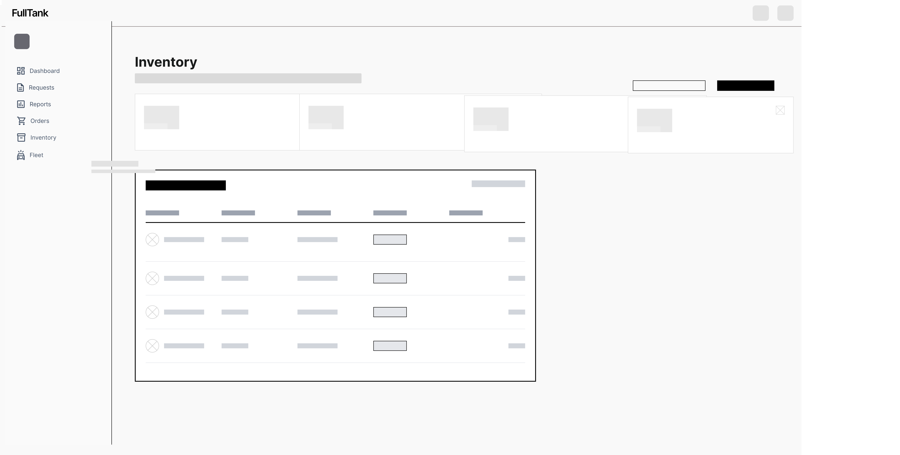
</div>

**Wireframe 13**

Este wireframe muestra una pantalla de gestión de órdenes, enfocada en visualizar, organizar y dar seguimiento a pedidos, combinando una tabla principal con detalles y un panel lateral para información o acciones rápidas.

<div align="center">
  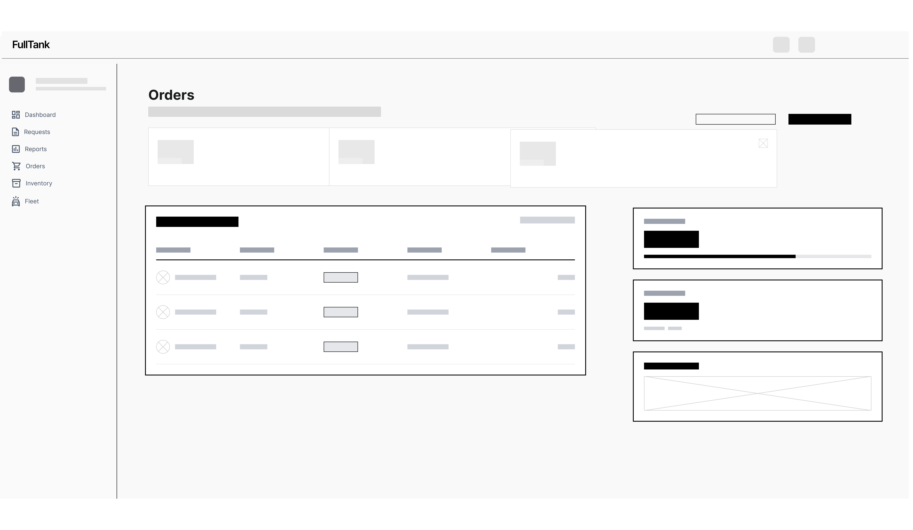
</div>

Este wireframe muestra una pantalla de detalle de una orden, cuyo propósito es visualizar toda la información específica de un pedido, incluyendo su estado, datos relacionados y posibles acciones, en una vista más completa y organizada.

**Wireframe 14**

<div align="center">
  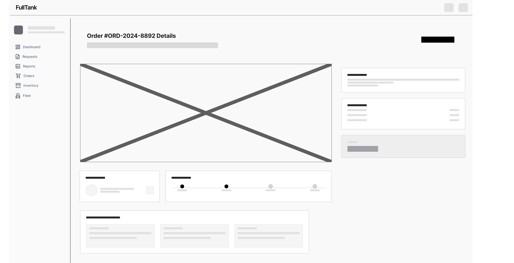
</div>

**Wireframe 15**

Este wireframe muestra una pantalla para gestionar solicitudes entrantes de proveedores, donde el usuario puede revisar y tomar acciones sobre pedidos de forma rápida, usando filtros y una tabla con las solicitudes

<div align="center">
  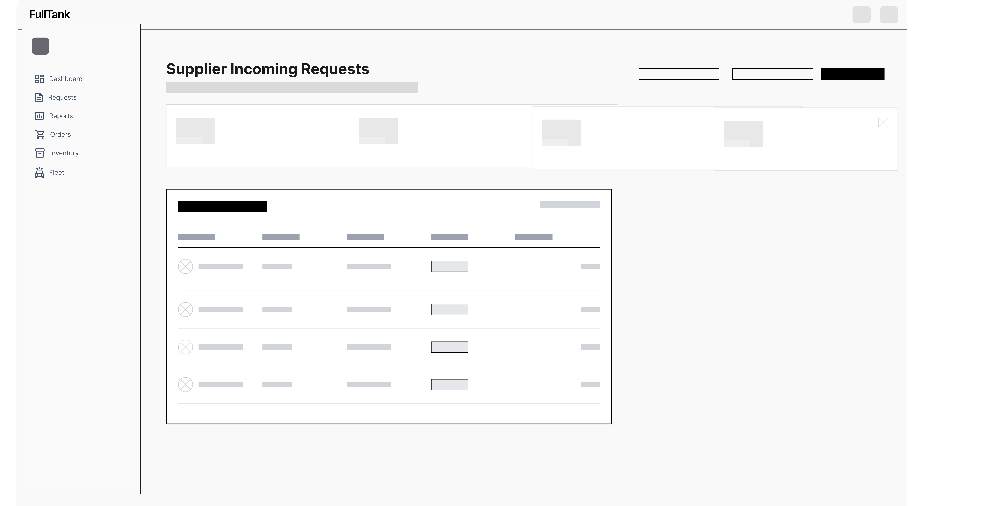
</div>

**Wireframe 16**

El wireframe representa un dashboard para la gestión operativa de una plataforma logística o de suministro de combustible, cuyo propósito es centralizar información clave para la toma de decisiones.

<div align="center">
  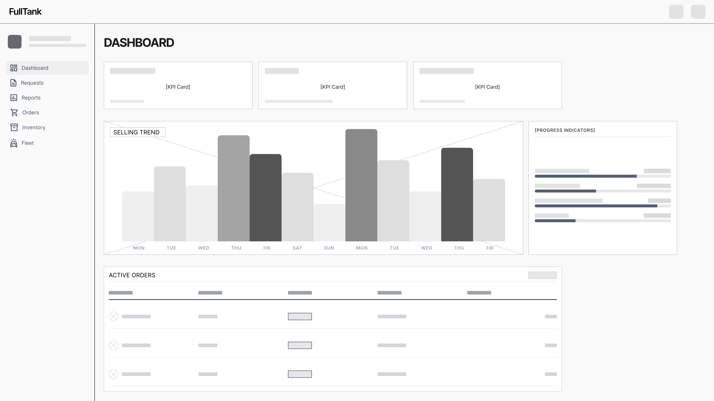
</div>

**Wireframe 17**

El wireframe representa una pantalla de la cuenta, donde puede verificar los datos de su cuenta, su seguridad y ver las notificaciones

<div align="center">
  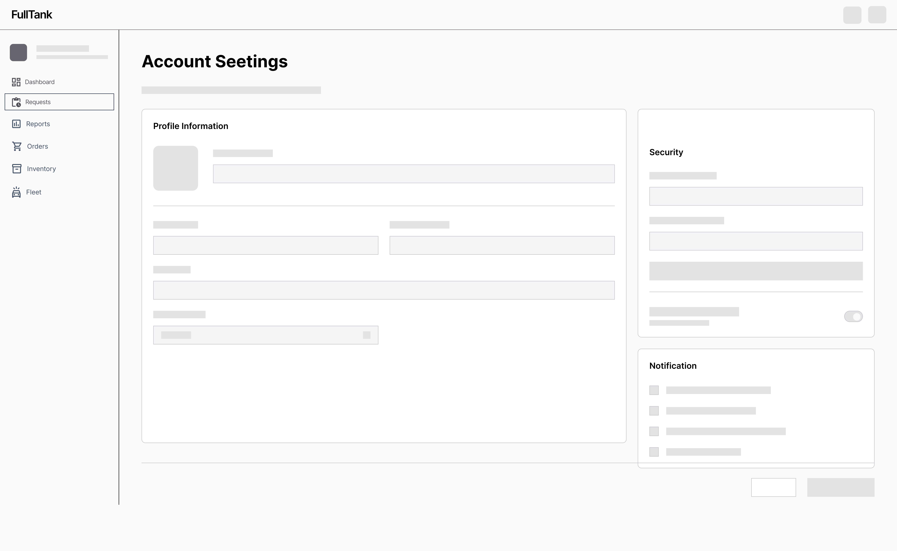
</div>

**Wireframe 18**

El wireframe representa una pantalla de fletes, donde se puede revisar el costo de los fletes y revisar que conductor será el más apropiado

<div align="center">
  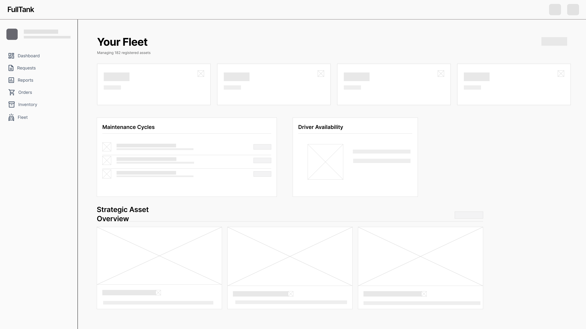
</div>

**Wireframe 19**

El wireframe representa una pantalla para gestionar reportes, donde se puede revisar las ventas que fueron concluidas y las ventas actuales. Por otra parte, existen los filtos para este tipo de imagenes que les sera útil ya que permite buscar la informacion más rápido.

<div align="center">
  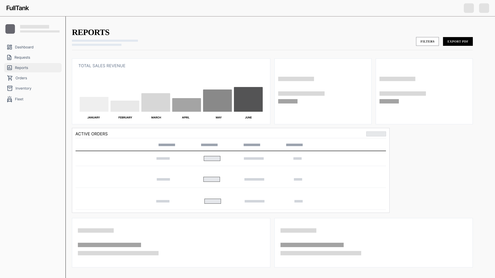
</div>

**Wireframe 20**

El wireframe representa una pantalla de gestion de reportes, aqui se pueden revisar las estadisticas de la empresa como la cantidad de clientes o las órdenes activas. Además, se puede revisar que sector está invirtiendo más en combustible

<div align="center">
  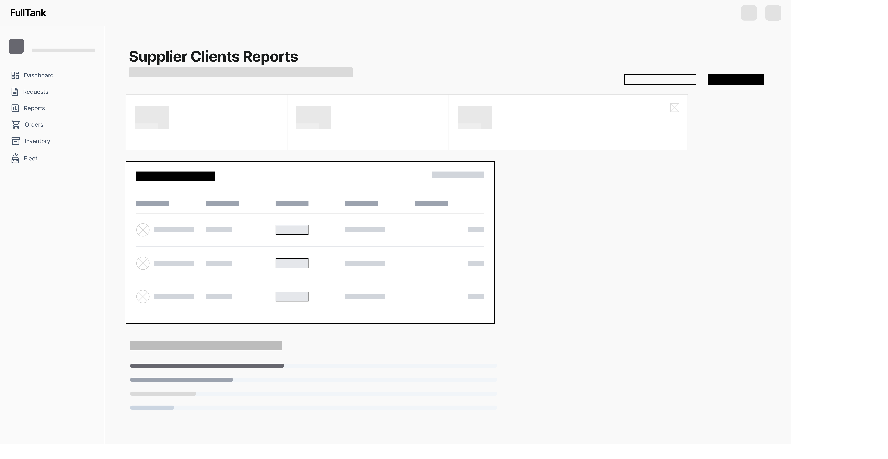
</div>


### **Mobile**
**Wireframe 1**

La adaptación móvil de la página principal prioriza la jerarquía vertical para asegurar una navegación fluida en pantallas pequeñas. La arquitectura de información reorganiza el menú en un componente de "hamburguesa" y transforma las tarjetas de planes y beneficios en una disposición de columna única. Los botones de llamado a la acción se han redimensionado para ocupar el ancho de la pantalla, facilitando la interacción táctil y guiando al usuario directamente hacia el registro o inicio de sesión.

<div align="center">
  
</div>

**Wireframe 2**

Los wireframes de Inicio de Sesión y Recuperación de Contraseña se han simplificado al máximo para evitar la fatiga visual. En la versión móvil, los campos de entrada de datos son los protagonistas absolutos, utilizando etiquetas claras y botones de gran escala. El diseño inclusivo se evidencia en el espaciado entre elementos, optimizado para evitar errores de pulsación y garantizar un acceso rápido incluso para operarios en entornos de alta movilidad.

<div align="center">
  
</div>

### Compradores

**Wireframe 3**

Este wireframe de Búsqueda de Proveedores organiza el directorio mediante un diseño de tarjetas verticales que facilita la comparación rápida de opciones en pantallas móviles.

<div align="center">
  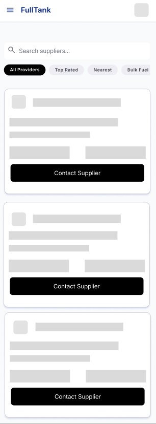
</div>

**Wireframe 4**

Este wireframe del Dashboard Operativo para Compradores organiza la información crítica en una estructura vertical de cuatro niveles para un monitoreo rápido. Su arquitectura de información prioriza métricas inmediatas como órdenes activas y balance de combustible, seguidas de un gráfico de consumo semanal y el estado detallado de los tanques de almacenamiento.

<div align="center">
  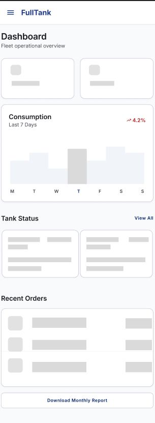
</div>

**Wireframe 5**

Este wireframe de Monitoreo de Equipos utiliza un diseño de tarjetas individuales para gestionar el estado de los tanques y unidades de combustible de forma independiente. Su arquitectura de información destaca visualmente el porcentaje de llenado mediante gráficos circulares, permitiendo una lectura rápida de la capacidad y la fecha del último reabastecimiento.

<div align="center">
  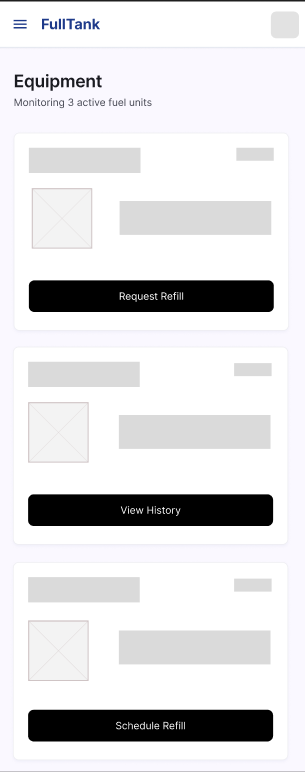
</div>

**Wireframe 6**

Este wireframe de Reportes y Analítica presenta una estructura de auditoría móvil centrada en la síntesis de datos logísticos complejos. Su arquitectura de información se divide en módulos que incluyen un selector de rango de fechas, un gráfico detallado de consumo de combustible y un desglose de gastos por sede, facilitando el control financiero.

<div align="center">
  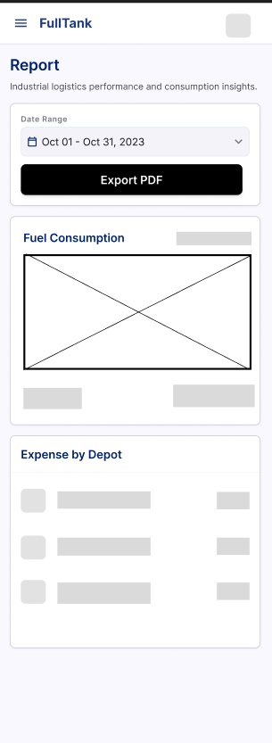
</div>

**Wireframe 7**

Este wireframe de Gestión de Solicitudes Activas organiza el flujo de pedidos mediante una lista de tarjetas de estado que permite el seguimiento en tiempo real.

<div align="center">
  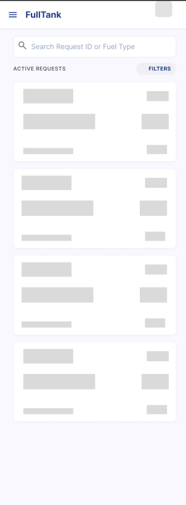
</div>

**Wireframe 8**

Este wireframe de Seguimiento de Orden en Tiempo Real utiliza una arquitectura de información de alta visibilidad para reducir la incertidumbre del comprador. La interfaz prioriza un mapa geolocalizado en la parte superior, seguido de tarjetas con datos técnicos del combustible y la identificación del conductor.

<div align="center">
  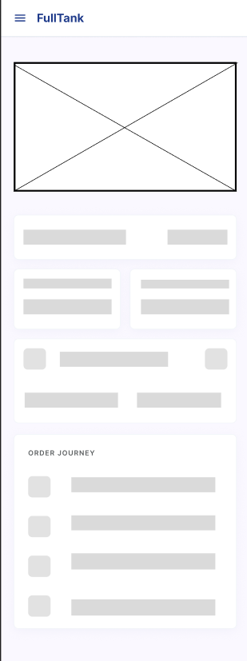
</div>

**Wireframe 9**

Este wireframe de Recomendaciones de Proveedores implementa una arquitectura de información basada en algoritmos de confianza, priorizando a los socios con mayor puntaje de fiabilidad. La interfaz destaca una tarjeta principal para el proveedor "más confiable" con métricas de desempeño detalladas, seguida de un listado categorizado que diferencia entre proveedores contratados y bajo demanda.

<div align="center">
  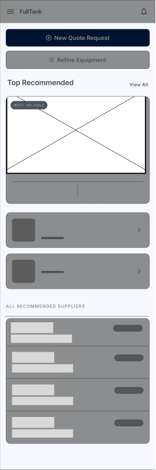
</div>

**Wireframe 10**

Este wireframe de Nueva Solicitud de Combustible implementa un flujo de formulario por pasos para guiar al comprador en la configuración de pedidos complejos. Su arquitectura de información segmenta el proceso en tres niveles lógicos: selección de producto, ubicación mediante mapa interactivo y programación de entrega, finalizando con un resumen de costos detallado.

<div align="center">
  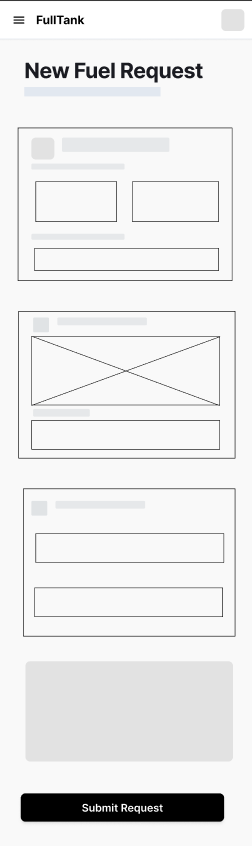
</div>


### Proveedores

**Wireframe 11**

Este wireframe organiza la gestión comercial mediante una estructura vertical de tres niveles. Su arquitectura de información prioriza el balance total y las métricas de ingresos mensuales en la parte superior, seguidas de un gráfico de desempeño de ventas y un listado de órdenes recientes para una validación rápida.

<div align="center">
  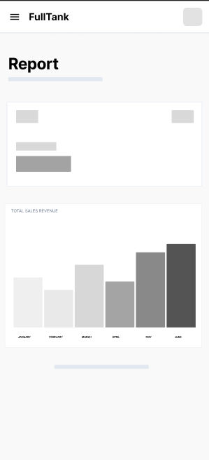
</div>

**Wireframe 12**

Este wireframe centraliza la gestión operativa del proveedor mediante una estructura de monitoreo en tiempo real. Su arquitectura de información destaca métricas de órdenes activas y balance de combustible, seguidas de una gráfica de tendencias de venta semanal para facilitar la toma de decisiones.

<div align="center">
  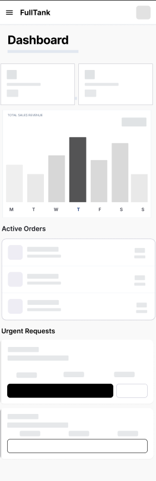
</div>

**Wireframe 13**

Este wireframe de Gestión de Flota Activa organiza el monitoreo de vehículos mediante una lista de tarjetas de estado para un control logístico en tiempo real.

<div align="center">
  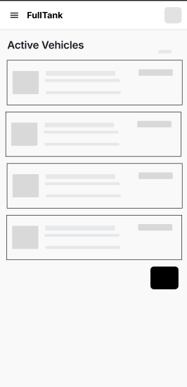
</div>

**Wireframe 14**

Este wireframe de Órdenes en Progreso para proveedores centraliza el monitoreo logístico de los despachos activos mediante tarjetas con mapas integrados. Su arquitectura de información destaca el estado de tránsito, la ubicación geográfica en tiempo real y datos críticos como el tiempo estimado de llegada (ETA) y la identificación de la unidad de transporte.

<div align="center">
  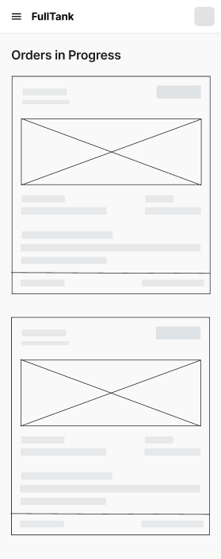
</div>

**Wireframe 15**

Este wireframe de Reportes de Clientes organiza la inteligencia de negocios del proveedor mediante un análisis segmentado de su cartera. Su arquitectura de información prioriza métricas generales (total de clientes y volumen) y la distribución del suministro por sectores mediante barras de progreso, facilitando la identificación de los mercados con mayor demanda.

<div align="center">
  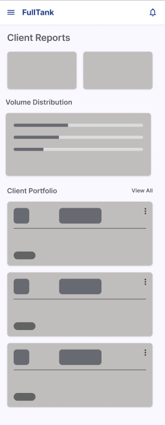
</div>

**Wireframe 16**

Este wireframe de Monitoreo de Inventario en Sedes organiza el estado de los depósitos mediante tarjetas de alerta que priorizan la urgencia operativa. Su arquitectura de información utiliza barras de estado y etiquetas de nivel (Critical, Optimal, Low Stock) para informar sobre el volumen de distintos combustibles en cada terminal.

<div align="center">
  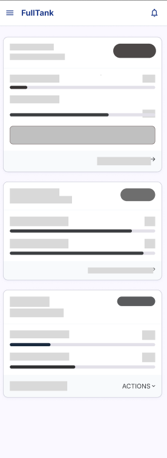
</div>

**Wireframe 17**

Este wireframe de Gestión de Solicitudes Entrantes permite a los proveedores procesar órdenes de logística mediante un sistema de validación rápida. Su arquitectura de información organiza las peticiones en tarjetas individuales que muestran el volumen solicitado y los ingresos proyectados, clasificando su prioridad mediante etiquetas de estado.

<div align="center">
  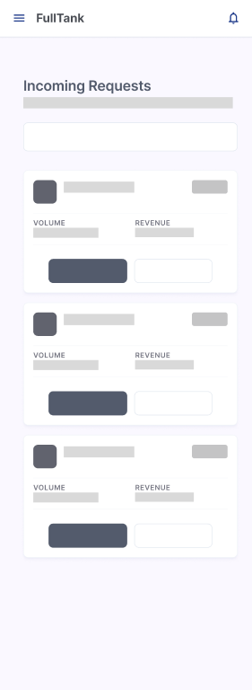
</div>

**Wireframe 18**

Este wireframe de Manifiesto de Carga y Seguimiento del Conductor organiza la información logística detallada para una supervisión precisa de la entrega. Su arquitectura de información destaca un mapa de geolocalización superior, seguido del perfil del conductor con canales de comunicación directa y un desglose técnico de la carga.

<div align="center">
  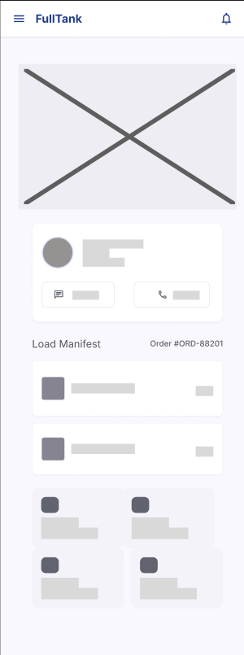
</div>

**Wireframe 19**

Este wireframe de Perfil y Configuración de Cuenta organiza la gestión de identidad y seguridad del usuario en una estructura vertical de fácil navegación. Su arquitectura de información se divide en tres bloques lógicos: datos personales, seguridad y preferencias de notificaciones, permitiendo un control granular sobre la cuenta.

<div align="center">
  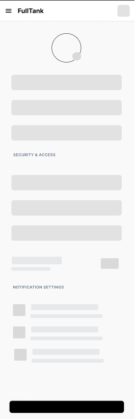
</div>

**Wireframe 20**

Este wireframe representa el Menú de Navegación Lateral (Sidebar), el componente central que articula la experiencia de usuario en ambas versiones de la aplicación.

<div align="center">
  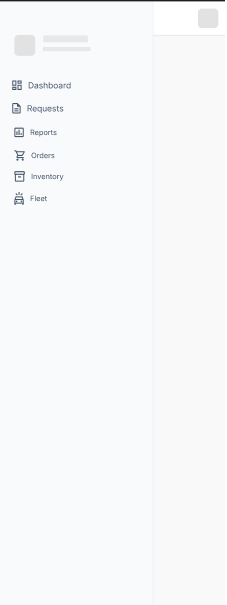
</div>

### 4.4.2 Web Applications Wireflow Diagrams

Los wireflows combinan los wireframes de la sección 4.4.1 con las transiciones entre pantallas. Muestran qué acción lleva al usuario de una vista a otra y permiten comprobar, antes de diseñar en alta fidelidad, que cada objetivo se completa con pocos pasos y sin callejones sin salida. Se elaboraron en Figma, uno por segmento.

Ambos recorridos parten del inicio de sesión, que también da acceso al registro de una cuenta corporativa y a la recuperación de contraseña. Tras autenticarse, la aplicación lleva al usuario al dashboard de su rol, y desde allí la barra lateral le da acceso directo a cada módulo.

**Wireflow del segmento solicitante (Carlos Ramírez)**

Está pensado para registrar pedidos y seguirlos con la menor cantidad de pasos. Desde el Dashboard, Carlos puede:

- ir a **Equipment** para revisar el nivel de sus equipos y registrar uno nuevo con el formulario *Add Equipment*;
- ir a **Requests** para ver sus solicitudes, abrir el detalle de una de ellas con su seguimiento y crear una nueva;
- ir a **Suppliers** para comparar proveedores y abrir el directorio de proveedores verificados;
- consultar **Reports** con su consumo y sus gastos;
- actualizar sus datos en **Account Settings**.

<div align="center">
  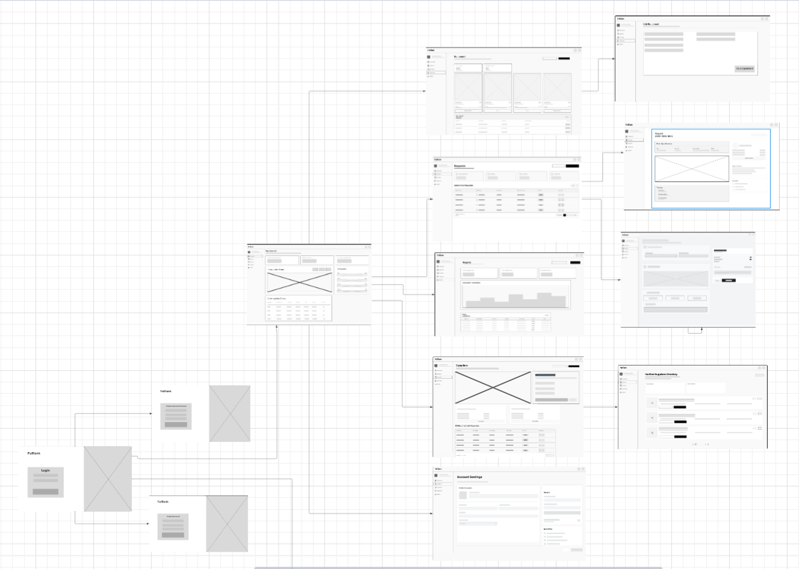
</div>

**Wireflow del segmento proveedor (Andrea López)**

Prioriza la atención de muchos pedidos a la vez. Desde el Dashboard, Andrea puede:

- abrir **Requests** para aprobar o rechazar las solicitudes entrantes;
- abrir **Orders** para seguir los despachos en curso y entrar al detalle de cada orden;
- mantener su **Inventory** actualizado;
- administrar su **Fleet** de cisternas y conductores;
- revisar **Reports** de ventas y el reporte de clientes;
- actualizar su **Account Settings**.

<div align="center">
  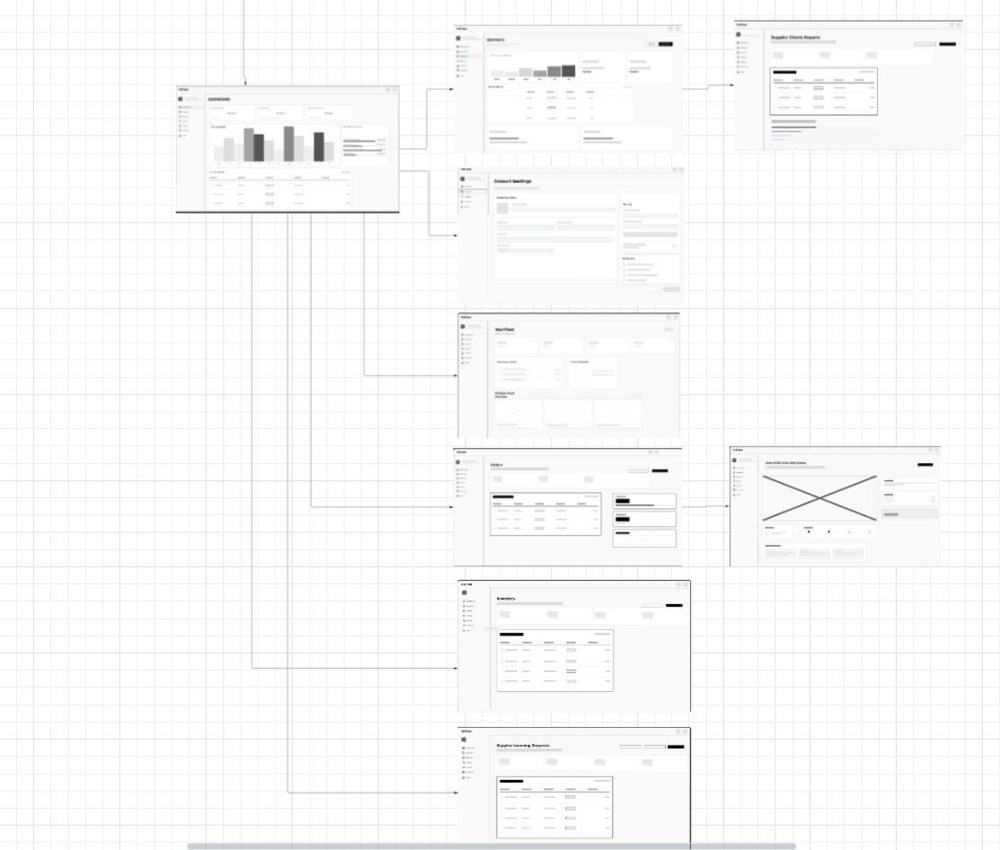
</div>

**Transiciones principales**

| Segmento | Pantalla de origen | Acción del usuario | Pantalla de destino |
|---|---|---|---|
| Ambos | Sign In | Ingresa credenciales válidas y presiona «Ingresar» | Dashboard de su rol |
| Ambos | Sign In | Presiona «Regístrate aquí» | Sign Up |
| Ambos | Sign In | Presiona «¿Olvidaste tu contraseña?» | Password Recovery |
| Solicitante | Dashboard | Selecciona «Requests» en la barra lateral | Requests |
| Solicitante | Requests | Presiona «New Fuel Request» | New Fuel Request |
| Solicitante | Requests | Selecciona una solicitud | Request Detail |
| Solicitante | Dashboard | Selecciona «Equipment» | Equipment |
| Solicitante | Equipment | Presiona «Register New Asset» | Add Equipment |
| Solicitante | Dashboard | Selecciona «Suppliers» | Suppliers |
| Solicitante | Suppliers | Presiona «View All» | Verified Suppliers Directory |
| Proveedor | Dashboard | Selecciona «Requests» | Incoming Requests |
| Proveedor | Incoming Requests | Presiona «Approve» o «Reject» | Incoming Requests con el estado actualizado |
| Proveedor | Dashboard | Selecciona «Orders» | Orders |
| Proveedor | Orders | Presiona «Details» | Order Detail |
| Proveedor | Dashboard | Selecciona «Reports» | Reports |
| Proveedor | Reports | Presiona «View All Clients» | Client Reports |

### 4.4.3 Web Applications Mock-ups

Los mock-ups son los diseños de alta fidelidad de la aplicación web. Se elaboraron en Figma a partir de los wireframes y wireflows anteriores y aplican el sistema de diseño de la sección 4.1:

- tipografía Inter;
- azul primario y ámbar para las acciones destacadas;
- colores semánticos para los estados;
- espaciado en múltiplos de 8 px.

Se presentan en versión desktop y mobile para ambos segmentos. Los componentes se eligieron para que su implementación con Vue 3 y PrimeVue sea directa:

- `Sidebar` y `Menu` para la navegación;
- `Card` para los indicadores;
- `DataTable` para las listas;
- `Tag` para los estados;
- `Timeline` para el seguimiento;
- `Chart` para los reportes.

#### Acceso a la aplicación

**Inicio de sesión.** Pantalla dividida en dos columnas.

- **Izquierda:** el formulario pide el correo corporativo y la contraseña, y ofrece los enlaces para recuperar la contraseña y para crear una cuenta.
- **Derecha:** una imagen de una cisterna refuerza el contexto del producto.
- **Botón principal:** «Ingresar» usa el color de acento para destacar la acción.

<div align="center">
  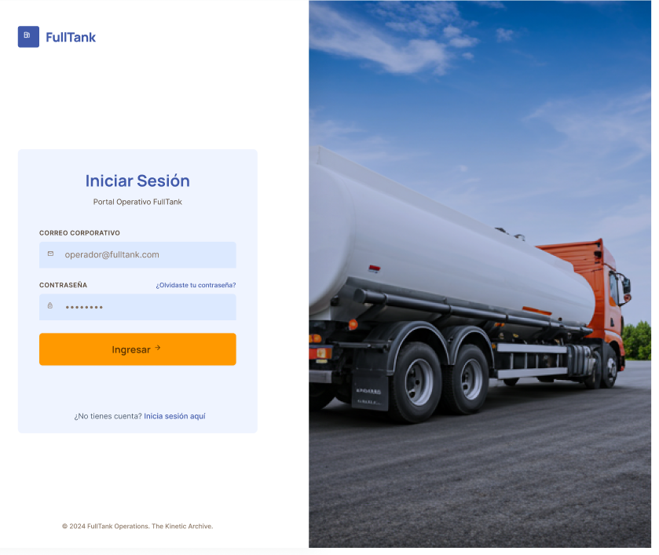
</div>

**Registro de cuenta corporativa.** Mantiene la misma estructura y solicita el nombre de la empresa, el correo corporativo y la contraseña. Tras el registro, el usuario recibe un correo de validación y vuelve al inicio de sesión.

<div align="center">
  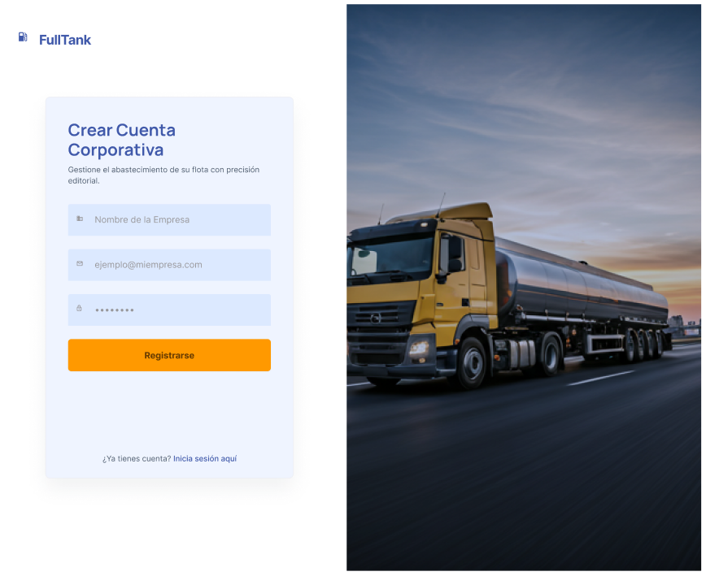
</div>

#### Segmento solicitante: versión desktop

Las pantallas del solicitante comparten:

- una barra lateral con los módulos Dashboard, Requests, Suppliers, Equipment y Reports;
- una barra superior con las notificaciones y la configuración.

**Dashboard.**

- **Indicadores:** consumo total de combustible, solicitudes pendientes y tanques con baja capacidad.
- **Consumo:** tendencia diaria, semanal o mensual.
- **Tanques:** nivel de cada uno, con colores semánticos.
- **Pedidos activos:** tabla con destino, proveedor, volumen, hora estimada de llegada y estado.

<div align="center">
  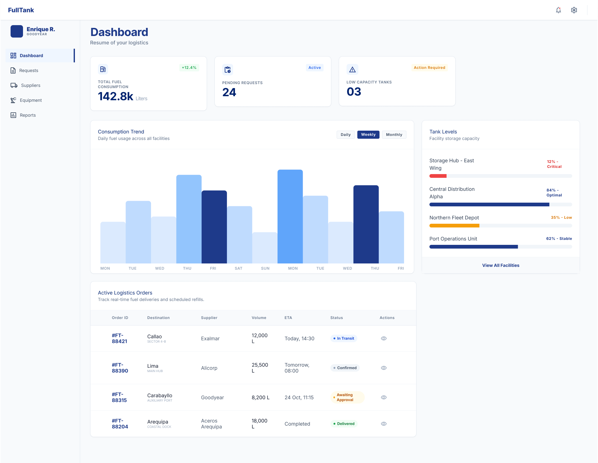
</div>

**Directorio de proveedores verificados.**

- **Datos de cada proveedor:** cobertura, tipos de combustible, capacidad mensual, pedido mínimo e índice de confiabilidad.
- **Acciones:** solicitar una cotización o marcar al proveedor como favorito.

<div align="center">
  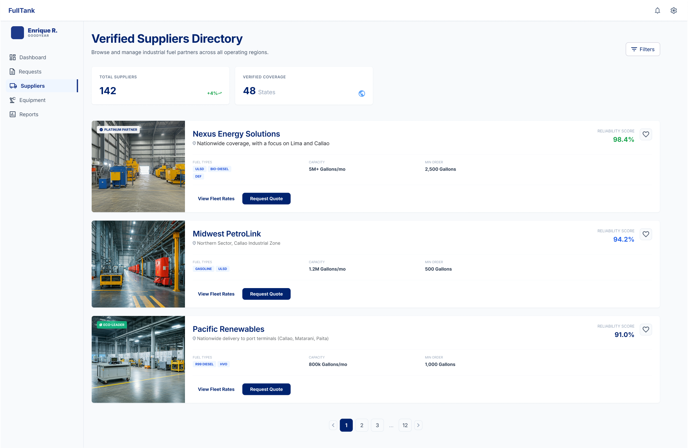
</div>

**Recomendación de proveedores.** Destaca al proveedor más adecuado para los equipos del solicitante y compara alternativas por tipo de combustible, precio unitario, tiempo de entrega y cumplimiento.

<div align="center">
  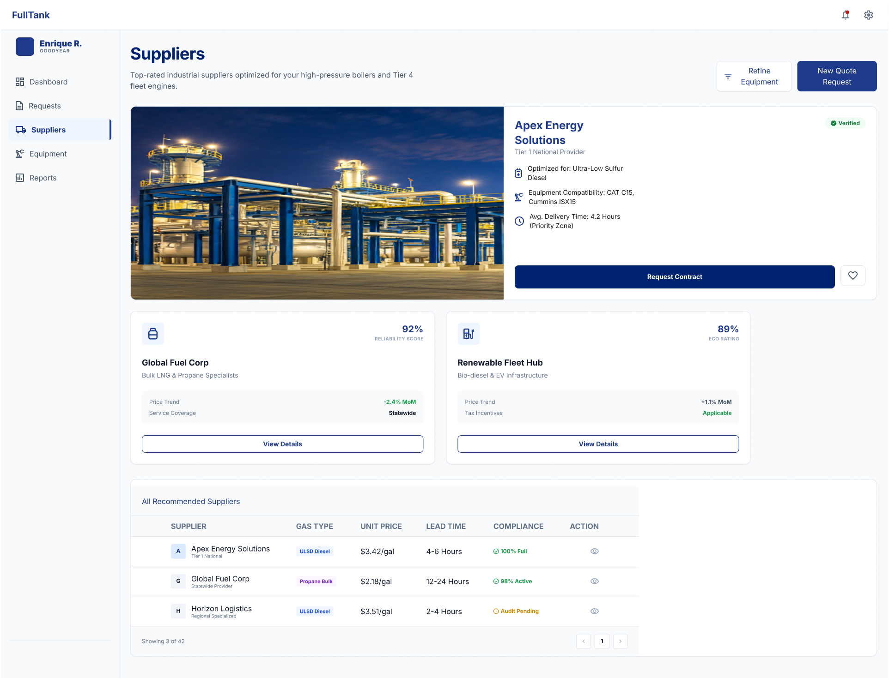
</div>

**Nueva solicitud de combustible.** Guía el registro en tres pasos:

1. tipo y cantidad de combustible;
2. lugar de entrega, con apoyo de un mapa;
3. prioridad e instrucciones adicionales.

Un panel lateral resume el pedido y su costo estimado antes de enviarlo o guardarlo como borrador.

<div align="center">
  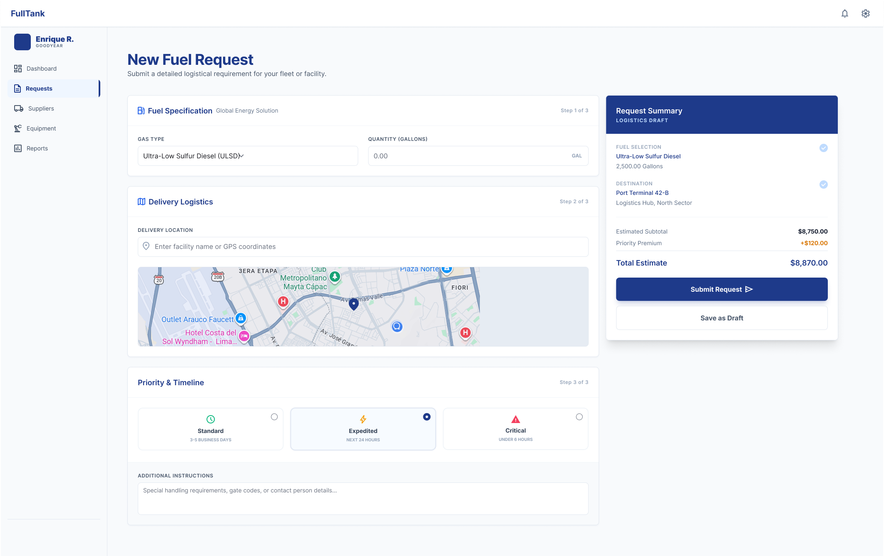
</div>

**Lista de solicitudes.** Resume las solicitudes activas, las pendientes, el volumen en tránsito y las completadas en el día. La tabla permite ordenar, paginar y abrir el detalle de cada solicitud.

<div align="center">
  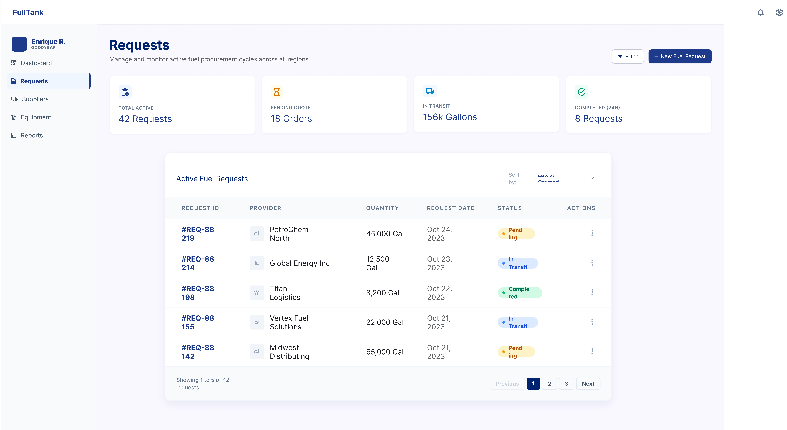
</div>

**Detalle de la solicitud.** Reúne:

- las especificaciones del pedido;
- el mapa del lugar de entrega;
- la línea de tiempo de estados;
- el proveedor, el conductor y la cisterna asignados, con la hora estimada de llegada;
- las notas y los documentos adjuntos.

Desde aquí el solicitante puede contactar al proveedor.

<div align="center">
  
</div>

**Equipos.** Presenta los tanques y equipos del solicitante en tarjetas con su capacidad, su porcentaje restante y su fecha de última recarga. Cada tarjeta permite solicitar una recarga, y al pie se listan las últimas solicitudes de recarga.

<div align="center">
  
</div>

**Reportes.** Resume el consumo total, el gasto y la eficiencia del periodo seleccionado. Muestra la tendencia semanal de consumo y la tabla de gastos recientes, y permite exportar a PDF.

<div align="center">
  
</div>

**Configuración de la cuenta.** Permite editar los datos del perfil y el idioma, cambiar la contraseña, activar la autenticación en dos pasos y elegir qué notificaciones recibir.

<div align="center">
  
</div>

#### Segmento proveedor: versión desktop

Las pantallas del proveedor comparten una barra lateral con los módulos Dashboard, Requests, Reports, Orders, Inventory y Fleet.

**Dashboard.**

- **Indicadores:** volumen vendido, órdenes pendientes y alertas de inventario bajo.
- **Ventas:** tendencia de ventas.
- **Depósitos:** nivel de cada uno.
- **Órdenes activas:** tabla con destino, volumen, hora estimada y estado.

<div align="center">
  
</div>

**Solicitudes entrantes.** Es la bandeja de trabajo principal. Cada solicitud muestra:

- el cliente;
- el combustible y la cantidad;
- el lugar;
- la prioridad;
- el estado del pago (pendiente, comprobante cargado o verificado);
- los botones para aprobar o rechazar.

Un registro inferior muestra las últimas acciones realizadas.

<div align="center">
  
</div>

**Órdenes en curso.** Muestra los despachos en tránsito, en carga, con retraso y entregados en el día. La tabla lista cada orden con su estado y su hora estimada, y un panel lateral agrupa las alertas prioritarias.

<div align="center">
  
</div>

**Detalle de la orden.** Combina:

- el seguimiento de la ruta en un mapa;
- la cisterna y el conductor asignados;
- la línea de tiempo de la orden;
- los datos del cliente y el manifiesto de carga;
- las notas y requisitos de entrega.

<div align="center">
  
</div>

**Inventario.** Muestra el stock total por tipo de combustible y las alertas activas. Una tabla lo distribuye por depósito con la capacidad ocupada y el tipo de producto, y el botón «Add Inventory» registra nuevos ingresos.

<div align="center">
  
</div>

**Flota.** Resume el tamaño de la flota, su disponibilidad, los mantenimientos y las alertas de seguridad. Muestra la disponibilidad de los conductores y las unidades con su estado y nivel de carga, y permite registrar un nuevo vehículo.

<div align="center">
  
</div>

**Reportes de ventas.** Presenta los ingresos del periodo con su tendencia mensual, la tasa de cumplimiento y el tiempo promedio de entrega. Incluye el desempeño por cliente y la exportación a PDF.

<div align="center">
  
</div>

**Reporte de clientes.** Muestra la cartera de clientes con su sector, volumen, última actividad y estado, junto con la distribución del volumen por sector industrial.

<div align="center">
  
</div>

**Configuración de la cuenta.** Ofrece las mismas opciones de perfil, seguridad y notificaciones que el solicitante, con alertas específicas de inventario.

<div align="center">
  
</div>

#### Segmento solicitante: versión mobile

La versión mobile sigue un enfoque responsive:

- la barra lateral se convierte en un menú hamburguesa;
- las tablas se transforman en tarjetas apiladas;
- los botones ocupan todo el ancho para facilitar el uso táctil.

Está pensada para un solicitante que suele estar en obra o en planta y necesita pedir combustible o revisar una entrega desde su celular.

- **Dashboard:** pedidos activos, balance de combustible, consumo de la semana, estado de los tanques y pedidos recientes.
- **Proveedores:** buscador con filtros rápidos y tarjetas con calificación, cobertura, pedido mínimo y tiempo de entrega.
- **Recomendaciones:** proveedor más confiable y alternativas ordenadas por puntaje.
- **Nueva solicitud:** los tres pasos del formulario desktop en una sola columna, con el total estimado antes de enviar.

<p align="center">
  
  
  
  
</p>

- **Solicitudes:** buscador y tarjetas con el estado, el tipo de combustible, la cantidad y el acceso al detalle o al seguimiento.
- **Detalle de la solicitud:** mapa, combustible y volumen, proveedor y conductor con botón de llamada, y línea de tiempo del pedido.
- **Equipos:** nivel de cada tanque en un indicador circular, con acceso directo a solicitar o programar una recarga.
- **Reportes:** consumo del periodo, gasto por sede y exportación a PDF.

<p align="center">
  
  
  
  
</p>

#### Segmento proveedor: versión mobile

La versión mobile del proveedor permite supervisar la operación logística en campo con la misma información que la versión desktop.

- **Menú de navegación:** el menú hamburguesa despliega los mismos módulos que la barra lateral.
- **Dashboard:** órdenes activas, balance de combustible, tendencia de ventas y solicitudes urgentes con botones para aceptar o rechazar.
- **Órdenes en progreso:** tarjetas con mapa, combustible, hora estimada de llegada, destino y cisterna asignada.
- **Seguimiento de la orden:** ubicación de la cisterna, datos del conductor con opciones de mensaje y llamada, y manifiesto de carga.

<p align="center">
  
  
  
  
</p>

- **Inventario:** tarjetas por depósito con el nivel de cada combustible y etiquetas de estado (crítico, óptimo o bajo).
- **Flota:** vehículos activos con su estado, destino y tiempo estimado, y un botón flotante para registrar una unidad.
- **Reportes:** ingresos del periodo, tendencia de volumen y descarga del reporte en PDF.
- **Reporte de clientes:** volumen por sector y cartera de clientes.
- **Configuración de la cuenta:** perfil, seguridad y preferencias de notificación en una sola columna.

<p align="center">
  
  
  
  
  
</p>

### 4.4.4 Web Applications User Flow Diagrams

Los User Flow Diagrams representan el recorrido que sigue un usuario para cumplir un objetivo concreto (User Goal) dentro de la aplicación. Para cada objetivo se describe:

- el **happy path**, en el que el usuario completa la tarea sin inconvenientes;
- los **unhappy paths**, en los que un error o una condición no cumplida desvía el flujo.

Cada objetivo se relaciona con las historias de usuario del capítulo III y con los User Personas Carlos Ramírez (solicitante) y Andrea López (proveedora).

#### User Goal 1: iniciar sesión

- **User Personas:** Carlos Ramírez y Andrea López.
- **Historias relacionadas:** EP04 — Autenticación y Registro.

**Happy path.** El usuario ingresa su correo corporativo y su contraseña en la pantalla de inicio de sesión y presiona «Ingresar». El sistema valida sus credenciales y lo lleva al dashboard de su rol, desde donde puede gestionar sus pedidos.

<div align="center">
  
</div>

**Unhappy path.** El usuario ingresa credenciales incorrectas. Al presionar «Ingresar», el sistema no permite el acceso y muestra el mensaje «Usuario y/o contraseña incorrectos». El usuario permanece en la misma pantalla para corregir los datos y volver a intentarlo.

<div align="center">
  
</div>

#### User Goal 2: crear una cuenta corporativa

- **User Personas:** visitantes que serán solicitantes o proveedores.
- **Historias relacionadas:** EP04 — Autenticación y Registro.

**Happy path.** Desde el inicio de sesión, el visitante presiona «Regístrate aquí» y llega al formulario de registro. Completa el nombre de su empresa, su correo corporativo y una contraseña válida, y presiona «Registrarse». El sistema crea la cuenta y lo devuelve al inicio de sesión para que ingrese con sus nuevas credenciales.

<div align="center">
  
</div>

**Unhappy paths.** Se contemplan dos errores:

- un dato con formato inválido, como un correo mal escrito;
- uno o más campos obligatorios vacíos.

En ambos casos el sistema no crea la cuenta, se mantiene en el formulario y muestra en rojo el mensaje «Campos inválidos» o «Complete todos los campos».

<div align="center">
  
</div>

#### User Goal 3: recuperar el acceso a la cuenta

- **User Personas:** Carlos Ramírez y Andrea López.
- **Historias relacionadas:** EP04 — Autenticación y Registro; TS-02.

**Happy path.**

1. Desde el inicio de sesión, el usuario presiona «¿Olvidaste tu contraseña?».
2. Ingresa su correo corporativo y presiona «Enviar código».
3. En la pantalla «Restablecer contraseña» escribe el código recibido, su nueva contraseña y la confirmación.
4. Presiona «Actualizar contraseña» y el proceso termina con éxito.

<div align="center">
  
</div>

**Unhappy path.** El usuario ingresa un correo que no está registrado. Al presionar «Enviar código», el sistema no continúa y muestra el mensaje «Correo no registrado, ingrese un correo válido» hasta que el usuario corrija el dato.

<div align="center">
  
</div>

#### User Goal 4: registrar un pedido de combustible

- **User Persona:** Carlos Ramírez.
- **Historias relacionadas:** US-05 Registrar nuevo pedido y US-08 Registrar información de pago.

**Happy path.**

1. Desde su dashboard, Carlos entra a «Requests» y presiona «New Fuel Request».
2. Selecciona el tipo de combustible, indica la cantidad y el lugar de entrega, y elige la prioridad.
3. Revisa el resumen de costos y presiona «Submit Request».
4. El sistema registra el pedido con estado «Pending» y lo lleva a la lista de solicitudes, donde el pedido aparece al inicio.

<div align="center">
  
</div>

**Unhappy paths.** El pedido no se envía si Carlos:

- deja campos obligatorios vacíos, como el tipo de combustible;
- ingresa una cantidad igual o menor a cero, o mayor al límite permitido.

El sistema se mantiene en el formulario, resalta los campos con error y explica qué debe corregirse.

<div align="center">
  
</div>

#### User Goal 5: aprobar un pedido con pago validado

- **User Persona:** Andrea López.
- **Historias relacionadas:** US-10 Ver pedidos pendientes, US-11 Aprobar pedido y US-42 Rechazar pedido.

**Happy path.**

1. Desde su dashboard, Andrea entra a «Requests» y revisa la bandeja de solicitudes entrantes.
2. Ubica un pedido cuyo pago figura como verificado.
3. Comprueba que los comprobantes cubren el total y presiona «Approve».
4. El pedido cambia a «Approved», se muestra una confirmación y el solicitante recibe una notificación.

<div align="center">
  
</div>

**Unhappy paths.** El pago del pedido está pendiente, es inválido o no cubre el total.

- Si Andrea intenta aprobarlo, el sistema no cambia el estado y muestra un mensaje que indica que el pago está incompleto.
- Andrea puede esperar a que el cliente regularice el pago o presionar «Reject»; en ese caso debe ingresar un motivo obligatorio antes de confirmar el rechazo.

<div align="center">
  
</div>

#### User Goal 6: despachar un pedido aprobado

- **User Persona:** Andrea López.
- **Historias relacionadas:** US-12 Marcar pedido como despachado; TS-17, TS-18 y TS-19.
- **Happy path:** Andrea abre un pedido aprobado desde «Orders», le asigna una cisterna y un conductor disponibles de su flota y lo despacha. El pedido pasa a «In Transit», el solicitante recibe una notificación y la línea de tiempo se actualiza.
- **Unhappy paths:**
  - no hay cisternas o conductores disponibles: el sistema lo indica y no permite despachar hasta que se libere un recurso;
  - el pedido todavía no fue aprobado: la acción de despacho no está disponible.


```mermaid
flowchart LR
    A[Orders] --> B[Detalle de la orden aprobada]
    B --> C{¿Hay cisterna y conductor disponibles?}
    C -- Sí --> D[Asignar cisterna y conductor]
    D --> E[Despachar]
    E --> F[Estado In Transit y cliente notificado]
    C -- No --> G[Mensaje: no hay recursos disponibles]
    G --> A
    B --> H{¿Pedido aprobado?}
    H -- No --> I[Despacho no disponible]
    classDef ok fill:#D1FAE5,stroke:#047857,color:#065F46
    classDef bad fill:#FEE2E2,stroke:#B91C1C,color:#991B1B
    class F ok
    class G,I bad
```

#### User Goal 7: seguir y confirmar la entrega

- **User Persona:** Carlos Ramírez.
- **Historias relacionadas:** US-06 Consultar estado del pedido, US-07 Confirmar recepción y US-13 Cerrar pedido.
- **Happy path:** Carlos recibe la notificación de despacho y abre el detalle de su solicitud. Sigue la cisterna en el mapa y, cuando el combustible llega, confirma la recepción. El pedido pasa a «Completed» y el proveedor puede cerrarlo.
- **Unhappy paths:**
  - el pedido aún no está en tránsito: la confirmación no está disponible;
  - el pedido ya fue confirmado: el sistema bloquea la acción e informa que la entrega ya fue registrada.


```mermaid
flowchart LR
    A[Notificación: pedido despachado] --> B[Detalle de la solicitud]
    B --> C[Seguir la cisterna en el mapa]
    C --> D{¿Estado In Transit?}
    D -- Sí --> E[Confirmar recepción]
    E --> F{¿Ya estaba confirmado?}
    F -- No --> G[Estado Completed]
    G --> H[El proveedor cierra el pedido]
    D -- No --> I[Confirmación no disponible]
    F -- Sí --> J[Mensaje: la entrega ya fue registrada]
    classDef ok fill:#D1FAE5,stroke:#047857,color:#065F46
    classDef bad fill:#FEE2E2,stroke:#B91C1C,color:#991B1B
    class G,H ok
    class I,J bad
```

## 4.5 Web Applications Prototyping

El prototipo interactivo de FullTank se construyó en Figma sobre los mock-ups de la sección 4.4.3, en versión desktop y mobile. Simula cómo los usuarios se autentican, registran y siguen sus pedidos, y cómo los proveedores los aprueban, despachan y controlan.

**Tipo de prototipo y objetivo**

Siguiendo a Gothelf y Seiden (2021), el tipo de prototipo se eligió según quién lo usará y qué se quiere aprender.

- **Tipo:** prototipo on-screen de alta fidelidad, porque se evaluará con responsables de abastecimiento y de despacho que deben reconocer en él una herramienta de trabajo real.
- **Alcance:** no simula todo el producto, sino los flujos principales, que son los que concentran el mayor riesgo:
  - registrar un pedido;
  - aprobarlo;
  - despacharlo;
  - seguirlo hasta su entrega.
- **Qué se quiere aprender:**
  - si ambos segmentos completan esas tareas sin ayuda;
  - si entienden los estados del pedido;
  - si encuentran valor suficiente para dejar las llamadas y los mensajes.

**Criterios de diseño**

- **Arquitectura centrada en el usuario:** las tareas más frecuentes del User Task Matrix (registrar y seguir pedidos, validar pagos, despachar y recibir notificaciones) están a uno o dos clics desde el dashboard.
- **Navegación consistente:** en desktop, la barra lateral fija da acceso a los módulos de cada rol, como define la sección 4.1.2; en mobile, el mismo contenido se despliega desde un menú hamburguesa.
- **Patrones de interacción conocidos:**
  - tarjetas para indicadores y proveedores;
  - tablas con filtros y paginación para listas extensas;
  - etiquetas de color para los estados del pedido;
  - líneas de tiempo para el seguimiento;
  - formularios por pasos para las solicitudes.
- **Diseño accesible:**
  - contraste conforme a WCAG 2.1 AA;
  - tipografía Inter con jerarquía clara;
  - botones amplios en mobile;
  - mensajes de error que explican cómo corregir cada dato.

**Flujos del prototipo**

| Flujo | Segmento | Recorrido |
|---|---|---|
| Flujo 1: acceso | Ambos | Inicio de sesión → registro de cuenta → recuperación de contraseña → dashboard según el rol |
| Flujo 2: proveedor | Andrea López | Dashboard → solicitudes entrantes (aprobar o rechazar) → órdenes → detalle de la orden → inventario → flota → reportes → configuración |
| Flujo 3: solicitante | Carlos Ramírez | Dashboard → proveedores y recomendaciones → nueva solicitud → lista de solicitudes → detalle y seguimiento → equipos → reportes → configuración |

**Versión desktop.** Está orientada a la gestión completa. El dashboard concentra los indicadores y los pedidos activos, la barra lateral lleva a cada módulo y las vistas de detalle agrupan en paneles la información del pedido, la logística y las acciones disponibles.

**Versión mobile.** Prioriza la consulta rápida en campo:

- resumen inmediato de pedidos y alertas;
- tarjetas apiladas en lugar de tablas;
- acciones principales al alcance del pulgar;
- acceso a todos los módulos desde el menú hamburguesa.

**Relación con los User Flow Diagrams.** Los flujos del prototipo recorren los happy paths de los User Goals de la sección 4.4.4, y los estados de error se muestran con los mensajes definidos en los unhappy paths.

**Enlaces y Evidencia de Prototipado Interactivo**

- **Diseño y prototipo interactivo en Figma:** [FullTank en Figma (Desktop y Mobile)](https://www.figma.com/design/ZMHB35H60u2eUhctevkVKc/Fullank-Completo?node-id=0-1&t=I3nr2x0tcAinM7gE-1)
- **Grabación de sustentación y recorrido en Microsoft Stream:** [FullTank - Sustentación y Recorrido del Prototipo Interactivo](https://upcedupe-my.sharepoint.com/:v:/g/personal/u202318620_upc_edu_pe/IQD-Y375Tn-qTL4_5hJtuQ8QAbHWOzNnv9YkDF7B09hJdfw?nav=eyJyZWZlcnJhbEluZm8iOnsicmVmZXJyYWxBcHAiOiJPbmVEcml2ZUZvckJ1c2luZXNzIiwicmVmZXJyYWxBcHBQbGF0Zm9ybSI6IldlYiIsInJlZmVycmFsTW9kZSI6InZpZXciLCJyZWZlcnJhbFZpZXciOiJNeUZpbGVzTGlua0NvcHkifX0&e=i63Yxn)

<div align="center">
  
  <p><em>Figura 4.28. Mockup del dashboard del solicitante utilizado en el prototipo de alta fidelidad. La grabación del recorrido se consulta en el enlace anterior.</em></p>
</div>


## 4.6 Domain-Driven Software Architecture

### 4.6.1 Design-Level Event Storming
Para identificar los eventos de dominio, es recomendable realizar una sesión de Event Storming. Esta técnica permite visualizar y comprender el flujo de eventos dentro del dominio, facilitando la identificación de los Bounded Context.

El desarrollo del proceso del Domain-Driven Design se realizó en la aplicación Miro: https://miro.com/app/board/uXjVGgOzeI4=/?share_link_id=421094077860

<div align="center">
  
</div>

1. Bounded Context IAM
   El bounded context IAM (Identity and Access Management) se encarga de la autenticación, autorización y gestión de credenciales dentro del sistema. Administra procesos como el registro de clientes y proveedores, inicio de sesión, recuperación de contraseñas y asignación de permisos según el rol. Su propósito es garantizar accesos seguros y controlados, asegurando que cada usuario interactúe únicamente con las funcionalidades que le corresponden dentro de la plataforma.
<div align="center">
  
</div>

2. Bounded Context Catalog
El bounded context Catalog se encarga de gestionar la visualización y consulta de empresas proveedoras y los productos de combustible que ofrecen dentro del sistema. Su propósito es permitir que los solicitantes puedan explorar, comparar y evaluar diferentes opciones de combustible según disponibilidad, características y oferta de cada proveedor, facilitando así la toma de decisiones para seleccionar el producto más adecuado para sus equipos y operaciones.

<div align="center">
  
</div>

3. Bounded Context Ordering
El bounded context Ordering se encarga de la gestión del ciclo de vida de las solicitudes y órdenes realizadas por los clientes. Administra procesos como la creación de solicitudes, validación, aceptación o rechazo por parte del proveedor, generación de órdenes, despacho, confirmación de entrega y cierre del pedido. Su propósito es orquestar el flujo principal del negocio, asegurando que cada pedido siga un proceso claro, trazable y consistente desde su inicio hasta su finalización.

<div align="center">
  
</div>


4. Bounded Context Fulfillment
El bounded context Fulfillment se encarga de la gestión logística necesaria para cumplir con las órdenes generadas. Administra procesos como el registro de transportes y conductores, asignación de recursos a pedidos y ejecución del despacho. Su propósito es garantizar que la entrega del combustible se realice de manera eficiente, coordinando los recursos logísticos involucrados en la distribución.

<div align="center">
  
</div>


5. Bounded Context Payment
El bounded context Payment se encarga de la gestión de los pagos asociados a las órdenes. Administra procesos como la solicitud de pago, registro de transacciones y aprobación del pago. Su propósito es asegurar que las operaciones económicas se realicen de manera confiable, validando que los pedidos cuenten con el respaldo financiero necesario antes de su ejecución o finalización.

<div align="center">
  
</div>

6. Bounded Context Notification
El bounded context Notification se encarga de la generación y gestión de notificaciones dentro del sistema. Administra procesos como la creación de notificaciones y el seguimiento de su estado (leídas o no leídas). Su propósito es mantener informados a los usuarios sobre eventos relevantes, como cambios en el estado de pedidos, pagos o entregas, mejorando la comunicación dentro de la plataforma.

<div align="center">
  
</div>

7. Bounded Context Reporting & Analytics
El bounded context Reporting & Analytics se encarga de la generación y visualización de reportes basados en la información del sistema. Administra procesos como la elaboración de reportes de ventas, consumo y métricas operativas. Su propósito es proporcionar información clave para la toma de decisiones, permitiendo analizar el comportamiento del negocio y optimizar sus procesos.

<div align="center">
  
</div>

8. Bounded Context Inventory
El bounded context Inventory se encarga de la gestión de los productos de combustible ofrecidos por los proveedores dentro del sistema. Administra procesos como el registro, actualización y eliminación de productos, así como la modificación de información relacionada con precios, disponibilidad y características del combustible. Su propósito es permitir que los proveedores mantengan actualizado su inventario, asegurando que los solicitantes puedan consultar ofertas vigentes y seleccionar el producto más adecuado para sus necesidades operativas.

<div align="center">
  
</div>

9. Bounded Context Equipment
El bounded context Equipment se encarga de la gestión y monitoreo de los equipos pertenecientes a los clientes o solicitantes dentro del sistema. Administra procesos como el registro y actualización de equipos, así como la visualización de su estado operativo y el nivel de combustible disponible en cada uno. Su propósito es permitir a los solicitantes supervisar sus hornos, maquinarias, tanques y otros equipos relacionados, facilitando el control del consumo de combustible y la planificación eficiente de sus operaciones.

<div align="center">
  
</div>

### 4.6.2 Software Architecture Context Diagram
En este nivel se presenta una vista de alto nivel de la arquitectura, donde el foco está en el sistema de software FullTank Platform como una "caja negra" y en las interacciones que mantiene con sus usuarios y con otros sistemas externos.

El context diagram muestra al FullTank Platform como un recuadro central, rodeado por los principales actores y sistemas con los que se comunica:

Visitor: usuario anónimo que navega la landing page para conocer la plataforma, revisar sus beneficios y registrarse en el sistema.

Client (Requester): representante de una empresa que requiere combustible. Interactúa con la plataforma para explorar el catálogo de proveedores y sus productos, gestionar sus equipos (vehículos, generadores, maquinaria), crear solicitudes de abastecimiento, registrar pagos, hacer seguimiento de pedidos y confirmar entregas.

Provider: representante de una empresa proveedora de combustible. Gestiona su inventario de productos, evalúa solicitudes entrantes, aprueba o rechaza pedidos, asigna recursos logísticos (transporte y conductores) y ejecuta despachos.

Email Service: sistema externo encargado de enviar correos electrónicos, principalmente para la recuperación de contraseñas y notificaciones relacionadas a autenticación.

Cloud Storage: sistema externo utilizado para almacenar comprobantes de pago (vouchers) cargados por los clientes.

PDF Generator Service: sistema externo encargado de generar reportes en formato PDF, como resúmenes de consumo y ventas.

En el diagrama se representan las relaciones entre estos elementos, destacando que los usuarios (Visitor, Client y Provider) interactúan directamente con FullTank, mientras que el sistema se encarga de orquestar la comunicación con los servicios externos (correo, almacenamiento y generación de reportes). Esta vista permite comprender el alcance del sistema, sus límites de responsabilidad y el ecosistema en el que opera antes de entrar en detalles internos.

<div align="center">
  
</div>

### 4.6.3 Software Architecture Container Diagrams

En el nivel de contenedores, la atención se centra en cómo se organiza internamente el sistema en aplicaciones y fuentes de datos. El container diagram muestra los elementos principales de la arquitectura de FullTank, sus responsabilidades y la forma en que se comunican entre sí y con sistemas externos.

La arquitectura lógica de FullTank se estructura en los siguientes contenedores:

Landing Page: aplicación web estática que presenta la propuesta de valor del sistema, incluyendo secciones como descripción del servicio, beneficios, testimonios, precios, preguntas frecuentes y contacto. Está desarrollada con HTML, CSS y JavaScript, y orientada a usuarios no autenticados.

FullTank Web Application (SPA): aplicación web principal desarrollada en Vue.js 3 con Pinia como gestor de estado y Vue Router para navegación protegida por roles. Es utilizada por clientes y proveedores para interactuar con el sistema. Del lado del cliente contiene módulos como catálogo de proveedores, gestión de equipos, solicitudes, pagos, reportes de consumo y notificaciones. Del lado del proveedor incluye módulos de inventario, gestión de órdenes, flota y despacho, reportes de ventas y listado de clientes.

FullTank API: backend desarrollado en ASP.NET Core 8 con Entity Framework Core que expone una API REST. Centraliza la lógica de negocio, reglas de validación y orquestación de procesos, organizados en nueve bounded contexts del dominio: Identity & Access, Catalog, Equipment, Inventory, Ordering, Payment, Fulfillment, Notification y Reporting & Analytics.

MySQL Database: base de datos relacional donde se almacena toda la información estructurada del sistema, incluyendo usuarios, proveedores, productos, equipos, solicitudes, órdenes, pagos, inventario, flota, despachos, notificaciones y reportes.

En el diagrama se observa que los usuarios acceden inicialmente a la Landing Page, desde donde pueden registrarse o ingresar a la aplicación principal. La Web Application (SPA) se comunica exclusivamente con la API mediante peticiones HTTPS utilizando formato JSON a través de un cliente HTTP centralizado (Axios) con interceptor JWT. La API persiste y consulta datos en la base de datos MySQL mediante Entity Framework Core.Adicionalmente, la API se integra con sistemas externos: Email Service para correos de recuperación de contraseña, Cloud Storage para almacenamiento de comprobantes de pago y PDF Generator Service para la generación de reportes descargables.

Esta vista permite entender la distribución de responsabilidades entre la capa de presentación (Landing Page y SPA), la capa de lógica de negocio (API) y la capa de persistencia (Database), así como las principales decisiones tecnológicas adoptadas.

<div align="center">
  
</div>

### 4.6.4 Software Architecture Components Diagrams
En el nivel de componentes se detalla la descomposición interna de los contenedores, enfocándose principalmente en el contenedor FullTank API, donde reside la lógica de negocio del sistema.

El component diagram organiza la arquitectura interna siguiendo los bounded contexts definidos en el dominio. Cada uno representa un módulo backend con responsabilidades específicas:

Identity & Access BC: gestiona el registro de usuarios (clientes y proveedores), autenticación mediante credenciales de correo electrónico y contraseña, autorización basada en roles, emisión de tokens JWT, recuperación de contraseñas y administración de perfiles. Redirige al usuario según su rol tras el inicio de sesión.

Catalog BC: bounded context orientado al cliente que permite explorar los proveedores disponibles en la plataforma, consultar el catálogo de productos (tipos de combustible, precios por litro) que ofrece cada proveedor y asignar productos seleccionados a los equipos registrados del cliente. Consume datos del Inventory BC para obtener disponibilidad y del Equipment BC para validar compatibilidad de tipo de combustible.

Equipment BC: gestiona los equipos del cliente, tales como vehículos, generadores y maquinaria. Cada equipo registra su tipo, marca, modelo, tipo de combustible requerido, capacidad del tanque y estado operativo. Permite al cliente agregar, actualizar, eliminar y listar sus equipos, así como asignar o cambiar el tipo de combustible asociado.

Inventory BC: bounded context orientado al proveedor que administra el inventario de combustible, incluyendo niveles de stock disponible y precio por litro según tipo de combustible. Valida la información de los ítems al momento de registro o actualización y notifica al administrador ante cambios relevantes.

Ordering BC: orquesta el ciclo de vida completo de las órdenes, desde la creación de solicitudes por parte del cliente hasta su cierre por parte del proveedor. Incluye las operaciones de creación de solicitud, cancelación, aceptación, rechazo, despacho, confirmación de entrega y cierre. Valida la información de cada solicitud, notifica al proveedor o cliente según corresponda y, al cerrar una orden, descuenta el inventario correspondiente.

Payment BC: gestiona el registro de pagos mediante comprobantes (vouchers), valida que el monto total coincida con el precio del combustible solicitado y habilita la aprobación de órdenes una vez verificado el respaldo financiero.

Fulfillment BC: administra los recursos logísticos del proveedor, incluyendo el registro de transportes (vehículos de distribución) y conductores. Permite asignar un transporte y un conductor a una orden aprobada para su despacho, y libera ambos recursos cuando la orden es cerrada.

Notification BC: genera notificaciones dentro del sistema en respuesta a eventos relevantes del dominio, como cambios en el estado de las órdenes (creación, aprobación, rechazo, despacho, entrega, cierre). Permite a los usuarios visualizar su historial de notificaciones y marcarlas como leídas.

Reporting & Analytics BC: procesa información histórica de órdenes cerradas para generar reportes de consumo (perspectiva del cliente) y ventas (perspectiva del proveedor), incluyendo gráficos de tendencias y la generación de archivos PDF descargables.

En el diagrama se refleja cómo la Web Application consume los servicios de cada componente backend mediante endpoints REST organizados por contexto. Cada bounded context accede a la base de datos para gestionar la información correspondiente a su dominio. Existen interacciones relevantes entre contextos: Ordering depende de Payment para validar pagos antes de aprobar órdenes; Ordering interactúa con Fulfillment para coordinar la asignación de flota y su liberación al cerrar órdenes; Ordering actualiza el stock en Inventory al cerrar órdenes; Catalog lee datos de Inventory para mostrar disponibilidad de productos y valida contra Equipment la compatibilidad de tipos de combustible; Notification reacciona a cambios de estado en órdenes; y Reporting consume datos de órdenes cerradas para generar agregados analíticos. Algunos componentes se integran con sistemas externos: Identity & Access con el servicio de correo electrónico, Payment con almacenamiento en la nube para comprobantes y Reporting & Analytics con el generador de PDFs.

De esta manera, los component diagrams permiten entender cómo la arquitectura se organiza internamente en módulos coherentes con el dominio, cómo se relacionan entre sí y cómo colaboran para implementar la funcionalidad completa de FullTank.

<div align="center">
  
</div>

## 4.7 Software Object-Oriented Design

En esta sección se presenta el diseño orientado a objetos del sistema, el cual desarrolla con mayor detalle la implementación interna de los componentes identificados en los diagramas C4 del sección 4.6. A partir de los contenedores y componentes definidos (Landing Page, Web Application, API y Database), se derivan diagramas de clases específicos para cada bounded context del dominio, con el objetivo de mostrar:

- Cómo se modelan las entidades, agregados, servicios, repositorios y controladores en el backend para cada contexto.
- Cómo se estructuran los componentes de presentación, lógica de aplicación y acceso a datos en el frontend.
- Cómo se reflejan estos modelos en el diseño de la base de datos relacional, identificando qué tablas pertenecen a cada bounded context.

De esta forma, el diseño orientado a objetos enlaza el nivel arquitectónico (C4 Model) con el nivel de implementación, permitiendo verificar la coherencia entre bounded contexts, responsabilidades de cada módulo y decisiones de diseño técnico, como el uso de interfaces de servicio, repositorios, ensambladores y value objects por contexto.

### 4.7.1 Class Diagrams

En esta subsección se presentan los diagramas de clases que detallan la estructura interna de los principales componentes para cada bounded context. Estos diagramas complementan al Component Diagram de la API Application y a los contenedores definidos, proporcionando una vista centrada en clases, relaciones y responsabilidades.


### Diagramas de clases del Frontend

A nivel de frontend, se modelan las clases en función de los módulos y vistas que consumen los servicios expuestos por la API. La aplicación web sigue una arquitectura modular basada en bounded contexts, donde cada contexto se organiza en packages independientes con las siguientes capas:

- **domain/model**: contiene las estructuras que representan los modelos de datos y value objects utilizados en la interfaz.
- **application**: incluye servicios de aplicación que coordinan la lógica necesaria para interactuar con el backend.
- **infrastructure/api**: encapsula las llamadas HTTP a la API mediante un cliente centralizado.
- **presentation**: agrupa las vistas y componentes de interfaz de usuario, así como los mecanismos de gestión de estado cuando es necesario compartir información entre múltiples vistas.

**Diagrama del Frontend completo:**

<div align="center">
  
</div>

El diagrama completo del frontend muestra la organización general de la capa de presentación, incluyendo todos los bounded contexts agrupados en packages independientes, los mecanismos de gestión de estado global, el cliente HTTP centralizado con manejo de autenticación, y los componentes encargados de la protección de rutas según el rol del usuario autenticado. Cada vista se conecta a su servicio correspondiente, el cual interactúa con la capa de infraestructura para consumir los servicios REST del backend.

**Diagrama del Frontend dividido por contextos:**

- **Identity & Access Frontend**  
  Responsabilidad: Maneja las vistas de registro, inicio de sesión, recuperación de contraseña y edición de perfil de usuario.

<div align="center">
  
</div>

- **Catalog Frontend**  
  Responsabilidad: Maneja las vistas de gestión del inventario de recursos ofrecidos por el proveedor.

<div align="center">
  
</div>

- **Ordering Frontend**  
  Responsabilidad: Maneja las vistas del ciclo de vida completo de pedidos: creación de solicitudes, aprobación, rechazo, despacho, confirmación de entrega y cierre.

<div align="center">
  
</div>

- **Payment Frontend**  
  Responsabilidad: Maneja las vistas para que el cliente registre comprobantes de pago vinculados a una orden.

<div align="center">
  
</div>

- **Fulfillment Frontend**  
  Responsabilidad: Maneja las vistas de gestión de recursos logísticos (por ejemplo, vehículos y operadores) y la asignación de despacho a órdenes aprobadas.

<div align="center">
  
</div>

- **Notification Frontend**  
  Responsabilidad: Maneja el panel de notificaciones dentro de la aplicación para informar a los usuarios sobre cambios en el estado de los pedidos.

<div align="center">
  
</div>

- **Reporting & Analytics Frontend**  
  Responsabilidad: Maneja las vistas de visualización de métricas, gráficos de consumo o ventas, y la descarga de reportes.

<div align="center">
  
</div>


- **Equipment Frontend**  
  Responsabilidad: Maneja las vistas para que el cliente registre, actualice, elimine y visualice sus equipos (vehículos, generadores, maquinaria), incluyendo el tipo de combustible requerido y el estado operativo de cada uno.

<div align="center">
  
</div>

- **Inventory Frontend**  
  Responsabilidad: Maneja las vistas de gestión del inventario de combustible por parte del proveedor, incluyendo el registro, actualización y eliminación de ítems, así como la visualización de niveles de stock y precio por litro.

<div align="center">
  
</div>

### Diagramas de clases del Backend

A nivel de backend, los diagramas de clases reflejan la implementación detallada de los módulos definidos como componentes dentro de la API. El sistema sigue una arquitectura por capas organizada por bounded contexts, donde cada contexto mantiene una clara separación de responsabilidades:

- **interfaces**: expone los endpoints del sistema (controladores REST) y componentes encargados de transformar datos entre modelos externos e internos.
- **domain**: contiene las entidades, agregados, value objects, así como comandos, consultas e interfaces que definen el comportamiento del dominio.
- **application**: implementa la lógica de negocio mediante servicios que ejecutan comandos y consultas.
- **infrastructure**: define los mecanismos de persistencia y comunicación con sistemas externos, incluyendo repositorios y servicios de integración.

**Diagrama del Backend completo:**

<div align="center">
  
</div>

El diagrama completo del backend muestra la organización de todos los bounded contexts como módulos independientes dentro del sistema. Se visualizan las dependencias entre contextos, donde el bounded context de Ordering actúa como núcleo del sistema y coordina a los demás contextos mediante interfaces.

Las principales dependencias incluyen:
- Verificación de pagos antes de aprobar órdenes.
- Gestión y liberación de recursos logísticos.
- Validación y actualización de inventario.
- Generación de notificaciones ante cambios de estado.
- Alimentación de datos para reportes y análisis.

Todas las interacciones entre bounded contexts se realizan a través de interfaces, evitando dependencias directas de implementación y favoreciendo el desacoplamiento.

**Diagrama del Backend dividido por contextos:**

- **Identity & Access Backend**  
  Responsabilidad: Gestiona el registro de usuarios, autenticación, autorización y control de acceso.

<div align="center">
  
</div>

- **Catalog Backend**  
  Responsabilidad: Gestiona el inventario de recursos disponibles, incluyendo stock y características relevantes.

<div align="center">
  
</div>

- **Ordering Backend**  
  Responsabilidad: Orquesta el ciclo de vida completo del pedido. Es el bounded context central que coordina la interacción con los demás contextos.

<div align="center">
  
</div>


- **Payment Backend**  
  Responsabilidad: Gestiona el registro y validación de pagos asociados a órdenes.

<div align="center">
  
</div>

- **Fulfillment Backend**  
  Responsabilidad: Gestiona los recursos necesarios para la ejecución de entregas y su asignación a órdenes.

<div align="center">
  
</div>

- **Notification Backend**  
  Responsabilidad: Genera y gestiona notificaciones ante eventos relevantes del sistema.

<div align="center">
  
</div>


- **Reporting & Analytics Backend**  
  Responsabilidad: Agrega información histórica para generar métricas, análisis y reportes.

<div align="center">
  
</div>

- **Equipment Backend**  
  Responsabilidad: Gestiona el registro, actualización, eliminación y consulta de los equipos del cliente, así como la asignación del tipo de combustible requerido por cada equipo.

<div align="center">
  
</div>

- **Inventory Backend**  
  Responsabilidad: Gestiona el registro, actualización y eliminación de los productos de combustible del proveedor, validando la información del ítem y controlando los niveles de stock disponible y precio por litro.

<div align="center">
  
</div>

## 4.8 Database Design

### 4.8.1 Database Diagrams
La base de datos relacional almacena todos los datos del dominio del sistema. Las tablas se organizan en correspondencia directa con los bounded contexts definidos en el diseño orientado a objetos. A continuación, se detalla qué tablas pertenecen a cada contexto y cuál es su responsabilidad dentro del modelo de datos.

<div align="center">
  
</div>


Identity & Access — Base de datos
Responsabilidad: Almacena la información de usuarios, sesiones y las extensiones de perfil para clientes y proveedores.

- USER: datos base del usuario autenticado (id_user, ruc, full_name, dni, email, password_hash, phone_number, address, role, is_active, created_at, updated_at).
- CLIENT: extensión del perfil para empresas solicitantes (id_client, id_user FK, company_name, company_ruc, industry, created_at).
- PROVIDER: extensión del perfil para empresas proveedoras (id_provider, id_user FK, company_name, company_ruc, description, created_at).

<div align="center">
  
</div>


Catalog — Base de datos
Responsabilidad: Almacena el inventario disponible de cada proveedor, incluyendo stock y características relevantes.

- INVENTORY: registro de stock por tipo de recurso (id_inventory, id_provider FK, fuel_type, quantity_liters, price_per_liter, updated_at).


<div align="center">
  
</div>


Ordering — Base de datos
Responsabilidad: Almacena el ciclo de vida completo de solicitudes y órdenes, incluyendo el detalle de ítems y los cambios de estado.

- REQUEST: solicitud creada por el cliente (id_request, id_client FK, id_provider FK, fuel_type, quantity_liters, delivery_address, requested_date, estimated_delivery, status, notes, created_at).
- REQUEST_DETAIL: detalle del pedido con desglose de valores (id_detail, id_request FK, fuel_type, quantity_liters, unit_price, subtotal).
- ORDER: orden generada a partir de una solicitud aprobada (id_order, id_request FK, status, approved_at, dispatched_at, delivered_at, closed_at, rejection_reason, created_at).


<div align="center">
  
</div>


Payment — Base de datos
Responsabilidad: Almacena los registros de pago asociados a las órdenes.

- PAYMENT: comprobante de pago vinculado a una orden (id_payment, id_order FK, operation_code, amount, bank_name, voucher_url, payment_date, status, registered_at).

<div align="center">
  
</div>


Fulfillment — Base de datos
Responsabilidad: Almacena los recursos logísticos y su asignación a órdenes.

- TRANSPORT: recurso de transporte del proveedor (id_transport, id_provider FK, plate, vehicle_type, capacity_liters, is_available, created_at).
- DRIVER: operador asignado al transporte (id_driver, id_provider FK, full_name, dni, license_number, phone_number, is_available, created_at).
- DISPATCH: asignación de recursos a una orden (id_dispatch, id_order FK, id_transport FK, id_driver FK, assigned_at, status).

<div align="center">
  
</div>

Notification — Base de datos
Responsabilidad: Almacena las notificaciones generadas por eventos del sistema.

- NOTIFICATION: notificación asociada a un usuario (id_notification, id_user FK, id_order FK, type, message, is_read, created_at).

<div align="center">
  
</div>


Reporting & Analytics — Base de datos
Responsabilidad: Almacena la información de reportes generados a partir de datos históricos.

- REPORT: reporte generado por un usuario (id_report, id_user FK, type, pdf_url, generated_at).

<div align="center">
  
</div>


Equipment — Base de datos
Responsabilidad: Almacena los equipos registrados por las empresas solicitantes que requieren abastecimiento de combustible (vehículos, maquinaria pesada, grupos electrógenos), permitiendo registrar sus características técnicas y capacidad de tanque.

- EQUIPMENT: registro de equipos del cliente solicitante (id_equipment, id_client FK, name, equipment_type, fuel_type, tank_capacity, is_operational, created_at, updated_at).


Inventory — Base de datos
Responsabilidad: Almacena los productos de combustible y el control de inventario de las empresas distribuidoras, registrando volúmenes disponibles, stock reservado para despachos en tránsito, precios unitarios por litro y umbrales mínimos de abastecimiento.

- INVENTORY_ITEM: registro de stock de combustible por proveedor (id_inventory_item, id_provider FK, fuel_type, stock_liters, reserved_liters, available_liters, unit_price, min_stock_alert, last_restocked_at, updated_at).

---

# Capítulo V: Product Implementation, Validation & Deployment

## 5.1. Software Configuration Management

### 5.1.1. Software Development Environment Configuration

Para garantizar un flujo de trabajo estructurado, predecible y colaborativo a lo largo del ciclo de vida de FullTank, producto desarrollado por la startup FuelPoint, se han seleccionado herramientas estandarizadas organizadas por categorías funcionales, asegurando la trazabilidad desde la concepción de requisitos hasta el despliegue de la solución.

#### Project Management

* **Trello**: Servicio de gestión de proyectos basado en el marco de trabajo ágil Kanban y tableros visuales. Se emplea para estructurar y priorizar el Product Backlog y los Sprint Backlogs de cada iteración, asignar responsables, gestionar el flujo de tarjetas de trabajo (*To Do*, *In Process*, *To Review*, *Done*) y monitorear el avance global de las tareas del equipo.
  * *Ruta oficial:* [https://trello.com](https://trello.com)
  * *Tablero del proyecto:* [FullTank · FuelPoint | Product Backlog y Sprints · TB1](https://trello.com/b/6h5mZ8L6)
* **Google Meet**: Plataforma de comunicación audiovisual y conferencias en tiempo real de Google. Se utiliza para la ejecución de los eventos del marco de trabajo Scrum, tales como el *Sprint Planning*, reuniones de sincronización (*Daily Stand-ups*), *Sprint Review* y *Sprint Retrospective*, promoviendo la alineación continua de los integrantes.
  * *Ruta oficial:* [https://meet.google.com](https://meet.google.com)
* **WhatsApp**: Aplicación de mensajería instantánea multiplataforma empleada como canal de comunicación operativa directa, rápida y cotidiana entre los integrantes del equipo para resolver consultas puntuales y notificar hitos de integración.
  * *Ruta oficial:* [https://www.whatsapp.com](https://www.whatsapp.com)
* **Google Workspace / Google Drive**: Suite ofimática colaborativa en la nube utilizada para la redacción concurrente de minutas de reunión, tablas de cálculo para estimación de esfuerzo y almacenamiento centralizado de documentación complementaria.
  * *Ruta oficial:* [https://workspace.google.com](https://workspace.google.com)

#### Requirements Management

* **UXPressia**: Plataforma especializada en el diseño y mapeo de la experiencia de usuario. Se emplea para la formulación de los perfiles de usuario (*User Personas*), mapas de recorrido (*User Journey Maps*) e *Impact Maps*, asegurando que la definición de los requisitos funcionales y de negocio esté centrada en las necesidades de las empresas solicitantes y proveedoras de combustible.
  * *Ruta oficial:* [https://uxpressia.com](https://uxpressia.com)
* **Google Forms**: Herramienta para la estructuración y distribución de encuestas digitales cuantitativas dirigidas a los segmentos objetivo del sector de abastecimiento de combustible, permitiendo la recolección estructurada de datos para la validación de necesidades.
  * *Ruta oficial:* [https://forms.google.com](https://forms.google.com)
* **Zoom Meetings**: Plataforma de videoconferencias empleada para la realización y grabación de entrevistas cualitativas con usuarios reales del dominio, facilitando la obtención empírica de requisitos y el análisis de puntos de dolor (*pain points*).
  * *Ruta oficial:* [https://zoom.us](https://zoom.us)

#### Product UX/UI Design

* **Figma**: Entorno de diseño vectorial y prototipado colaborativo en la nube. Se utiliza para la definición integral de la guía de estilos (*Style Guidelines*), diseño de wireframes de baja fidelidad, flujos de pantalla (*wireflows* y *user flows*), mockups de alta fidelidad con componentes interactivos y prototipos navegables responsive tanto para la Landing Page como para la Web Application de FullTank.
  * *Ruta oficial:* [https://www.figma.com](https://www.figma.com)

#### Software Development

* **Visual Studio Code**: Editor de código fuente ligero, modular y altamente extensible desarrollado por Microsoft. Constituye el entorno principal para el desarrollo frontend de la Landing Page (HTML5, CSS3, JavaScript puro) y de la Web Application (Vue 3, Vite, PrimeVue), aprovechando su ecosistema de extensiones para análisis estático, formateo y depuración.
  * *Ruta oficial:* [https://code.visualstudio.com](https://code.visualstudio.com)
* **Visual Studio 2022**: Entorno de desarrollo integrado (IDE) robusto para la plataforma .NET. Se utiliza para la arquitectura, implementación y prueba del backend de servicios web RESTful con ASP.NET Core y Entity Framework Core en lenguaje C#, proporcionando capacidades avanzadas de refactorización, depuración y administración de soluciones.
  * *Ruta oficial:* [https://visualstudio.microsoft.com/vs/](https://visualstudio.microsoft.com/vs/)
* **.NET 8 SDK**: Kit de desarrollo de software que provee las bibliotecas de clases base, compiladores y herramientas de línea de comandos de .NET para compilar, probar y ejecutar la API RESTful de FullTank.
  * *Ruta oficial:* [https://dotnet.microsoft.com](https://dotnet.microsoft.com)
* **Node.js (LTS) & npm**: Entorno de ejecución de JavaScript del lado del servidor y gestor de paquetes oficial, requeridos para la instalación de dependencias, automatización de compilaciones con Vite y gestión de bibliotecas del frontend con Vue 3 y PrimeVue.
  * *Ruta oficial:* [https://nodejs.org](https://nodejs.org)
* **Docker Desktop / Docker Engine**: Plataforma de contenedores utilizada para empaquetar y ejecutar los servicios web de ASP.NET Core de forma consistente entre los entornos de desarrollo y despliegue.
  * *Ruta oficial:* [https://www.docker.com/products/docker-desktop/](https://www.docker.com/products/docker-desktop/)
* **Google Chrome**: Navegador web multiplataforma utilizado como entorno primario de visualización, depuración e inspección de elementos en tiempo de ejecución a través de Chrome DevTools, permitiendo la verificación de estilos CSS, consumo de red y diagnóstico de consola.
  * *Ruta oficial:* [https://www.google.com/chrome](https://www.google.com/chrome)
* **Mozilla Firefox**: Navegador web utilizado como entorno secundario para la validación cruzada (*cross-browser testing*) del renderizado responsive y compatibilidad de estándares web de las interfaces de usuario.
  * *Ruta oficial:* [https://www.mozilla.org/firefox](https://www.mozilla.org/firefox)

#### Software Testing

* **Postman**: Plataforma integral para el diseño, depuración, consumo y prueba automatizada de APIs RESTful. Se utiliza para validar los contratos de endpoints, códigos de estado HTTP, encabezados y payloads JSON emitidos por los controladores ASP.NET Core de FullTank.
  * *Ruta oficial:* [https://www.postman.com](https://www.postman.com)
* **Lighthouse (Google Chrome DevTools)**: Herramienta de auditoría automatizada de código abierto integrada en el navegador para evaluar el rendimiento (*Performance*), accesibilidad (*Accessibility* bajo normas WCAG y roles ARIA), mejores prácticas (*Best Practices*) y optimización para motores de búsqueda (*SEO*) en las páginas de la aplicación.
  * *Ruta oficial:* [https://developer.chrome.com/docs/lighthouse](https://developer.chrome.com/docs/lighthouse)
* **W3C Markup Validation Service & Nu HTML Checker**: Servicios de validación técnica provistos por el consorcio W3C para verificar la conformidad sintáctica de los documentos HTML5 y las hojas de estilo CSS3 frente a los estándares internacionales.
  * *Ruta oficial:* [https://validator.w3.org](https://validator.w3.org)

#### Software Deployment

* **GitHub Pages**: Plataforma de alojamiento estático integrada en GitHub. Se utiliza para el alojamiento y despliegue de la Landing Page de FullTank de manera pública, con soporte nativo para HTTPS y enlace al repositorio de código fuente.
  * *Ruta oficial:* [https://pages.github.com](https://pages.github.com)
* **Infraestructura Cloud (Pendiente de Selección)**: Para el aprovisionamiento y despliegue en producción de la Web Application (Vue 3/PrimeVue), los Web Services (ASP.NET Core en contenedores) y la base de datos relacional (MySQL o PostgreSQL), el equipo evaluará proveedores de nube (como Microsoft Azure, Render o AWS) en los sprints de arquitectura técnica, manteniendo la configuración mediante contenedores Docker portables.

#### Software Documentation

* **GitHub**: Plataforma de control de versiones y colaboración basada en Git. Aloja los repositorios oficiales de la organización, coordina el flujo de desarrollo mediante Pull Requests y actúa como repositorio centralizado de la documentación técnica en formato Markdown.
  * *Ruta oficial:* [https://github.com](https://github.com)
* **OpenAPI Specification & Swagger UI**: Especificación estándar y conjunto de herramientas visuales para la descripción de interfaces RESTful. Se integra en la API ASP.NET Core mediante Swashbuckle para generar documentación viva, interactiva y tipada de los endpoints del sistema.
  * *Ruta oficial:* [https://swagger.io](https://swagger.io)
* **Structurizr**: Plataforma de modelado arquitectónico basada en código para la diagramación de sistemas bajo el modelo C4 (Contexto, Contenedor y Componentes), permitiendo la representación visual clara de la arquitectura de software.
  * *Ruta oficial:* [https://structurizr.com](https://structurizr.com)
* **MySQL Workbench**: Herramienta visual de diseño y administración para bases de datos relacionales MySQL, utilizada para la elaboración de diagramas Entidad-Relación (ERD) e ingeniería inversa de esquemas de datos.
  * *Ruta oficial:* [https://www.mysql.com/products/workbench/](https://www.mysql.com/products/workbench/)

---

### 5.1.2. Source Code Management

La gestión del código fuente del proyecto FuelPoint se realiza de forma centralizada y transparente a través de la plataforma GitHub, aplicando una estrategia rigurosa de control de versiones que asegura la integridad de los entregables, la trazabilidad de los cambios y la colaboración concurrente sin conflictos.

#### Repositorios Oficiales Verificados

A la fecha del presente informe, la organización oficial cuenta exclusivamente con dos repositorios creados y verificados:

1. **Repositorio de Documentación del Proyecto:**
   * **Nombre:** `Fuel_Point_Document`
   * **Propósito:** Aloja el informe completo del proyecto en formato Markdown, las especificaciones de requisitos, diagramas arquitectónicos, guías de estilo y el registro de evidencias de cada sprint.
   * **URL pública:** [https://github.com/1ASI0730-2620-16129-G1-FuelPoint/Fuel_Point_Document](https://github.com/1ASI0730-2620-16129-G1-FuelPoint/Fuel_Point_Document)

2. **Repositorio de la Landing Page:**
   * **Nombre:** `Full_Tank_Landing_Page`
   * **Propósito:** Aloja el código fuente completo de la página de aterrizaje del producto, desarrollada con HTML5, CSS3 y JavaScript puro, configurada para su despliegue público en GitHub Pages.
   * **URL pública:** [https://github.com/1ASI0730-2620-16129-G1-FuelPoint/Full_Tank_Landing_Page](https://github.com/1ASI0730-2620-16129-G1-FuelPoint/Full_Tank_Landing_Page)

3. **Repositorio de la Web Application (Frontend):**
   * **Nombre:** `Full_Tank_Frontend`
   * **Propósito:** Aloja la aplicación web cliente Single Page Application (SPA) desarrollada en Vue 3 con Composition API, Pinia, PrimeVue y Vue Router. Su arquitectura modular desacopla el frontend en Bounded Contexts independientes (`iam`, `catalog`, `ordering`, `fulfillment`, `notification`, `payment`, `reporting`, `equipment`, `inventory`) coordinados sobre una base común (`shared`).
   * **URL pública:** [https://github.com/1ASI0730-2620-16129-G1-FuelPoint/Full_Tank_Frontend](https://github.com/1ASI0730-2620-16129-G1-FuelPoint/Full_Tank_Frontend)

#### Estrategia de Ramificación GitFlow

Para gobernar el ciclo de vida del código fuente, el equipo implementa el flujo de trabajo estructurado **GitFlow**, el cual define roles específicos para cada rama y evita la contaminación de la base de código estable:

* **Rama `main`**: Contiene exclusivamente código en estado de producción estable, rigurosamente probado y auditado. Cada versión consolidada en `main` se asocia a una etiqueta de versión inmutable (*tag* de Semantic Versioning).
* **Rama `develop`**: Actúa como la rama central de integración continua. Alberga las funcionalidades concluidas y aprobadas que formarán parte del siguiente release. Todos los aportes individuales se fusionan hacia esta rama.
* **Ramas de característica (`feat/*`)**: Se desprenden siempre a partir de `develop` para el desarrollo de funcionalidades, secciones de documentación o módulos específicos (por ejemplo: `feat/chapter5`, `feat/landing-hero`). Una vez concluido el trabajo y validadas las pruebas locales, se reintegran a `develop` mediante un Pull Request.
* **Ramas de preparación de entrega (`release/*`)**: Se crean a partir de `develop` cuando se alcanza el conjunto planificado de características para un hito de entrega (por ejemplo: `release/v1.0.0`). En estas ramas se llevan a cabo tareas de estabilización menor, corrección de textos y congelamiento de versión, fusionándose posteriormente tanto a `main` como a `develop`.
* **Ramas de corrección urgente (`hotfix/*`)**: Se derivan directamente de `main` para resolver incidencias críticas detectadas en el entorno de producción que no pueden esperar al ciclo regular de desarrollo. Una vez subsanado el error, se incorporan tanto a `main` como a `develop`.

#### Políticas de Pull Requests (PR) y Revisión de Código

Toda integración hacia la rama `develop` o `main` debe efectuarse obligatoriamente mediante un Pull Request formal en GitHub, cumpliendo con las siguientes reglas:

1. **Revisión por pares (Code Review):** Se requiere la aprobación de al menos un revisor del equipo antes de autorizar la fusión (*merge*).
2. **Descripción estructurada:** El PR debe detallar las modificaciones realizadas, la motivación del cambio y la referencia al *work-item* o *issue* correspondiente.
3. **Validación técnica previa:** El autor debe garantizar que los cambios no introduzcan conflictos con `develop`, que compilen sin errores y que cumplan con las guías de estilo instituidas.
4. **Estrategia de merge:** Las ramas de característica, release y hotfix se integran mediante un commit de merge explícito sin *fast-forward* (`--no-ff`), preservando la topología y trazabilidad del historial GitFlow.

#### Convenciones de Commits (Conventional Commits)

Los mensajes de confirmación deben redactarse rigurosamente en idioma inglés, en modo imperativo, siguiendo el estándar **Conventional Commits**:

$$\text{Formato: } \langle\text{type}\rangle(\langle\text{scope}\rangle)\text{: } \langle\text{description}\rangle$$

* Tipos admitidos:
  * `feat`: Incorporación de una nueva funcionalidad o sección documental.
  * `fix`: Corrección de un error o inconsistencia identificada.
  * `docs`: Modificaciones exclusivas en documentación (archivos Markdown, comentarios).
  * `style`: Cambios de formato, espaciado o convenciones que no alteran la lógica del código.
  * `refactor`: Reestructuración de código sin alterar su comportamiento funcional ni añadir características.
  * `perf`: Optimizaciones orientadas a mejorar el rendimiento de la aplicación.
  * `test`: Adición o modificación de pruebas unitarias o de integración.
  * `chore`: Actualización de dependencias, scripts de construcción o configuración del entorno.
* Ejemplos de uso del equipo:
  * `docs: document software configuration management for chapter 5`
  * `feat(landing): implement responsive contact form with input validation`
  * `fix(navbar): resolve navigation menu collapse on mobile viewports`
  * `style(css): align color palette with FuelPoint brand guidelines`
  * `chore(deps): update primevue component library to latest stable version`

#### Versionado Semántico (SemVer)

El proyecto adopta el esquema de **Semantic Versioning 2.0.0** (`MAJOR.MINOR.PATCH`):

* **MAJOR (`X.0.0`)**: Se incrementa `X` ante cambios estructurales incompatibles con versiones anteriores (por ejemplo, reescritura de APIs o cambios de contratos de datos).
* **MINOR (`X.Y.0`)**: Se incrementa `Y` al incorporar nuevas funcionalidades compatibles con la versión actual (por ejemplo, finalización de nuevos módulos en un Sprint).
* **PATCH (`X.Y.Z`)**: Se incrementa `Z` al aplicar correcciones de errores y parches menores compatibles hacia atrás.

---

### 5.1.3. Source Code Style Guide & Conventions

Para garantizar alta legibilidad, mantenibilidad y robustez técnica, el equipo de desarrollo de FuelPoint sigue convenciones formales para cada una de las tecnologías involucradas, con nomenclatura obligatoriamente en idioma inglés para elementos de código y bases de datos.

#### HTML (HTML5)

* **Fuentes oficiales:** [Google HTML/CSS Style Guide](https://google.github.io/styleguide/htmlcssguide.html) y especificación [W3C HTML5 Standard](https://html.spec.whatwg.org/).
* **Reglas de codificación:**
  1. **Nomenclatura y minúsculas:** Todas las etiquetas, elementos y nombres de atributos deben escribirse estrictamente en minúsculas (`<section>`, `<input>`, `class="..."`).
  2. **Estructura semántica:** Utilizar etiquetas semánticas de HTML5 (`<header>`, `<nav>`, `<main>`, `<section>`, `<article>`, `<aside>`, `<footer>`) en lugar de contenedores genéricos `<div>` indiscriminados.
  3. **Accesibilidad y atributos obligatorios:** Toda imagen debe contener un atributo `alt` descriptivo (``). Los campos de formulario deben asociar inequívocamente su etiqueta `<label>` mediante el atributo `for` y el `id` correspondiente.
  4. **Roles y atributos ARIA:** Incorporar atributos ARIA (`aria-label`, `aria-expanded`, `aria-hidden`, `role="..."`) en elementos interactivos como menús desplegables, acordeones y botones dinámicos para garantizar el cumplimiento de accesibilidad universal.
  5. **Declaración de documento y codificación:** Incluir siempre `<!DOCTYPE html>` al inicio del archivo y definir la codificación UTF-8 mediante `<meta charset="UTF-8">` en el bloque `<head>`.
  6. **Nombres de atributos e identificadores en inglés:** Utilizar términos claros en inglés para todos los `id` y `name` (ejemplo: `id="main-navigation"`, `id="submit-quote-button"`).

#### CSS (CSS3)

* **Fuentes oficiales:** [Google HTML/CSS Style Guide](https://google.github.io/styleguide/htmlcssguide.html) y especificaciones del [W3C CSS](https://www.w3.org/Style/CSS/).
* **Reglas de codificación:**
  1. **Convención BEM (Block, Element, Modifier):** La nomenclatura de clases debe estructurarse siguiendo BEM en minúsculas con guiones simples o dobles:
     * Bloque: `.navbar`, `.station-card`
     * Elemento: `.navbar__link`, `.station-card__title`
     * Modificador: `.navbar__link--active`, `.station-card--highlighted`
  2. **Variables CSS (Custom Properties):** Centralizar la paleta de colores de FullTank, familias tipográficas, radios de borde y espaciados en el selector `:root` (ejemplo: `--color-primary: #1E3A8A;`, `--font-main: 'Inter', sans-serif;`).
  3. **Enfoque Mobile-First:** Diseñar la base de estilos para pantallas de dispositivos móviles y aplicar mejoras progresivas para pantallas de mayor resolución empleando Media Queries con `min-width` (`@media (min-width: 768px)`).
  4. **Formato consistente:** Insertar un espacio después de los dos puntos de cada propiedad y finalizar obligatoriamente con punto y coma (`display: flex; justify-content: space-between;`).
  5. **Nombres en inglés:** Todos los nombres de clases, identificadores y animaciones deben expresarse en inglés.

#### JavaScript y Vue 3

* **Fuentes oficiales:** [Airbnb JavaScript Style Guide](https://github.com/airbnb/javascript) y [Vue 3 Official Style Guide](https://vuejs.org/style-guide/).
* **Reglas de codificación:**
  1. **Declaración de variables:** Emplear exclusivamente `const` para referencias inmutables y `let` cuando la variable deba reasignarse dentro de su ámbito léxico. Queda prohibido el uso de `var`.
  2. **Nomenclatura en inglés:**
     * Variables y funciones: `camelCase` (ejemplo: `fetchStationDetails()`, `isAuthenticated`, `currentUser`).
     * Constantes globales de configuración: `UPPER_SNAKE_CASE` (ejemplo: `API_BASE_URL`, `DEFAULT_PAGE_SIZE`).
     * Componentes Vue: `PascalCase` con nombres multi-palabra obligatorios para prevenir colisiones con elementos HTML nativos (ejemplo: `FuelStationCard.vue`, `NavbarNavigation.vue`).
  3. **Paradigma Vue 3 Composition API:** Utilizar la sintaxis concisa `<script setup>` con Composition API. Tipar y validar explícitamente las propiedades de entrada mediante `defineProps()` y los eventos emitidos mediante `defineEmits()`.
  4. **Internacionalización (i18n):** Implementar soporte multi-idioma mediante claves semánticas en inglés (`$t('home.hero.headline')`). La aplicación tendrá como idioma predeterminado el inglés (`en_US`) con soporte alternativo para español (`es_419`).
  5. **Manejo asíncrono moderno:** Utilizar sintaxis `async/await` con bloques `try/catch` estructurados para el consumo de servicios web y captura controlada de excepciones, evitando encadenamientos anidados complejos de promesas.

#### C# (ASP.NET Core & Entity Framework Core)

* **Fuentes oficiales:** [Microsoft C# Coding Conventions](https://learn.microsoft.com/dotnet/csharp/fundamentals/coding-style/coding-conventions) y [Framework Design Guidelines](https://learn.microsoft.com/dotnet/standard/design-guidelines/).
* **Reglas de codificación:**
  1. **Convenciones de mayúsculas y minúsculas (Casing):**
     * `PascalCase`: Nombres de clases, registros (*records*), interfaces, métodos, propiedades, eventos y espacios de nombres (ejemplo: `FuelStation`, `CalculateFuelCost()`, `StationAddress`).
     * `camelCase`: Parámetros de métodos y variables locales (ejemplo: `stationId`, `transactionDate`).
     * `_camelCase` (guion bajo inicial): Campos privados de instancia (ejemplo: `_stationRepository`, `_logger`).
  2. **Nomenclatura de interfaces:** Todas las interfaces deben iniciar con la letra prefija `I` en mayúscula (ejemplo: `IFuelOrderRepository`, `INotificationService`).
  3. **Idioma inglés estricto:** Todas las entidades del dominio, controladores, servicios, DTOs, métodos, comentarios de código y mensajes de excepción deben redactarse íntegramente en inglés.
  4. **Principios SOLID y arquitectura limpia:** Aplicar inversión de dependencias mediante inyección en constructores primarios, segregar interfaces y mantener controladores delgados (*thin controllers*) cuya única responsabilidad sea la gestión del protocolo HTTP.
  5. **Entity Framework Core:** Definir mapeos de entidades mediante *Fluent API* en clases de configuración dedicadas que implementen `IEntityTypeConfiguration<T>`, garantizando la separación entre el modelo de dominio y la infraestructura relacional.

#### Gherkin (Criterios de Aceptación de Historias de Usuario)

* **Fuentes oficiales:** [Cucumber Gherkin Reference](https://cucumber.io/docs/gherkin/reference/).
* **Reglas de redacción:**
  1. **Palabras clave estándar:** Estructurar cada escenario empleando la sintaxis formal: `Scenario`, `Given`, `When`, `Then`, `And`, `But`.
  2. **Enfoque de comportamiento de negocio (BDD):** Los pasos deben describir la intención del usuario y el resultado esperado desde el punto de vista funcional, sin acoplar detalles de implementación técnica (por ejemplo, evitar mencionar nombres de botones HTML o sentencias SQL).
  3. **Consistencia de tiempos verbales:** Redactar en presente y tercera persona.
  4. **Ejemplo estándar:**
     ```gherkin
     Scenario: Successful fuel station search by location
       Given the fleet manager is on the fuel station locator screen
       When the user enters a valid city name in the search field
       Then the system displays the list of registered fuel stations within that area
       And displays their current fuel prices and operating hours
     ```

#### Markdown (Documentación del Proyecto)

* **Fuentes oficiales:** [CommonMark Specification](https://commonmark.org/) y [Markdownlint Rules](https://github.com/DavidAnson/markdownlint).
* **Reglas de redacción:**
  1. **Jerarquía estricta de encabezados:** Utilizar un único título principal `#` (H1) por documento y respetar la progresión secuencial (`#` -> `##` -> `###` -> `####`) sin omitir niveles intermedios.
  2. **Espaciado y legibilidad:** Incluir siempre una línea en blanco antes y después de encabezados, listas, tablas y bloques de código delimitados.
  3. **Formateo de tablas:** Delimitar todas las columnas con barras verticales (`|`), definiendo explícitamente la fila de separación con guiones para una renderización uniforme en GitHub.
  4. **Rutas relativas e hipervínculos:** Utilizar rutas relativas válidas para enlazar documentos y recursos del repositorio, asegurando textos de anclaje claros y descriptivos.

---

### 5.1.4. Software Deployment Configuration

A continuación se detalla la configuración y el procedimiento de despliegue reproducible para cada componente de software que integra la solución FullTank, distinguiendo los artefactos actualmente desplegados de aquellos proyectados para fases técnicas posteriores.

#### 1. Landing Page (Despliegue Operativo en Producción)

* **Tecnologías:** HTML5, CSS3, JavaScript puro (Vanilla).
* **Repositorio oficial de código fuente:** [https://github.com/1ASI0730-2620-16129-G1-FuelPoint/Full_Tank_Landing_Page](https://github.com/1ASI0730-2620-16129-G1-FuelPoint/Full_Tank_Landing_Page)
* **Proveedor de hosting:** GitHub Pages.
* **URL pública verificada:** [https://1asi0730-2620-16129-g1-fuelpoint.github.io/Full_Tank_Landing_Page/](https://1asi0730-2620-16129-g1-fuelpoint.github.io/Full_Tank_Landing_Page/)
* **Procedimiento de despliegue reproducible paso a paso:**
  1. Los desarrolladores integran las ramas de funcionalidad verificadas (`feat/*`) hacia la rama `develop` mediante Pull Request aprobado.
  2. Previo al hito de entrega del Sprint, los cambios aprobados en `develop` se fusionan a la rama `main` mediante un Pull Request de estabilización.
  3. En la configuración del repositorio en GitHub (*Settings* $\rightarrow$ *Pages*), se establece como fuente de publicación (*Build and deployment / Source*) la opción **Deploy from a branch**.
  4. Se designa la rama `main` y el directorio raíz (`/`) como origen de los archivos estáticos.
  5. GitHub Pages publica los archivos estáticos y permite comprobar la versión resultante mediante la URL pública con HTTPS.

#### 2. Web Application (Frontend - Configuración y Despliegue)

* **Tecnologías:** Vue 3 (Composition API con `<script setup>`), Vite 8, PrimeVue 4 (Material Design), Pinia 3, Vue Router 4, Vue I18n 9, Vitest y Axios.
* **Repositorio oficial de código fuente:** [https://github.com/1ASI0730-2620-16129-G1-FuelPoint/Full_Tank_Frontend](https://github.com/1ASI0730-2620-16129-G1-FuelPoint/Full_Tank_Frontend)
* **Arquitectura modular de entrega:** La aplicación web cliente sigue una descomposición por Bounded Contexts independientes (`fulfillment`, `notification`, `iam`, `ordering`, etc.) integrados sobre una capa compartida (`shared`). Cada módulo encapsula sus modelos de dominio, ensambladores, cliente API REST, store de Pinia y vistas de presentación.
* **Requisitos y empaquetado reproducible:**
  * Entorno: Node.js (LTS v20+) y gestor de dependencias npm.
  * Instalación reproducible de paquetes: `npm install` o `npm ci`.
  * Verificación de pruebas unitarias: `npm test` (ejecución automatizada de suites de prueba con Vitest para stores y clientes API).
  * Compilación y empaquetado optimizado: `npm run build:demo` o `npm run build`, lo cual produce los bundles minimizados en el directorio `/dist`.
  * Servidor de desarrollo local: `npm run dev` (iniciando el entorno de recarga rápida con Vite en `http://localhost:5173/`).
* **Estrategia de despliegue y CI/CD:** Firebase Hosting, proyecto `full-tank-964e2`, con publicación del directorio `dist` y reescritura de rutas SPA (`source: "**"`, `destination: "/index.html"`). El despliegue se encuentra 100% automatizado mediante GitHub Actions (`.github/workflows/ci-cd.yml`), ejecutando instalación determinista (`npm ci`), la suite completa de pruebas unitarias con Vitest (90 pruebas automatizadas), build optimizado (`npm run build:demo`) y publicación automática ante cada push a `develop` y `main`. Acceso público en producción: [FullTank Web Application](https://full-tank-964e2.web.app/iam/login).

#### 3. Web Services / RESTful API (Backend - Configuración Prevista)

* **Tecnologías:** ASP.NET Core 8, Entity Framework Core y C#.
* **Estado de despliegue:** *Pendiente de implementación y aprovisionamiento.* El desarrollo del backend y la publicación de endpoints están programados para los sprints técnicos posteriores.
* **Requisitos y empaquetado reproducible:**
  * Entorno: .NET 8 SDK.
  * Compilación y publicación: `dotnet publish -c Release -o ./publish`.
  * Contenedorización: Definición de una imagen multiplataforma Dockerfile con etapas separadas de compilación (`mcr.microsoft.com/dotnet/sdk:8.0`) y ejecución (`mcr.microsoft.com/dotnet/aspnet:8.0`) para maximizar la portabilidad y seguridad.
  * Variables de entorno: Inyección segura de la cadena de conexión a la base de datos (`ConnectionStrings:DefaultConnection`) y claves secretas en tiempo de ejecución, evitando la exposición de credenciales en el código fuente.
  * Documentación OpenAPI: Exposición de la interfaz interactiva Swagger UI en el entorno de pruebas (`/swagger`).
* **Estrategia de despliegue proyectada:** Despliegue en contenedor sobre un servicio en la nube (proveedor cloud como Azure App Services, Render o AWS ECS pendiente de selección y presupuesto técnico del equipo). No se presenta ninguna URL ficticia antes de su despliegue real.

#### 4. Database Server (Configuración Prevista)

* **Tecnologías:** MySQL Server 8.0 o PostgreSQL 16.
* **Estado de despliegue:** *Pendiente de aprovisionamiento en la nube.*
* **Procedimiento reproducible previsto:**
  * Gestión de esquema: Migraciones automáticas administradas mediante Entity Framework Core CLI (`dotnet ef database update`).
  * Conectividad: Acceso seguro mediante SSL y restricción de IPs hacia los contenedores de la API RESTful.
  * Proveedor y credenciales: El servicio administrado (DBaaS) y la URL de conexión se encuentran pendientes de contratación técnica en los sprints respectivos.

---

## 5.2. Landing Page, Services & Applications Implementation

En esta sección se documenta la ejecución de los ciclos de desarrollo iterativo e incremental del proyecto bajo el marco de trabajo ágil Scrum. Para la entrega del Trabajo Parcial (TB1 – Stage Review – Semana 7), se documenta exhaustivamente la ejecución de los dos primeros ciclos de desarrollo: el **Sprint 1**, enfocado en el desarrollo y despliegue del Landing Page informativo; y el **Sprint 2**, centrado en la implementación, integración modular y despliegue del Frontend de la Aplicación Web (FullTank Web Application) estructurado por Bounded Contexts en Vue 3 y PrimeVue.

---

### 5.2.1. Sprint 1

#### 5.2.1.1. Sprint Planning 1

<table border>
    <tr align="center">
        <td><strong>Sprint #</strong></td>
        <td><strong>Sprint 1</strong></td>
    </tr>
    <tr>
        <td colspan="2" align="center"><strong>Sprint Planning Background</strong></td>
    </tr>
    <tr align="center">
        <td>Date</td>
        <td>09/04/2026</td>
    </tr>
    <tr align="center">
        <td>Time</td>
        <td>15:00 PM</td>
    </tr>
    <tr align="center">
        <td>Location</td>
        <td>Meet</td>
    </tr>
    <tr align="center">
        <td>Prepared by</td>
        <td>Brayan Alexis Corvacho Damian</td>
    </tr>
    <tr align="center">
        <td>Attendess (to planning meeting)</td>
        <td>
          Corvacho Damian, Brayan Alexis - U20231a257<br>
          Frank Anthony, Huingo Tello - U202319057<br>
          Joan Fabricio, Payano Puchuri - U202318620<br>
          Mantilla Maldonado, Enrique Manuel - U20231B842<br>
          Carhuayal Suarez, Joan Salvador - U202219040
        </td>
    </tr>
    <tr align="center">
        <td>Sprint 0 Review Summary</td>
        <td>No hubo sprint previo</td>
    </tr>
    <tr align="center">
        <td>Sprint 0 Retrospective Summary</td>
        <td>No hubo sprint previo</td>
    </tr>
    <tr>
        <td colspan="2" align="center"><strong>Sprint Goal & User Stories</strong></td>
    </tr>
    <tr>
        <td align="center">Sprint 1 Goal</td>
        <td>Nuestro objetivo es comunicar la propuesta de valor de FullTank a clientes y proveedores potenciales
            mediante una página de destino funcional. Creemos que esto genera conocimiento de la marca e interés en
            la conversión entre las empresas que solicitan combustible y los proveedores. Esto se confirmará cuando 
            los visitantes puedan navegar por todas las secciones, cambiar de idioma y acceder al formulario de registro
            sin errores.
        </td>
    </tr>
    <tr align="center">
        <td>Sprint 1 Velocity</td>
        <td>17</td>
    </tr>
    <tr align="center">
        <td>Sum of Story Point</td>
        <td>17</td>
    </tr>
</table>

#### 5.2.1.2. Aspect Leaders and Collaborators

<table border="1" cellspacing="0" cellpadding="6">
  <thead>
    <tr>
      <th>Team Member</th>
      <th>GitHub Username</th>
      <th>Landing Page</th>
      <th>Documentation</th>
    </tr>
  </thead>
  <tbody>
    <tr>
      <td>Frank Anthony, Huingo Tello</td>
      <td>MaxghZZ</td>
      <td>L</td>
      <td>L</td>
    </tr>
    <tr>
      <td>Joan Fabricio, Payano Puchuri</td>
      <td>DhudsQ</td>
      <td>C</td>
      <td>C</td>
    </tr>
    <tr>
      <td>Mantilla Maldonado, Enrique Manuel</td>
      <td>DerDFHE</td>
      <td>C</td>
      <td>C</td>
    </tr>
    <tr>
      <td>Carhuayal Suarez, Joan Salvador</td>
      <td>joann113</td>
      <td>C</td>
      <td>C</td>
    </tr>
    <tr>
      <td>Brayan Alexis Corvacho Damian</td>
      <td>BralexCD</td>
      <td>C</td>
      <td>C</td>
    </tr>
  </tbody>
</table>


#### 5.2.1.3. Sprint Backlog 1

**Tablero de seguimiento:** [FullTank · FuelPoint en Trello](https://trello.com/b/6h5mZ8L6).

La captura del tablero incluida en [3.3 Product Backlog](#33-product-backlog) corresponde al escenario hipotético de integración del frontend para TB1. Las historias de Landing Page permanecen en Product Backlog en esa proyección; sus posiciones no actualizan ni verifican los estados históricos del Sprint 1 documentados en la tabla siguiente.

<table border>
    <tr align="center">
        <td colspan="2"><strong>Sprint #</strong></td>
        <td colspan="6"><strong>Sprint 1</strong></td>
    </tr>
    <tr align="center">
        <td colspan="2"><strong>User Story</strong></td>
        <td colspan="6"><strong>Work-Item / Task</strong></td>
    </tr>
    <tr align="center">
        <td><strong>Id</strong></td>
        <td><strong>Title</strong></td>
        <td><strong>Id</strong></td>
        <td><strong>Title</strong></td>
        <td><strong>Description</strong></td>
        <td><strong>Estimation (Hours)</strong></td>
        <td><strong>Assigned to</strong></td>
        <td><strong>Status (To do / In process / To review / Done)</strong></td>
    </tr>
    <tr align="center">
        <td>US-01</td>
        <td>Ver sección Home</td>
        <td>W-01</td>
        <td>Sección Home</td>
        <td>Como visitante (proveedor), quiero ver una sección de inicio que resuma el valor de FullTank para comprender rápidamente el objetivo del sistema</td>
        <td>5 horas</td>
        <td>Enrique</td>
        <td>Done</td>
    </tr>
    <tr align="center">
        <td>US-02</td>
        <td>Ver sección About Us</td>
        <td>W-02</td>
        <td>Sección About Us</td>
        <td>Como visitante de ambos segmentos, quiero conocer quiénes están detrás de FullTank para confiar en el sistema</td>
        <td>4 horas</td>
        <td>Bryan</td>
        <td>Done</td>
    </tr>
    <tr align="center">
        <td>US-03</td>
        <td>Ver sección How it Works?</td>
        <td>W-03</td>
        <td>Sección How it works?</td>
        <td>Como visitante de ambos segmentos, quiero entender cómo funciona FullTank paso a paso para evaluar si se ajusta a mis necesidades</td>
        <td>5 horas</td>
        <td>Enrique</td>
        <td>Done</td>
    </tr>
    <tr align="center">
        <td>US-36</td>
        <td>Ver sección Benefits</td>
        <td>W-04</td>
        <td>Sección Beneficios</td>
        <td>Como visitante de ambos segmentos, quiero conocer las principales ventajas con las que puedo contar para evaluar la implementación de la plataforma</td>
        <td>4 horas</td>
        <td>JoanC</td>
        <td>Done</td>
    </tr>
    <tr align="center">
        <td>US-37</td>
        <td>Ver sección Lo que Dicen Nuestros Clientes</td>
        <td>W-05</td>
        <td>Sección Testimonios</td>
        <td>Como visitante de ambos segmentos, quiero conocer los testimonios de los usuarios de FullTank para tener confianza en la plataforma y saber que otras empresas ya la están usando.</td>
        <td>6 horas</td>
        <td>Frank</td>
        <td>Done</td>
    </tr>
    <tr align="center">
        <td>US-04</td>
        <td>Enviar mensaje de contacto</td>
        <td>W-06</td>
        <td>Contacto</td>
        <td>Como visitante de ambos segmentos, quiero enviar un mensaje desde Contact Us para solicitar más información</td>
        <td>5 horas</td>
        <td>Brayan</td>
        <td>Done</td>
    </tr>
    <tr align="center">
        <td>US-38</td>
        <td>Ver sección Planes y Precios</td>
        <td>W-07</td>
        <td>Sección Planes y Precios</td>
        <td>Como visitante (ambos segmentos), quiero saber que planes se adecuan a mis necesidades para poder iniciar un proceso de registro o solicitud.</td>
        <td>6 horas</td>
        <td>JoanP</td>
        <td>Done</td>
    </tr>
    <tr align="center">
        <td>US-39</td>
        <td>Cambiar idioma</td>
        <td>W-08</td>
        <td>Idioma</td>
        <td>Como visitante de ambos segmentos, quiero poder cambiar entre inglés y español para entender la plataforma en mi idioma preferido</td>
        <td>8 horas</td>
        <td>JoanC</td>
        <td>Done</td>
    </tr>
</table>

#### 5.2.1.4. Development Evidence for Sprint Review

Durante el Sprint 1, nuestro equipo culminó la implementación de la Landing Page de FullTank, cumpliendo con las User Stories priorizadas. Se trabajó en la maquetación de las secciones principales, implementación de estilos CSS, diseño responsive para diferentes dispositivos y subida de los cambios al repositorio grupal. Los commits fueron realizados en la rama main, cada uno agregando una sección de la Landing Page

<table border>
  <thead>
    <tr>
      <th>Repositorio</th>
      <th>Rama</th>
      <th>ID de Commit</th>
      <th>Mensaje de Commit</th>
      <th>Descripción del Commit</th>
      <th>Fecha de Commit</th>
    </tr>
  </thead>
<tbody>
  <tr>
    <td>1ASI0730-2620-16129-G1-FuelPoint/Full_Tank_Landing_Page</td>
    <td>main</td>
    <td>5596c00</td>
    <td>feat: add initial landing page structure for FullTank web platform</td>
    <td>Estructura HTML inicial y maquetación de secciones clave de la Landing Page.</td>
    <td>24/04/2026</td>
  </tr>
  <tr>
    <td>1ASI0730-2620-16129-G1-FuelPoint/Full_Tank_Landing_Page</td>
    <td>main</td>
    <td>6c22e93</td>
    <td>feat: implement landing page interactivity including navigation, scroll effects, FAQ accordion, and animations</td>
    <td>Lógica interactiva en JavaScript para navegación, efectos de scroll y acordeón FAQ.</td>
    <td>24/04/2026</td>
  </tr>
  <tr>
    <td>1ASI0730-2620-16129-G1-FuelPoint/Full_Tank_Landing_Page</td>
    <td>main</td>
    <td>02df602</td>
    <td>feat: add styles for metrics, FAQ accordion, step cards, and responsive navbar components</td>
    <td>Hojas de estilo CSS responsive para componentes de métricas, tarjetas y navbar.</td>
    <td>24/04/2026</td>
  </tr>
  <tr>
    <td>1ASI0730-2620-16129-G1-FuelPoint/Full_Tank_Landing_Page</td>
    <td>main</td>
    <td>25bd1bf</td>
    <td>feat: add styling for testimonials, pricing, FAQ, footer, about, and team sections</td>
    <td>Estilizado CSS para testimonios, planes de precios, footer y sección de equipo.</td>
    <td>24/04/2026</td>
  </tr>
  <tr>
    <td>1ASI0730-2620-16129-G1-FuelPoint/Full_Tank_Landing_Page</td>
    <td>feat/about us</td>
    <td>0408f5d</td>
    <td>docs: improved the spelling</td>
    <td>Corrección ortográfica y gramatical de contenidos en la sección About Us.</td>
    <td>25/04/2026</td>
  </tr>
  <tr>
    <td>1ASI0730-2620-16129-G1-FuelPoint/Full_Tank_Landing_Page</td>
    <td>feat/about us</td>
    <td>389615f</td>
    <td>docs: added images file</td>
    <td>Incorporación de archivos de imágenes y recursos gráficos para About Us.</td>
    <td>25/04/2026</td>
  </tr>
  <tr>
    <td>1ASI0730-2620-16129-G1-FuelPoint/Full_Tank_Landing_Page</td>
    <td>main</td>
    <td>771e406</td>
    <td>add team profiles and about-the-team video section</td>
    <td>Integración visual de perfiles de integrantes y sección de video institucional.</td>
    <td>25/04/2026</td>
  </tr>
  <tr>
    <td>1ASI0730-2620-16129-G1-FuelPoint/Full_Tank_Landing_Page</td>
    <td>main</td>
    <td>68e2115</td>
    <td>docs: fix landing page text</td>
    <td>Depuración y ajuste de redacción en los textos informativos de la Landing Page.</td>
    <td>25/04/2026</td>
  </tr>
  <tr>
    <td>1ASI0730-2620-16129-G1-FuelPoint/Full_Tank_Landing_Page</td>
    <td>main</td>
    <td>3ce5d9d</td>
    <td>feat(about the product): add stakeholder video for the future</td>
    <td>Incorporación de bloque multimedia con video explicativo para stakeholders.</td>
    <td>26/04/2026</td>
  </tr>
  <tr>
    <td>1ASI0730-2620-16129-G1-FuelPoint/Full_Tank_Landing_Page</td>
    <td>main</td>
    <td>d6c516c</td>
    <td>fix(english switched): everything is now translated to english</td>
    <td>Traducción completa de contenidos e internacionalización inicial al idioma inglés.</td>
    <td>26/04/2026</td>
  </tr>
  <tr>
    <td>1ASI0730-2620-16129-G1-FuelPoint/Full_Tank_Landing_Page</td>
    <td>main</td>
    <td>bc61806</td>
    <td>fix(responsive design):responsive design corrected</td>
    <td>Corrección y optimización de media queries para diseño adaptable en dispositivos móviles.</td>
    <td>26/04/2026</td>
  </tr>
  <tr>
    <td>1ASI0730-2620-16129-G1-FuelPoint/Full_Tank_Landing_Page</td>
    <td>main</td>
    <td>bae9d2d</td>
    <td>fix(main.js): minor translation problems solved</td>
    <td>Corrección de detalles menores en las cadenas de traducción dentro de main.js.</td>
    <td>26/04/2026</td>
  </tr>
</tbody>

</table>

#### 5.2.1.5. Execution Evidence for Sprint Review

En el sprint 1 se diseñó el primer modelo de la landing page. Esta cuenta con diferentes secciones para acceso de los usuarios. Algunas evidencias son:
- **Home:** Presenta de manera rápida el propósito y valor de FullTank para captar la atención del visitante.


- **About Us:** Explica quiénes somos y nuestra misión para generar confianza.


- **Benefits:** Explica los beneficios de implementar FullTank en el área logística de la empresa.


- **How it works?:** Describe de forma sencilla y visual el funcionamiento de FullTank paso a paso.


- **Testimonials:** Muestra algunas de las empresas o usuarios que confían en FullTank como referencia de credibilidad.


- **Pricing:** Propone planes y precios que puedan acomodarse a las necesidades del usuario.


- **Contact Us:** Ofrece un formulario y datos de contacto directo para resolver dudas o solicitar soporte.


#### 5.2.1.6. Services Documentation Evidence for Sprint Review

Durante el Sprint 1, el equipo se enfocó en el desarrollo del Landing Page de FullTank, por lo cual no se implementaron ni documentaron endpoints relacionados a Web Services. Los trabajos de desarrollo backend, integración de API y documentación con OpenAPI están planificados para Sprints posteriores.

#### 5.2.1.7. Software Deployment Evidence for Sprint Review

Resumen:
La Landing Page de FullTank está publicada en GitHub Pages, según el enlace público verificado el 9 de octubre de 2026.

Detalles del Despliegue:
- URL de la Landing Page: https://1asi0730-2620-16129-g1-fuelpoint.github.io/Full_Tank_Landing_Page/
- Repositorio: https://github.com/1ASI0730-2620-16129-G1-FuelPoint/Full_Tank_Landing_Page

Evidencia:


#### 5.2.1.8. Team Collaboration Insights during Sprint

Resumen:
El equipo colaboró mediante GitHub y WhatsApp durante el Sprint. Las actividades principales se centraron en el desarrollo y despliegue de la Landing Page.

Evidencia de Colaboración:

Captura de pantalla de commits en GitHub mostrando contribuciones del equipo.

##### Insights


##### Contributors


##### Network graph


Principales Herramientas de Comunicación:
- GitHub (control de versiones y manejo de issues)
- WhatsApp (comunicación diaria y aclaraciones rápidas)
- Google Meet (reuniones de planificación de sprint)


---

### 5.2.2. Sprint 2

#### 5.2.2.1. Sprint Planning 2

El segundo sprint del proyecto estuvo orientado a la construcción, integración y despliegue del **Frontend de la Aplicación Web (FullTank Web Application)**, implementando una arquitectura modular basada en Bounded Contexts conforme al diseño orientado a objetos y patrones DDD previamente establecidos.

<table border="1" cellpadding="6" cellspacing="0" style="border-collapse: collapse; width: 100%;">
    <tr align="center" style="background-color: #f2f2f2;">
        <td><strong>Sprint #</strong></td>
        <td><strong>Sprint 2</strong></td>
    </tr>
    <tr>
        <td colspan="2" align="center" style="background-color: #eaeaea;"><strong>Sprint Planning Background</strong></td>
    </tr>
    <tr align="center">
        <td><strong>Fecha de Planificación</strong></td>
        <td>Septiembre–octubre de 2026 (fecha exacta de la reunión pendiente de confirmar con el acta)</td>
    </tr>
    <tr align="center">
        <td><strong>Hora</strong></td>
        <td>16:00–18:30 (horario consignado en la planificación)</td>
    </tr>
    <tr align="center">
        <td><strong>Lugar</strong></td>
        <td>Google Meet (Sesión virtual de equipo)</td>
    </tr>
    <tr align="center">
        <td><strong>Elaborado por</strong></td>
        <td>Corvacho Damian, Brayan Alexis</td>
    </tr>
    <tr align="center">
        <td><strong>Asistentes a la Planificación</strong></td>
        <td>
          Corvacho Damian, Brayan Alexis — U20231a257<br>
          Frank Anthony, Huingo Tello — U202319057<br>
          Joan Fabricio, Payano Puchuri — U202318620<br>
          Mantilla Maldonado, Enrique Manuel — U20231B842<br>
          Carhuayal Suarez, Joan Salvador — U202219040
        </td>
    </tr>
    <tr align="center">
        <td><strong>Resumen de Revisión del Sprint 1</strong></td>
        <td>Se completó y desplegó satisfactoriamente la Landing Page informativa en GitHub Pages, validando el diseño responsive, la coherencia de estilos y la funcionalidad multidioma (inglés/español). La retroalimentación inicial destacó una navegación limpia y clara presentación de la propuesta de valor.</td>
    </tr>
    <tr align="center">
        <td><strong>Resumen de Retrospectiva del Sprint 1</strong></td>
        <td>Se acordó establecer un desacoplamiento estricto por Bounded Contexts para el desarrollo de la aplicación web, evitando ramas monolíticas. Asimismo, se determinó el uso obligatorio de PrimeVue para componentes visuales complejos y la estandarización de mensajes de commit en formato Conventional Commits en inglés imperativo.</td>
    </tr>
    <tr align="center">
        <td><strong>Sprint Goal</strong></td>
        <td>Desarrollar, integrar y desplegar el Frontend de la Aplicación Web (FullTank Web Application) en Vue 3 y PrimeVue estructurado rigurosamente por Bounded Contexts independientes (Identity & Access, Ordering, Catalog, Fulfillment, Inventory, Equipment, Payment, Notification y Reporting & Analytics), implementando las interfaces reactivas de usuario para los segmentos de solicitantes y proveedores de combustible y consumiendo servicios de integración con soporte de pruebas unitarias.</td>
    </tr>
    <tr align="center">
        <td><strong>Sprint Velocity & Capacidad</strong></td>
        <td>Velocidad estimada: <strong>50 Story Points</strong> | Puntos planificados: <strong>66 Story Points</strong> | Duración: 2 semanas (Ciclo 2026-20).</td>
    </tr>
</table>

##### Historias de Usuario Planificadas en el Sprint 2

| ID | Título de la Historia de Usuario | Descripción Resumida | Story Points |
| :--- | :--- | :--- | :---: |
| **US-15** | Iniciar sesión | Autenticación segura de usuarios mediante credenciales y redirección por rol. | 2 |
| **US-40** | Registrar empresa solicitante | Formulario de alta para empresas consumidoras con datos fiscales (RUC) y de contacto. | 3 |
| **US-41** | Registrar empresa proveedora | Registro corporativo de distribuidoras de combustible con descripción y catálogo. | 3 |
| **US-16** | Recuperar contraseña | Solicitud y flujo de restablecimiento de contraseña de acceso. | 2 |
| **US-17** | Cerrar sesión | Cierre seguro de sesión invalidando tokens locales y limpiando el estado. | 1 |
| **US-23** | Ver perfil de usuario | Consulta de datos generales de la empresa y del representante registrado. | 1 |
| **US-24** | Editar datos de perfil | Actualización de datos de contacto, dirección y configuración de la cuenta. | 2 |
| **US-05** | Registrar nuevo pedido | Formulario reactivo para solicitar combustible especificando tipo, cantidad y ubicación. | 5 |
| **US-06** | Consultar estado del pedido | Visualización del estado en tiempo real de los pedidos activos del solicitante. | 2 |
| **US-43** | Ver detalle de pedido | Vista detallada con desglose de montos, proveedor, fecha y trazabilidad de entrega. | 2 |
| **US-10** | Ver pedidos pendientes | Bandeja de entrada del proveedor con solicitudes por evaluar y procesar. | 2 |
| **US-11** | Aprobar pedido | Acción del proveedor para aceptar una solicitud de combustible y pasar a preparación. | 3 |
| **US-42** | Rechazar pedido | Rechazo justificado de solicitudes por falta de cobertura o stock insuficiente. | 2 |
| **US-46** | Gestionar inventario de combustibles | Registro, actualización de stock y edición de precios de los productos ofrecidos. | 3 |
| **US-44** | Gestionar vehículos de flota | Administración de camiones cisterna con placas y capacidades en galones/litros. | 3 |
| **US-45** | Gestionar conductores | Registro de operadores de transporte con licencias y datos de contacto. | 3 |
| **US-49** | Asignar recursos a despacho | Vinculación en un paso de vehículo cisterna y conductor a una orden aprobada. | 5 |
| **US-08** | Registrar información de pago | Adjuntar comprobante de transferencia bancaria y código de operación. | 3 |
| **US-29** | Recibir notificación de aprobación | Alertas visuales ante cambios de estado de las órdenes solicitadas. | 2 |
| **US-30** | Notificación de pedido despachado | Notificación al cliente indicando salida del camión cisterna a destino. | 2 |
| **US-47** | Dashboard principal del proveedor | Métricas clave de rendimiento (KPIs), pedidos activos y tendencias de venta. | 3 |
| **US-18** | Ver resumen de pedidos (Solicitante) | Panel del solicitante con indicadores de volumen solicitado y órdenes en curso. | 3 |
| **US-33** | Ver gráfico de consumo | Visualización gráfica del consumo histórico mensual de combustible. | 3 |
| **US-34** | Ver gráfico de ventas | Visualización gráfica de ingresos y volumen despachado por período. | 3 |
| **US-35** | Descargar reporte PDF | Exportación de reportes de gestión en formato PDF estructurado. | 3 |
| **Total** | **25 Historias de Usuario Planificadas** | — | **66 SP** |

La suma se recalculó a partir de las 25 filas. Supera la velocidad estimada de 50 SP en 16 SP; se requiere revisar la capacidad y el compromiso real del sprint. La selección incluye US-16 y US-35, aún pendientes; el total planificado no equivale a puntos completados.

---

#### 5.2.2.2. Aspect Leaders and Collaborators

Para asegurar una división equitativa del esfuerzo, responsabilidad técnica clara y rigor en las revisiones de código, se formuló la **Matriz LACX (Leader, Approver, Contributor, eXternal/Informed)** adaptada para el Sprint 2:

- **L (Leader):** Responsable principal del diseño, desarrollo del módulo y preparación del Pull Request.
- **A (Approver):** Integrante encargado de realizar la revisión de código cruzada (*code review*), verificar el cumplimiento de estándares y aprobar el PR.
- **C (Contributor):** Colaborador que aporta componentes auxiliares, pruebas o ajustes de integración.
- **X (eXternal / Informed):** Miembros del equipo informados de los cambios e interfaces resultantes para garantizar la interoperabilidad.

<table border="1" cellpadding="6" cellspacing="0" style="border-collapse: collapse; width: 100%;">
    <thead>
        <tr align="center" style="background-color: #f2f2f2;">
            <th>Bounded Context / Aspecto Técnico</th>
            <th>Brayan Corvacho</th>
            <th>Enrique Mantilla</th>
            <th>Joan Carhuayal</th>
            <th>Frank Huingo</th>
            <th>Joan Payano</th>
        </tr>
    </thead>
    <tbody>
        <tr>
            <td><strong>Shared Base Architecture & Routing</strong><br><em>Configuración Vite, Pinia, PrimeVue, i18n, layouts base y guards</em></td>
            <td align="center"><strong>L</strong></td>
            <td align="center">C</td>
            <td align="center"><strong>A</strong></td>
            <td align="center">C</td>
            <td align="center">C</td>
        </tr>
        <tr>
            <td><strong>Identity & Access Management (IAM)</strong><br><em>Sign-in, sign-up por rol, sesión, recuperación y perfiles de empresa</em></td>
            <td align="center"><strong>L</strong></td>
            <td align="center">C</td>
            <td align="center">C</td>
            <td align="center">C</td>
            <td align="center"><strong>A</strong></td>
        </tr>
        <tr>
            <td><strong>Catalog Management</strong><br><em>Catálogo de productos de combustible, especificaciones y filtros</em></td>
            <td align="center"><strong>A</strong></td>
            <td align="center"><strong>L</strong></td>
            <td align="center">C</td>
            <td align="center">X</td>
            <td align="center">C</td>
        </tr>
        <tr>
            <td><strong>Ordering & Lifecycle Management</strong><br><em>Creación de pedidos, tracking, bandeja de aprobación y rechazo</em></td>
            <td align="center"><strong>A</strong></td>
            <td align="center"><strong>L</strong></td>
            <td align="center">C</td>
            <td align="center">C</td>
            <td align="center">C</td>
        </tr>
        <tr>
            <td><strong>Equipment Management</strong><br><em>Registro y CRUD de equipos, generadores y maquinaria del cliente</em></td>
            <td align="center"><strong>A</strong></td>
            <td align="center">C</td>
            <td align="center"><strong>L</strong></td>
            <td align="center">C</td>
            <td align="center">X</td>
        </tr>
        <tr>
            <td><strong>Inventory Management</strong><br><em>Gestión de existencias, cálculo de capacidad y actualización de precios</em></td>
            <td align="center">C</td>
            <td align="center">C</td>
            <td align="center"><strong>L</strong></td>
            <td align="center"><strong>A</strong></td>
            <td align="center">X</td>
        </tr>
        <tr>
            <td><strong>Fulfillment & Fleet Logistics</strong><br><em>Gestión de camiones cisterna, conductores y asignación a despachos</em></td>
            <td align="center"><strong>A</strong></td>
            <td align="center">C</td>
            <td align="center">C</td>
            <td align="center"><strong>L</strong></td>
            <td align="center">X</td>
        </tr>
        <tr>
            <td><strong>Notifications & Alerts</strong><br><em>Feed de notificaciones reactivo, badge de alertas y toast messages</em></td>
            <td align="center">C</td>
            <td align="center"><strong>A</strong></td>
            <td align="center">X</td>
            <td align="center"><strong>L</strong></td>
            <td align="center">C</td>
        </tr>
        <tr>
            <td><strong>Payment Verification</strong><br><em>Registro de comprobantes, código de operación bancaria y validación</em></td>
            <td align="center"><strong>A</strong></td>
            <td align="center">C</td>
            <td align="center">X</td>
            <td align="center">C</td>
            <td align="center"><strong>L</strong></td>
        </tr>
        <tr>
            <td><strong>Reporting & Analytics</strong><br><em>Gráficos Chart.js de consumo y ventas, KPIs y descarga de resumen PDF</em></td>
            <td align="center"><strong>A</strong></td>
            <td align="center">X</td>
            <td align="center">C</td>
            <td align="center">C</td>
            <td align="center"><strong>L</strong></td>
        </tr>
        <tr>
            <td><strong>Unit Testing & QA (Vitest)</strong><br><em>Especificación y ejecución de pruebas automatizadas de stores y selectores</em></td>
            <td align="center"><strong>L</strong></td>
            <td align="center">C</td>
            <td align="center">C</td>
            <td align="center">C</td>
            <td align="center"><strong>A</strong></td>
        </tr>
        <tr>
            <td><strong>CI/CD & Cloud Deployment</strong><br><em>Build con Vite y publicación de la demo en Firebase Hosting</em></td>
            <td align="center"><strong>L</strong></td>
            <td align="center">C</td>
            <td align="center">C</td>
            <td align="center"><strong>A</strong></td>
            <td align="center">C</td>
        </tr>
    </tbody>
</table>

---

#### 5.2.2.3. Sprint Backlog 2

**Tablero del Sprint Backlog:** [FullTank · FuelPoint | Product Backlog y Sprints · TB1](https://trello.com/b/6h5mZ8L6).

La [captura y nota de alcance en 3.3 Product Backlog](#33-product-backlog) muestran un **escenario hipotético de cumplimiento del plan TB1**: 34 historias en Hecho y 17 en Product Backlog. Las tarjetas trasladadas incluyen la nota «HECHO HIPOTÉTICO TB1 · Sprint 2» y consideran mocks/adaptadores demo. La lista «Sprint Backlog · Por hacer» aparece vacía porque las historias seleccionadas se proyectaron a Hecho.

**Nota sobre los estados:** Los estados `Done` de la tabla siguiente se interpretan como proyección del plan, no como evidencia de ejecución, revisión, integración o despliegue real. Su cierre debe contrastarse con los criterios de aceptación y las evidencias correspondientes. US-16 (recuperación de contraseña) y US-35 (descarga de reportes PDF) permanecen pendientes en el tablero; por ello, TSK-221 se registra como `To do`. Los endpoints de backend y las tareas de documentación conservan sus pendientes según la nota de alcance.

A continuación se detalla la desagregación prevista de las Historias de Usuario en tareas técnicas (*Sprint Backlog*) para el Sprint 2:

| Task ID | Descripción de la Tarea Técnica | Historia Asociada | Estimación (Horas) | Responsable | Estado |
| :--- | :--- | :--- | :---: | :--- | :---: |
| **TSK-201** | Inicializar proyecto Vue 3 con Vite, configurar PrimeVue 4, PrimeFlex e i18n multidioma | US-39 | 6h | Brayan Corvacho | **Done** |
| **TSK-202** | Configurar Pinia stores y cliente HTTP centralizado Axios con interceptores de autenticación | US-15 | 5h | Brayan Corvacho | **Done** |
| **TSK-203** | Desarrollar vistas de Sign-in y Sign-up con selección de rol (Comprador / Proveedor) | US-15, US-40, US-41 | 8h | Brayan Corvacho | **Done** |
| **TSK-204** | Implementar vistas de Perfil de Empresa y edición de datos corporativos | US-23, US-24 | 5h | Brayan Corvacho | **Done** |
| **TSK-205** | Configurar guards de navegación en Vue Router según el estado de autenticación y rol | US-15, US-17 | 4h | Brayan Corvacho | **Done** |
| **TSK-206** | Construir el catálogo interactivo de combustibles con tarjetas de especificaciones y precios | US-46 | 6h | Enrique Mantilla | **Done** |
| **TSK-207** | Implementar formulario reactivo de nueva solicitud de combustible con cálculo automático | US-05 | 9h | Enrique Mantilla | **Done** |
| **TSK-208** | Desarrollar vista de trazabilidad y línea de tiempo del estado de pedidos del solicitante | US-06, US-43 | 7h | Enrique Mantilla | **Done** |
| **TSK-209** | Implementar bandeja de solicitudes entrantes para el proveedor con acciones de aprobar/rechazar | US-10, US-11, US-42 | 8h | Enrique Mantilla | **Done** |
| **TSK-210** | Crear módulo de gestión de inventario de combustibles con indicadores de stock y precio | US-46 | 7h | Joan Carhuayal | **Done** |
| **TSK-211** | Construir interfaz de administración de equipos del solicitante con diálogos de creación y edición | US-05 | 7h | Joan Carhuayal | **Done** |
| **TSK-212** | Integrar store de equipos y vincular selección de equipo al formulario de pedido | US-05 | 5h | Joan Carhuayal | **Done** |
| **TSK-213** | Desarrollar módulo de gestión de flota de cisternas del proveedor (placas, tipo, capacidad) | US-44 | 7h | Frank Huingo | **Done** |
| **TSK-214** | Desarrollar módulo de gestión de conductores con números de licencia y contacto | US-45 | 6h | Frank Huingo | **Done** |
| **TSK-215** | Implementar modal de asignación de vehículo y chofer a pedidos en estado Aprobado | US-49 | 8h | Frank Huingo | **Done** |
| **TSK-216** | Construir componente de feed de notificaciones reactivo con contador de no leídas | US-29, US-30 | 5h | Frank Huingo | **Done** |
| **TSK-217** | Implementar formulario de registro de comprobante de pago con código de operación bancaria | US-08 | 7h | Joan Payano | **Done** |
| **TSK-218** | Desarrollar vista de verificación y aprobación de comprobantes para el proveedor | US-08, US-11 | 6h | Joan Payano | **Done** |
| **TSK-219** | Integrar gráficos de consumo mensual de combustible para el solicitante usando Chart.js | US-33, US-18 | 7h | Joan Payano | **Done** |
| **TSK-220** | Construir dashboard principal del proveedor con gráficos de ingresos y distribución de ventas | US-34, US-47 | 8h | Joan Payano | **Done** |
| **TSK-221** | Implementar servicio de exportación y descarga de resúmenes de operación en formato PDF | US-35 | 6h | Joan Payano | **To do** |
| **TSK-222** | Escribir pruebas unitarias con Vitest para validación de stores y selectores de IAM y Payment | US-15, US-08 | 6h | Brayan Corvacho | **Done** |
| **TSK-223** | Configurar pipeline de build en modo demo y pruebas automatizadas en GitHub Actions | — | 4h | Brayan Corvacho | **Done: pipeline CI/CD activo en GitHub Actions** |
| **TSK-224** | Desplegar aplicación web en Firebase Hosting con configuración de dominios y certificados | — | 4h | Brayan Corvacho | **Verificado: URL pública y capturas, 09/10/2026** |
| **TSK-225** | Ejecutar pruebas cruzadas de usabilidad y responsividad móvil en resoluciones 375px y 768px | US-05, US-10 | 5h | Frank Huingo | **Done** |

---

#### 5.2.2.4. Development Evidence for Sprint Review

**Repositorio oficial:** [Full_Tank_Frontend](https://github.com/1ASI0730-2620-16129-G1-FuelPoint/Full_Tank_Frontend).

Se verificaron los Pull Requests mediante la API pública de GitHub el **9 de octubre de 2026**. La tabla distingue la existencia de una contribución, su estado y su integración; el SHA identifica la cabeza del PR consultado.

| Pull Request | Rama | SHA de cabeza | Cuenta autora | Título publicado | Estado verificado |
|---|---|---|---|---|---|
| [#1](https://github.com/1ASI0730-2620-16129-G1-FuelPoint/Full_Tank_Frontend/pull/1) | `feat/frontend-title-i18n` | `7c2c47a` | `BralexCD` | feat: titulo FullTank y docs demo | Cerrado sin integrar |
| [#2](https://github.com/1ASI0730-2620-16129-G1-FuelPoint/Full_Tank_Frontend/pull/2) | `feat/shared` | `2adc9d1` | `BralexCD` | feat(shared): incorporar base minima de FullTank | Integrado |
| [#3](https://github.com/1ASI0730-2620-16129-G1-FuelPoint/Full_Tank_Frontend/pull/3) | `feat/iam` | `b856edb` | `BralexCD` | feat(iam): add demo authentication and session management | Integrado |
| [#4](https://github.com/1ASI0730-2620-16129-G1-FuelPoint/Full_Tank_Frontend/pull/4) | `feat/fulfillment` | `1751254` | `Franz2308` | feat(fulfillment): fleet and driver logistics management | Integrado |
| [#5](https://github.com/1ASI0730-2620-16129-G1-FuelPoint/Full_Tank_Frontend/pull/5) | `feat/notification` | `e9717cb` | `Franz2308` | feat(notification): alert center, unread counter, and reactive toast triggers | Integrado |
| [#6](https://github.com/1ASI0730-2620-16129-G1-FuelPoint/Full_Tank_Frontend/pull/6) | `feat/equipment` | `b1f8e9c` | `JoanCS` | feat(equipment): client machinery and fuel tank monitoring | Integrado |
| [#7](https://github.com/1ASI0730-2620-16129-G1-FuelPoint/Full_Tank_Frontend/pull/7) | `feat/inventory` | `4561913` | `JoanCS` | feat(inventory): supplier fuel tank stock and alert thresholds | Integrado |
| [#8](https://github.com/1ASI0730-2620-16129-G1-FuelPoint/Full_Tank_Frontend/pull/8) | `feat/catalog` | `a05238f` | `enrique-mantilla` | feat(catalog): product catalog, provider directory and fuel request panel | Integrado |
| [#9](https://github.com/1ASI0730-2620-16129-G1-FuelPoint/Full_Tank_Frontend/pull/9) | `feat/ordering` | `932360c` | `enrique-mantilla` | feat(ordering): fuel orders, requests lifecycle and dispatch management | Integrado |
| [#10](https://github.com/1ASI0730-2620-16129-G1-FuelPoint/Full_Tank_Frontend/pull/10) | `feat/payment` | `e6c62b3` | `joanfpp2-ai` | feat(payment): invoice registry, payment verification and voucher upload | Integrado |
| [#11](https://github.com/1ASI0730-2620-16129-G1-FuelPoint/Full_Tank_Frontend/pull/11) | `feat/reporting` | `375f4be` | `joanfpp2-ai` | feat(reporting): buyer and provider analytics dashboards and KPI metrics | Integrado |

Los diez Pull Requests (#2 al #11) correspondientes a la base compartida y a cada uno de los Bounded Contexts asignados en la matriz LACX fueron integrados de forma satisfactoria hacia `develop` y posteriormente liberados en `main` bajo el tag de release `v1.0.0`.

**Relación con el despliegue:** la demo integrada está disponible en Firebase Hosting y fue recorrida para las capturas de 5.2.2.5. El repositorio oficial cuenta con un pipeline de CI/CD automatizado en GitHub Actions que ejecuta pruebas unitarias y despliega a producción en cada push.

**Evidencia conservada:** [consulta de Pull Requests](assets/chapter-5/ejecucion-tb1/github-pull-requests.json) y [registro de verificación](assets/chapter-5/ejecucion-tb1/VERIFICACION_TB1.md).

---

#### 5.2.2.5. Execution Evidence for Sprint Review

La aplicación desplegada en [Firebase Hosting](https://full-tank-964e2.web.app/iam/login) fue recorrida el **9 de octubre de 2026**, con las cuentas demo de comprador y proveedor. Las imágenes siguientes son capturas de la aplicación publicada, sin sustituir pantallas por mockups. Resoluciones: **1440 × 1000 px** en escritorio y **390 × 844 px** en móvil.

**Alcance:** primera versión del frontend con API simulada en memoria. Las empresas, pedidos y valores mostrados son datos demo; sus fechas no representan la fecha de esta verificación. Los pagos son simulados. Las capturas acreditan acceso y visualización de las pantallas descritas; no certifican todas las operaciones CRUD ni una integración con backend productivo.

> **Grabación de Sustentación y Recorrido de la Aplicación Web (TB1):**  
> [Ver exposición TB1 en Microsoft Stream](https://upcedupe-my.sharepoint.com/:v:/g/personal/u20231a257_upc_edu_pe/IQBOLr6orh8kSYVocJuNA4awAZE_KVDNpkV2wqSCSsXiDLU?nav=eyJyZWZlcnJhbEluZm8iOnsicmVmZXJyYWxBcHAiOiJTdHJlYW1XZWJBcHAiLCJyZWZlcnJhbFZpZXciOiJTaGFyZURpYWxvZy1MaW5rIiwicmVmZXJyYWxBcHBQbGF0Zm9ybSI6IldlYiIsInJlZmVycmFsTW9kZSI6InZpZXcifX0%3D&e=7koIIx)
> *(Archivo: `upc-pre-202620-1asi0730-16129-fuelpoint-expo-tb1.mp4`. Duración: **21:39**, confirmada en la captura del reproductor proporcionada por el equipo; cumple el máximo de 30 minutos).*

La captura del reproductor confirma el nombre del archivo y la duración de la exposición TB1. El contenido completo y los permisos del evaluador no se verificaron desde el acceso público. Las capturas de la aplicación de esta sección se obtuvieron directamente del despliegue.

##### 1. Autenticación y registro

Se comprobó el ingreso de las dos cuentas demo y el cierre de sesión. El registro muestra la selección entre comprador y proveedor. La recuperación de contraseña (US-16) sigue pendiente. El texto de marca «PrimeFuel» aún visible en el login/registro proviene de la versión desplegada y debe actualizarse a FuelPoint en una siguiente publicación.

<div align="center">
  
  <p><em>Acceso real a FullTank y credenciales de demostración, vista de escritorio.</em></p>
</div>
<div align="center">
  
  <p><em>Inicio de sesión en el despliegue, vista móvil.</em></p>
</div>
<div align="center">
  
  <p><em>Formulario real de registro, vista móvil; no se creó una cuenta durante la revisión.</em></p>
</div>

##### 2. Segmento comprador / solicitante

Se consultaron el dashboard, catálogo de proveedores, equipos y solicitudes. La creación de una nueva solicitud comienza desde el catálogo. Se capturaron los estados de las solicitudes precargadas y las alertas de los equipos.

<div align="center">
  
  <p><em>Dashboard del comprador con indicadores y órdenes precargadas.</em></p>
</div>
<div align="center">
  
  <p><em>Catálogo real de proveedores y combustibles de la demo.</em></p>
</div>
<div align="center">
  
  <p><em>Equipos del comprador con capacidad y nivel de combustible.</em></p>
</div>
<div align="center">
  
  <p><em>Formulario de solicitud del proveedor con selección de combustible, equipo, cantidad, dirección y fecha. No se envió una solicitud durante la revisión.</em></p>
</div>

<div align="center">
  
  <p><em>Listado real de solicitudes y sus estados.</em></p>
</div>
<div align="center">
  
  <p><em>Dashboard del comprador en móvil con la barra lateral contraída.</em></p>
</div>
<div align="center">
  
  <p><em>Consulta de equipos en móvil con navegación contraída.</em></p>
</div>

##### 3. Segmento proveedor / distribuidor

Se accedió con `dispatch@petroandes.com` y se consultaron el dashboard, las solicitudes pendientes con acciones de aceptar/rechazar, inventario, flota y conductores. Estas capturas registran la consulta; no se efectuó un despacho durante esta revisión.

<div align="center">
  
  <p><em>Dashboard del proveedor con solicitudes y órdenes de la demo.</em></p>
</div>
<div align="center">
  
  <p><em>Solicitudes pendientes visibles para el proveedor.</em></p>
</div>
<div align="center">
  
  <p><em>Inventario del proveedor con stock físico, reservado y disponible.</em></p>
</div>
<div align="center">
  
  <p><em>Flota registrada y estados de los vehículos.</em></p>
</div>
<div align="center">
  
  <p><em>Registro de conductores y disponibilidad.</em></p>
</div>
<div align="center">
  
  <p><em>Dashboard del proveedor en móvil con navegación contraída.</em></p>
</div>

##### 4. Pagos simulados

La vista muestra órdenes pendientes y permite abrir el formulario de pago demo con opciones Card/Yape. Se verificó la apertura del formulario, sin confirmar un pago ni ingresar datos financieros reales. La versión observada no corresponde al flujo de carga de comprobante bancario descrito en la planificación de US-08; ese criterio debe revisarse con el equipo antes de cerrar la historia.

<div align="center">
  
  <p><em>Órdenes pendientes de pago en la demo académica.</em></p>
</div>
<div align="center">
  
  <p><em>Formulario de pago simulado abierto desde la aplicación desplegada.</em></p>
</div>

##### 5. Reportes y notificaciones

Se consultaron los reportes del comprador y proveedor, sus filtros de periodo y los gráficos de gasto/ingreso. Se visualizó el historial de notificaciones precargadas. No se encontró una acción de exportación PDF en estas pantallas; **US-35 y TSK-221 siguen pendientes**.

<div align="center">
  
  <p><em>Reporte del comprador con gráficos de gasto y desglose por equipo.</em></p>
</div>
<div align="center">
  
  <p><em>Reporte del proveedor con ingresos, órdenes y clientes.</em></p>
</div>
<div align="center">
  
  <p><em>Centro de notificaciones con eventos precargados de la demo.</em></p>
</div>

##### 6. Verificación de responsividad

Login y registro se abrieron a 390 × 844 px. En las vistas internas se utilizó el botón de menú para contraer la barra lateral; con la barra expandida se reduce considerablemente el espacio del contenido. Queda pendiente mejorar su comportamiento automático en móvil y validar tablas extensas a 375 px. No se declara una validación completa de accesibilidad ni responsividad a partir de estas capturas.

---

#### 5.2.2.6. Services Documentation Evidence for Sprint Review

Para TB1 se utiliza la **API simulada en memoria** (`VITE_USE_FAKE_API=true`) detrás del cliente Axios. Los contratos siguientes se contrastaron con los adaptadores de la demo integrada y `.env.demo`, con base `/api/v1`. Son contratos de integración del frontend; no indican que exista un backend ASP.NET Core desplegado.

| Contexto | Método | Ruta relativa a `/api/v1` | Operación y entrada |
|---|---|---|---|
| IAM | POST | `/authentication/sign-in` | Inicio de sesión: `{ email, password }`. |
| IAM | POST | `/authentication/sign-up` | Registro de usuario vinculado a empresa; datos definidos por el formulario y adaptador. |
| IAM | GET | `/users/{id}` | Consulta del usuario por identificador. |
| IAM | PUT | `/users/{id}/profile` | Actualización del perfil. |
| IAM | PUT | `/users/{id}/password` | Cambio de contraseña: `{ currentPassword, newPassword }`. |
| IAM | GET / POST | `/buyer-companies`, `/provider-companies` | Directorios y creación de empresas de cada segmento. |
| Catalog | GET | `/provider-companies`, `/inventory-items` | Catálogo proyectado desde los proveedores y su inventario. |
| Catalog | GET / POST | `/favorite-providers` | Consulta por `companyId` y registro de favoritos. |
| Catalog | GET / POST / PUT | `/provider-ratings`, `/provider-ratings/{id}` | Consulta, creación y edición de valoraciones. |
| Ordering | GET / POST | `/fuel-requests` | Consulta y creación de solicitudes. |
| Ordering | POST | `/fuel-requests/{id}/approve` | Aprobar una solicitud con cuerpo `{}`. |
| Ordering | GET / POST / PUT / DELETE | `/orders`, `/orders/{id}` | Operaciones sobre órdenes mediante el adaptador CRUD. |
| Ordering | POST | `/orders/{id}/dispatch` | Asignación de despacho: `{ driverId, vehicleId }`. |
| Ordering | POST | `/orders/{id}/receive` | Confirmar recepción con cuerpo `{}`. |
| Ordering | POST | `/orders/{id}/cancel` | Cancelar una orden: `{ reason }`. |
| Equipment | GET / POST / PUT / DELETE | `/equipment`, `/equipment/{id}` | Consulta y administración de equipos. |
| Equipment | GET / POST | `/refill-history` | Consulta y registro del historial de recargas. |
| Inventory | GET / POST / PUT / DELETE | `/inventory-items`, `/inventory-items/{id}` | Existencias, precios y administración de productos. |
| Inventory | GET / POST | `/inventory-movements` | Consulta y registro de movimientos de stock. |
| Fulfillment | GET | `/vehicles/provider/{providerId}`, `/drivers/provider/{providerId}` | Recursos logísticos del proveedor. |
| Fulfillment | POST / PUT / DELETE | `/vehicles`, `/vehicles/{id}`, `/drivers`, `/drivers/{id}` | Registro, modificación y eliminación de vehículos/conductores. |
| Fulfillment | POST | `/deliveries/{id}/complete` | Completar una entrega desde su adaptador. |
| Payment | GET / POST | `/payments`, `/invoices` | Consulta y creación de pagos/facturas simulados. |
| Payment | POST | `/payment-checkout` | Checkout demo: `{ payment, invoice }`; sin transacción monetaria. |
| Notification | GET / POST | `/notifications` | Consulta y creación de notificaciones. |
| Notification | POST | `/notifications/{id}/read` | Marcar una notificación como leída. |
| Notification | POST | `/notifications/buyer/{id}/read-all`, `/notifications/provider/{id}/read-all` | Marcar todas como leídas por segmento. |
| Reporting | GET | `/analytics/buyer-dashboard/{companyId}`, `/analytics/provider-dashboard/{providerId}` | Indicadores de dashboard. |
| Reporting | GET | `/analytics/buyer/{companyId}/{recurso}` | `spending-summary`, `monthly-spending`, `spending-by-provider`, `spending-by-fuel-type`, `spending-by-equipment`; parámetros de periodo. |
| Reporting | GET | `/analytics/provider/{providerId}/{recurso}` | `sales-summary`, `revenue-over-time`, `revenue-by-fuel-type`, `orders-by-status`, `customers-by-sector`, `top-customers`; parámetros de periodo. |

Las respuestas, validaciones y casos de error de la simulación se verifican en la suite de pruebas unitarias con Vitest (14 archivos de prueba, 90 pruebas automatizadas), junto con las pruebas de stores y coordinación transversal. La definición OpenAPI del backend y sus pruebas de integración corresponden a los siguientes sprints. No se atribuyen códigos HTTP o cuerpos no contrastados al servicio productivo.

---

#### 5.2.2.7. Software Deployment Evidence for Sprint Review

- **Alojamiento:** Firebase Hosting, proyecto `full-tank-964e2`.
- **Acceso público:** [FullTank — Iniciar sesión](https://full-tank-964e2.web.app/iam/login).
- **Repositorio de contribuciones:** [Full_Tank_Frontend](https://github.com/1ASI0730-2620-16129-G1-FuelPoint/Full_Tank_Frontend).
- **Verificación:** 9 de octubre de 2026; respuesta HTTP 200, ingreso con ambos roles y consulta de las pantallas documentadas en 5.2.2.5.
- **Alcance:** frontend SPA con API simulada en memoria y pagos demo. No se presenta este alojamiento como despliegue de backend.

##### Configuración de publicación y pipeline CI/CD

El proyecto integrado contiene `firebase.json` con `hosting.public: "dist"` y la reescritura `source: "**"`, `destination: "/index.html"`. `.firebaserc` identifica `full-tank-964e2`.

La automatización de compilación, ejecución de pruebas y despliegue continuo se gestiona mediante **GitHub Actions** a través del workflow `.github/workflows/ci-cd.yml`:
- **Disparadores (triggers):** Cada push a las ramas `develop` y `main`.
- **Pipeline automatizado:**
  1. Checkout del código y configuración de Node.js 20 con caché de npm.
  2. Instalación determinista de dependencias con `npm ci`.
  3. Ejecución de pruebas unitarias con `npm test` (Vitest).
  4. Compilación del bundle de producción con `npm run build:demo`.
  5. Despliegue automático a Firebase Hosting mediante `w9j/action-firebase@v2` empleando el secret `FIREBASE_TOKEN`.

Ambas ejecuciones automatizadas concluyeron exitosamente en GitHub Actions (Run ID `37898772687` para `develop` y Run ID `37898773279` para `main`), publicando la versión oficial etiquetada con el release tag `v1.0.0`.

##### Construcción y pruebas verificadas

Tanto en el entorno de desarrollo local como en los runners de GitHub Actions:

- `npm test`: **90/90 pruebas satisfactorias en catorce archivos de prueba** (100% aprobadas), validando IAM, Catalog, Equipment, Inventory, Ordering, Fulfillment, Payment, Reporting, Notification, coordinación entre Bounded Contexts y clientes API.
- `npm run build:demo`: compilación de producción satisfactoria, con salida optimizada en `dist`.
- Despliegue verificado en producción: [https://full-tank-964e2.web.app](https://full-tank-964e2.web.app), retornando código HTTP 200 y título `FullTank`.
- Release oficial: tag `v1.0.0` generado y sincronizado en `origin/main`.

Véanse [resultados de verificación](assets/chapter-5/ejecucion-tb1/VERIFICACION_TB1.md) y [salida de build](assets/chapter-5/ejecucion-tb1/build-demo.txt).

---

#### 5.2.2.8. Team Collaboration Insights during Sprint

Resumen:
Durante el Sprint 2, el equipo colaboró activamente en el repositorio oficial de la aplicación web ([Full_Tank_Frontend](https://github.com/1ASI0730-2620-16129-G1-FuelPoint/Full_Tank_Frontend)) para la implementación modular de los Bounded Contexts en Vue 3 y PrimeVue, la ejecución de pruebas unitarias con Vitest y el despliegue funcional en Firebase Hosting.

Evidencia de Colaboración:

Captura de pantalla de commits en GitHub mostrando contribuciones del equipo.

##### Insights


##### Contributors


##### Network graph


Principales Herramientas de Comunicación:
- GitHub (control de versiones, pull requests y code review cruzado)
- WhatsApp (coordinación técnica inmediata y sincronización diaria)
- Google Meet (reuniones de planificación y retrospectiva del sprint)

Se contrastó la planificación de responsabilidades con los Pull Requests integrados del frontend al **9 de octubre de 2026**. La consulta oficial registra la totalidad de diez Pull Requests de funcionalidades (#2 al #11) integrados satisfactoriamente hacia `develop` y posteriormente fusionados a `main`. Todos los integrantes del equipo cuentan con participación técnica y autoría comprobada de Pull Requests en el repositorio oficial:

| Contexto / Bounded Context | Autor(es) | Evidencia oficial | Estado |
|---|---|---|---|
| Shared Base & Coord. | Brayan Corvacho (`BralexCD`) | PR #2 (`feat/shared`) | Integrado en `develop` y `main`. |
| IAM & Session | Brayan Corvacho (`BralexCD`) | PR #3 (`feat/iam`) | Integrado en `develop` y `main`. |
| Fulfillment | Frank Huingo (`Franz2308`) | PR #4 (`feat/fulfillment`) | Integrado en `develop` y `main`. |
| Notification | Frank Huingo (`Franz2308`) | PR #5 (`feat/notification`) | Integrado en `develop` y `main`. |
| Equipment | Joan Payano (`JoanCS`) | PR #6 (`feat/equipment`) | Integrado en `develop` y `main`. |
| Inventory | Joan Payano (`JoanCS`) | PR #7 (`feat/inventory`) | Integrado en `develop` y `main`. |
| Catalog | Enrique Mantilla (`enrique-mantilla`) | PR #8 (`feat/catalog`) | Integrado en `develop` y `main`. |
| Ordering | Enrique Mantilla (`enrique-mantilla`) | PR #9 (`feat/ordering`) | Integrado en `develop` y `main`. |
| Payment | Joan Palomino (`joanfpp2-ai`) | PR #10 (`feat/payment`) | Integrado en `develop` y `main`. |
| Reporting | Joan Palomino (`joanfpp2-ai`) | PR #11 (`feat/reporting`) | Integrado en `develop` y `main`. |

Fuentes: [Pull Requests del frontend](https://github.com/1ASI0730-2620-16129-G1-FuelPoint/Full_Tank_Frontend/pulls), [Contributors](https://github.com/1ASI0730-2620-16129-G1-FuelPoint/Full_Tank_Frontend/graphs/contributors), [Network Graph](https://github.com/1ASI0730-2620-16129-G1-FuelPoint/Full_Tank_Frontend/network) y [consulta conservada de la API](assets/chapter-5/ejecucion-tb1/github-pull-requests.json).

La integración exitosa de los diez Pull Requests demuestra el trabajo coordinado de los cinco integrantes del equipo bajo la estrategia GitFlow. Cada Bounded Context fue desarrollado en su rama temática correspondiente, validado con sus respectivas pruebas unitarias y coordinado a través del bus de eventos transversal (`coordination.service.js`) antes de su consolidación final y despliegue a producción.

##### Acciones de mejora y compromisos para Sprint 3 (AV2)

- Conectar el frontend SPA con la API RESTful de backend implementada en ASP.NET Core, sustituyendo los adaptadores en memoria.
- Diseñar la persistencia en base de datos relacional PostgreSQL/SQL Server asegurando integridad referencial en transacciones de combustible y pedidos.
- Extender la cobertura de pruebas hacia pruebas de integración end-to-end (E2E) con Playwright/Cypress.
- Ajustar el compromiso de historias de usuario a la velocidad histórica demostrada en este primer sprint (velocidad real observada).
- Incorporar pasarela de pago real y subida de comprobantes bancarios conforme a los criterios de aceptación de US-08.

Estos puntos consolidan las lecciones aprendidas durante la ejecución de TB1 y guiarán el desarrollo del Sprint 3 para la Entrega AV2.

---

---

## Conclusiones

1. **Validación del Modelo de Negocio y Lean UX:** La investigación cualitativa con empresas solicitantes y proveedoras de combustible confirmó que la fragmentación en la gestión de pedidos (llamadas telefónicas, WhatsApp y hojas de cálculo desconectadas) es la principal causa de desorganización y retrasos en las entregas. La plataforma FullTank demuestra ser una solución viable y pertinente para centralizar las operaciones, brindando trazabilidad en tiempo real a ambos segmentos.
2. **Efectividad de la Arquitectura DDD y Modularidad Frontend:** La descomposición del sistema en 9 Bounded Contexts independientes (IAM, Catalog, Equipment, Inventory, Ordering, Payment, Fulfillment, Notification y Reporting) permitió una distribución eficiente del trabajo durante el Sprint 2. Cada módulo en Vue 3 encapsula su dominio, lógica de aplicación e infraestructura. La aplicación publicada permite operar a ambos segmentos; la totalidad de los 10 Pull Requests se encuentran integrados satisfactoriamente en el repositorio oficial.
3. **Calidad de Software y Buenas Prácticas de Ingeniería:** La aplicación web integrada superó exitosamente 90/90 pruebas automatizadas con Vitest en catorce archivos de especificación (100% de aprobación). Se configuró un pipeline de CI/CD automatizado en GitHub Actions que ejecuta las pruebas, genera la compilación de producción optimizada y despliega continuamente en Firebase Hosting ante cada push a las ramas `develop` y `main`, publicado oficialmente bajo el tag de release `v1.0.0`.
4. **Recomendaciones y Roadmap hacia el Trabajo Final (TB2):**
   - **Fase AV2 (Sprint 3):** Implementar la capa de servicios backend en ASP.NET Core 8 con Entity Framework Core, conectando la API RESTful con la base de datos relacional MySQL y documentando los endpoints con OpenAPI / Swagger.
   - **Fase TB2 (Sprint 4):** Integrar servicios externos de pasarela de pago, mensajería de correo y generación de reportes en PDF; ejecutar pruebas de integración end-to-end y validar la experiencia final mediante entrevistas de validación con evaluación heurística.

---

## Bibliografía

- Conventional Commits. (2020). *Conventional Commits 1.0.0: A specification for adding human and machine readable meaning to commit messages*. https://www.conventionalcommits.org/
- Driessen, V. (2010). *A successful Git branching model*. nvie.com. https://nvie.com/posts/a-successful-git-branching-model/
- Evans, E. (2003). *Domain-Driven Design: Tackling Complexity in the Heart of Software*. Addison-Wesley Professional.
- Gothelf, J., & Seiden, J. (2021). *Lean UX: Designing Great Products with Agile Teams* (3rd ed.). O'Reilly Media.
- Instituto Nacional de Estadística e Informática. (2025). *Demografía Empresarial en el Perú: III trimestre de 2025*. https://www.inei.gob.pe/media/MenuRecursivo/boletines/boletin_demografia_iiit25.pdf
- Microsoft. (2024). *ASP.NET Core Documentation: Build modern, fast, and scalable web apps and APIs*. https://learn.microsoft.com/en-us/aspnet/core/
- Organismo Supervisor de la Inversión en Energía y Minería. (2024). *Resolución de Consejo Directivo N.° 150-2024-OS/CD: Reglamento del Registro de Hidrocarburos*. https://www.osinergmin.gob.pe/seccion/centro_documental/hidrocarburos/RegistroHidrocarburo/Registro-Hidrocarburos/Osinergmin-150-2024-OS-CD-Reglamento.pdf
- Organismo Supervisor de la Inversión en Energía y Minería. (2025). *Demanda nacional de combustibles líquidos por departamento, diciembre de 2025*. https://www.osinergmin.gob.pe/seccion/centro_documental/hidrocarburos/SCOP/SCOP-DOCS/2025/01-Demanda-Nacional-Combustibles-Liquidos-Diciembre-2025.pdf
- PrimeTek Informatics. (2024). *PrimeVue: The Next-Gen UI Component Suite for Vue.js*. https://primevue.org/
- Schwaber, K., & Sutherland, J. (2020). *The Scrum Guide: The Definitive Guide to Scrum: The Rules of the Game*. Scrum.org. https://scrumguides.org/
- Semantic Versioning. (2020). *Semantic Versioning 2.0.0*. https://semver.org/
- Vue.js Team. (2024). *Vue.js: The Progressive JavaScript Framework*. https://vuejs.org/
- World Wide Web Consortium (W3C). (2023). *Web Content Accessibility Guidelines (WCAG) 2.1*. https://www.w3.org/TR/WCAG21/

---

## Anexos

### Anexo A - Videos de Exposiciones

| Entrega | Título del Video | Plataforma | Enlace de Visualización | Duración |
|---|---|---|---|:---:|
| **AV1** | Exposición de Avance 1 — Presentación de Proyecto y Landing Page | YouTube | [Ver Video en YouTube](https://youtu.be/slU0pE19KAY) | 21:27 |
| **TB1** | Exposición de Trabajo Parcial — Sustentación ABET SO5 y Frontend Web Application | Microsoft Stream | [Ver exposición TB1 en Microsoft Stream](https://upcedupe-my.sharepoint.com/:v:/g/personal/u20231a257_upc_edu_pe/IQBOLr6orh8kSYVocJuNA4awAZE_KVDNpkV2wqSCSsXiDLU?nav=eyJyZWZlcnJhbEluZm8iOnsicmVmZXJyYWxBcHAiOiJTdHJlYW1XZWJBcHAiLCJyZWZlcnJhbFZpZXciOiJTaGFyZURpYWxvZy1MaW5rIiwicmVmZXJyYWxBcHBQbGF0Zm9ybSI6IldlYiIsInJlZmVycmFsTW9kZSI6InZpZXcifX0%3D&e=7koIIx) | 21:39 |

> *Nota: El video de exposición de AV1 cuenta con acceso público en YouTube, mientras que el enlace de TB1 en Microsoft Stream se encuentra restringido a la organización institucional UPC.*

### Anexo B - Repositorios Oficiales y Artefactos Digitales

| Artefacto / Producto | Propósito | Enlace Oficial |
|---|---|---|
| **Project Report Repository** | Repositorio de documentación oficial en Markdown | [Fuel_Point_Document en GitHub](https://github.com/1ASI0730-2620-16129-G1-FuelPoint/Fuel_Point_Document) |
| **Landing Page Repository** | Código fuente de la página de aterrizaje (HTML5/CSS3/JS) | [Full_Tank_Landing_Page en GitHub](https://github.com/1ASI0730-2620-16129-G1-FuelPoint/Full_Tank_Landing_Page) |
| **Landing Page Deployed** | Despliegue público en producción de la Landing Page | [FullTank Landing Page en GitHub Pages](https://1asi0730-2620-16129-g1-fuelpoint.github.io/Full_Tank_Landing_Page/) |
| **Web Application Repository** | Código fuente del Frontend SPA (Vue 3, Pinia, PrimeVue) | [Full_Tank_Frontend en GitHub](https://github.com/1ASI0730-2620-16129-G1-FuelPoint/Full_Tank_Frontend) |
| **Web Application Deployed** | Frontend publicado en Firebase Hosting; demo académica TB1 | [FullTank Web App en Producción](https://full-tank-964e2.web.app/iam/login) |
| **Tablero del Proyecto (Trello)** | Tableros Kanban de Product Backlog y Sprints | [Tablero Oficial FullTank en Trello](https://trello.com/b/6h5mZ8L6) |
| **Diseño y Prototipo (Figma)** | Wireframes, Mockups y Prototipo Navegable | [FullTank en Figma](https://www.figma.com/design/ZMHB35H60u2eUhctevkVKc/Fullank-Completo?node-id=0-1) |
| **Sesión DDD EventStorming (Miro)** | Lienzo de modelado de Bounded Contexts y eventos | [EventStorming FullTank en Miro](https://miro.com/app/board/uXjVGgOzeI4=/) |
